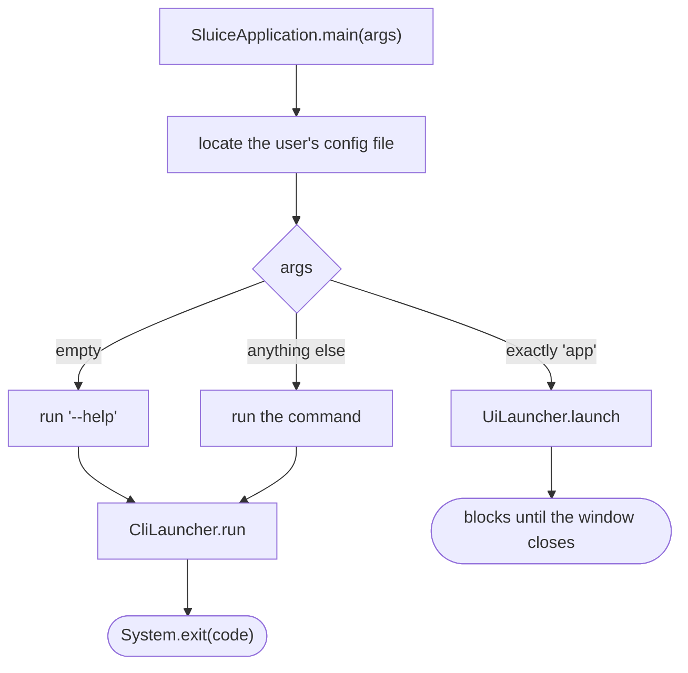
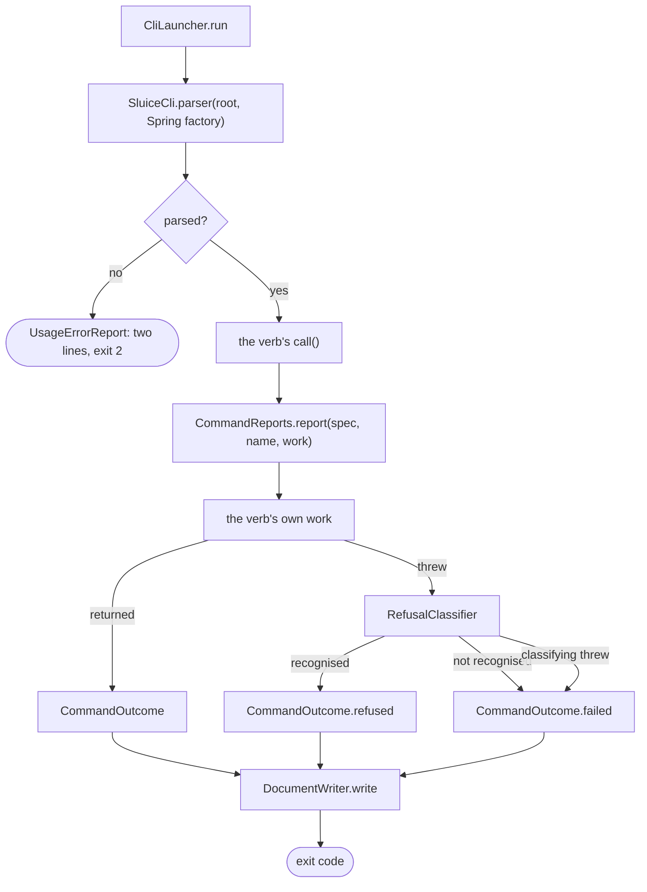

# The command surface

How one typed command becomes a process exit code, across `config/CliLauncher` and `adapter/cli`
(`app/src/main/java/photos/sluice/config/CliLauncher.java`,
`app/src/main/java/photos/sluice/adapter/cli/`).

Both surfaces are adapters over the same `Pipeline`. The desktop renders state a person watches and
can respond to. This one answers once and exits, with nothing to ask and nothing to redraw. Its
caller may be a person at a terminal, a shell script, or an agent, and the surface cannot tell them
apart. So the whole design points at one thing: **everything a caller has to handle is decided once,
whichever verb ran.**

## Choosing a surface before either one is built

**The branch sits ahead of everything.** No Spring context, no window toolkit, no logging
configuration. A machine with no desktop may have no FX runtime at all. Loading one to then not use
it would also start threads a one-shot run has no use for. The choice is made on a string.

**`main` may not name either adapter.** `ArchitectureTest.adaptersReachedOnlyThroughPorts` forbids a
class outside `..adapter..` and `..config..` from depending on one inside it, and
`photos.sluice.SluiceApplication` sits outside both. So each surface is entered through a launcher
in `config/`, which is the composition root and the one layer allowed to name concrete
implementations.

**An empty invocation asks for help.** Somebody who typed the name on its own wanted to know what it
does. That is also why nothing packaged may start Sluice without arguments. Help goes to the output
stream at exit 0, so a launch with no console attached would print into nothing and exit
successfully.

## Preparing the process

`CliLauncher.run` does four things before a parser exists.

**It names the log stream, first statement of the method.** Logging is configured from
`logback.xml` before Spring exists, and reads the target from a system property. Set later, the
earliest failures would already have been written to the output stream, which carries the answer.

**It silences the framework's own failure report**, because this surface answers that failure in its
own words further down.

**It starts Spring under the `cli` profile**, with the banner and startup log off. Neither is log
output, so the logging configuration cannot reach them, and both would otherwise land on the answer
stream.

**It splits the arguments.** An argument whose name carries a dot goes to Spring alone, as do
`--debug` and `--trace`. Nothing is filtered after `--`, since what follows is a value the user is
insisting on. This rests on a convention: no flag on this surface carries a dot. A test over the
registered option names holds it, rather than intent.

A failure during any of that never escapes. `StartupFailureReport` renders it in the shape the
arguments asked for, read without a parser, since there is not one yet.

## One command

**A verb supplies only what differs**: what it did, and how to say so. It hands
`CommandReports.report` a supplier of its own work and its own name. Refusals, unexpected failures,
the two streams and the exit code are settled the same way for every verb.

**Nothing thrown reaches the parser.** An exception that escaped would arrive as a stack trace on
the wrong stream with no document at all, which is no use to anybody, reading or parsing. An `Error` is
left alone, because those say the machine is in trouble rather than the command.

**Reading a failure is itself work that can fail**, and `CommandReports.reading` says why. What gets
reported then is the original failure, with the second attached as a suppressed exception.

**Which refusal it is, is decided by exception type alone.** Matching on a message would break
silently the first time somebody improved a sentence.

## What a caller sees

**The output stream carries the answer and nothing else.** The error stream carries everything that
is not the answer, in both shapes, so somebody watching a piped run still reads why it stopped. That
single rule is what makes the surface pipeable, and most other decisions here fall out of it.

**Asked for a document, the output stream carries exactly one, on one line.** Line-oriented tools
then read one run as one record with no framing to agree on. A stack trace goes inside the document
as a string rather than being printed around it.

**The exit code is coarse and the document is fine.** One refusal code covers every reason a command
can refuse, and which reason it was lives in the document. A caller branches on the code and reads
further only when it needs to. `CommandStatus` pairs each status with its code, taking 0 and 1 from
picocli's own constants.

**Three things write no document whatever was asked for**: a refusal from the parser, arguments
naming no verb, and help. Nothing classified an outcome in any of them, and help is not a result.

**A document names the verb the parser resolved.** A failure that stopped the app before parsing
leaves that field out rather than inventing one.

## Where a verb lives

Every verb is a `@Component` under the `cli` profile and a `@Command` in `SluiceCli`'s subcommand
list. picocli builds the command tree through a Spring-backed factory, so a verb is constructed with
its collaborators.

**Every verb is constructed when the tree is built**, whether or not it is the one that runs. So a
verb whose dependencies cannot be satisfied stops the whole surface rather than only itself.

**`app` is registered but opens nothing.** The window is opened in `main`, before this surface exists.
The class is declared so that picocli lists the verb in the help, which it cannot do for a name it
does not know. It is reached only when the verb carried something else, and that is what it refuses.
