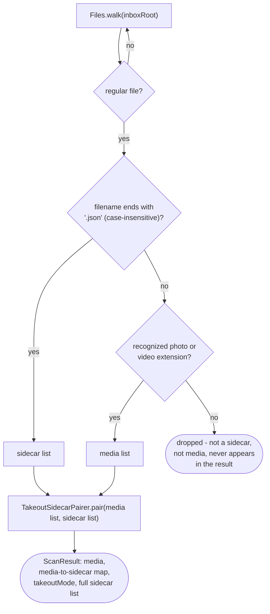

# Inbox scanning

How `adapter/fs/InboxScanner` turns an inbox folder tree into a `ScanResult`
(`app/src/main/java/photos/sluice/adapter/fs/InboxScanner.java`).

## 1. Classifying every file in the tree

Directories themselves are walked but never classified - only regular files reach the
sidecar/media check. A file that is neither a sidecar nor a recognized media extension (a stray
`.txt`, `.docx`, etc.) is simply excluded from both lists. It is not an error, and it never
surfaces anywhere in the result.

## 2. Two ways a scan can fail

The two failure shapes come from the JDK itself. Opening a bad root fails immediately as a
checked `IOException`. A failure discovered while the stream is still being consumed - a
subdirectory that disappears or loses permissions partway through - surfaces as an
already-unchecked `UncheckedIOException` instead. Both are caught and rewrapped with the same
contextual message so a caller never has to know which shape triggered it.

## Scenarios

| Scenario                                                             | Outcome                                                                                           |
|----------------------------------------------------------------------|---------------------------------------------------------------------------------------------------|
| `photo.jpg` + `photo.jpg.json` in the same folder                    | Paired (delegated to `TakeoutSidecarPairer`)                                                      |
| `photo.jpg.JSON` (uppercase extension)                               | Still recognized as a sidecar - the check is case-insensitive                                     |
| `readme.txt` alongside media                                         | Dropped silently - neither a sidecar nor a recognized media extension                             |
| `orphan.jpg.json` with no matching photo anywhere                    | Collected as a sidecar but never paired; `takeoutMode` still flips true (a JSON file was present) |
| `metadata.json`, or any `.json` that never described a photo         | Collected on extension alone, like any other JSON - the sweep makes that distinction              |
| Two folders each with their own `IMG_1234.jpg` + `IMG_1234.jpg.json` | Each pairs within its own folder only - pairing never crosses directories                         |
| Empty inbox folder                                                   | `ScanResult` with empty media, empty sidecars, `takeoutMode = false`                              |
| Inbox root path doesn't exist                                        | Throws `UncheckedIOException`                                                                     |

## Related

- Sidecar-matching detail (owner keys, the prefix fallback):
  [`takeout-sidecar-pairing.md`](../../domain/scan/takeout-sidecar-pairing.md) in the sibling
  `domain/scan` design folder.
- Risk note: pairing is name-based only, and deletion does not close that gap by validating content.
  Inline consumption spends only a sidecar whose parsed date actually won for its file. The orphan
  sweep that catches every other spent sidecar decides from names alone and never reads content. The
  sweep's safety is structural instead: it deletes only `.json` files, never media, and only once
  nothing left in the sidecar's own directory owns it. See
  [`sidecar-sweep.md`](../../domain/scan/sidecar-sweep.md) for the rules and the one accepted
  residual, a long-named stray `.json`.
- `ScanResult.jsonPaths` carries every `.json` found, paired or not, and the classification here is
  by extension alone. That is deliberate: the list is meant to say what was on disk, not to judge
  it. `SortEngine` calls this scan once per `sort()` invocation and reuses the full list after
  routing, minus whatever it consumed itself, to feed `SidecarSweep`. Deciding which of those files
  could ever have been a sidecar happens there. See
  [`sidecar-sweep.md`](../../domain/scan/sidecar-sweep.md) in the `domain/scan` design folder.
