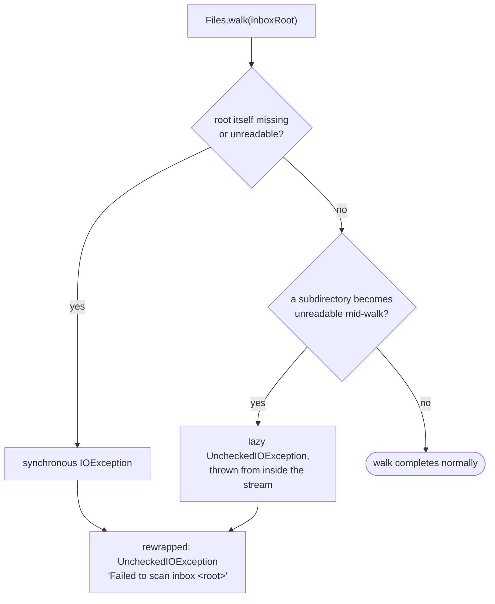

# Inbox scanning

How `adapter/fs/InboxScanner` turns an inbox folder tree into a `ScanResult`
(`app/src/main/java/photos/sluice/adapter/fs/InboxScanner.java`).

## 1. Classifying every file in the tree

Directories themselves are walked but never classified - only regular files reach the
sidecar/media check. A file that is neither a sidecar nor a recognized media extension (a stray
`.txt`, `.docx`, etc.) is simply excluded from both lists; it is not an error and never surfaces
anywhere in the result.

## 2. Two ways a scan can fail

The two failure shapes come from the JDK itself: opening a bad root fails immediately as a checked
`IOException`, but a failure discovered while the stream is still being consumed - a subdirectory
that disappears or loses permissions partway through - surfaces as an already-unchecked
`UncheckedIOException` instead. Both are caught and rewrapped with the same contextual message so a
caller never has to know which shape triggered it.

## Scenarios

| Scenario | Outcome |
|---|---|
| `photo.jpg` + `photo.jpg.json` in the same folder | Paired (delegated to `TakeoutSidecarPairer`) |
| `photo.jpg.JSON` (uppercase extension) | Still recognized as a sidecar - the check is case-insensitive |
| `readme.txt` alongside media | Dropped silently - neither a sidecar nor a recognized media extension |
| `orphan.jpg.json` with no matching photo anywhere | Collected as a sidecar but never paired; `takeoutMode` still flips true (a JSON file was present) |
| Two folders each with their own `IMG_1234.jpg` + `IMG_1234.jpg.json` | Each pairs within its own folder only - pairing never crosses directories |
| Empty inbox folder | `ScanResult` with empty media, empty sidecars, `takeoutMode = false` |
| Inbox root path doesn't exist | Throws `UncheckedIOException` |

## Related

- Sidecar-matching detail (owner keys, the prefix fallback): `takeout-sidecar-pairing.md` in the
  sibling `domain/scan` design folder.
- Risk note: pairing is name-based only, so a paired sidecar must be schema-validated as real
  Takeout metadata before anything ever deletes it - never on name-match alone.
- `ScanResult.jsonPaths` carries every sidecar found, paired or not. `SortEngine` calls this scan
  once per `sort()` invocation and reuses that full list after routing - minus whatever it
  consumed itself - to feed `SidecarSweep` and find orphans. See `sidecar-sweep.md` in the
  `domain/scan` design folder.
