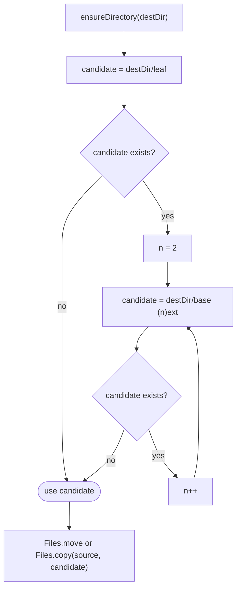

# Media store

How `adapter/fs/NioMediaStore` places a file into a destination directory without ever
overwriting an existing one
(`app/src/main/java/photos/sluice/adapter/fs/NioMediaStore.java`).

## Collision-safe placement (shared by move and copy)

`base`/`ext` split on the last `.` in the leaf name; a leaf with no extension (or a leading-dot
dotfile) keeps the whole name as `base` and an empty `ext`. The loop only ever increments `n` -
once a free numbered candidate is found it is used immediately, matching first-free-wins.

## Scenarios

| Scenario | Outcome |
|---|---|
| `destDir` doesn't exist yet | Created (and any missing parents) before the collision check |
| No file at `destDir/IMG_1234.jpg` | Placed at the original name, no suffix |
| `IMG_1234.jpg` already present | Placed at `IMG_1234 (2).jpg` |
| `IMG_1234.jpg` and `IMG_1234 (2).jpg` both present | Placed at `IMG_1234 (3).jpg` |
| Leaf has no extension (e.g. `README`) | Suffix still applies: `README (2)`, `README (3)`, ... |
| `move` | Source is removed; destination holds the bytes |
| `copy` | Source is left in place; destination holds a duplicate |

## Removing empty directories

Deepest-first matters. By the time a shallower directory is checked, any empty child it had has
already been removed in this same pass. A chain of nested empty directories therefore collapses
bottom-up in one walk, with no repeated passes needed. `root` itself is never a delete candidate,
even if every directory under it ends up empty. A directory holding a genuine non-media leftover
(a stray `.txt`, an album descriptor) is left in place, and so is every ancestor above it.

## Related

- `delete` and `ensureDirectory` are thin `Files` wrappers with no branching worth diagramming;
  both rewrap `IOException` as `UncheckedIOException` with a contextual message, matching every
  other adapter in this package. The same is true of `exists`, `size`, and `appendLine`.
- The main consumer of this port is `sort-engine.md` in the `application/service` design folder,
  which uses `move`, `delete`, `exists`, `size`, and `appendLine`. `copy` has no caller yet - it's
  declared alongside `move` for the near-dup handling a later phase's apply engine will need.
- `removeEmptyDirectories` is invoked as the second step of `SortEngine`'s post-run sweep; the
  first step (which sidecars count as orphaned) is `sidecar-sweep.md` in the `domain/scan` design
  folder.
