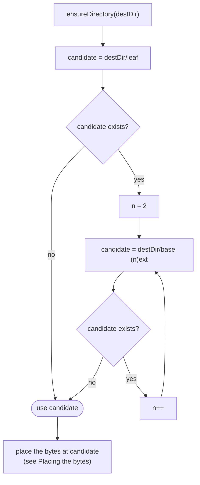
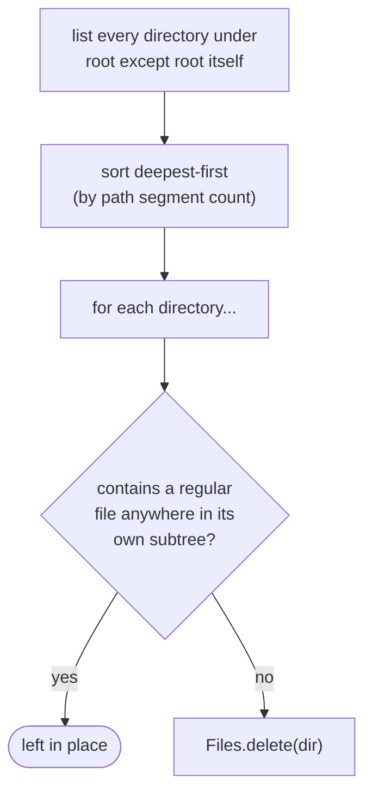
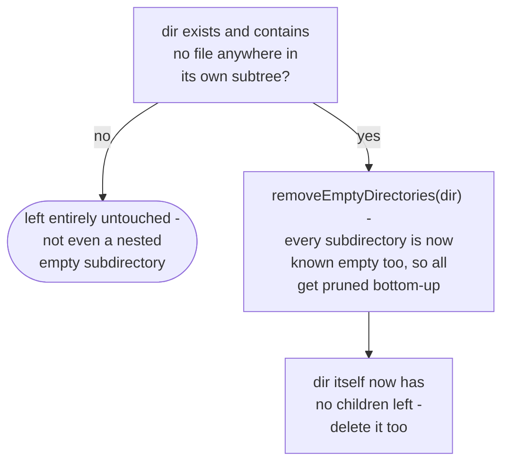

# Media store

How `adapter/fs/NioMediaStore` places a file into a destination directory without ever
overwriting an existing one
(`app/src/main/java/photos/sluice/adapter/fs/NioMediaStore.java`).

## Collision-safe placement (shared by move and copy)

`base`/`ext` split on the last `.` in the leaf name. A leaf with no extension (or a leading-dot
dotfile) keeps the whole name as `base` and an empty `ext`. The loop only ever increments `n` -
once a free numbered candidate is found it is used immediately, matching first-free-wins.

`move` is this whole flow end to end: resolve a candidate, then move straight to it. `copy` is the
same, ending in a copy rather than a move. The candidate-finding part above, with no file movement,
is also exposed on its own as `resolveDestination`, and the final placement step as `moveTo` and
`copyTo`. `ApplyEngine` calls them separately. It needs to know a move's exact destination before
performing it, to durably record a decision's source hash against that destination first - see
`apply-planner.md`'s move-record section. `moveTo` and `copyTo` trust the caller to have already
reserved that exact path and do no collision handling of their own.

## Placing the bytes

Nothing here ever passes `REPLACE_EXISTING`, at any step. An occupied destination is a failure, and
a failure is what the collision loop above exists to make unreachable.

A move within one file store is a plain rename, instant and with nothing to interrupt. A move across
stores is a full read and write, so it becomes the interruptible copy below and the source is
deleted once the copy has landed. Which of the two it is, is decided up front by comparing the file
stores rather than by catching a failure. `Files.move` does the cross-volume copy itself, silently
and uninterruptibly, so there is nothing to catch. `ATOMIC_MOVE` would throw, and on POSIX it also
overwrites an occupied destination.

A copy, and the copy half of a cross-store move, runs block by block through a `.part` file beside
the destination, then renames that into place. Two properties follow. An abandoned transfer leaves
no truncated photo under a name a later scan would read. And the stop signal is answered between
blocks rather than at the end. The part file is removed on either failure path. Timestamps are
restored by hand onto the part file before the rename, because a block-by-block copy preserves none
and the date chain falls back to mtime.

`listFiles` answers a leftover part file like any other, since a caller clearing a directory out has
to be handed it. `MediaStore.isIncompleteTransfer` is what tells one apart from media.

## Scenarios

| Scenario                                           | Outcome                                                      |
|----------------------------------------------------|--------------------------------------------------------------|
| `destDir` doesn't exist yet                        | Created (and any missing parents) before the collision check |
| No file at `destDir/IMG_1234.jpg`                  | Placed at the original name, no suffix                       |
| `IMG_1234.jpg` already present                     | Placed at `IMG_1234 (2).jpg`                                 |
| `IMG_1234.jpg` and `IMG_1234 (2).jpg` both present | Placed at `IMG_1234 (3).jpg`                                 |
| Leaf has no extension (e.g. `README`)              | Suffix still applies: `README (2)`, `README (3)`, ...        |
| `move`                                             | Source is removed; destination holds the bytes               |
| `copy`                                             | Source is left in place; destination holds a duplicate       |

## Removing empty directories

Deepest-first matters. By the time a shallower directory is checked, any empty child it had has
already been removed in this same pass. A chain of nested empty directories therefore collapses
bottom-up in one walk, with no repeated passes needed. `root` itself is never a delete candidate,
even if every directory under it ends up empty. A directory holding a genuine non-media leftover
(a stray `.txt`, an album descriptor) is left in place, and so is every ancestor above it.

## Removing a directory entirely, if it's empty of files

Unlike `removeEmptyDirectories`, `dir` itself is a delete candidate here. That's the whole
point: a caller wants the named directory to disappear completely once nothing real is left
in it. The check is whole-subtree, not top-level-only, and it's all-or-nothing. A single file
buried anywhere below `dir` blocks the entire operation, leaving even unrelated empty sibling
subdirectories inside `dir` untouched. The implementation composes the two existing pieces
above rather than duplicating traversal logic. It reuses `removeEmptyDirectories(dir)` for the
pruning, then applies to `dir` the same now-empty-directory delete that `removeEmptyDirectories`
itself uses.

## Related

- `delete`, `ensureDirectory`, `listFiles`, and `listChildDirectories` are thin `Files` wrappers with
  no branching worth diagramming. All rewrap `IOException` as `UncheckedIOException` with a
  contextual message, matching every other adapter in this package. The same is true of `exists`,
  `size`, and `appendLine`. `listFiles` walks a directory's whole subtree for its regular files;
  `listChildDirectories` lists only root's immediate subdirectories, non-recursive.
- The main consumer of `move`, `delete`, `exists`, `size`, and `appendLine` is `sort-engine.md` in
  the `application/service` design folder. `RescueEngine`'s own scope logic is in
  `rescue-engine.md`. `listChildDirectories` is used by `PrepDirDoctor`, covered in
  `prep-dir-doctor.md`, to shallow-list the sift-prep root so one candidate's own read failing
  cannot cost every other one. `copy`, `resolveDestination`, `moveTo`, and `write` are used by
  `apply-engine.md`'s `ApplyEngine` for near-dup handling and crash-safe resume.
- `removeEmptyDirectories` is invoked as the second step of `SortEngine`'s post-run sweep; the
  first step (which sidecars count as orphaned) is `sidecar-sweep.md` in the `domain/scan` design
  folder.
- `removeIfEmptyOfFiles` is used by `rescue-engine.md` (also in `application/service`) to dissolve
  a Review folder once every file in it has been rescued.
