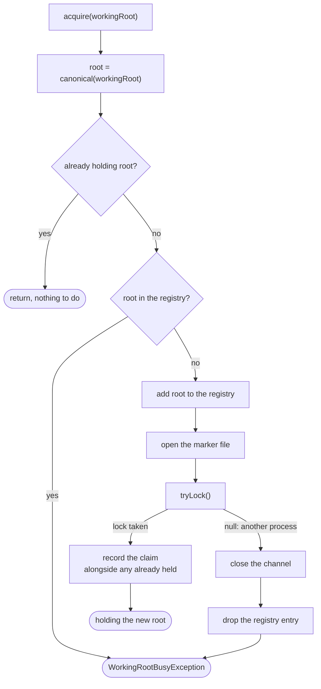

# Working root lock

How `adapter/fs/FileChannelWorkingRootLock` lets one process at a time work in a given working root
(`app/src/main/java/photos/sluice/adapter/fs/FileChannelWorkingRootLock.java`).

The claim is an OS lock held on a `.sluice-lock` marker file inside the root, for as long as the
process holds that root. The kernel drops it when the process dies, whichever way it dies, so a
crash or a deliberate force-quit leaves nothing to clean up. A file recording a process id could not
offer that.

## Taking a claim

**The registry is consulted before the marker is opened**, and that ordering is load-bearing. An OS
file lock belongs to the process, not to the object holding it. On Linux the kernel releases a lock
of this kind as soon as any descriptor for that file closes in the same process. So a refusal that
opened the marker and closed it again would release the lock the first claim still believes it
holds. That leaves a claim which only looks held. Refusing from the registry means no second
descriptor is ever opened.

**Taking a claim gives nothing up.** A caller moving between roots holds both, and says which to
give up once it knows. That is what leaves no window where the root a caller's own settings still
name is unheld. A refusal throws with every existing claim intact, so a rejected settings save
changes nothing.

Holding two claims is bounded in practice rather than by this class. A settings save is the only
caller that moves between roots, and one save runs at a time.

**Holders are counted per folder.** `canonical()` below collapses two spellings of one directory
onto a single key, and a caller comparing raw configured paths does not. So a caller can acquire
what it reads as two roots and get one claim, then release what it reads as the other and mean to
keep the folder. The count is what makes that release a decrement rather than a handover.

The count balances per folder, not per caller, and that is the thing to hold on to. A settings save
issues one acquire and one release, so it comes out even only because the session's own startup
claim is already on that key. A process that holds nothing to begin with has no such holder, and the
same save gives the folder up. `releaseAll()` ignores the count entirely, since an exit path means
all of it.

## Root identity

`canonical()` normalises the path, then resolves it. Normalising first matters: `toRealPath()`
throws on any component that does not exist, and a relative step like `sub/..` names one that need
not. Resolving matters because a symlink, a junction or a re-spelled path all name one directory,
and the registry has to recognise them as one root. Otherwise a settings save that only re-spells
the path would look like a move onto a root this process already holds. It would then refuse the
user their own root.

A path that does not resolve at all falls back to its normalised form. Claiming it fails a moment
later on the open, which reports the problem in terms of the path the user actually configured.

The one case this does not cover is a directory renamed while its claim is live. The new name
resolves somewhere the registry has never seen, so the marker is opened a second time and the lock
itself does the refusing. The claim is still refused; one descriptor leaks.

## Giving a claim up

`release(workingRoot)` gives up the one root it names and leaves any other held.
`releaseAll()` gives up everything, for a caller that has to hand back whatever it has without
knowing what that is, which is what an exit path needs. `releaseAll` attempts every claim even after
one fails to close, and reports one failure with the rest hung off it as suppressed. Which one it
keeps is arbitrary, since all of them are carried either way. Stopping at the first would strand the
claims behind it for the life of the process.

Closing the channel drops the OS lock with it. The registry entry goes afterwards, in a `finally`,
which is a trade rather than an oversight. A close that fails frees the key while the lock may still
be held, and nothing in this process can detect that. Holding the key instead would strand the root
until the process exits, which is worse and far easier to hit. The claim is dropped from the
instance either way. A caller that cannot act on a close failure is therefore not left believing it
still holds the root.

The marker file stays on disk. Deleting it would race a process opening it at that moment, and an
abandoned marker is an empty file.

## What the claim is worth

A convenience, not a safety device, and the difference is worth keeping straight. A delete is
authorised by a hash being present in an append-only index flushed per entry. Two processes
appending can interleave rows or tear a line, but neither can invent a hash that was never
committed. So the promise never to delete a file unless its bytes survive elsewhere does not rest on
this lock. What the lock prevents is a malformed row that fails a later parse, and the confusion of
two engines moving one tree.

Work that only reads never claims a root. A status check from elsewhere would otherwise fail
whenever the desktop app happened to be open, which only teaches people to close it to look at
something.
