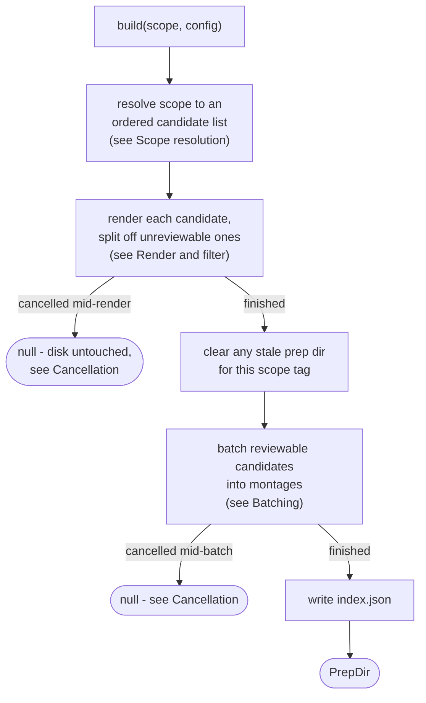
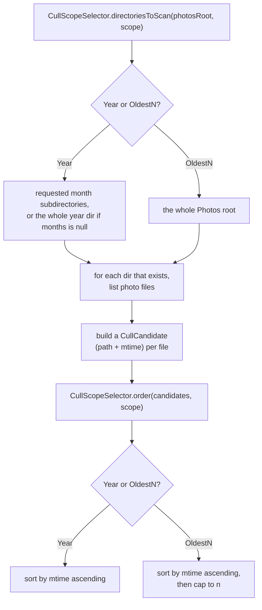
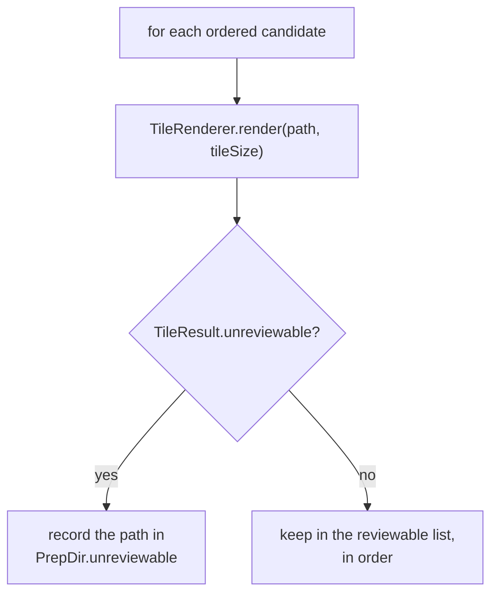
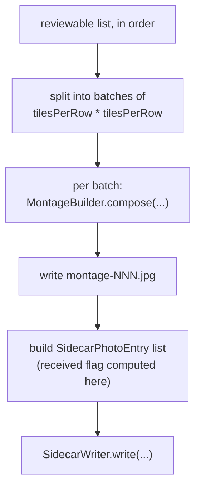

# Cull montage renderer

How `adapter/imaging/CullMontageRenderer` implements the `MontageRenderer` port
(`app/src/main/java/photos/sluice/adapter/imaging/CullMontageRenderer.java`). It wires
`TileRenderer`, `MontageBuilder`, `SidecarWriter`, and `PrepIndexWriter` together. Given a
`CullScope`, it finds the right `Sorted` photo files and renders each to a tile. It then drops
the ones that can't be judged, batches the rest into montages, and writes the whole prep
directory to disk.

## Top-level routing

Ordering happens before rendering, and filtering happens before batching. Both choices exist for
the same reason. Once photos are grouped into a montage, there's no way to pull one back out
without reshuffling every batch after it. Deciding "which files, in what order, are actually going
to appear" has to be settled before any batch boundary is drawn.

## Scope resolution

A requested month directory that doesn't exist is skipped silently, not treated as an error. A
month with nothing sorted into it yet is a normal, expected state, not a caller mistake.
`CullScopeSelector` never touches disk itself; it's pure `Path`/`Instant` logic, so it stays
unit-testable without a filesystem.

## Render and filter

`MontageBuilder` has no concept of "skip this tile" - it composes whatever list it's handed.
This is the only place in the whole pipeline where the `unreviewable` flag can still be acted
on, so it has to happen here, before batching. An unreviewable file is never moved. It's only
reported, in `PrepDir.unreviewable` / `index.json`'s `unreviewable` field. That gives a future
caller something to act on, instead of the file just silently sitting wherever it already is
(see Known limitations).

## Batching

Montage numbering is 1-based and zero-padded to 3 digits (`montage-001`, `montage-002`, ...). The
`received` flag (WhatsApp's received-photo filename convention) is computed here, on the bare
filename, not by `SidecarWriter` - that class only serializes whatever entries it's handed.

## Clearing the prep directory

`logs/cull-prep/<scopeTag>` is wiped and recreated on every `build()` call, before any montage is
written. A prior run of the same scope may have produced more montages than this run does, if
fewer photos are reviewable this time around. Without clearing first, a stale `montage-002.*` from
that prior run would survive alongside this run's smaller output, with nothing to indicate it's no
longer current. This is safe specifically because `logs/cull-prep/<tag>` is a directory this
feature exclusively generates and owns - unlike `Inbox`/`Sorted`/`Review`/`Duplicates`, which the
project's media-safety invariant protects from bulk deletes.

## Cancellation

Checked in two places, both before doing the (potentially slow) work for the next item rather than
after:

- **The render pass** (one `TileRenderer.render()` call per candidate, including any HEIC CLI
  decode) is the long pass. It runs entirely before the prep dir is ever cleared. A
  cancellation seen here means disk is left completely untouched: nothing to clean up, nothing for
  a caller to resume from.
- **The montage-write loop** - checked once per montage, before writing it. A prep dir stopped
  mid-loop here is inert. `index.json` is never written, so it's invisible to
  `Pipeline.waitingJobs()`, and the next `build()` call for this scope clears it via
  `clearPrepDir()` anyway.

Either case returns `null` instead of a `PrepDir`. That return value is the sole authority on
whether the run was cancelled - `Pipeline` never re-checks disk state to decide. A `null` this
early (before `index.json` exists) means there's nothing resumable yet. That's unlike a
cancellation later in the cull flow (dispatch or apply), which lands on an already-prepped,
genuinely resumable `Waiting` job.

## Scenarios

| Input                                                 | Outcome                                                                  |
|-------------------------------------------------------|--------------------------------------------------------------------------|
| `Year(year, null)`                                    | Whole year directory scanned, every month present included               |
| `Year(year, [6, 7])`                                  | Only those two month subdirectories scanned                              |
| A requested month directory that doesn't exist        | Skipped silently, not an error                                           |
| `OldestN(n)`                                          | Whole `Photos` root scanned, true global oldest by mtime, capped to `n`  |
| An unreviewable file lands inside `OldestN`'s window  | Its slot is dropped, not backfilled from just outside the window         |
| Every candidate in scope is unreviewable              | `photos=0, montages=0, entries=[]`; `index.json` still written, no crash |
| Rerun with fewer reviewable photos than a prior run   | Stale montage files from the prior run are removed first                 |
| Cancellation requested mid-render                     | `null` returned; disk left exactly as it was before this call            |
| Cancellation requested mid-batch (montage-write loop) | `null` returned; the partial prep dir is inert, cleared by the next call |

## Known limitations

- **Unreviewable files are reported, never moved.** `PrepDir.unreviewable` lists them so
  a caller can see what got skipped. This class only ever reads files - it never moves
  or deletes anything in `Sorted`. The actual move to `Unreviewable/<year>/<month>/`
  belongs to the apply step, which acts on culled scopes. Keeping this class
  side-effect-free is also what keeps a cull run dry-run-safe.
- **`OldestN` caps before the unreviewable filter runs.** Capping to `n` happens on the full
  ordered list; filtering happens after. If one of the `n` oldest candidates turns out
  unreviewable, that slot is simply dropped. It isn't backfilled from the next-oldest candidate
  just outside the window, even though that candidate might itself be reviewable.
- **`clearPrepDir` always does a full wipe, never an incremental diff.** Every `build()` call for
  a scope deletes and regenerates the whole prep directory. That happens even when the output
  would be identical to what's already there. Simpler than diffing, and prep directories are
  small and cheap to regenerate.

## Related

- `adapter/imaging/TileRenderer` - renders each candidate to a tile, and is the sole source of the
  `unreviewable` flag this class acts on.
- `adapter/imaging/MontageBuilder` - composes each batch into a montage image; never sees the
  `unreviewable` flag itself (see that doc's own Known limitations).
- `adapter/imaging/SidecarWriter` / `PrepIndexWriter` - JSON emission for each montage and for the
  overall `index.json`.
- `domain/cull/CullScopeSelector` + `CullCandidate` - pure scope-resolution and ordering logic.
- `domain/cull/PrepDir` - the receipt this class returns, mirroring `index.json`'s field shape.
- `application/port/out/MontageRenderer` - the port this class implements.
