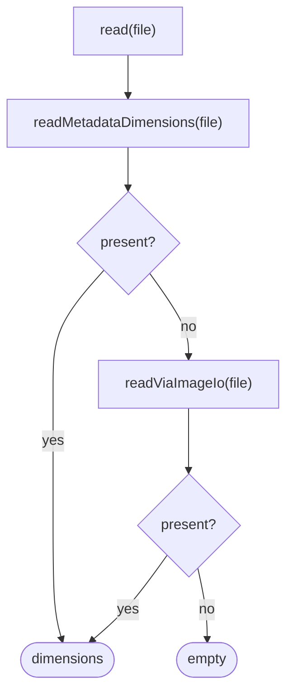
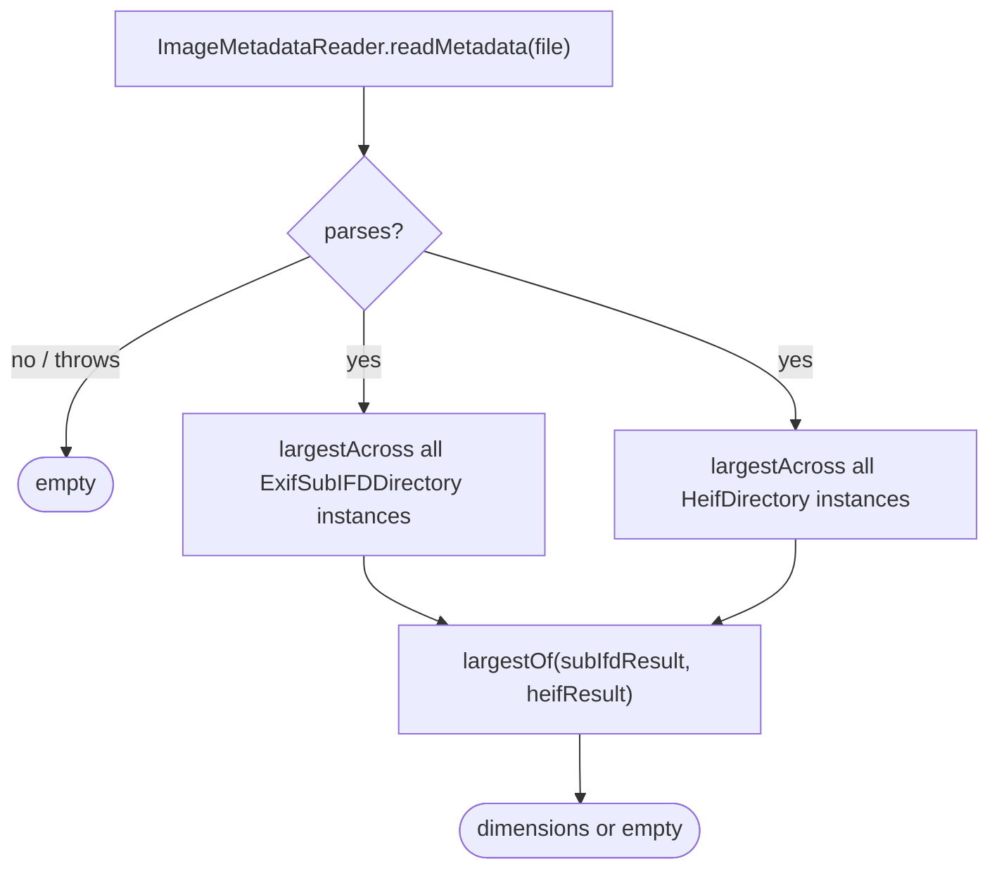
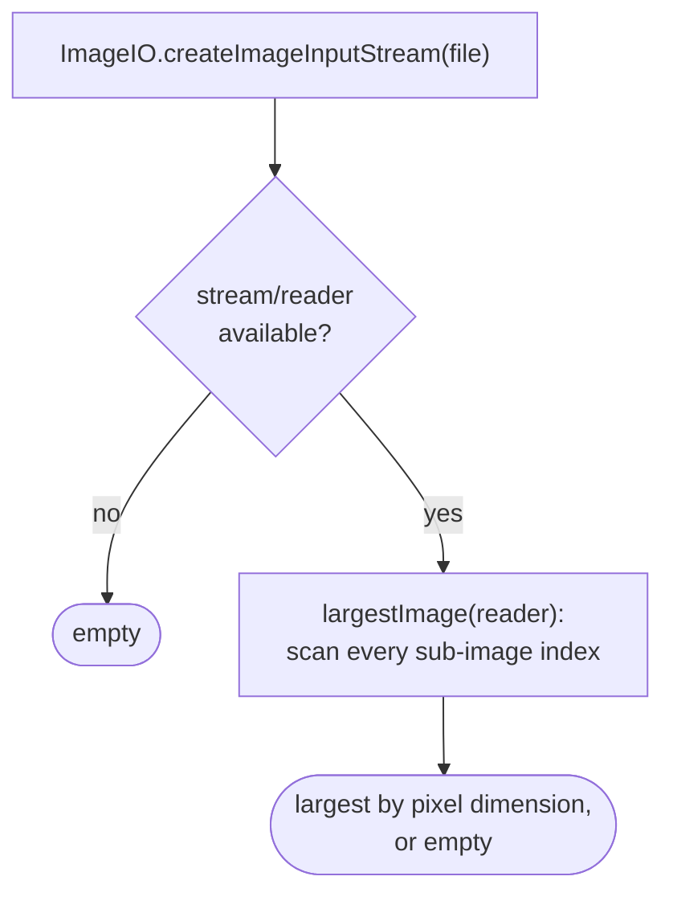

# Image dimensions reader

How `adapter/imaging/ImageDimensionsReader` determines a media file's pixel dimensions, consumed by
`SortEngine`/`LowResGate` to decide whether a file is low-res
(`app/src/main/java/photos/sluice/adapter/imaging/ImageDimensionsReader.java`).

This runs at `sort` time, trusting metadata **tag values** rather than decoding real pixels. That's
a different, cheaper mechanism than `TileRenderer`'s montage-time real decode (see
`tile-renderer.md`). `TileRenderer` independently re-measures actual decoded content, so it doesn't
share this class's failure modes.

## Top-level routing

## `readMetadataDimensions`

`ImageMetadataReader.readMetadata` throws unchecked exceptions on some malformed real-world files,
not just its declared checked exception - both are caught, falling through to the ImageIO path.

A single file can expose more than one directory of the same type. A RAW file's IFD chain
(thumbnail, preview, full capture) can carry several `ExifSubIFDDirectory` instances; a HEIF/AVIF
file can carry several `HeifDirectory` instances too. `largestAcross` checks every instance of a
type and keeps the largest, rather than the first found. This is verified against a real Nikon
NEF: its *first* `ExifSubIFDDirectory` (the embedded preview's own) has no width/height tags at
all. Only a later one holds the true native capture resolution.

`largestOf` compares the two directory types' results against each other. A file could in
principle carry dimensions in both at once - an edited HEIC whose EXIF wasn't refreshed to match a
later HEIF-box resize, for example. The same largest-wins safety margin applies across types too,
not only within one.

Trusting the largest is a one-directional safety margin. `LowResGate` only ever flags a file
low-res when its reported dimensions are small, so under-reporting a real capture's size is the
risk this guards against. A corrupted file whose non-primary directory reports an inflated bogus
value could in principle let a genuinely low-res file escape the flag. It could never cause the
reverse: misrouting a real high-res photo as low-res.

### Per-directory tag extraction

- **`subIfdDimensions(ExifSubIFDDirectory)`** - tries the EXIF-specific pixel-dimension tags
  first (`0xA002`/`0xA003`, what Canon uses), then falls back to the generic TIFF
  `ImageWidth`/`ImageHeight` tags (`0x0100`/`0x0101`, what Nikon leaves on the SubIFD holding the
  true capture resolution instead). Both live on a SubIFD, not the container's own top-level
  directory, so both are trusted equally.
- **`heifDimensions(HeifDirectory)`** - reads `TAG_IMAGE_WIDTH`/`TAG_IMAGE_HEIGHT` directly.
  Verified against a real AVIF fixture with no embedded EXIF at all: metadata-extractor exposes its
  dimensions only here, under a container-native width/height box, not under any `ExifSubIFDDirectory`.

## `readViaImageIo` fallback

Used when metadata parsing found nothing (no EXIF/HEIF metadata at all, e.g. a plain PNG). Scans
every sub-image index via ImageIO directly rather than assuming index 0 is the real photo. A
multi-image file (e.g. a TIFF with an embedded thumbnail) exposes images in raw physical order,
with no marker for which one is the real capture. This mirrors the same largest-not-first
principle the metadata path applies.

## Scenarios

| File                                                        | Path taken                                  | Result                                           |
|-------------------------------------------------------------|---------------------------------------------|--------------------------------------------------|
| iPhone HEIC (real EXIF)                                     | `ExifSubIFDDirectory`                       | True capture resolution                          |
| Real AVIF, no embedded EXIF                                 | `HeifDirectory`                             | True capture resolution                          |
| Real Nikon NEF, multiple SubIFDs                            | `ExifSubIFDDirectory`, largest across all   | True capture resolution, not the 160x120 preview |
| Real Sony ARW, TIFF vs. EXIF tag pairs on different SubIFDs | `ExifSubIFDDirectory`, largest across all   | True capture resolution, not the smaller preview |
| Plain PNG/JPEG with no EXIF                                 | ImageIO fallback                            | Real dimensions                                  |
| Multi-image TIFF                                            | ImageIO fallback, largest across sub-images | The larger image, not the embedded thumbnail     |
| Not an image / unparseable                                  | Neither path finds anything                 | Empty                                            |

## Known limitations

- **The cross-directory-type comparison in `largestOf` has no real-fixture case where both sides
  are simultaneously present.** Every real fixture in this suite carries dimensions in exactly one
  directory type or the other, never both. The "both present, pick the larger" branch is covered
  only by a direct unit test against hand-built values, not an observed real file.
- **Trusting the largest value is a one-directional safety margin, not a corruption defense.** A
  corrupted file whose non-primary directory reports an inflated bogus value could in principle
  cause a genuinely low-res file to escape `LowResGate`'s flag. `TileRenderer`'s montage-time real
  pixel decode is the independent second check that doesn't share this failure mode.

## Related

- `domain/imaging/LowResGate` - the consumer this class's result feeds; `MIN_DIMENSION` (640) is
  shared with `TileRenderer`'s own judgeability check for a related but distinct question.
- `application/service/SortEngine` - the production caller, at `sort` time.
- `tile-renderer.md` - the montage-time real-decode counterpart, the independent second
  measurement that provides defense in depth against this class's metadata-trust assumption.
