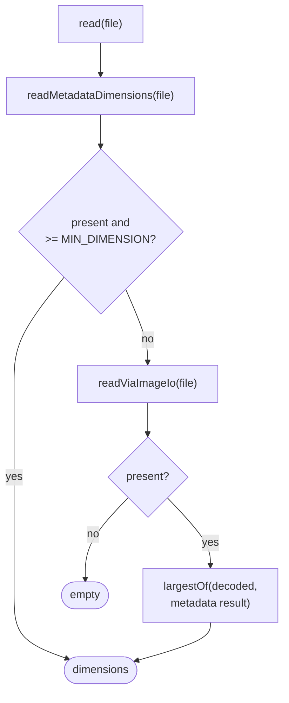

# Image dimensions reader

How `adapter/imaging/ImageDimensionsReader` determines a media file's pixel dimensions, consumed by
`SortEngine`/`LowResGate` to decide whether a file is low-res
(`app/src/main/java/photos/sluice/adapter/imaging/ImageDimensionsReader.java`).

This runs at `sort` time, trusting metadata **tag values** rather than decoding real pixels wherever
it can. That's a different, cheaper mechanism than `TileRenderer`'s montage-time real decode (see
`tile-renderer.md`). `TileRenderer` independently re-measures actual decoded content, so it doesn't
share this class's failure modes.

## Top-level routing

The metadata answer is taken as final only above `LowResGate.MIN_DIMENSION` (640). That is the only
bar at which the exact number changes a routing decision. Above it a decode would buy nothing and
cost a read per file.

Below the bar the metadata answer is a candidate, not a verdict. Any single directory can describe a
sub-image rather than the capture, and two real shapes do:

- **Stale EXIF pixel-dimension tags.** An editor resizes the pixels and leaves `0xA002`/`0xA003`
  behind at the old size. Reproduced with a fixture whose tags read 400x300 over a real 1024x768
  picture.
- **A tiled HEIC.** Apple stores the picture as a grid of 512x512 tiles, and the container box a
  metadata parse reaches carries a tile's size, not the grid's. Verified on this repo's own real
  4032x3024 iPhone HEIC: its `HeifDirectory` reads 512x512. That file is saved today only because
  its Exif SubIFD also carries the true size. An EXIF-stripped copy of it leaves 512 as the sole
  reading, under the 640 bar, on a full-resolution photo.

So below the bar the decode runs as a second source and `largestOf` picks between them. When no
decoder handles the format at all, nothing corroborates the small reading and the result is empty.
`LowResGate` treats unknown dimensions as "don't flag", which leaves a real photo where it belongs.
An uncorroborated small reading would exile it to `Review\` as low-res instead.

That last rule costs something, and the cost is the deliberate trade. A genuinely sub-640 file in a
format ImageIO cannot read reports no dimensions, so only the 50 KiB file-size floor can flag it.
HEIC and AVIF are always in that group. RAW is mixed. A CR2 or ARW has no working reader here
either, but a NEF's embedded preview does open. So a NEF's metadata reading gets corroborated
rather than left unconfirmed. A real sub-640 image in an unreadable format lands far under that
floor.

## `readMetadataDimensions`

`ImageMetadataReader.readMetadata` throws unchecked exceptions on some malformed real-world files,
not just its declared checked exception - both are caught, falling through to the ImageIO path.

A single file can expose more than one directory of the same type. A RAW file's IFD chain
(thumbnail, preview, full capture) can carry several `ExifSubIFDDirectory` instances; a HEIF/AVIF
file can carry several `HeifDirectory` instances too. `largestAcross` checks every instance of a
type and keeps the largest, rather than the first found. This is verified against a real Nikon
NEF: its *first* `ExifSubIFDDirectory` (the embedded preview's own) has no width/height tags at
all. Only a later one holds the true native capture resolution.

`largestOf` compares the two directory types' results against each other. A file really does carry
dimensions in both at once. The iPhone HEIC fixture is one: `HeifDirectory` reads its 512x512 tile,
its Exif SubIFD reads the true 4032x3024. The same largest-wins safety margin applies across types
too, not only within one, and that file is why it has to.

Trusting the largest is a one-directional safety margin. `LowResGate` only ever flags a file
low-res when its reported dimensions are small, so under-reporting a real capture's size is the
risk this guards against. A corrupted file whose non-primary directory reports an inflated bogus
value could in principle let a genuinely low-res file escape the flag. Picking the larger candidate
only ever raises the reported size, so this rule alone cannot push a photo below the flag.

What it cannot do is lift a file whose every directory under-reports. The largest of several
sub-image readings is still a sub-image reading. That gap is what the sub-threshold decode
cross-check above closes.

### Per-directory tag extraction

- **`subIfdDimensions(ExifSubIFDDirectory)`** - tries the EXIF-specific pixel-dimension tags
  first (`0xA002`/`0xA003`, what Canon uses). It then falls back to the generic TIFF
  `ImageWidth`/`ImageHeight` tags (`0x0100`/`0x0101`, what Nikon leaves on the SubIFD holding
  the true capture resolution instead). Both live on a SubIFD, not the container's own
  top-level directory, so both are trusted equally.
- **`heifDimensions(HeifDirectory)`** - reads `TAG_IMAGE_WIDTH`/`TAG_IMAGE_HEIGHT` directly.
  Verified against a real AVIF fixture with no embedded EXIF at all: metadata-extractor exposes its
  dimensions only here, under a container-native width/height box, not under any `ExifSubIFDDirectory`.

## `readViaImageIo` fallback

Used when metadata parsing found nothing (no EXIF/HEIF metadata at all, e.g. a plain PNG). Also
used as the second source whenever the metadata answer came out under 640. Scans every sub-image
index via ImageIO directly rather than assuming index 0 is the real photo. A multi-image file
(e.g. a TIFF with an embedded thumbnail) exposes images in raw physical order, with no marker for
which one is the real capture. This mirrors the same largest-not-first principle the metadata path
applies.

## Scenarios

| File                                                        | Path taken                                  | Result                                           |
|-------------------------------------------------------------|---------------------------------------------|--------------------------------------------------|
| iPhone HEIC (real EXIF, 512x512 tiles)                      | `ExifSubIFDDirectory` beats `HeifDirectory` | True capture resolution, not the 512x512 tile    |
| Real AVIF, no embedded EXIF                                 | `HeifDirectory`                             | True capture resolution                          |
| Real Nikon NEF, multiple SubIFDs                            | `ExifSubIFDDirectory`, largest across all   | True capture resolution, not the 160x120 preview |
| Real Sony ARW, TIFF vs. EXIF tag pairs on different SubIFDs | `ExifSubIFDDirectory`, largest across all   | True capture resolution, not the smaller preview |
| Plain PNG/JPEG with no EXIF                                 | ImageIO fallback                            | Real dimensions                                  |
| Multi-image TIFF                                            | ImageIO fallback, largest across sub-images | The larger image, not the embedded thumbnail     |
| JPEG whose EXIF tags are stale at 400x300                   | Sub-threshold cross-check, decode wins      | Real 1024x768, not the stale tag pair            |
| Sub-640 AVIF/HEIC, nothing else to read it                  | Sub-threshold cross-check, no decoder       | Empty, so `LowResGate` leaves the file alone     |
| Not an image / unparseable                                  | Neither path finds anything                 | Empty                                            |

## Known limitations

- **A sub-640 file in a format ImageIO cannot read reports no dimensions at all.** HEIC and AVIF
  have no reader here. Neither does a CR2 or ARW, though a NEF's embedded preview does open. Where
  nothing can confirm a small metadata reading, only the 50 KiB file-size floor can flag the file
  as low-res. Accepted deliberately: a real sub-640 image in an unreadable format sits far under
  that floor, and the alternative misroutes full-resolution photos.
- **Trusting the largest value is a one-directional safety margin, not a corruption
  defense.** A corrupted file's non-primary directory could report an inflated bogus value.
  That could, in principle, let a genuinely low-res file escape `LowResGate`'s flag.
  `TileRenderer`'s montage-time real pixel decode is the independent second check that
  doesn't share this failure mode.

## Related

- `domain/imaging/LowResGate` - the consumer this class's result feeds; `MIN_DIMENSION` (640) is
  shared with `TileRenderer`'s own judgeability check for a related but distinct question.
- `application/service/SortEngine` - the production caller, at `sort` time.
- `tile-renderer.md` - the montage-time real-decode counterpart, the independent second
  measurement that provides defense in depth against this class's metadata-trust assumption.
