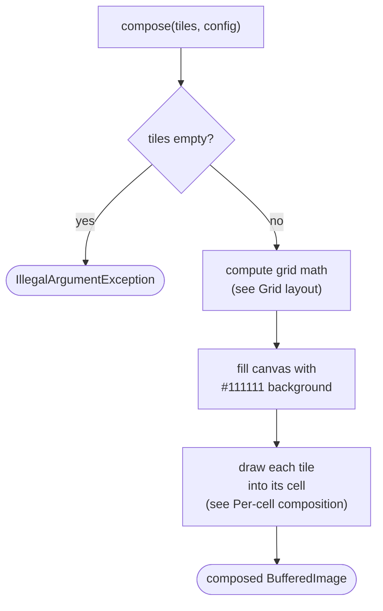
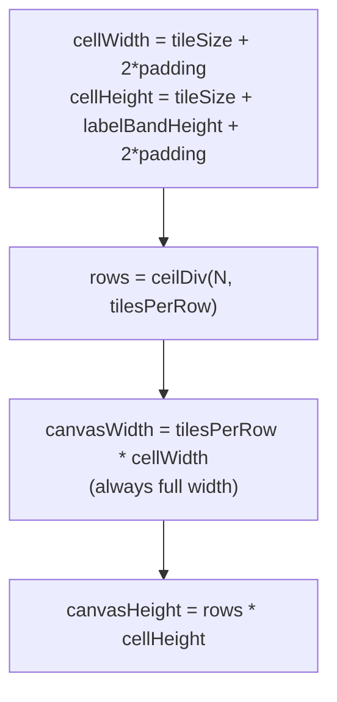
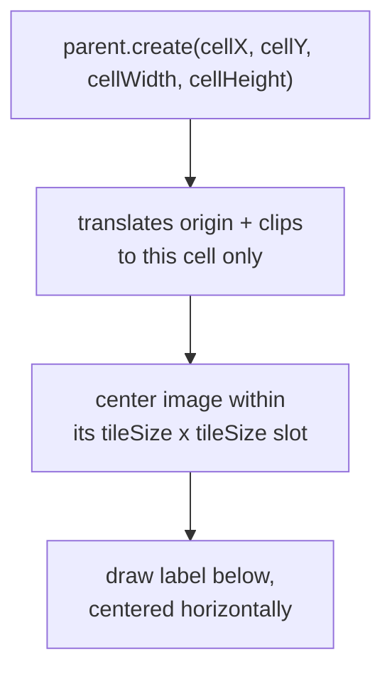

# Montage builder

How `adapter/imaging/MontageBuilder` composes a batch of already-rendered tiles into one montage
grid image (`app/src/main/java/photos/sluice/adapter/imaging/MontageBuilder.java`). Pure in-memory
Java2D - no subprocess, no intermediate tile files ever written to disk. `compose()` returns a
`BufferedImage` only; writing the result out as a `.jpg` is the calling adapter's job, not this
class's.

`TileRenderer` already returns each tile bounded to at most `tileSize x tileSize`, aspect-preserving
- a non-square source does not fill a square slot. This class does not re-fit or resize a tile. It
only places an already-sized image into a fixed-size grid cell (centering it) and draws a filename
label band below.

## Top-level routing



## Grid layout



`canvasWidth` is always `tilesPerRow * cellWidth`, even when the last row has fewer tiles than
`tilesPerRow` - the grid never shrinks to fit a sparse row. Since the whole canvas is pre-filled
with the `#111111` background before any tile is drawn, a partial last row's unused cells need no
special-casing. They're background simply because nothing draws there.

## Per-cell composition



`Graphics2D.create(int x, int y, int width, int height)` both translates the origin to the cell's
position and clips to its size in one call. This makes all per-cell coordinate math cell-local
(0,0-origin). It also clips an overlong label at the cell's own edge automatically, so no
width-measuring or ellipsis logic is needed. `TileRenderer` guarantees
`image.getWidth()/getHeight() <= tileSize`, so the image itself is always within its slot with room
to spare. Only a label can overflow, and the clip contains it.

The image is centered within its `tileSize x tileSize` slot:
```
imgX = padding + (tileSize - image.getWidth()) / 2
imgY = padding + (tileSize - image.getHeight()) / 2
```
A landscape tile (shorter than `tileSize`) centers vertically; a portrait tile (narrower than
`tileSize`) centers horizontally. This was verified directly. Sampling a pixel in the empty margin
strip above/below (or left/right of) a non-square tile's real bounds returns the background color,
not the tile's own fill.

## Label band

A fixed 9pt plain font, not scaled by `tileSize`. This is distinct from
`TileRenderer.placeholder()`'s `tileSize/10f` bold stand-in text, which fills a whole tile rather
than captioning a real photo. A caption should stay a consistent, legible size regardless of how big
`tileSize` is configured, not scale proportionally with it.

`labelBandHeight()` is computed via a throwaway 1x1 probe image. Font metrics need a `Graphics2D`
context to measure, but the canvas height must be known before one exists. It's package-private so
the test class can compute the same expected height directly, rather than hardcoding a
JDK/OS-dependent pixel value. This project's CI runs both Ubuntu and Windows, and real font metrics
vary slightly between them.

## Scenarios

| Input                                             | Outcome                                                                   |
|---------------------------------------------------|---------------------------------------------------------------------------|
| Empty tile list                                   | `IllegalArgumentException`                                                |
| N tiles exactly filling full rows                 | Canvas sized to exactly `rows * cellHeight`, no wasted space              |
| N tiles not a multiple of `tilesPerRow`           | Canvas still full-width; unused cells in the last row are plain `#111111` |
| A landscape-aspect tile (shorter than `tileSize`) | Centered vertically within its slot                                       |
| A portrait-aspect tile (narrower than `tileSize`) | Centered horizontally within its slot                                     |
| A filename longer than the cell can fit           | Clipped at the cell's own edge, never bleeds into the neighboring cell    |

## Known limitations

- **The label caption doesn't scale with `tileSize`.** A fixed 9pt font stays legible at any
  configured tile size. But the caption's proportion to the image shrinks as `tileSize` grows well
  beyond the 224px default. This hasn't been tested at extreme tile sizes.
- **An overlong filename clips rather than ellipsizing or shrinking to fit.** This is simpler than
  either alternative. But there's no visual signal, like `...`, that the label is incomplete. A
  truncated label could occasionally read as a shorter, different filename at a glance.
- **An empty tile list throws by design.** The assumption is that upstream routing never reaches
  this class with zero photos to montage. This isn't a defensive validation against a scenario
  expected to occur in normal operation.
- **This class never filters by `TileResult.unreviewable`.** `MontageTile` has no such field.
  Excluding unreviewable tiles (no decode at all, or real pixels below 640px) before batching is the
  caller's job, not this class's - see `CullMontageRenderer` below. If one leaked through anyway,
  `TileRenderer.placeholder()`'s `#444444` background still stays visually distinct from this
  class's own `#111111` grid background, so it wouldn't silently blend in.
- **Pixel-based tests deliberately avoid exact glyph colors.** They check only that label-band
  content "differs from background". That's because anti-aliased text edges render slightly
  differently across the Ubuntu/Windows CI matrix.

## Related

- `adapter/imaging/TileRenderer` - supplies the images this class composes; not called directly by
  `MontageBuilder` itself (the caller renders tiles first, then hands the results here).
- `domain/cull/MontageConfig` - supplies `tileSize`/`tilesPerRow`.
- `adapter/imaging/CullMontageRenderer` - implements `MontageRenderer` on top of this class. It
  batches photos, calls `TileRenderer` per photo, calls this class per batch, then writes the
  composed image and sidecar JSON to disk. This is also where `TileResult.unreviewable` filtering
  happens - this class doesn't do it. See `cull-montage-renderer.md` for the full design.
