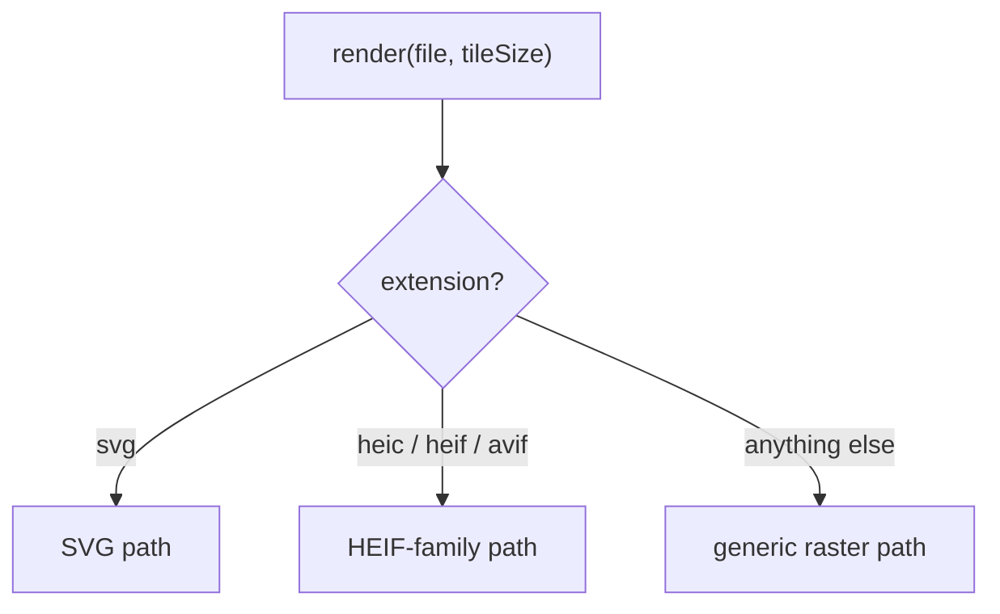
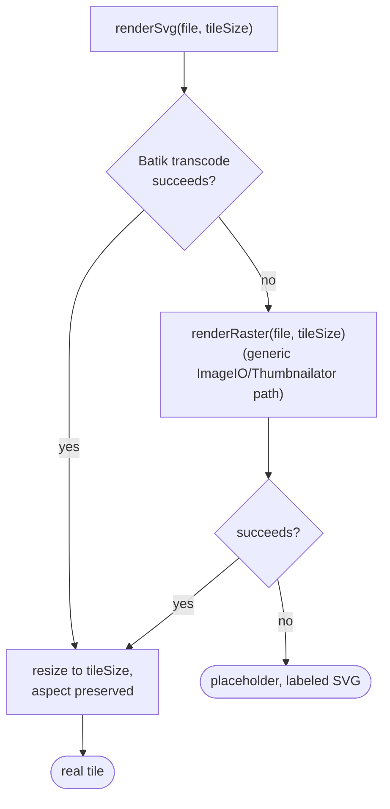
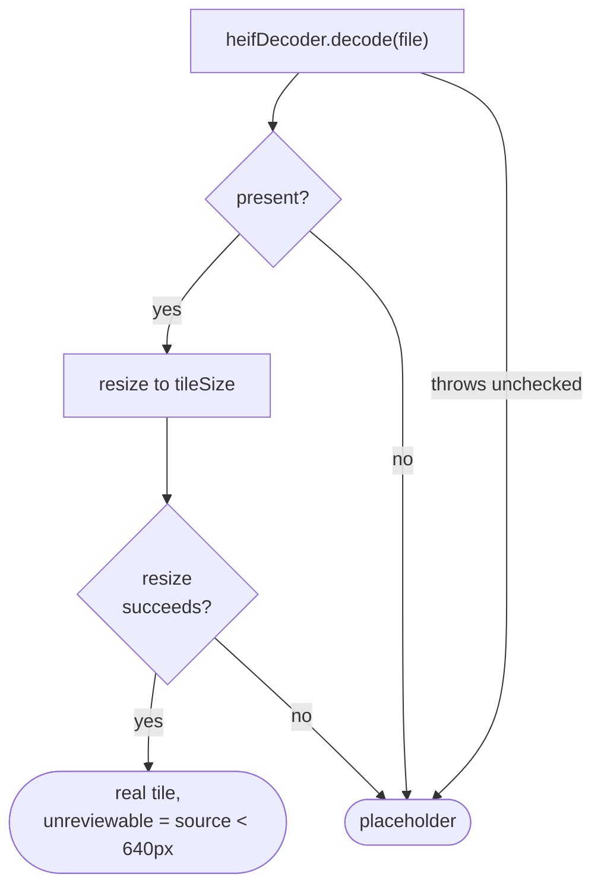
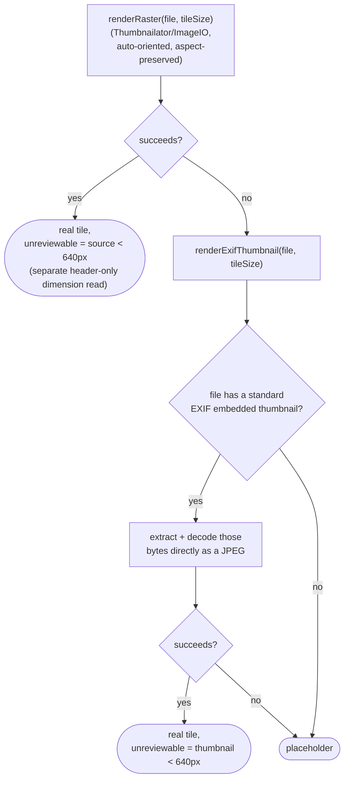

# Tile renderer

How `adapter/imaging/TileRenderer` turns one media file into one montage thumbnail tile, and
never throws. Every path terminates in a `TileResult(BufferedImage image, boolean unreviewable)`
(`app/src/main/java/photos/sluice/adapter/imaging/TileRenderer.java`).

`unreviewable` is true whenever the tile shouldn't be shown to a vision model for a keep/junk
judgment. This happens for one of two reasons. Either nothing could be decoded at all, producing a
drawn placeholder. Or real pixels came back, but the source was too small to trust for fine judgment
calls. That's below 640px on its longest side, the same bar `LowResGate` uses elsewhere. Both cases
mean the same thing to a caller assembling a montage: skip the vision pass for this file, route it
elsewhere instead.

## Top-level routing

## SVG path

Before transcoding, `svgAspectRatio(file)` parses just the root `<svg>` element's `viewBox`
(preferred) or `width`/`height` attributes to compute the real aspect ratio, then passes explicit
`KEY_WIDTH`/`KEY_HEIGHT` hints to Batik. Batik's own default, used whenever no hints are given, is
a fixed 400x400 square regardless of the document's actual aspect ratio. Verified against a real
`viewBox`-only fixture (no `width`/`height` attributes, a common valid authoring style) - it came
out visibly stretched to square before this fix.

There are two cases where the aspect ratio falls back to 1.0 (square), matching Batik's own
default. Either the file isn't parseable XML at all (e.g. a raster file mislabeled with an `.svg`
extension, a real case in this project's own fixtures). Or it declares neither `viewBox` nor
`width`/`height`. The transcode attempt then fails identically and the raster fallback below takes
over.

The XML parser blocks external entities/DTD fetching (the XXE attack vector) rather than
disallowing `DOCTYPE` outright. So a normal SVG 1.1 public-DOCTYPE prolog (common from Illustrator
exports) still parses correctly.

## HEIF-family path (heic, heif, avif)

AVIF shares HEIC/HEIF's ISOBMFF container and is decodable by the same underlying codec library
(AV1 payload instead of HEVC). So it's routed through the same `HeifDecoder` port rather than a
separate one. `adapter/imaging/CliHeifDecoder` is the real implementation. It shells to a
libheif-based CLI decoder, its command configurable via `sluice.imaging.heif-decoder-command` and
defaulting to `heif-convert` on PATH. It's verified against real HEIC and AVIF fixtures. A missing
or failing binary degrades to `Optional.empty()`, which this path already turns into a placeholder.
`TileRenderer` still takes any `HeifDecoder` through its constructor, so which instance it actually
runs with in the assembled app is a later wiring concern, not this class's. The port's signature
permits an unchecked exception, and a decoder backed by a native library or a separate process can
raise one. So the decode call is guarded, and an implementation that throws lands on the same
placeholder an empty result does.

## Generic raster path (everything else, including every RAW extension)

RAW extensions (`dng, cr2, cr3, nef, arw, raf, orf, rw2`) are deliberately **not** short-circuited
to the placeholder. The same generic decode attempt is made for them as for anything else, and a
real file can land on either outcome depending on the manufacturer. Verified against three real
cameras, spanning two decades:

- **Nikon D40 (2006)** - decodes directly at the first step. Its one embedded image is a
  160x120 thumbnail, below the judgeable bar, so the real tile comes back `unreviewable=true`.
- **Canon EOS 20D (2004)** - primary pixel data fails at the first step. This is an "old-style
  JPEG" TIFF compression that TwelveMonkeys can't decode, a real `Missing TIFF tag JPEGQTables`
  failure. But the file also carries a standard EXIF embedded thumbnail. That's a complete,
  independently decodable JPEG blob per the EXIF spec, entirely separate from the TIFF-compressed
  main image. The second step recovers that thumbnail, also 160x120, also `unreviewable=true`.
- **Sony ILCE-6700 (2023)** - the same second-step fallback instead recovers a near-full-resolution
  6192x4128 embedded preview, well above the bar: a real, sharp, clearly judgeable photo,
  `unreviewable=false`. This confirms the tiny-preview problem is an old-camera artifact, not
  something a current camera's files are assumed to share.

Only a file with no usable image data at either step (verified with a fake/corrupt file) falls all
the way through to the placeholder. The placeholder's label is the real extension for a recognized
RAW format, or "NO PREVIEW" otherwise.

## Placeholder tile

A plain `tileSize x tileSize` image: solid `#444444` background, centered bold white label text.
`render()` never throws, so this is the value it returns when nothing could be decoded, always
paired with `unreviewable=true`. Per this file's own routing rule, an unreviewable tile is expected
to be routed away from montage assembly before a grid is ever built. A placeholder should not
normally reach a montage a human or the culler actually sees. Its background is still styled
distinctly from the montage grid's own `#111111` band regardless. So it stays legible as "no
preview" rather than blending in if that routing is ever skipped or incomplete at a call site.

## Scenarios

| File                                                     | Outcome                                                                            |
|----------------------------------------------------------|------------------------------------------------------------------------------------|
| Real JPEG/PNG/WebP/TIFF/BMP/GIF, source >= 640px         | Real tile, `unreviewable=false`                                                    |
| Real JPEG etc., source < 640px                           | Real tile, `unreviewable=true`                                                     |
| Real SVG (`viewBox` only, or with a standard DOCTYPE)    | Real tile, correct aspect ratio, `unreviewable=false`                              |
| A PNG mislabeled with an `.svg` extension                | Real tile via the raster fallback, subject to the same size check                  |
| Real Nikon NEF (2006)                                    | Real tile, decoded directly, `unreviewable=true` (160x120 source)                  |
| Real Canon CR2 (2004)                                    | Real tile via its EXIF embedded thumbnail, `unreviewable=true` (160x120 source)    |
| Real Sony ILCE-6700 ARW (2023)                           | Real tile via its EXIF embedded thumbnail, `unreviewable=false` (6192x4128 source) |
| A `.cr2`-named file with no real image content           | Placeholder labeled `CR2`                                                          |
| An unknown-extension corrupt file                        | Placeholder labeled `NO PREVIEW`                                                   |
| Real HEIC/AVIF, via `CliHeifDecoder`                     | Real tile, `unreviewable` per the same 640px source-size check                     |
| HEIC/HEIF/AVIF with no decoder on PATH or a corrupt file | Placeholder labeled with the real extension                                        |
| A `HeifDecoder` that throws an unchecked exception       | Placeholder labeled with the real extension                                        |

## Known limitations

- **5 of 8 RAW extensions are untested with real bytes** (`dng, cr3, raf, orf, rw2`). They share the
  identical code path already proven safe by the CR2/NEF/ARW fixtures, but that's inference from a
  shared mechanism, not direct verification of each format.
- **`isSourceUnreviewable`'s index-0 assumption rests on an internal library detail, not a public
  contract.** It reads a separate, lightweight dimension-only stream at index 0. It assumes that's
  the same sub-image `renderRaster`'s own Thumbnailator-based decode actually used. Verified directly
  against Thumbnailator 0.4.21's own source: `InputStreamImageSource.FIRST_IMAGE_INDEX = 0` is used
  consistently for width, height, and the actual read, with no format-specific branching. The two
  reads agree today, but that verification can't cover a future Thumbnailator version.
  `TileRendererTest.unreviewableFlagMatchesTheSubImageActuallyRendered` is the actual guardrail
  against that. It uses a synthetic multi-page file with visibly different content per page. The
  check compares against the tile's own rendered pixels rather than trusting the source read to still
  hold. A future version that picked a different sub-image would fail that test immediately, rather
  than silently disagreeing.
- **The 640px judgeability threshold is grounded in exactly three real cameras**: Canon EOS 20D
  (2004), Nikon D40 (2006), and Sony ILCE-6700 (2023). That's a real empirical basis for "old
  cameras have this problem, modern ones likely don't". But it isn't an exhaustive survey across
  manufacturers or eras.

## Related

- `application/port/out/HeifDecoder` - the port this class depends on.
- `adapter/imaging/CliHeifDecoder` - the real libheif-CLI-backed implementation.
- `domain/scan/MediaTypeDetector` - supplies the lowercase extension this class routes on.
- `adapter/imaging/MontageBuilder` - composes this class's tiles into a montage grid and draws the
  per-photo filename label band below each one.
