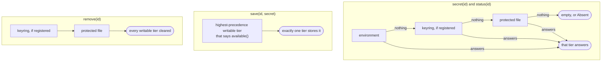
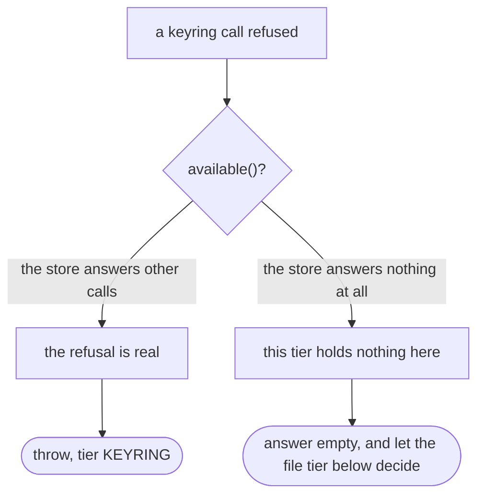
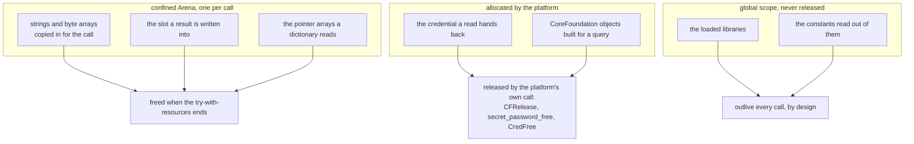

# Secret store

How `adapter/secrets` keeps the API credential a vision provider needs, across the three desktop
platforms and the machines that offer none of them
(`app/src/main/java/photos/sluice/adapter/secrets/`).

The port is `SecretStore` in `application/port/out`. Behind it sit tiers, each one a place a
credential can be read from. `TieredSecretStore` puts them in order and decides which of them any one
operation reaches.

Two things in this package are not recoverable by reading one class, and they are what this document
is for. The first is that the three operations reach different tiers, and that `available()` decides
more than which tier a save lands in. The second is who owns the native memory a binding allocates.
Both of the defects the Windows binding shipped lived in the first of those, and neither was visible
in either of the two classes it spanned.

## The tiers

| Tier                     | Reads from                     | Writable | Precedence |
|--------------------------|--------------------------------|----------|------------|
| `EnvironmentSecretTier`  | an environment variable        | no       | first      |
| `WindowsCredentialTier`  | the Windows Credential Manager | yes      | 100        |
| `LinuxSecretServiceTier` | the freedesktop Secret Service | yes      | 100        |
| `MacKeychainTier`        | the macOS keychain             | yes      | 100        |
| `FileSecretTier`         | a permission-restricted file   | yes      | 10         |

At most one keyring tier is ever registered, because `PlatformKeyring` answers for the machine it is
running on. The file tier is always registered, so a machine with no credential store is not a
machine with nowhere to keep a credential. The environment tier is read-only, which is why writing
lives on `WritableSecretTier` rather than on `SecretTier` with a method that would have to refuse.

## Which tiers each operation reaches

**A read tries every tier and a save reaches exactly one.** So a save can land in a tier above the
one currently answering, and the read then picks up the new value because it is tried first.

**A remove reaches every writable tier, including ones a read never got to.** Clearing only the tier
that answered would uncover an older credential sitting below it, which reads as the removal having
silently failed. Every tier is attempted even after one refuses, and the refusals ride back as
suppressed exceptions on one `SecretStoreException` carrying tier `STORE`.

**The environment is never written and never cleared.** A `remove` cannot reach it, so a credential
an environment variable supplies keeps answering afterwards. Settings says so rather than hiding it.

## What `available()` decides, which is more than it looks

This is the composition both Windows defects lived in, and neither class is wrong on its own.

**Four call sites route through that one question, not one.** Selection routes the save. The read
guard routes the value. The `holds` guard routes the status. The erase guard routes the removal.
Naming only the save is the understatement that produced the original blind spot.

The `holds` guard is a separate one on Linux and macOS, where `holds` reaches the store on its own.
Windows is the exception: there `holds` is a read, so both go through the one guard. Anyone changing
the Linux or macOS `holds` is changing what the status line does, and nothing else says so.

**Why a refused read fails loud rather than falling through.** The keyring has a tier below it, so
falling through looks tempting. It would serve a stale credential out of the file after the keyring
was updated, which is exactly what the unconditional remove exists to prevent.

**Why an unusable store is the exception to that.** A store refusing *every* call is not a store that
failed one read. It holds nothing newer than the file below it, so failing loud there buys no
protection and costs everything. That machine could store a credential and never read it back.

**The one machine that pays.** Where a locked keyring holds the entry and the protected file holds an
older copy, failing loud stops the file from answering. The file copy is the staler of the two by
construction, so the trade is a wrong credential served quietly against the right one refused loudly.
An environment variable overrides both, because it is read first.

## What each platform can answer without prompting

`status()` routes through `holds()`, which never prompts, because drawing a settings label must not
put a password dialog on screen. Each platform buys that guarantee by a different mechanism, and
only two of them buy it by declining to read the value. Windows reads the credential and prompts for
nothing, so there is no dialog to avoid there.

| Platform | How existence is answered without unlocking       | What a locked store looks like            |
|----------|---------------------------------------------------|-------------------------------------------|
| Windows  | no unlock step exists; a read prompts for nothing | not a state this store has                |
| Linux    | a search with an empty flag word                  | no value and no error, like absence       |
| macOS    | a query for attributes, never for data            | a status code saying so, per Apple's docs |

The macOS row is documented rather than observed. A hosted runner's keychain is unlocked, so no test
has ever exercised a locked one. What does not depend on it: an item the keychain matches and then
hands no bytes for fails loud rather than reporting absence, whatever the reason.

**Linux is the awkward one, and it costs a second call.** The library abandons a failed unlock and
returns no value and no error. That is byte-for-byte what an absent entry looks like. So
`LinuxSecretServiceTier.read` asks `holds` when the service answers nothing, and fails loud when the
entry is there. The macOS binding needs no such check. Its status code already separates "no such
item" from an item it would not hand over.

**One divergence is shared by Linux and macOS, and it is deliberate.** Existence is judged without
seeing the value, so an entry hand-filled with only whitespace reports as held while a read falls
through to the tier below. Sluice can never store one, since a save strips and refuses a blank.

## Isolation from other applications, which differs by platform

Worth keeping straight, because the strongest of the three should not be read as holding everywhere.

- **Linux enforces it.** Every call carries a schema the service matches on, and the flag that would
  disable that matching is deliberately unset. Another application's credential is invisible to every
  lookup, search and removal made here, whatever it is named.
- **Windows does not.** Its credential store is a flat namespace per account and the `Sluice:` prefix
  on an entry name is a convention. The exposure is bounded rather than absent. A collision needs
  another application to pick the same prefixed name. The worst it does is read a stranger's
  credential into memory for an instant. The only entry reached that way is the availability probe,
  which never looks at what came back.
- **macOS is neither.** `kSecAttrService` is a matching key rather than a boundary, so the naming half
  is a convention exactly like Windows. What macOS adds is a per-item access control list, which is
  real enforcement, anchored to the calling code's identity rather than to the name. For an unsigned
  build that anchor is weak, so a shipped update may re-raise the access dialog. A signed build
  closes it, since a stable code identity is what the access control recognises.

## Native memory ownership

Three bindings allocate native memory and none of them can lean on the garbage collector for it. Two
separate owners are in play, and the arena covers only one.

**The arena's rule is that anything copied in for a call dies with the call.** A confined arena per
call, closed by try-with-resources. Nothing allocated there may outlive the downcall that reads it.

**The platform's rule is that anything it allocated is released by name.** A credential handed back
by a read was allocated by the platform, so freeing it through the arena would free memory the arena
never owned. Each binding uses the platform's own release call for it.

**macOS needs a scope of its own because it allocates the most.** Every argument travels inside a
`CFDictionary`, and each string, data object and dictionary built for one call is separately
reference counted. `CfScope` holds them and releases them in reverse when the call ends. Releasing
the dictionary alone is not enough: a dictionary retains its keys and values, and releasing it drops
only its own count on them.

**The libraries sit in the global scope deliberately.** The handles built from them stay valid for
the life of the process, and nothing here owns a moment at which unloading them would be correct.

**The three release calls are not equivalent, and only one of them wipes.** libsecret's
`secret_password_free` clears the bytes before freeing them. `CFRelease` does not, and neither does
a closing arena. So on macOS a credential's plaintext survives in freed native memory until
something reuses the page. That happens twice on the update path, since the value is built for both
the add and the update.

This is consistent with the rest of the app rather than a new hazard. The tier hands the credential
around as a `String`, which the garbage collector moves and copies freely. It is recorded because
the diagram above otherwise reads as if the three release calls do the same job.

**Two kinds of global are read, and they are not read the same way.** A constant declared as a
pointer (`extern const CFStringRef kSecClass`) has a symbol address pointing at where the pointer
sits. The value wanted is one dereference further on. A constant declared as a struct
(`const CFDictionaryKeyCallBacks kCFTypeDictionaryKeyCallBacks`) has a symbol address that already is
the struct. Confusing the two compiles and links, and produces nonsense at the call.

## What sits outside the coverage gate, and why that stays honest

`Advapi32CredentialManager`, `LibsecretService` and `SecurityFrameworkKeychain` are excluded in the
pom. A binding only runs on the platform whose library it binds, so no single leg of the matrix can
cover one. The gate would end up measuring the matrix rather than the tests.

That stays honest only while a binding carries bytes and decides nothing. What to store, what a
refusal means and which platform to reach for all live in the tiers and the selector, inside the
gate. Two deliberate exceptions are named in the pom rather than glossed over. Each is a ruling that
cannot survive the seam. The Linux binding can be told neither success nor an error, and the macOS
one can match an item and then get no bytes for it.

Each binding's own proof is its round-trip test against the real credential store, guarded by
`@EnabledOnOs` rather than by an assumption on whether the store answers. Guarding on the store would
skip the runner whose answer is the unknown worth buying.
