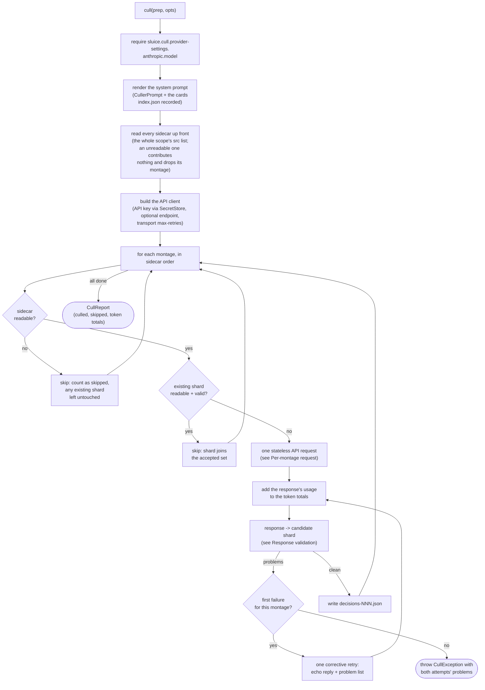
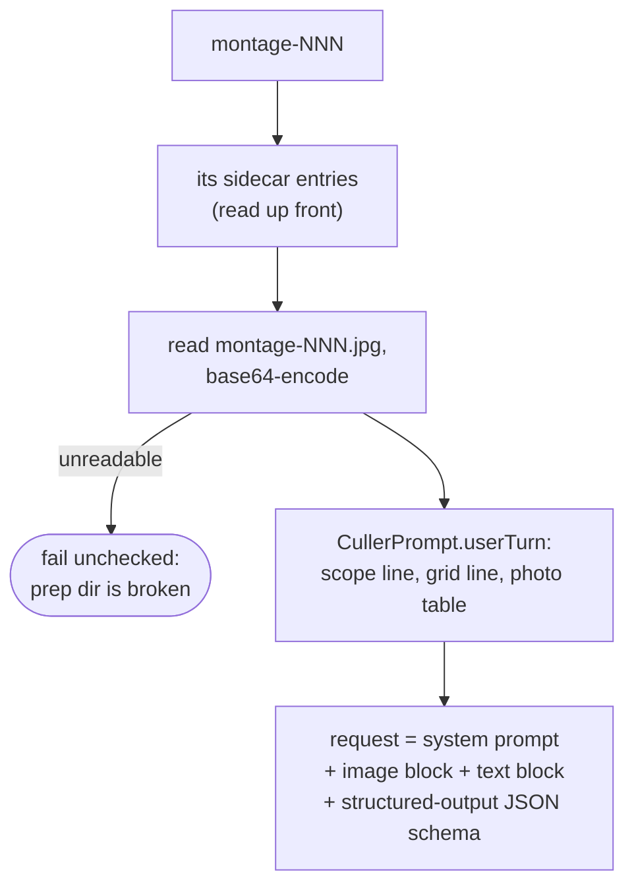
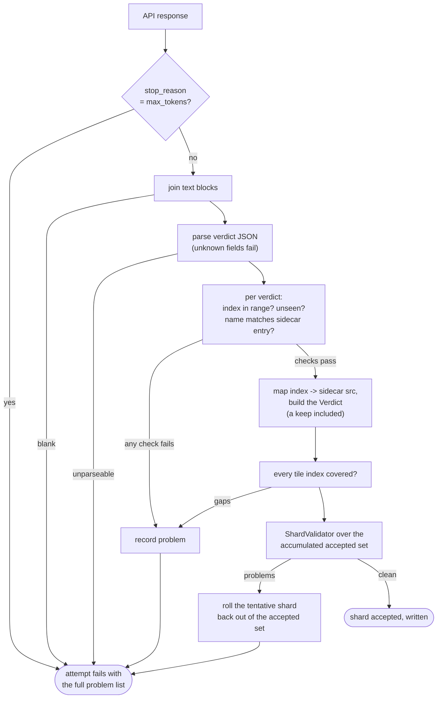
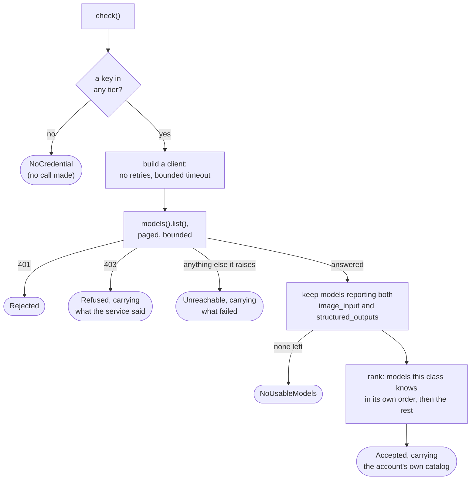

# Anthropic culler

How `adapter/vision/AnthropicCuller` implements the `VisionCuller` port
(`app/src/main/java/photos/sluice/adapter/vision/AnthropicCuller.java`). It turns a prepared
montage directory into decision shards. The user's configured Anthropic vision model is called
once per montage. Every response is validated hard, and a `decisions-NNN.json` shard is written
only for a response that passes. The on-disk output is identical in shape to what the
external-agent flavor expects to find, so the apply step and both providers share one shard
contract.

## Top-level flow

Each montage is one stateless request; no conversation state carries between montages. That
matches the crash-safety model (a shard lands on disk the moment its montage passes) and keeps
cost linear in photo count. Resume rides on the same property. A re-invoked run skips every
montage whose shard is already on disk and valid, so an interrupted cull finishes only the
remainder. An unreadable or contract-breaking existing shard is re-culled and overwritten.

A montage whose sidecar cannot be read is skipped instead. There is nothing to key the model's
verdicts back to files without one, so no request can be built for it. Failing the run outright
would be worse than skipping. The apply phase reports that montage as a corrupt sidecar, and offers
a real choice between trusting its existing shard and setting the montage aside. A hard failure
here would put the run out of reach of that answer. Any shard the montage already holds is left
exactly as it is, since trusting it is one of the two things the user may have chosen. Both a
damaged sidecar and a read that merely failed are tolerated the same way, matching what the apply
phase does with the identical file.

## Per-montage request

The image block precedes the text block, per Anthropic's vision guidance. The structured-output
schema is a discriminated union on `action`. One branch per action kind, each pinning `action` and
naming the fields that action needs beyond `index`, `name` and `action`. Every branch declares every
field a verdict may carry, so a keep that volunteers a reason is not refused. Naming the required
fields in the contract stops the model discovering them by being refused, and each gap discovered
that way costs a paid corrective retry. `ShardValidator` stays the single authority. Its
cross-verdict and cross-shard rules have no expression in a schema describing one verdict. No
sampling parameters are sent - current Anthropic models reject them.

A string constraint in the schema shapes the answer rather than refusing it, so its direction
decides whether it is safe. A floor steers an empty value away, which is what `minLength` does for a
reason. A ceiling truncates, so the slug's 24-character cap stays with the validator. Two
truncated-alike group ids would share a `Duplicates` folder whenever their keepers fall in the same
year-month, and a merge where one side brought only rejects lands silently.

No thinking parameter and no effort parameter either, so each model reasons at whatever depth it
reasons by default. Omitting both is the only shape every current model accepts. A parameter
asking for a particular depth is refused by some model, or by some setting of one. Whether depth helps
a model read a contact sheet is unmeasured. Comparing shard output across settings on the same
montages is what would settle it. `theRequestAsksForNoParticularReasoning` pins the shape, so an
answer arrives as a test to update rather than a line to notice.

The `max_tokens` ceiling is 16384. A verdict runs about 70 tokens, so the longest list a sheet can
produce is ~3.5k on a dense 7x7 grid. The remaining ~12k is a reasoning allowance, since a model
that reasons by default spends from this same ceiling at whatever depth it chooses. The ceiling also
bounds what one runaway call can cost.

## Response validation

Two validation layers, split by where the information lives:

- **Response-level, checked here:** tile indices exist only in the API response, so index
  coverage, duplicates, range, and the name-at-index match are this class's job. A name mismatch
  fails rather than healing - it signals a mis-keyed tile, and guessing which field to trust could
  set aside the wrong photo. (`ShardValidator`'s unique-basename heal is for a hand-written shard
  that retyped a path. It never rescues a mismatch here, refused before the validator is reached.)
- **Shard-level, delegated:** everything shard-shaped goes to `ShardValidator`, the contract's
  single source of truth. It runs over the whole accepted-so-far set, not the current shard alone,
  because its cross-shard rules can only fire on the full set. A near-dup group id reused by two
  montages, say, is something a stateless call could never avoid on its own. Every run validates
  against the whole scope's src list, read from all sidecars up front. This makes "in scope" mean
  the same thing here as for the sibling provider. Earlier shards are known clean, so any fresh
  problem implicates the current montage. Resumed shards join the same set, so the cross-shard
  rules keep firing across the resume boundary. A montage skipped for want of a readable sidecar is
  the one gap. Its shard stays out of the accepted set, so a group id it claims is invisible to the
  montages after it. Apply's gate sees every shard on disk and catches the collision there.

One shard-level rule is deliberately not run here: the check against `index.json`'s unreviewable
list. A file named by both a decision and that list would double-move, so it is a genuine problem.
It is just not one this class is placed to settle. The user can answer it with `TRUST_DECISION`,
and that answer lives in a disposition ledger only the apply phase reads. Rejecting a shard here
would re-derive a verdict they have already overruled, and every rejection costs another paid model
call. A verdict this class builds cannot name one of those files anyway. Each comes from a sidecar
entry, and `CullMontageRenderer` keeps the reviewable and unreviewable sets disjoint. A shard read
back off disk on the resume path carries no such guarantee, which is a second reason the question
belongs to the apply phase. It runs the same check there, with those answers applied.

A failing attempt does not throw by itself. Its problem list feeds the corrective retry (see the
top-level flow). The model's reply comes back as an assistant turn, and the problems follow as a
user turn asking for the complete corrected verdict list. The retry response goes through this
same validation. Only a second failure throws, carrying both attempts' problems. The cap is
deliberate - a model that fails the same montage twice stops burning tokens.

## The credential check

`check()` answers whether the stored key works and what it can run, in one request. Listing models
authenticates without generating tokens, so asking costs nothing.

Three details carry weight.

**Retries are off and the timeout is short.** A cull rides the retry count the user configured; a
check does not. A check that silently backs off through a 5xx reads as a hung window to whoever
asked for it.

**A model that cannot read a photo or answer a schema is not offered.** A montage is an image and a
verdict answers a JSON schema, and the Models API reports both as capability flags. That removes a
wider class of wrong choice than a typo does: a real model id for a model that cannot do the work.
A model the service describes in a shape this app cannot read is dropped the same way, leaving the
rest of the account's list usable.

**An account with nothing usable is its own answer.** `ModelCatalog` always holds at least one
model, so an empty one cannot express it. `NoUsableModels` is the variant that does, and the
compiler is then what stops an empty picker being drawn as success.

The static list in the descriptor is what a fresh install opens on, before any key exists. It is
ordered least capable first, so a surface with no recommendation to fall back on lands on the
cheapest rather than the dearest model. A successful check replaces it with the account's own.

## Failure channels

| Failure                                                                             | Who fixes it                  | How it surfaces                                                                 |
|-------------------------------------------------------------------------------------|-------------------------------|---------------------------------------------------------------------------------|
| `provider-settings.anthropic.model` unset                                           | User config                   | Unchecked `IllegalStateException` naming the property                           |
| No API key in any credential tier                                                   | Settings, or the environment  | Unchecked `IllegalStateException` naming both routes                            |
| Montage image unreadable                                                            | Re-prep the scope             | Unchecked `UncheckedIOException` - the prep dir is broken app output            |
| Sidecar unreadable                                                                  | Answer at the apply phase     | That montage is skipped; apply reports it as a corrupt sidecar                  |
| Response fails validation twice (attempt + corrective retry)                        | Re-run the cull               | Checked `CullException` naming the montage and both attempts' problems          |
| Response cut off at the token ceiling, twice                                        | Re-run, or use a smaller grid | Checked `CullException` saying the answer was cut off, not that it was bad JSON |
| Transport trouble (429/5xx/timeout) beyond `provider-settings.max-retries` backoffs | Wait / raise the retry cap    | The SDK's own exception after its exponential backoff gives up                  |

## Scenarios

| Input                                                         | Outcome                                                                                                           |
|---------------------------------------------------------------|-------------------------------------------------------------------------------------------------------------------|
| Valid verdicts for every tile                                 | Shard written, keeps included; tokens counted                                                                     |
| Every verdict is `keep`                                       | Shard written with one keep per tile - the montage is reviewed                                                    |
| First response invalid, retry valid                           | Shard written; both attempts' tokens counted                                                                      |
| A verdict names the wrong photo for its index, twice          | `CullException`; no shard written for that montage                                                                |
| A tile has no verdict, or two, twice                          | `CullException` listing the gap or the duplicate                                                                  |
| Action is not `keep`, near-dup, or a recorded category, twice | `CullException` via `ShardValidator`                                                                              |
| Two montages reuse one near-dup group id, twice               | `CullException` at the second montage; the first montage's shard stays on disk                                    |
| Response is not the schema's JSON, twice                      | `CullException`                                                                                                   |
| Response stops at `max_tokens`, twice                         | `CullException` naming the ceiling rather than the JSON                                                           |
| Run fails at montage N                                        | Shards 1..N-1 remain; the run reports failure and nothing is applied (missing shards stay a hard gate downstream) |
| Re-run after a failure or interruption                        | Montages with valid shards resume (skipped, no API call); the rest are culled                                     |
| Existing shard unreadable or contract-breaking                | Re-culled; the fresh shard overwrites it                                                                          |
| A montage's sidecar is unreadable, and it has no shard        | Skipped, no API call; apply reports the corrupt sidecar and the missing shard                                     |
| A montage's sidecar is unreadable, and it already has a shard | Skipped, no API call; that shard is left untouched for the apply-phase answer to act on                           |
| A file is named by both a decision and the unreviewable list  | Shard written; the overlap is apply's to report, with the user's own answer applied                               |

## Known limitations

- **`CullOptions` is ignored.** A montage resumes, culls, or is skipped for want of a readable
  sidecar, so `allowPartial` has nothing to waive. A montage that fails both attempts fails the
  run. `timeout` is not yet wired to the client.
- **Exhaustive verdicts are always on.** The designed off-switch for cheap all-keeper scopes
  (`cull.exhaustiveVerdicts`) is not implemented.
- **Response-level validation is single-consumer for now.** The parse and per-verdict checks live
  in this class alone. The verdict schema is provider-neutral, so any later API-backed provider
  needs the identical checks. The planned seam is a shared helper inside `adapter/vision` that
  every API provider runs before `ShardValidator`. Extracting it waits for that second consumer,
  so the helper's shape is set by real needs instead of guesses.

## Related

- `adapter/vision/CullerPrompt` - renders the system prompt and each montage's user turn. The
  cards come from the prep dir rather than live settings, so the prompt and the validation that
  judges its answer read one source.
- `adapter/vision/SidecarReader` - the authoritative in-scope photo list per montage.
- `adapter/vision/ShardCodec` - writes the accepted shard in the shared on-disk shape.
- `adapter/vision/ExternalAgentCuller` - the sibling provider; same output contract, judgement
  arrives from outside the app instead of an API call.
- `domain/cull/ShardValidator` - the shard contract's single source of truth.
- `application/port/out/VisionCuller` - the port this class implements;
  `application/service/CullDispatcher` routes to it by the configured provider id.
- [`adding-a-provider.md`](adding-a-provider.md) - what a second provider has to satisfy. It names
  this class as the structural template, so a change to the shape here is a change to that guide.
- [`cull-montage-renderer.md`](../imaging/cull-montage-renderer.md) - keeps a montage's reviewable
  and unreviewable sets disjoint, which is what lets a verdict built here never name an unreviewable
  file.
