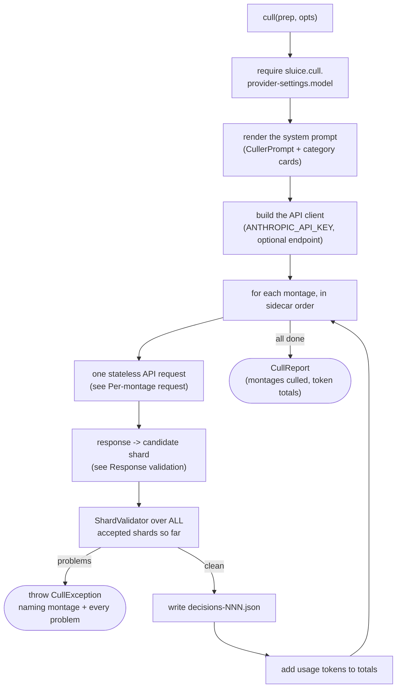
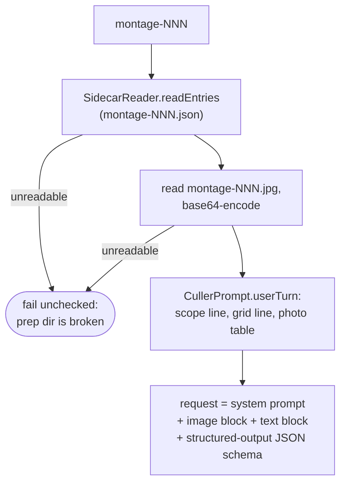
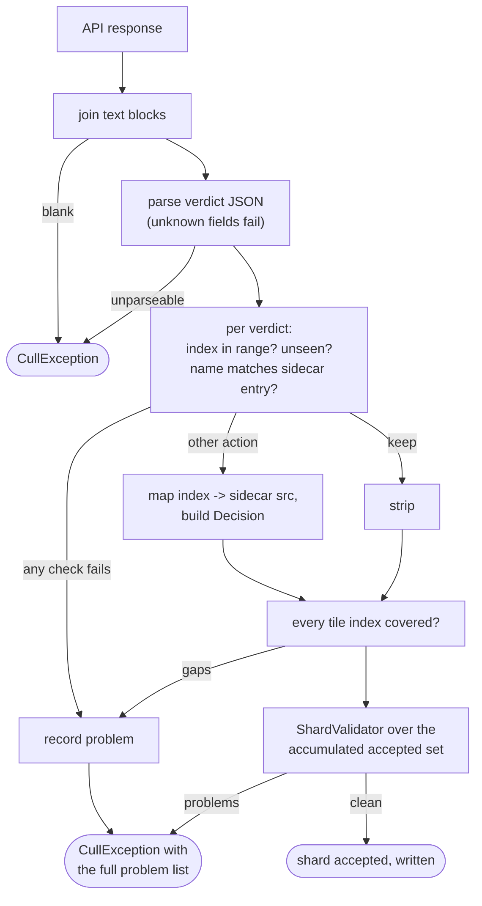

# Anthropic culler

How `adapter/vision/AnthropicCuller` implements the `VisionCuller` port
(`app/src/main/java/photos/sluice/adapter/vision/AnthropicCuller.java`). It turns a prepared
montage directory into decision shards by calling the user's configured Anthropic vision model
once per montage, validating every response hard, and writing a `decisions-NNN.json` shard only
for a response that passes. The on-disk output is identical in shape to what the external-agent
flavor expects to find, so the apply step and both providers share one shard contract.

## Top-level flow

Each montage is one stateless request; no conversation state carries between montages. That
matches the crash-safety model (a shard lands on disk the moment its montage passes) and keeps
cost linear in photo count.

## Per-montage request

The image block precedes the text block, per Anthropic's vision guidance. The structured-output
schema is a flat verdict object (`index`, `name`, `action`, optional `reason`/`group`/
`chosen_reason`, `additionalProperties: false`), deliberately not a discriminated union on
`action`: `ShardValidator` reports per-action gaps with better messages than a schema violation
would. No sampling parameters are sent - current Anthropic models reject them.

## Response validation

Two validation layers, split by where the information lives:

- **Response-level, checked here:** tile indices exist only in the API response, so index
  coverage, duplicates, range, and the name-at-index match are this class's job. A name mismatch
  fails rather than healing - it signals a mis-keyed tile, and guessing which field to trust could
  set aside the wrong photo. (The basename auto-heal exists only in the external-agent path, where
  hand-written shards may retype paths.)
- **Shard-level, delegated:** everything shard-shaped goes to `ShardValidator`, the contract's
  single source of truth. It runs over the whole accepted-so-far set, not the current shard alone,
  because its cross-shard rules can only fire on the full set - a near-dup group id reused by two
  montages, say, which a stateless call could never avoid on its own. Earlier shards are known
  clean, so any fresh problem implicates the current montage.

## Failure channels

| Failure | Who fixes it | How it surfaces |
|---|---|---|
| `provider-settings.model` unset | User config | Unchecked `IllegalStateException` naming the property |
| `ANTHROPIC_API_KEY` unset | User environment | Unchecked `IllegalStateException` naming the variable |
| Sidecar or montage image unreadable | Re-prep the scope | Unchecked `UncheckedIOException` - the prep dir is broken app output |
| Response fails any validation | Re-run the cull | Checked `CullException` naming the montage and every problem |

## Scenarios

| Input | Outcome |
|---|---|
| Valid verdicts for every tile | Shard written; keeps omitted; tokens counted |
| Every verdict is `keep` | Empty-decisions shard written - marks the montage reviewed |
| A verdict names the wrong photo for its index | `CullException`; no shard written for that montage |
| A tile has no verdict, or two | `CullException` listing the gap or the duplicate |
| Action is not `keep`, near-dup, or a configured category | `CullException` via `ShardValidator` |
| Two montages reuse one near-dup group id | `CullException` at the second montage; the first montage's shard stays on disk |
| Response is not the schema's JSON | `CullException` |
| Run fails at montage N | Shards 1..N-1 remain; the run reports failure and nothing is applied (missing shards stay a hard gate downstream) |

## Known limitations

- **Single attempt per montage, for now.** A response that fails validation fails the whole run on
  the spot. The planned recovery - one corrective retry that echoes the validator's error list back
  and accepts only corrected JSON, plus backoff for transport errors - is a documented follow-up,
  deliberately bounded so a model that fails twice on the same montage stops burning tokens.
- **No resume.** Every run culls every montage and overwrites any shard already present. Skipping
  montages that already hold a valid shard is part of the same follow-up.
- **`CullOptions` is ignored.** `allowPartial` has nothing to waive without resume, so
  `montagesSkipped` is always 0; `timeout` is not yet wired to the client.
- **Exhaustive verdicts are always on.** The designed off-switch for cheap all-keeper scopes
  (`cull.exhaustiveVerdicts`) is not implemented.
- **Response-level validation is single-consumer for now.** The parse and per-verdict checks live
  in this class alone. The verdict schema is provider-neutral, so any later API-backed provider
  needs the identical checks; the planned seam is a shared helper inside `adapter/vision` that
  every API provider runs before `ShardValidator`. Extracting it waits for that second consumer,
  so the helper's shape is set by real needs instead of guesses.

## Related

- `adapter/vision/CullerPrompt` - renders the system prompt and each montage's user turn.
- `adapter/vision/SidecarReader` - the authoritative in-scope photo list per montage.
- `adapter/vision/ShardCodec` - writes the accepted shard in the shared on-disk shape.
- `adapter/vision/ExternalAgentCuller` - the sibling provider; same output contract, judgement
  arrives from outside the app instead of an API call.
- `domain/cull/ShardValidator` - the shard contract's single source of truth.
- `application/port/out/VisionCuller` - the port this class implements;
  `application/service/CullDispatcher` routes to it by the configured provider id.
