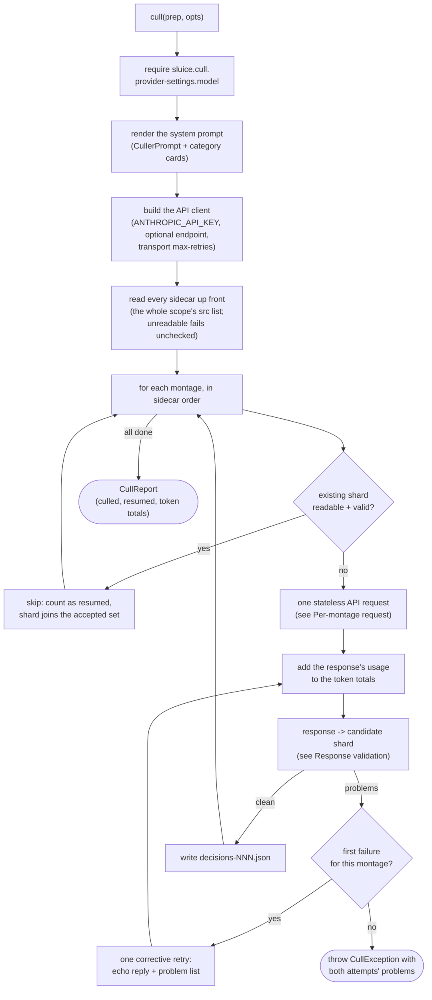
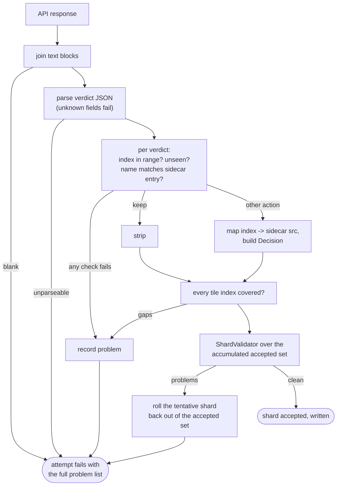

# Anthropic culler

How `adapter/vision/AnthropicCuller` implements the `VisionCuller` port
(`app/src/main/java/photos/sluice/adapter/vision/AnthropicCuller.java`). It turns a prepared
montage directory into decision shards. The user's configured Anthropic vision model is called
once per montage. Every response is validated hard, and a `decisions-NNN.json` shard is written
only for a response that passes. The on-disk output is identical in shape to what the
external-agent flavor expects to find, so the apply step and both providers share one shard
contract.

## Top-level flow

Each montage is one stateless request; no conversation state carries between montages. That
matches the crash-safety model (a shard lands on disk the moment its montage passes) and keeps
cost linear in photo count. Resume rides on the same property. A re-invoked run skips every
montage whose shard is already on disk and valid, so an interrupted cull finishes only the
remainder. An unreadable or contract-breaking existing shard is re-culled and overwritten.

## Per-montage request

The image block precedes the text block, per Anthropic's vision guidance. The structured-output
schema is a flat verdict object (`index`, `name`, `action`, optional `reason`/`group`/
`chosen_reason`, `additionalProperties: false`), deliberately not a discriminated union on
`action`. `ShardValidator` reports per-action gaps with better messages than a schema violation
would. No sampling parameters are sent - current Anthropic models reject them.

Thinking is always sent explicitly, never left to the model generation's own default:
`provider-settings.thinking` off (the default) sends disabled, on sends adaptive. The `max_tokens`
ceiling is sized from the answer. A verdict runs about 70 tokens, so the largest list a sheet can
produce is ~3.5k on a dense 7x7 grid. 8192 holds that worst case more than twice over. A thinking
run doubles the ceiling to 16384. Reasoning shares the response budget, so the extra 8192 is a
reasoning allowance (~300 tokens of deliberation per photo on the default 5x5 sheet). That keeps
a long chain from squeezing out the verdict JSON. Either ceiling also bounds what one runaway
call can cost.

## Response validation

Two validation layers, split by where the information lives:

- **Response-level, checked here:** tile indices exist only in the API response, so index
  coverage, duplicates, range, and the name-at-index match are this class's job. A name mismatch
  fails rather than healing - it signals a mis-keyed tile, and guessing which field to trust could
  set aside the wrong photo. (The basename auto-heal exists only in the external-agent path, where
  hand-written shards may retype paths.)
- **Shard-level, delegated:** everything shard-shaped goes to `ShardValidator`, the contract's
  single source of truth. It runs over the whole accepted-so-far set, not the current shard alone,
  because its cross-shard rules can only fire on the full set. A near-dup group id reused by two
  montages, say, is something a stateless call could never avoid on its own. Every run validates
  against the whole scope's src list, read from all sidecars up front. This makes "in scope" mean
  the same thing here as for the sibling provider. Earlier shards are known clean, so any fresh
  problem implicates the current montage. Resumed shards join the same set, so the cross-shard
  rules keep firing across the resume boundary.

A failing attempt does not throw by itself. Its problem list feeds the corrective retry (see the
top-level flow). The model's reply comes back as an assistant turn, and the problems follow as a
user turn asking for the complete corrected verdict list. The retry response goes through this
same validation. Only a second failure throws, carrying both attempts' problems. The cap is
deliberate - a model that fails the same montage twice stops burning tokens.

## Failure channels

| Failure                                                                             | Who fixes it               | How it surfaces                                                        |
|-------------------------------------------------------------------------------------|----------------------------|------------------------------------------------------------------------|
| `provider-settings.model` unset                                                     | User config                | Unchecked `IllegalStateException` naming the property                  |
| `ANTHROPIC_API_KEY` unset                                                           | User environment           | Unchecked `IllegalStateException` naming the variable                  |
| Sidecar or montage image unreadable                                                 | Re-prep the scope          | Unchecked `UncheckedIOException` - the prep dir is broken app output   |
| Response fails validation twice (attempt + corrective retry)                        | Re-run the cull            | Checked `CullException` naming the montage and both attempts' problems |
| Transport trouble (429/5xx/timeout) beyond `provider-settings.max-retries` backoffs | Wait / raise the retry cap | The SDK's own exception after its exponential backoff gives up         |

## Scenarios

| Input                                                           | Outcome                                                                                                           |
|-----------------------------------------------------------------|-------------------------------------------------------------------------------------------------------------------|
| Valid verdicts for every tile                                   | Shard written; keeps omitted; tokens counted                                                                      |
| Every verdict is `keep`                                         | Empty-decisions shard written - marks the montage reviewed                                                        |
| First response invalid, retry valid                             | Shard written; both attempts' tokens counted                                                                      |
| A verdict names the wrong photo for its index, twice            | `CullException`; no shard written for that montage                                                                |
| A tile has no verdict, or two, twice                            | `CullException` listing the gap or the duplicate                                                                  |
| Action is not `keep`, near-dup, or a configured category, twice | `CullException` via `ShardValidator`                                                                              |
| Two montages reuse one near-dup group id, twice                 | `CullException` at the second montage; the first montage's shard stays on disk                                    |
| Response is not the schema's JSON, twice                        | `CullException`                                                                                                   |
| Run fails at montage N                                          | Shards 1..N-1 remain; the run reports failure and nothing is applied (missing shards stay a hard gate downstream) |
| Re-run after a failure or interruption                          | Montages with valid shards resume (skipped, no API call); the rest are culled                                     |
| Existing shard unreadable or contract-breaking                  | Re-culled; the fresh shard overwrites it                                                                          |

## Known limitations

- **`CullOptions` is ignored.** Every montage either resumes or culls, so `allowPartial` has
  nothing to waive. A montage that fails both attempts fails the run. `timeout` is not yet wired
  to the client.
- **Exhaustive verdicts are always on.** The designed off-switch for cheap all-keeper scopes
  (`cull.exhaustiveVerdicts`) is not implemented.
- **Response-level validation is single-consumer for now.** The parse and per-verdict checks live
  in this class alone. The verdict schema is provider-neutral, so any later API-backed provider
  needs the identical checks. The planned seam is a shared helper inside `adapter/vision` that
  every API provider runs before `ShardValidator`. Extracting it waits for that second consumer,
  so the helper's shape is set by real needs instead of guesses.

## Related

- `adapter/vision/CullerPrompt` - renders the system prompt and each montage's user turn.
- `adapter/vision/SidecarReader` - the authoritative in-scope photo list per montage.
- `adapter/vision/ShardCodec` - writes the accepted shard in the shared on-disk shape.
- `adapter/vision/ExternalAgentCuller` - the sibling provider; same output contract, judgement
  arrives from outside the app instead of an API call.
- `domain/cull/ShardValidator` - the shard contract's single source of truth.
- `application/port/out/VisionCuller` - the port this class implements;
  `application/service/CullDispatcher` routes to it by the configured provider id.
