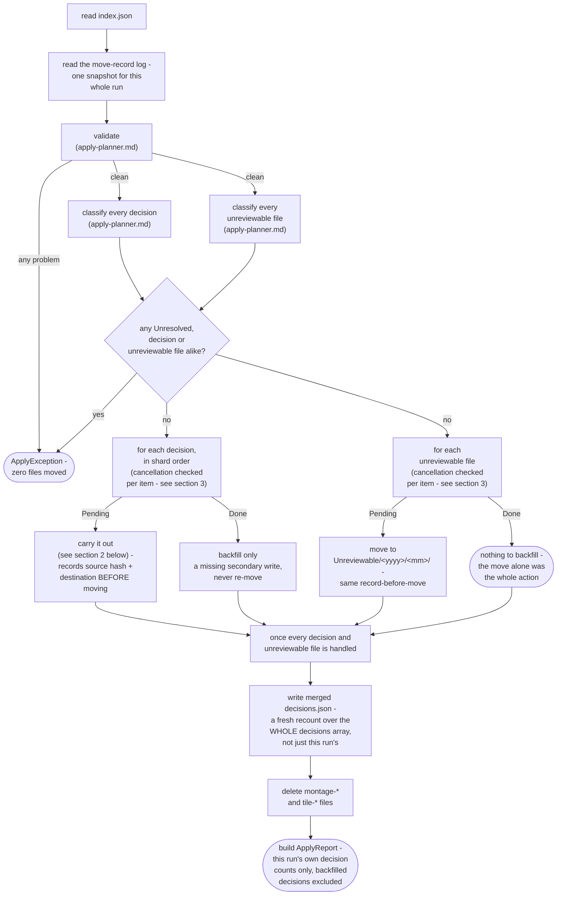
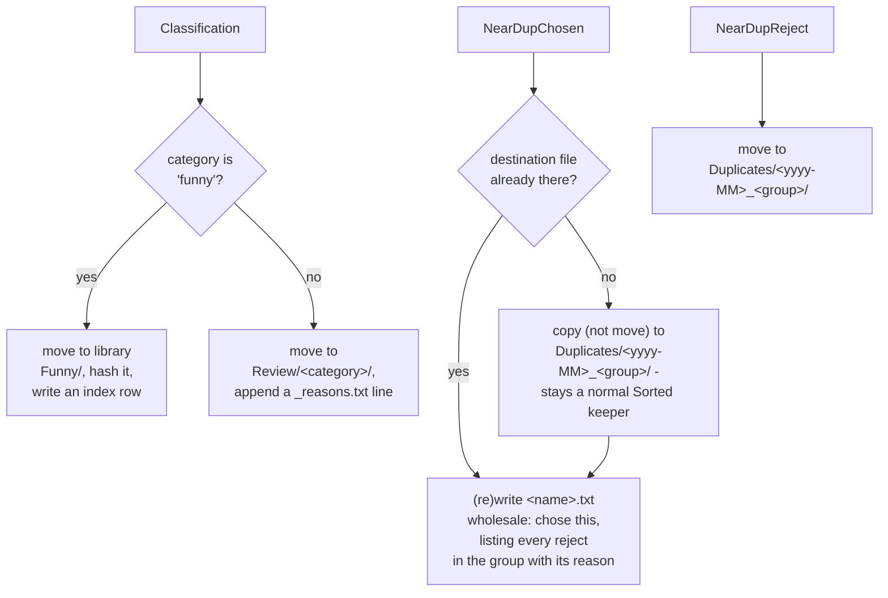
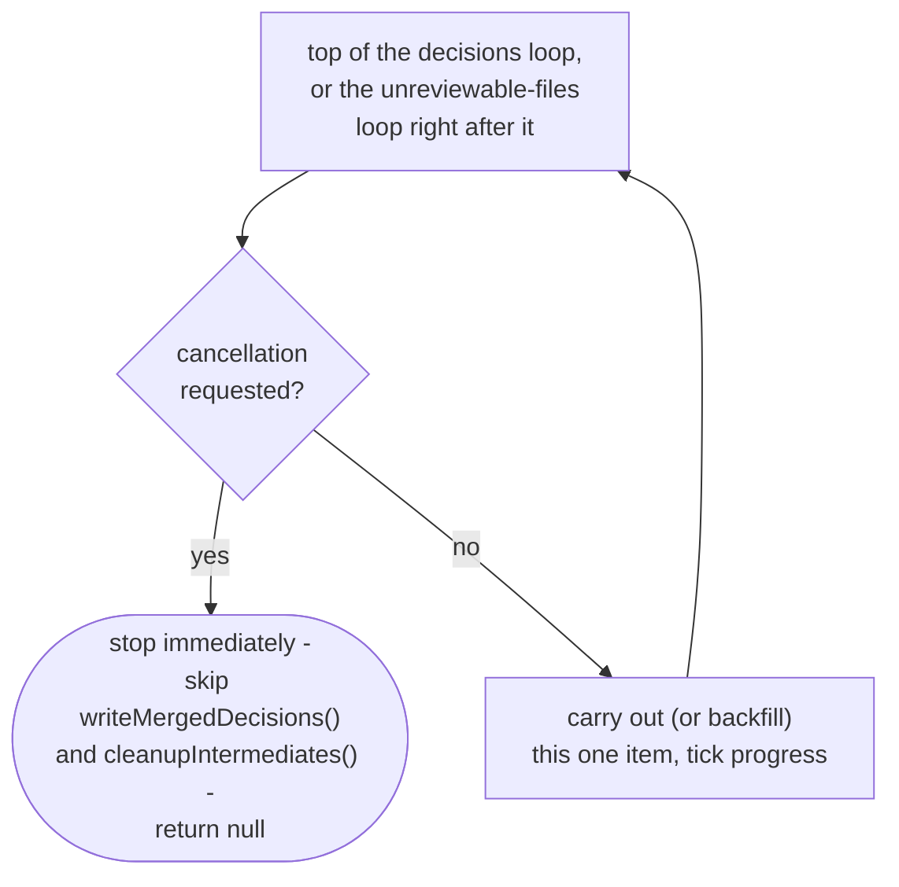

# Apply engine

How `application/service/ApplyEngine` carries a prep directory's decisions out against the
filesystem: the resumable apply pipeline, carrying out one decision, and cancellation
(`app/src/main/java/photos/sluice/application/service/ApplyEngine.java`). Validation and resume
classification are `ApplyPlanner`'s own job; see `apply-planner.md`.

## 1. The apply pipeline

The move-record log is read exactly once per run, before `validate()` even starts. That single
`Ledger` snapshot is what `validate()`, and both classification passes below, all consume. See
`move-ledger.md` for the snapshot's own rules.

Every problem source is aggregated before anything throws - a bad run is seen and fixed whole, not
one error per re-run. Classification runs entirely before any decision or unreviewable file is
carried out too. An Unresolved verdict anywhere, a decision or an unreviewable file alike, aborts
the whole run: the same all-or-nothing guarantee validation itself gives. The decisions.json write
and the intermediate cleanup always run once classification passes, even when every montage was an
all-keeps montage and zero decisions exist. A funny decision's hash-index row is written
immediately as part of carrying it out, not collected and appended once at the end. A decision
already Done on a resumed run is handled by `backfillSecondaryWrite()`
(`backfillClassificationWrite()` for a `Classification`), never reprocessed, so it never re-enters
the carry-out path. Batching the index row instead would lose it for good, the one time a crash
actually lands between decisions.

`index.json`'s own `unreviewable` list holds paths this run's montage generation found but
couldn't render a judgeable tile for. It rides through the same pipeline as a sibling to the
decisions array, not as one more decision type, and has no shard, no category, no reason.
`ApplyPlanner.classifyFile()` is `classify()`'s sibling for a plain `Path`: same
Pending/Done/Unresolved logic, minus the `NearDupChosen` copy exception (an unreviewable file is
always a move). Carrying one out reuses `recordThenMove()` exactly as `Classification`/
`NearDupReject` do, just with a different destination (`Unreviewable/<yyyy>/<mm>/`, resolved by
`CullDestinations.unreviewableDir()`) and no secondary write. A Done unreviewable file has nothing
left to backfill.

`ApplyReport` is built twice, at two different scopes, for two different readers. The value
returned to the caller counts only what *this* invocation itself moved. A decision a prior,
crashed run already carried out is not counted again. That lets a caller report "what did this
invocation just do." The summary embedded in `decisions.json` is different: a separate, freshly
recomputed tally over the *whole* decisions array in that same file. It covers this run's and every
prior run's decisions alike. `decisions.json` is overwritten wholesale each write, never appended
to, so nothing is lost by recounting it in full every time. Using the this-run-only report for both
would leave the persisted summary permanently out of step with the array sitting right next to it
after any resumed run.

## 2. Carrying out one decision

`funny` is the one category with a fixed destination, kept, not set aside for review, so it gets
no reason note. Every other category, junk included, routes generically to `Review/<category>/`;
there is no per-category destination configuration yet. The `<yyyy-MM>` folder segment comes from
the group's CHOSEN file's own `.../<yyyy>/<MM>/` parent directories, not a resolved date - this
app's Sorted layout guarantees that structure. Every member of a near-dup group shares that one
folder, chosen and rejects alike, even when a reject sits in a different Sorted month than its
keeper. A near-dup group's chosen note is built from every decision the group ever had, including
ones a prior, crashed run already carried out. A resumed run's note still lists every reject.

Every destination above is resolved by `CullDestinations`
(`application/service/CullDestinations.java`), the one class that decides which folder a
decision's file belongs in. `destinationDirFor()` covers a `Classification`, `duplicatesDir()` a
near-dup group's folder (given the group's chosen file as its anchor - see `nearDupAnchors()`),
`unreviewableDir()` an unreviewable file. `ReconcileEngine`'s offline sweep searches the very same
directories, so agreement between the two is what keeps an already-moved file from looking
permanently lost on reconcile. See `reconcile-engine.md`.

All three refuse a destination that does not land strictly inside the root it resolved from. Every
segment they are handed is already constrained upstream. A category is checked by `CategoryName`
when the prep index is read, a group id by `ShardValidator`'s slug rule, a year-month by its own
digit pattern. The refusal is still the last line before a move, and the only place the resolved
path itself is compared against its root.

### Why NearDupChosen still needs its own resume guard

Every other decision type is a *move*: once it genuinely runs, its source file disappearing is
exactly what the move-record log hash-verifies against (see `apply-planner.md`). `NearDupChosen`
is the one *copy*, its source is never removed. So that path doesn't apply to it, and it carries
no move record at all.

A crash between the copy and its note write leaves no trace in a move record, since none was ever
written for it. Reprocessing it on resume would land a stray `" (2)"` duplicate in `Duplicates/`.
It would also duplicate a line in its note, since a note is meant to hold exactly one record, not
a growing log.

Guarded directly instead: the copy only runs when the exact destination this decision would
produce doesn't already exist. The note is always (re)written wholesale via `MediaStore.write`
(create-or-truncate), never appended to. So re-running this decision, however far a prior attempt
got, converges on the same end state instead of compounding.

That destination check is reliable, but not because `ShardValidator` enforces global uniqueness. It
only checks that a group id isn't reused *within one prep dir's shards*, not across independent
runs. The real guarantee is a filesystem one: the destination path encodes the source file's own
`<yyyy>/<MM>/<basename>` plus the group id. A `Sorted` `<yyyy>/<MM>/` directory can never hold
two files with the same basename. So `exists(dest)` being true means one of two things happened.
Either this exact decision already ran, or the same source file was chosen again under the same
group in an independent re-cull. That's harmless either way, since it would be the identical bytes.

A source that's missing for a `NearDupChosen` decision is therefore always Unresolved (see
`apply-planner.md`). A copy's source is never supposed to disappear, so there is no "already done"
case for the classifier to confirm.

## 3. Cancellation

Checked once per item, at the top of both loops. That way an in-flight decision or unreviewable
file is never interrupted, and everything already carried out before the request stays carried out.
On cancel, `apply()` returns `null` instead of an `ApplyReport`, and deliberately skips both
finalizers: writing the merged `decisions.json` and deleting the montage/tile intermediates. With
no `decisions.json` written, the prep dir still reads exactly like an unresolved cull job.
`Pipeline` maps a `null` return straight to `CullJobOutcome.Waiting`, the same outcome a genuinely
incomplete shard set would produce. The engine's `null` return is the sole authority on whether the
run was cancelled; a caller never re-checks disk state to decide.

The `ApplyPlanner.validate()` pass that runs before either loop has no cancellation check of its
own. This is deliberate, not an oversight. It's read-only: shard and sidecar JSON reads, no moves
or deletes. It's also bounded by the scope's montage count, which this project's own batching
convention keeps small (tens, not thousands). In practice the wait before the first loop's own
check is negligible. Reassessed 2026-07-26 during a full cancellation-coverage review across every
engine this project's cancellation support touches; the verdict was to leave it as-is.

## Scenarios

| Scenario                                                                                                   | Outcome                                                                           |
|------------------------------------------------------------------------------------------------------------|-----------------------------------------------------------------------------------|
| Every montage is all-keeps (zero decisions across the whole run)                                           | `decisions.json` is still written; intermediates still cleaned up                 |
| A `funny` classification                                                                                   | Moved to library `Funny/`, hashed into the index, no reason note                  |
| Any other classification (including `junk`)                                                                | Moved to `Review/<category>/`, reason appended to `_reasons.txt`                  |
| A near-dup group's chosen photo                                                                            | Copied (not moved) to `Duplicates/`, original stays a Sorted keeper               |
| A near-dup group's rejected photo                                                                          | Moved to `Duplicates/`                                                            |
| A near-dup chosen photo's destination already exists (a prior run copied it, then crashed before its note) | Copy skipped; note (re)written wholesale                                          |
| index.json lists an unreviewable file (couldn't render a judgeable tile at montage time)                   | Moved to `Unreviewable/<yyyy>/<mm>/` - no reason note, nothing to backfill        |
| Cancellation requested mid-run, in either loop                                                             | `apply()` returns `null` - the finalizers never run, prep dir stays a waiting job |

## Related

- The shard contract itself, and the auto-heal rule: `ShardValidator`'s own doc comment
  (`domain/cull/ShardValidator.java`).
- The validation and resume classification this pipeline runs before carrying anything out:
  `apply-planner.md`.
- The disposition-ledger CHOICE remedies, and the corrupt-index/sidecar and last-resort discard
  repairs for a damaged prep dir: `prep-dir-remedies.md`.
- The offline rebuild for when the move ledger itself can't be trusted: `reconcile-engine.md`.
- The ledger files' own formats, markers, and parsing rules: `move-ledger.md`.
- The filesystem effects this engine relies on (`move`, `resolveDestination`, `moveTo`, `copy`,
  `appendLine`, `readLines`): `media-store.md` in the `adapter/fs` design folder.
