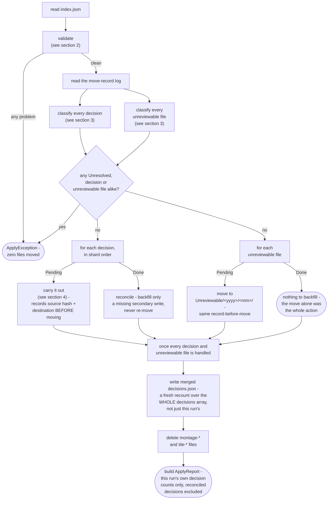
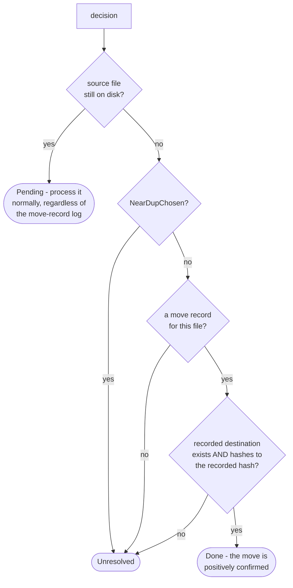
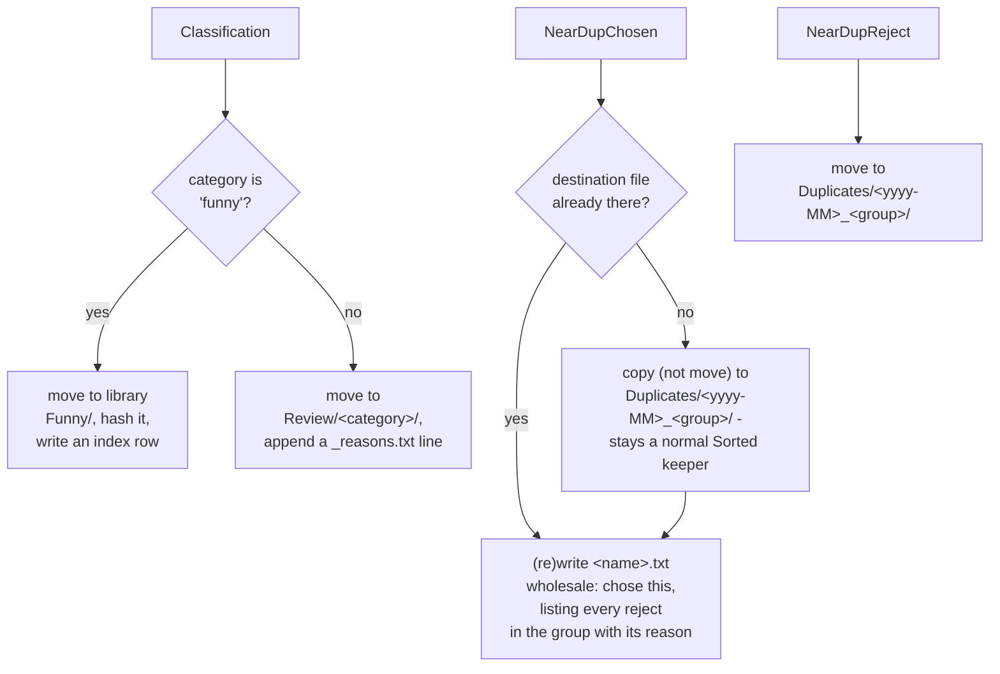

# Apply engine

How `application/service/ApplyEngine` merges a prep directory's decision shards, validates them, carries out every
non-keep decision, and leaves the prep directory in a resumable, cleaned-up state
(`app/src/main/java/photos/sluice/application/service/ApplyEngine.java`, validation rules in
`domain/cull/ShardValidator`).

## 1. The apply pipeline

Every problem source is aggregated before anything throws - a bad run is seen and fixed whole, not one error per re-run.
Classification runs entirely before any decision or unreviewable file is carried out too. An Unresolved verdict
anywhere - a decision or an unreviewable file alike - aborts the whole run, the same all-or-nothing guarantee
validation itself gives. The decisions.json write and the intermediate cleanup always run once classification passes,
even when every montage was an all-keeps montage and zero decisions exist. A funny decision's hash-index row is
written immediately as part of carrying it out, not collected and appended once at the end. A decision already Done
on a resumed run is reconciled, not reprocessed, so it never re-enters the carry-out path. Batching the index row
instead would lose it for good, the one time a crash actually lands between decisions.

`index.json`'s own `unreviewable` list (paths this run's montage generation found but couldn't render a judgeable
tile for) rides through the same pipeline as a sibling to the decisions array, not as one more decision type. It has
no shard, no category, no reason. `ApplyEngine.classifyFile()` is `classify()`'s sibling for a plain `Path`: same
Pending/Done/Unresolved logic, minus the `NearDupChosen` copy exception (an unreviewable file is always a move).
Carrying one out reuses `recordThenMove()` exactly as `Classification`/`NearDupReject` do, just with a different
destination (`Unreviewable/<yyyy>/<mm>/`, the same year/month segments `yearMonthOf()` reads for `Duplicates/`) and no
secondary write. A Done unreviewable file has nothing left to reconcile.

`ApplyReport` is built twice, at two different scopes, for two different readers. The value returned to the caller
counts only what *this* invocation itself moved. A decision a prior, crashed run already carried out is not counted
again. That lets a caller report "what did this invocation just do." The summary embedded in `decisions.json` is
different: a separate, freshly recomputed tally over the *whole* decisions array in that same file, this run's and every
prior run's alike. `decisions.json` is overwritten wholesale each write, never appended to, so nothing is lost by
recounting it in full every time. Using the this-run-only report for both would leave the persisted summary permanently
out of step with the array sitting right next to it after any resumed run.

## 2. Validation

A missing shard is the only problem allowPartial waives. A stray decisions file, an off-contract decision, and a
decision whose file resolves to neither the sidecar's in-scope set nor a unique healable basename are always fatal.
ShardValidator itself does no I/O: it checks a decision's file against the sidecar-derived set, never the filesystem. So
`ApplyEngine` runs one more pass after a clean validation - classifying every decision for resume (see section 3) -
before moving anything.

## 3. Classifying a decision (or an unreviewable file) for resume

A decision whose source file is still on disk is always Pending. A move that never happened needs no verification -
it just needs doing. Every other decision needs its source's disappearance explained before the run can proceed.
Either it's `NearDupChosen` (never move-based, see below), or a move record proves the move that removed it actually
happened, or the run refuses.

An unreviewable file follows the same diagram with node D always answered "no" - it has no `NearDupChosen`-shaped
copy exception, since routing one is always a move. `classifyFile()` is this logic's standalone version for a plain
`Path`, used because an unreviewable file has no `Decision` behind it to carry through the rest of the diagram.

### Why a move record, written before the move, not a log written after

A log recording a decision's completion *after* carrying it out has a fundamental gap. A crash landing between the
move and that write leaves no way to tell "already moved, log write lost" apart from "never moved at all." The run
would have to refuse and ask a human to check by hand which case it was. Even then, only `NearDupReject` (the one
decision type with no write after its move) has a manual recovery that's actually safe to apply unconditionally.

`ApplyEngine.recordThenMove()` avoids that gap entirely by moving the durable write to *before* the move instead of
after it. Before touching the file, it resolves the exact, already-collision-resolved destination the move will land
on (`MediaStore.resolveDestination`), hashes the source, and appends both to the move-record log. Only then does it
call `MediaStore.moveTo`, which moves straight to that reserved path with no collision logic of its own. A resumed
run whose source has disappeared doesn't need to guess a destination name (`" (2)"`, `" (3)"`, ...). It looks up the
one exact path this decision was recorded as headed for, and hashes whatever sits there. A match is positive proof
the move happened, not a guess. A mismatch, a missing destination, or no record at all all mean the same thing - this
engine cannot tell what happened to the file, and it refuses rather than guessing.

Confirming the move this way also settles a `Classification` decision's second write (a library hash-index row, or a
`_reasons.txt` line) that a crash could have skipped independently of the move itself. Once the move is positively
confirmed, `ApplyEngine.reconcile()` checks that second write directly - `funny` via `HashIndexPort.contains`,
everything else via an exact line match in `_reasons.txt`. It backfills only if that write is actually missing.
Nothing is ever re-moved on this path. A reconciled decision also isn't counted in the report `apply()` returns.

## 4. Carrying out one decision

`funny` is the one category with a fixed destination - kept, not set aside for review, so it gets no reason note. Every
other category, junk included, routes generically to `Review/<category>/`; there is no per-category destination
configuration yet. The `<yyyy-MM>` folder segment comes from the decision file's own `.../<yyyy>/<MM>/` parent
directories, not a resolved date - this app's Sorted layout guarantees that structure. A near-dup group's chosen note is
built from every decision the group ever had, including ones a prior, crashed run already carried out. A resumed run's
note still lists every reject.

### Why NearDupChosen still needs its own resume guard

Every other decision type is a *move*: once it genuinely runs, its source file disappearing is exactly what the
move-record log (section 3) hash-verifies against. `NearDupChosen` is the one *copy* - its source is never removed.
So that path doesn't apply to it, and it carries no move record at all.

A crash between the copy and its note write leaves no trace in a move record, since none was ever written for it.
Reprocessing it on resume would land a stray `" (2)"` duplicate in `Duplicates/`. It would also duplicate a line in
its note, since a note is meant to hold exactly one record, not a growing log.

Guarded directly instead: the copy only runs when the exact destination this decision would produce doesn't already
exist. The note is always (re)written wholesale via `MediaStore.write` (create-or-truncate), never appended to. So
re-running this decision, however far a prior attempt got, converges on the same end state instead of compounding.

That destination check is reliable, but not because `ShardValidator` enforces global uniqueness. It only checks that
a group id isn't reused *within one prep dir's shards*, not across independent runs. The real guarantee is a
filesystem one: the destination path encodes the source file's own `<yyyy>/<MM>/<basename>` plus the group id, and a
`Sorted` `<yyyy>/<MM>/` directory can never hold two files with the same basename. So `exists(dest)` can only be true
when this exact decision already ran, or the same source file was chosen again under the same group in an
independent re-cull. That's harmless either way, since it would be the identical bytes.

A source that's missing for a `NearDupChosen` decision is therefore always Unresolved (section 3). A copy's source is
never supposed to disappear, so there is no "already done" case for the classifier to confirm.

## Scenarios

| Scenario                                                                                                   | Outcome                                                                            |
|------------------------------------------------------------------------------------------------------------|------------------------------------------------------------------------------------|
| A montage's shard is missing, `allowPartial` not set                                                       | `ApplyException`, zero files moved                                                 |
| A montage's shard is missing, `allowPartial` set                                                           | That montage's photos stay in place; the rest of the run applies                   |
| A decisions file exists with no matching montage                                                           | `ApplyException`, zero files moved (regardless of `allowPartial`)                  |
| A decision's category isn't configured, or a required field is blank                                       | `ApplyException`, zero files moved                                                 |
| A decision's `file` doesn't match any sidecar entry, but its basename does (and is unique)                 | Healed - applied to the resolved path, reported as a heal                          |
| A move-based decision's file is missing, with no move record verifying it already ran                      | Unresolved - `ApplyException`, zero files moved                                    |
| A move-based decision's file is missing, and its move record's destination hash-verifies                   | Done - not reprocessed; a missing secondary write is backfilled                    |
| A move record's destination is missing, or its content no longer matches the recorded hash                 | Unresolved - `ApplyException`, zero files moved; the record alone is never trusted |
| Every montage is all-keeps (zero decisions across the whole run)                                           | `decisions.json` is still written; intermediates still cleaned up                  |
| A `funny` classification                                                                                   | Moved to library `Funny/`, hashed into the index, no reason note                   |
| Any other classification (including `junk`)                                                                | Moved to `Review/<category>/`, reason appended to `_reasons.txt`                   |
| A near-dup group's chosen photo                                                                            | Copied (not moved) to `Duplicates/`, original stays a Sorted keeper                |
| A near-dup group's rejected photo                                                                          | Moved to `Duplicates/`                                                             |
| A near-dup chosen photo's destination already exists (a prior run copied it, then crashed before its note) | Copy skipped; note (re)written wholesale                                           |
| index.json lists an unreviewable file (couldn't render a judgeable tile at montage time)                   | Moved to `Unreviewable/<yyyy>/<mm>/` - no reason note, nothing to reconcile        |
| An unreviewable file's move record verifies (destination hash-matches) but its source is gone              | Done - not reprocessed; there is no secondary write to backfill                    |
| An unreviewable file is missing, with no move record verifying it already ran                              | Unresolved - `ApplyException`, zero files moved (same gate as any decision)        |

## Related

- The shard contract itself, and the auto-heal rule: `ShardValidator`'s own doc comment
  (`domain/cull/ShardValidator.java`).
- The filesystem effects this engine relies on (`move`, `resolveDestination`, `moveTo`, `copy`, `appendLine`,
  `readLines`): `media-store.md` in the `adapter/fs` design folder.
