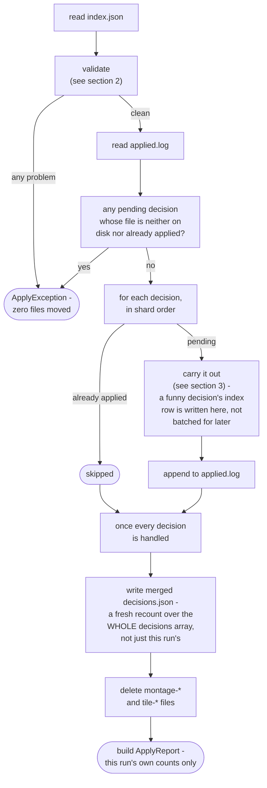
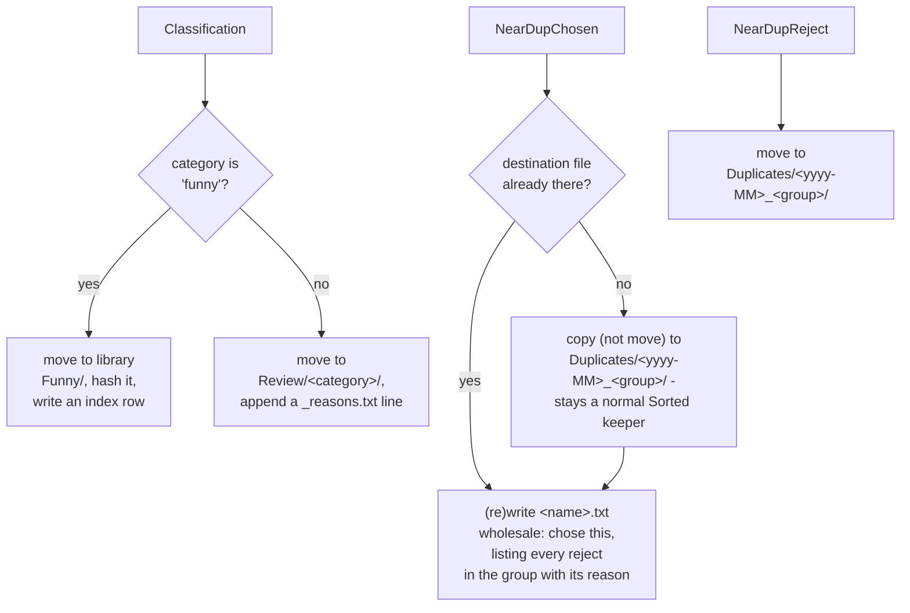

# Apply engine

How `application/service/ApplyEngine` merges a prep directory's decision shards, validates them, carries out every
non-keep decision, and leaves the prep directory in a resumable, cleaned-up state
(`app/src/main/java/photos/sluice/application/service/ApplyEngine.java`, validation rules in
`domain/cull/ShardValidator`).

## 1. The apply pipeline

Every problem source is aggregated before anything throws - a bad run is seen and fixed whole, not one error per re-run.
The decisions.json write and the intermediate cleanup always run once validation passes, even when every montage was an
all-keeps montage and zero decisions exist. A funny decision's hash-index row is written immediately as part of carrying
it out, not collected and appended once at the end. A decision already skipped on a resumed run never reaches that point
again. Batching it would lose the row for good, the one time a crash actually lands between decisions.

`ApplyReport` is built twice, at two different scopes, for two different readers. The value returned to the caller
counts only what *this* invocation itself moved. A decision a prior, crashed run already carried out is not counted
again. That lets a caller report "what did this invocation just do." The summary embedded in `decisions.json` is
different: a separate, freshly recomputed tally over the *whole* decisions array in that same file, this run's and every
prior run's alike. `decisions.json` is overwritten wholesale each write, never appended to, so nothing is lost by
recounting it in full every time. Using the this-run-only report for both would leave the persisted summary permanently
out of step with the array sitting right next to it after any resumed run.

## 2. Validation

A missing shard is the only problem allowPartial waives. A stray decisions file, an off-contract decision, and a
decision whose file resolves to neither the sidecar's in-scope set nor a unique healable basename are always fatal.
ShardValidator itself does no I/O: it checks a decision's file against the sidecar-derived set, never the filesystem. So
`ApplyEngine` runs one more pass after a clean validation. Every decision not already in `applied.log` must exist on
disk, or the whole run still refuses before moving anything.

## 3. Carrying out one decision

`funny` is the one category with a fixed destination - kept, not set aside for review, so it gets no reason note. Every
other category, junk included, routes generically to `Review/<category>/`; there is no per-category destination
configuration yet. The `<yyyy-MM>` folder segment comes from the decision file's own `.../<yyyy>/<MM>/` parent
directories, not a resolved date - this app's Sorted layout guarantees that structure. A near-dup group's chosen note is
built from every decision the group ever had, including ones a prior, crashed run already carried out. A resumed run's
note still lists every reject.

### Why NearDupChosen needs its own resume guard

Every other decision type is a *move*. Its source file disappearing is a reliable, free signal that it already ran.
Section 2's exists-check already catches a crash that landed after the move but before `applied.log`'s write, and the
whole run refuses loudly rather than silently reprocessing (or silently skipping) anything.

`NearDupChosen` is the one *copy*. Its source is never removed, so that signal doesn't exist for it. A crash in that
same window leaves no trace telling a resumed run this decision already happened. Reprocessing it would land a stray
`" (2)"` duplicate in `Duplicates/`, and - since a note is meant to hold exactly one record, not a growing log - a
duplicated line in its note.

Guarded directly instead. The copy only runs when the exact destination this decision would produce doesn't already
exist. The note is always (re)written wholesale via `MediaStore.write` (create-or-truncate), never appended to. So
re-running this decision, however far a prior attempt got, converges on the same end state instead of compounding.

That destination check is reliable, but not because `ShardValidator` enforces global uniqueness - it only checks that a
group id isn't reused *within one prep dir's shards*, not across independent runs. The real guarantee is a filesystem
one: the destination path encodes the source file's own `<yyyy>/<MM>/<basename>` plus the group id, and a `Sorted`
`<yyyy>/<MM>/` directory can never hold two files with the same basename. So `exists(dest)` can only be true when this
exact decision already ran, or the same source file was chosen again under the same group in an independent re-cull -
which is harmless, since it would be the identical bytes either way.

**Why not extend the same idea to the four move-based types?** That would mean auto-healing past the exists-check by
treating "missing from Sorted, sitting at the expected destination" as proof of a completed-but-unlogged decision. Two
problems rule that out, neither worth solving without a real transaction log.

First: a move's *destination* isn't as unambiguous a signal as a copy's. `Review/<category>/` and library `Funny/` are
shared by every other decision routed there. Presence alone can't distinguish "this exact decision already ran" from
"an unrelated file happens to share the leaf name" - a real case this app already has to handle elsewhere, since a
camera's filename counter resetting means two unrelated photos from different months can legitimately share one name.

Second: unlike the copy case, there is no ordering fix available. Whichever write happens last is the one exposed to
this gap, and `applied.log` must be that last write. Writing it *before* the move would silently and permanently skip a
decision that never actually ran - strictly worse than the current loud refusal.

The move-based exists-check refusal is therefore accepted as-is. It's a real, narrow crash window, and it always fails
loud rather than silently reprocessing or silently corrupting a file. `ApplyEngine.apply()`'s own `ApplyException`
message spells out the manual recovery: the exact line to add to `applied.log` to mark the ambiguous decision done,
once its destination confirms it already happened.

That manual recovery is only complete on its own for `NearDupReject`, which has no write beyond the move. A
`Classification` decision (funny or not) has a second write after its move - a library hash-index row, or a
`_reasons.txt` line - that the same crash could equally have landed before. Marking the decision done without checking
that second write also landed would silently and permanently skip it: the decision never reaches `applyClassification`
again once it's in `applied.log`. So this one recovery path *can* lose data, just not media - the message says so, and
names the specific thing to confirm first. Closing this gap for real, so a resumed run can confirm this on its own
instead of asking the user to check by hand, needs a genuine journal: hashing a file before its move, so a candidate
destination can be positively matched instead of guessed at from its name. Planned, not yet built.

## Scenarios

| Scenario                                                                                                     | Outcome                                                             |
|--------------------------------------------------------------------------------------------------------------|---------------------------------------------------------------------|
| A montage's shard is missing, `allowPartial` not set                                                         | `ApplyException`, zero files moved                                  |
| A montage's shard is missing, `allowPartial` set                                                             | That montage's photos stay in place; the rest of the run applies    |
| A decisions file exists with no matching montage                                                             | `ApplyException`, zero files moved (regardless of `allowPartial`)   |
| A decision's category isn't configured, or a required field is blank                                         | `ApplyException`, zero files moved                                  |
| A decision's `file` doesn't match any sidecar entry, but its basename does (and is unique)                   | Healed - applied to the resolved path, reported as a heal           |
| A decision's file is neither on disk nor already in `applied.log`                                            | `ApplyException`, zero files moved                                  |
| A file's key is already present in `applied.log`                                                             | Skipped - not moved or copied again                                 |
| Every montage is all-keeps (zero decisions across the whole run)                                             | `decisions.json` is still written; intermediates still cleaned up   |
| A `funny` classification                                                                                     | Moved to library `Funny/`, hashed into the index, no reason note    |
| Any other classification (including `junk`)                                                                  | Moved to `Review/<category>/`, reason appended to `_reasons.txt`    |
| A near-dup group's chosen photo                                                                              | Copied (not moved) to `Duplicates/`, original stays a Sorted keeper |
| A near-dup group's rejected photo                                                                            | Moved to `Duplicates/`                                              |
| A near-dup chosen photo's destination already exists (a prior run copied it, then crashed before logging it) | Copy skipped; note (re)written wholesale; now marked applied        |

## Related

- The shard contract itself, and the auto-heal rule: `ShardValidator`'s own doc comment
  (`domain/cull/ShardValidator.java`).
- The filesystem effects this engine relies on (`move`, `copy`, `appendLine`, `readLines`):
  `media-store.md` in the `adapter/fs` design folder.
