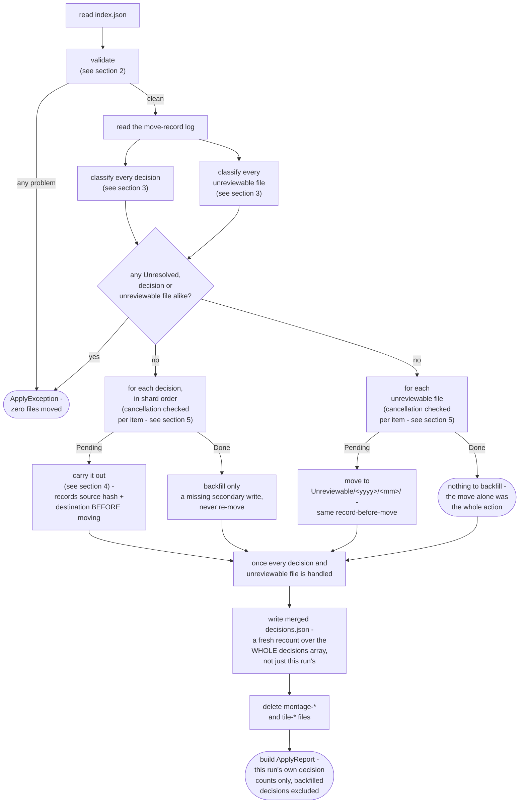
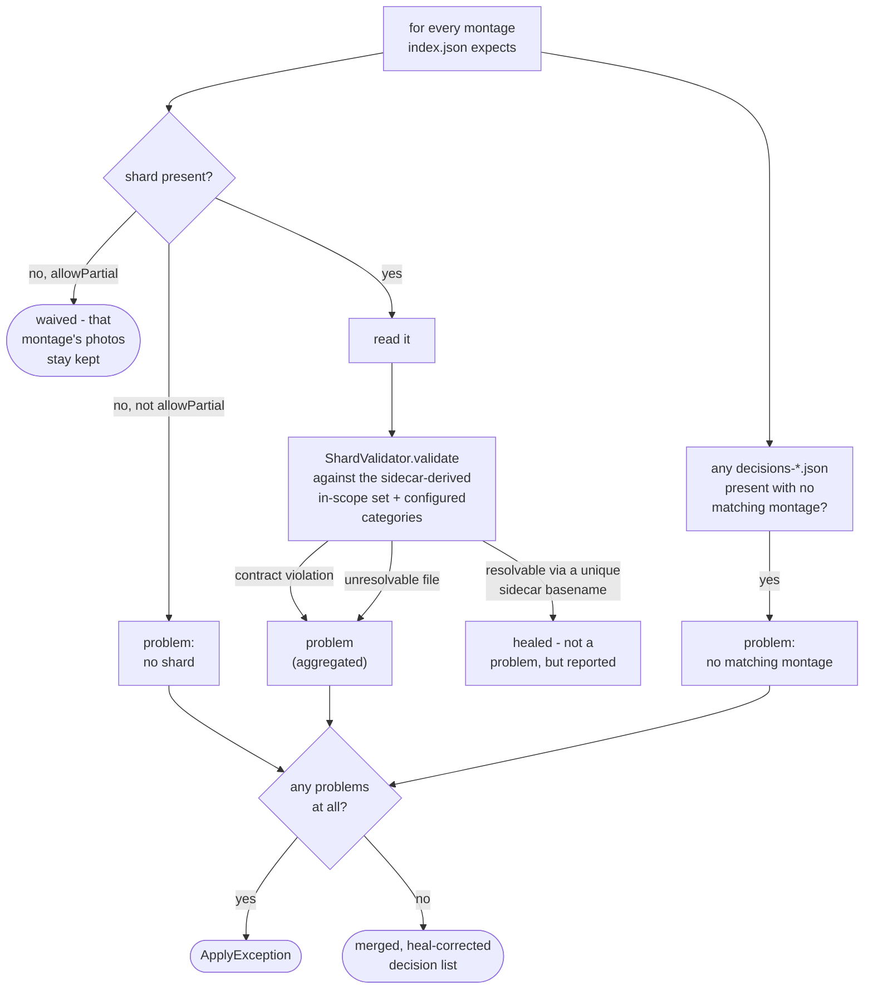
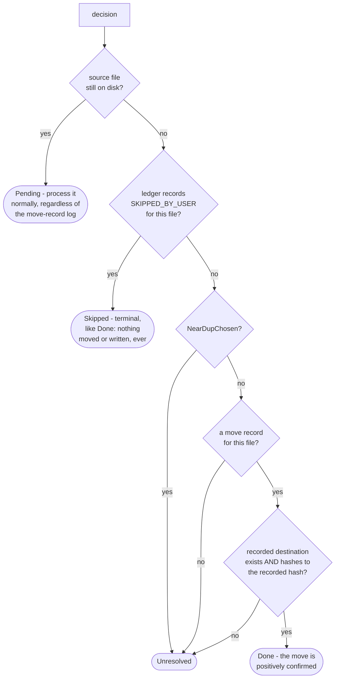
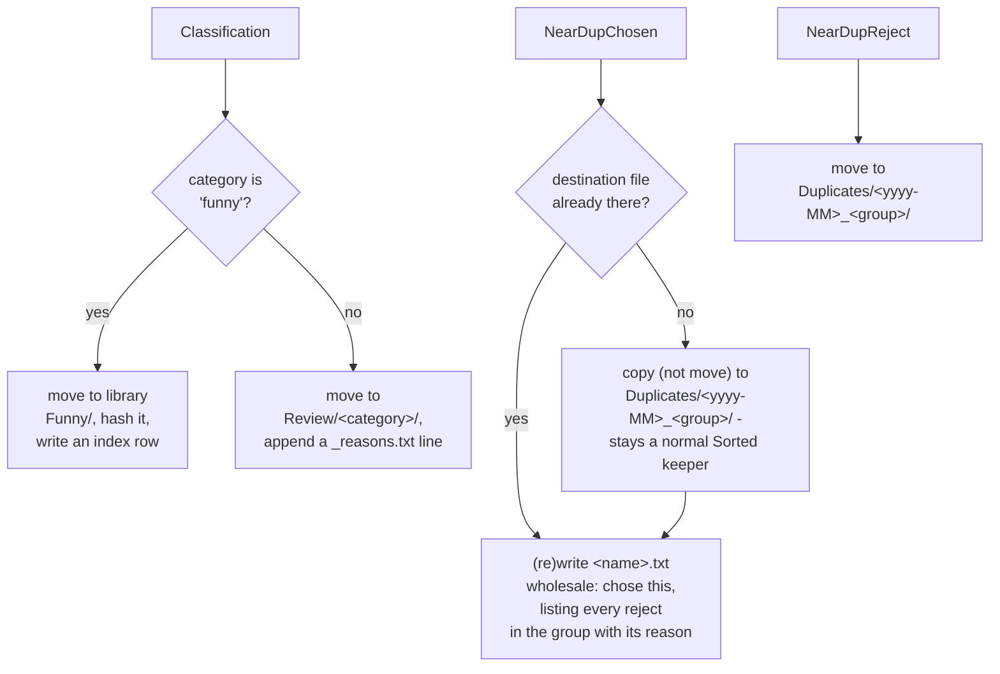
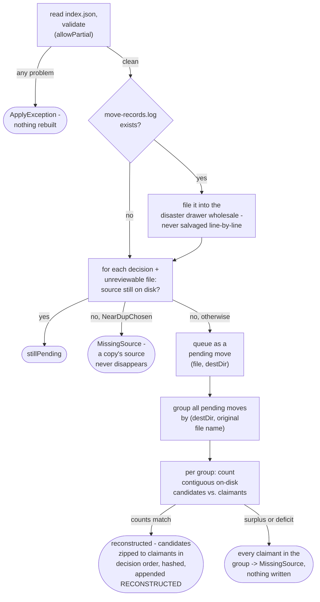
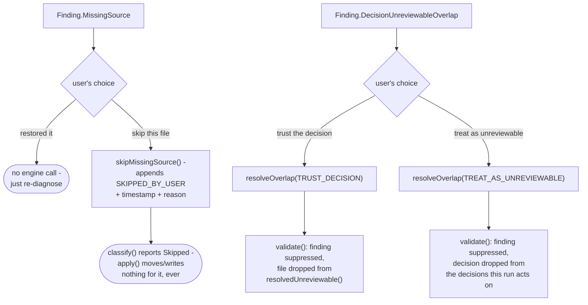
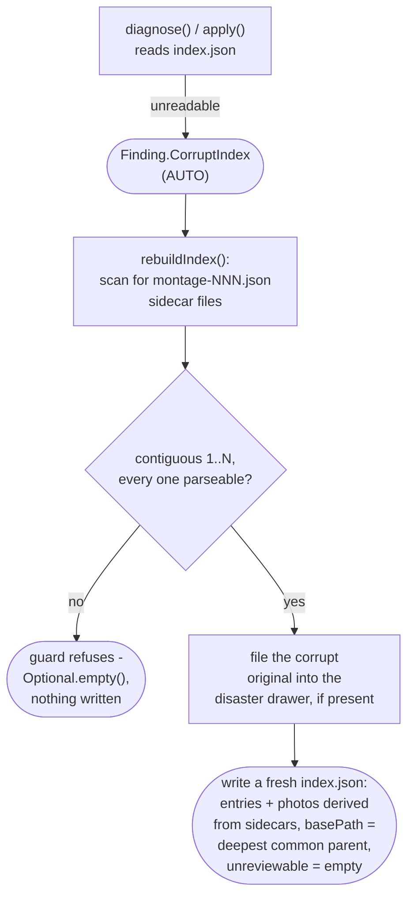
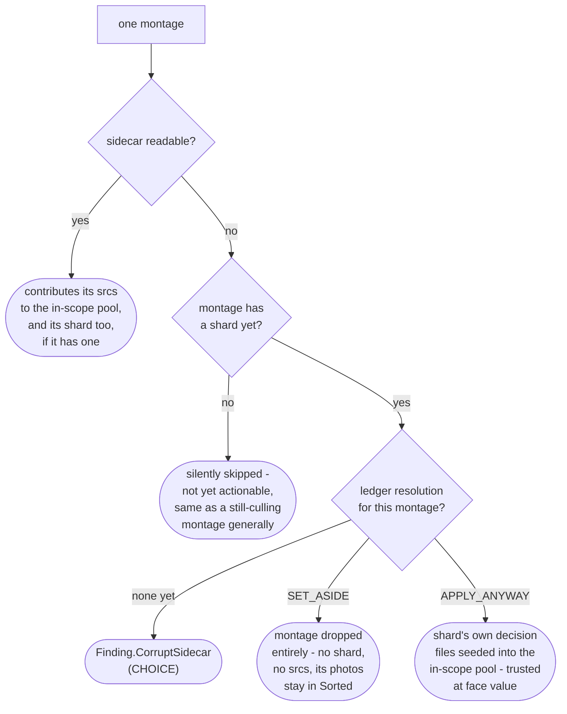

# Apply engine

How `application/service/ApplyEngine` merges a prep directory's decision shards, validates them,
carries out every non-keep decision, and leaves the prep directory in a resumable, cleaned-up state
(`app/src/main/java/photos/sluice/application/service/ApplyEngine.java`, validation rules in
`domain/cull/ShardValidator`).

## 1. The apply pipeline

Every problem source is aggregated before anything throws - a bad run is seen and fixed whole, not
one error per re-run. Classification runs entirely before any decision or unreviewable file is
carried out too. An Unresolved verdict anywhere - a decision or an unreviewable file alike - aborts
the whole run, the same all-or-nothing guarantee validation itself gives. The decisions.json write
and the intermediate cleanup always run once classification passes, even when every montage was an
all-keeps montage and zero decisions exist. A funny decision's hash-index row is written
immediately as part of carrying it out, not collected and appended once at the end. A decision
already Done on a resumed run is backfilled, not reprocessed, so it never re-enters the carry-out
path. Batching the index row instead would lose it for good, the one time a crash actually lands
between decisions.

`index.json`'s own `unreviewable` list (paths this run's montage generation found but couldn't
render a judgeable tile for) rides through the same pipeline as a sibling to the decisions array,
not as one more decision type. It has no shard, no category, no reason.
`ApplyEngine.classifyFile()` is `classify()`'s sibling for a plain `Path`: same
Pending/Done/Unresolved logic, minus the `NearDupChosen` copy exception (an unreviewable file is
always a move). Carrying one out reuses `recordThenMove()` exactly as
`Classification`/`NearDupReject` do, just with a different destination (`Unreviewable/<yyyy>/<mm>/`,
the same year/month segments `yearMonthOf()` reads for `Duplicates/`) and no secondary write. A
Done unreviewable file has nothing left to backfill.

`ApplyReport` is built twice, at two different scopes, for two different readers. The value
returned to the caller counts only what *this* invocation itself moved. A decision a prior,
crashed run already carried out is not counted again. That lets a caller report "what did this
invocation just do." The summary embedded in `decisions.json` is different: a separate, freshly
recomputed tally over the *whole* decisions array in that same file, this run's and every prior
run's alike. `decisions.json` is overwritten wholesale each write, never appended to, so nothing is
lost by recounting it in full every time. Using the this-run-only report for both would leave the
persisted summary permanently out of step with the array sitting right next to it after any
resumed run.

## 2. Validation

A missing shard is the only problem allowPartial waives. A stray decisions file, an off-contract
decision, and a decision whose file resolves to neither the sidecar's in-scope set nor a unique
healable basename are always fatal. ShardValidator itself does no I/O: it checks a decision's file
against the sidecar-derived set, never the filesystem. So `ApplyEngine` runs one more pass after a
clean validation - classifying every decision for resume (see section 3) - before moving anything.

The sidecar-derived in-scope set itself isn't read in one flat pass over every montage - a montage
whose own sidecar can't be read (missing or corrupt) is handled per section 8, either silently
skipped (not yet culled), reported as a `CorruptSidecar` finding, or resolved per the disposition
ledger, before the healthy montages' srcs and shards ever reach `ShardValidator`.

## 3. Classifying a decision (or an unreviewable file) for resume

A decision whose source file is still on disk is always Pending. A move that never happened needs
no verification - it just needs doing. A file the disposition ledger records as skipped
(`ApplyEngine.skipMissingSource()` - see section 7) is Skipped regardless of decision type, checked
before the `NearDupChosen` case: the user gave up on it rather than restoring it, so there is
nothing left to move or verify. Every other decision needs its source's disappearance explained
before the run can proceed. Either it's `NearDupChosen` (never move-based, see below), or a move
record proves the move that removed it actually happened, or the run refuses.

An unreviewable file follows the same diagram with node D always answered "no" - it has no
`NearDupChosen`-shaped copy exception, since routing one is always a move. `classifyFile()` is this
logic's standalone version for a plain `Path`, used because an unreviewable file has no `Decision`
behind it to carry through the rest of the diagram.

### Why a move record, written before the move, not a log written after

A log recording a decision's completion *after* carrying it out has a fundamental gap. A crash
landing between the move and that write leaves no way to tell "already moved, log write lost"
apart from "never moved at all." The run would have to refuse and ask a human to check by hand
which case it was. Even then, only `NearDupReject` (the one decision type with no write after its
move) has a manual recovery that's actually safe to apply unconditionally.

`ApplyEngine.recordThenMove()` avoids that gap entirely by moving the durable write to *before* the
move instead of after it. Before touching the file, it resolves the exact,
already-collision-resolved destination the move will land on (`MediaStore.resolveDestination`),
hashes the source, and appends both to the move-record log. Only then does it call
`MediaStore.moveTo`, which moves straight to that reserved path with no collision logic of its own.
A resumed run whose source has disappeared doesn't need to guess a destination name (`" (2)"`,
`" (3)"`, ...). It looks up the one exact path this decision was recorded as headed for, and hashes
whatever sits there. A match is positive proof the move happened, not a guess. A mismatch, a
missing destination, or no record at all mean the same thing - this engine cannot tell what
happened to the file, and it refuses rather than guessing.

Confirming the move this way also settles a `Classification` decision's second write (a library
hash-index row, or a `_reasons.txt` line) that a crash could have skipped independently of the move
itself. Once the move is positively confirmed, `ApplyEngine.backfillSecondaryWrite()` checks that
second write directly - `funny` via `HashIndexPort.contains`, everything else via an exact line
match in `_reasons.txt`. It backfills only if that write is actually missing. Nothing is ever
re-moved on this path. A backfilled decision also isn't counted in the report `apply()` returns.

## 4. Carrying out one decision

`funny` is the one category with a fixed destination - kept, not set aside for review, so it gets
no reason note. Every other category, junk included, routes generically to `Review/<category>/`;
there is no per-category destination configuration yet. The `<yyyy-MM>` folder segment comes from
the decision file's own `.../<yyyy>/<MM>/` parent directories, not a resolved date - this app's
Sorted layout guarantees that structure. A near-dup group's chosen note is built from every
decision the group ever had, including ones a prior, crashed run already carried out. A resumed
run's note still lists every reject.

### Why NearDupChosen still needs its own resume guard

Every other decision type is a *move*: once it genuinely runs, its source file disappearing is
exactly what the move-record log (section 3) hash-verifies against. `NearDupChosen` is the one
*copy* - its source is never removed. So that path doesn't apply to it, and it carries no move
record at all.

A crash between the copy and its note write leaves no trace in a move record, since none was ever
written for it. Reprocessing it on resume would land a stray `" (2)"` duplicate in `Duplicates/`.
It would also duplicate a line in its note, since a note is meant to hold exactly one record, not
a growing log.

Guarded directly instead: the copy only runs when the exact destination this decision would
produce doesn't already exist. The note is always (re)written wholesale via `MediaStore.write`
(create-or-truncate), never appended to. So re-running this decision, however far a prior attempt
got, converges on the same end state instead of compounding.

That destination check is reliable, but not because `ShardValidator` enforces global uniqueness. It
only checks that a group id isn't reused *within one prep dir's shards*, not across independent
runs. The real guarantee is a filesystem one: the destination path encodes the source file's own
`<yyyy>/<MM>/<basename>` plus the group id, and a `Sorted` `<yyyy>/<MM>/` directory can never hold
two files with the same basename. So `exists(dest)` can only be true when this exact decision
already ran, or the same source file was chosen again under the same group in an independent
re-cull. That's harmless either way, since it would be the identical bytes.

A source that's missing for a `NearDupChosen` decision is therefore always Unresolved (section 3).
A copy's source is never supposed to disappear, so there is no "already done" case for the
classifier to confirm.

## 5. Cancellation

Checked once per item, at the top of both loops - so an in-flight decision or unreviewable file is
never interrupted, and everything already carried out before the request stays carried out. On
cancel, `apply()` returns `null` instead of an `ApplyReport`, and deliberately skips both
finalizers: writing the merged `decisions.json` and deleting the montage/tile intermediates. With
no `decisions.json` written, the prep dir still reads exactly like an unresolved cull job.
`Pipeline` maps a `null` return straight to `CullJobOutcome.Waiting`, the same outcome a genuinely
incomplete shard set would produce. The engine's `null` return is the sole authority on whether the
run was cancelled; a caller never re-checks disk state to decide.

The `validate()` pass that runs before either loop (section 2) has no cancellation check of its
own. This is deliberate, not an oversight. It's read-only - shard and sidecar JSON reads, no moves
or deletes - and bounded by the scope's montage count, which this project's own batching
convention keeps small (tens, not thousands). In practice the wait before the first loop's own
check is negligible. Reassessed 2026-07-26 during a full cancellation-coverage review across every
engine this project's cancellation support touches; the verdict was to leave it as-is.

## 6. Offline reconcile

`reconcile()` exists for when `move-records.log` itself can't be trusted - missing or found corrupt
- while the shard contract is otherwise intact. It never salvages a corrupt log line-by-line;
hashes are the ground truth, so the whole log is re-derived from disk state and the original is
filed away for forensics.

The counts-match rule is what keeps a rebuilt record honest. A destination like library `Funny/`
accumulates files across every run this app has ever applied, not just the run being reconciled. So
the on-disk collision candidates for a given (destination, name) pair can outnumber or fall short of
this sweep's own claimants. Reconstruction only happens when the candidate count and claimant count
for a group match exactly. A surplus is a stranger's file holding a slot; a deficit is the genuinely
moved file gone without trace. Either way the group is ambiguous, and every claimant in it is
reported `MissingSource` rather than guessed at. A false refusal costs one click in a later CHOICE
remedy; a false reconstruction would be a permanent, undetectable lie in the audit trail.

One coincidence this rule cannot catch: a stranger's file arriving at the exact moment the genuine
file vanishes without trace still restores count parity, and would reconstruct wrongly. Nothing
short of the original file's own hash - which lived only in the log this repair is replacing - could
tell that case apart from a genuine match. This residual risk is accepted rather than chased; see
`ApplyEngine.resolvePendingMoves()`'s own Javadoc for the same rule stated against the code.

Corrupt/missing originals, and every troubleshoot report, are collected the same way - see
`DisasterDrawer`'s own class doc (`application/service/DisasterDrawer.java`) for the filename format
and retention rule. `troubleshooter.md` explains what decides whether this reconcile even runs.

## 7. Disposition ledger and CHOICE remedies

`move-records.log` is more than a move log: it is the disposition ledger for every decision and
unreviewable file the shard/index.json alone can't resolve. A witnessed or reconstructed move
record (sections 3/6) is one disposition. `ApplyEngine.skipMissingSource()` and
`ApplyEngine.resolveOverlap()` append two more, each a **CHOICE** remedy a user picks between -
never guessed at automatically. Neither ever edits a shard or `index.json`; both work by appending
a ledger entry that `validate()`/`classify()` consult on every later read. `ApplyEngine.readLedger()`
parses the whole file into three parts in one pass: `moves`, `skipped`, `overlaps`.

`DecisionUnreviewableOverlap` is `ShardValidator`'s own finding for the narrow
one-decision-plus-one-unreviewable shape. Every other multi-reference shape stays the general
`DuplicateFileReference`, which has no CHOICE remedy. `ApplyEngine.resolveOverlaps()` resolves it: a
post-processing pass `validate()` runs over `ShardValidator`'s own report. A resolved finding is
suppressed, and the losing side never reaches `apply()` - the decision for `TREAT_AS_UNREVIEWABLE`,
or the unreviewable listing for `TRUST_DECISION`. `ApplyEngine.resolvedUnreviewable()` is the single
place `prepDir.unreviewable()` gets filtered against a `TRUST_DECISION` resolution. Every caller
that used to read `prepDir.unreviewable()` directly - `apply()`, `checkMissingSources()`,
`reconcile()` - now reads through it instead.

`Finding.StrayShard` gets a third remedy, this one not ledger-based:
`ApplyEngine.autoRepairStrayShard()`. It is **AUTO** when it's provably unambiguous. Exactly one
montage in the prep dir currently has no shard, and every file the stray shard's own decisions name
is also a member of that one candidate montage's sidecar. It renames the stray file into place
(`decisions-NNN.json` for the candidate montage) with no ledger entry needed - the rename itself is
the fix. Anything else is left untouched: more than one montage unclaimed, or a decision naming a
file the candidate's sidecar never showed. `ApplyEngine.setAsideStrayShard()` is the CHOICE fallback
for that case. It files the stray file into the disaster drawer (never a true delete), so the
culler can redo that montage from a clean slate. `Troubleshooter` attempts this AUTO repair for
every `StrayShard` finding it sees, regardless of overall prep-dir state - see `troubleshooter.md`.

## 8. Corrupt or missing index.json / sidecar

Two of this app's own prior-output artifacts can themselves go missing or unreadable -
`index.json` (the prep dir's own summary) and a montage's own sidecar (`montage-NNN.json`, its
scope evidence). Neither is a culling mistake; both get an engine-level repair path instead of a
bare crash.

`rebuildIndex()`'s guard only trusts a *contiguous* montage sequence where *every* sidecar in it
also parses cleanly - a gap or an unparseable sidecar means the sidecars themselves are also
damaged, and a silently-smaller rebuilt index would make perfectly healthy shards look stray. The
unreviewable list is genuinely unrecoverable (no sidecar or shard ever names it), so a rebuilt
index always reports it empty - a report-line loss, not a safety one, since an unreviewable file is
never moved either way. `basePath` is reconstructed as the deepest common parent of every surviving
sidecar's own `src` files - exact for a `Year` scope, an approximation for `OldestN` narrowed to one
year, but the field is display-only and no engine logic ever consults it.

A montage's own sidecar failing to read, with `index.json` itself intact, is a narrower problem -
`Finding.CorruptSidecar` (CHOICE), handled per-montage inside `validate()`'s own sidecar/shard
collection loop (`ApplyEngine.collectMontage()`):

`ApplyEngine.resolveCorruptSidecar()` records the user's choice as one more disposition-ledger
entry (section 7's mechanism, keyed by montage id rather than a file path), and files the sidecar
itself into the disaster drawer if it's still present - its scope evidence is spent either way once
a choice is made. `SET_ASIDE` means a future cull of the same scope sees those photos fresh;
`APPLY_ANYWAY` means every other safety net (files must exist, categories configured, cross-shard
duplicate check, never-overwrite) still applies, only the membership cross-check is skipped.

## 9. Last-resort discard

`ApplyEngine.discard()` is the remedy for a prep dir mangled beyond every repair above - it gives up
on the run entirely rather than resolving it. Every non-image file (shards, sidecars, `index.json`,
the move-record log, and any disaster drawer, preserving its own relative layout) is moved
wholesale into a global graveyard, `logs/disasters/<scope>-<timestamp>/` - the scope read straight
off the prep dir's own folder name, never `index.json`, since the whole point of this remedy is
that `index.json` (or anything else) might be unreadable. Only the montage/tile contact-sheet
images are truly deleted - cents to re-render on a fresh cull of the same scope. Library media is
never touched.

This is the raw, ungated mechanism only - a caller should gate it on `PrepDirDoctor` reporting
anything but `COMPLETE`. `Pipeline.discard()` (a later phase) adds that gate, plus
watcher-disarming and `JobRunner` wiring, for its own two entry points: this last-resort remedy, and
giving up on a still-waiting job.

## Scenarios

| Scenario                                                                                                   | Outcome                                                                            |
|------------------------------------------------------------------------------------------------------------|------------------------------------------------------------------------------------|
| A montage's shard is missing, `allowPartial` not set                                                       | `ApplyException`, zero files moved                                                 |
| A montage's shard is missing, `allowPartial` set                                                           | That montage's photos stay in place; the rest of the run applies                   |
| A decisions file exists with no matching montage                                                           | `ApplyException`, zero files moved (regardless of `allowPartial`)                  |
| A decision's category isn't configured, or a required field is blank                                       | `ApplyException`, zero files moved                                                 |
| A decision's `file` doesn't match any sidecar entry, but its basename does (and is unique)                 | Healed - applied to the resolved path, reported as a heal                          |
| A move-based decision's file is missing, with no move record verifying it already ran                      | Unresolved - `ApplyException`, zero files moved                                    |
| A move-based decision's file is missing, and its move record's destination hash-verifies                   | Done - not reprocessed; a missing secondary write is backfilled                    |
| A move record's destination is missing, or its content no longer matches the recorded hash                 | Unresolved - `ApplyException`, zero files moved; the record alone is never trusted |
| Every montage is all-keeps (zero decisions across the whole run)                                           | `decisions.json` is still written; intermediates still cleaned up                  |
| A `funny` classification                                                                                   | Moved to library `Funny/`, hashed into the index, no reason note                   |
| Any other classification (including `junk`)                                                                | Moved to `Review/<category>/`, reason appended to `_reasons.txt`                   |
| A near-dup group's chosen photo                                                                            | Copied (not moved) to `Duplicates/`, original stays a Sorted keeper                |
| A near-dup group's rejected photo                                                                          | Moved to `Duplicates/`                                                             |
| A near-dup chosen photo's destination already exists (a prior run copied it, then crashed before its note) | Copy skipped; note (re)written wholesale                                           |
| index.json lists an unreviewable file (couldn't render a judgeable tile at montage time)                   | Moved to `Unreviewable/<yyyy>/<mm>/` - no reason note, nothing to backfill         |
| An unreviewable file's move record verifies (destination hash-matches) but its source is gone              | Done - not reprocessed; there is no secondary write to backfill                    |
| An unreviewable file is missing, with no move record verifying it already ran                              | Unresolved - `ApplyException`, zero files moved (same gate as any decision)        |
| Cancellation requested mid-run, in either loop                                                             | `apply()` returns `null` - the finalizers never run, prep dir stays a waiting job  |
| A file listed both as a decision and in index.json's unreviewable list                                     | Reported as `DecisionUnreviewableOverlap` (CHOICE), not `DuplicateFileReference`   |
| A missing file the user resolved via `skipMissingSource()`                                                 | Skipped - `apply()` moves/writes nothing for it, ever again                        |
| An overlap resolved `TRUST_DECISION`                                                                       | The decision applies normally; the file is no longer treated as unreviewable       |
| An overlap resolved `TREAT_AS_UNREVIEWABLE`                                                                | The file moves to `Unreviewable/<yyyy>/<mm>/`; the decision is dropped             |
| A stray shard, exactly one montage unclaimed, decisions match that montage's sidecar                       | `autoRepairStrayShard()` (AUTO) renames it into place with no user input           |
| A stray shard that can't be assigned unambiguously                                                         | Left as a `StrayShard` finding; `setAsideStrayShard()` is the CHOICE fallback      |
| index.json is corrupt or missing, every sidecar contiguous and parseable                                   | `rebuildIndex()` (AUTO) rebuilds it from the sidecars; original filed if present   |
| index.json is corrupt or missing, a sidecar is also missing or unparseable                                 | Rebuild guard refuses - `CorruptIndex` finding stays open, no engine remedy left   |
| A montage's sidecar is missing or corrupt, the montage has no shard yet                                    | Silently skipped - not yet actionable, same as any still-culling montage           |
| A montage's sidecar is missing or corrupt, the montage already has a shard                                 | `CorruptSidecar` finding (CHOICE)                                                  |
| A `CorruptSidecar` finding resolved `SET_ASIDE`                                                            | Montage dropped entirely; its photos stay in `Sorted` for a future cull            |
| A `CorruptSidecar` finding resolved `APPLY_ANYWAY`                                                         | Montage's own decisions trusted at face value; membership cross-check skipped      |
| A prep dir mangled beyond every repair above                                                               | `discard()` (last-resort CHOICE) graveyards its text artifacts, deletes its images |

## Related

- The shard contract itself, and the auto-heal rule: `ShardValidator`'s own doc comment
  (`domain/cull/ShardValidator.java`).
- The filesystem effects this engine relies on (`move`, `resolveDestination`, `moveTo`, `copy`,
  `appendLine`, `readLines`): `media-store.md` in the `adapter/fs` design folder.
