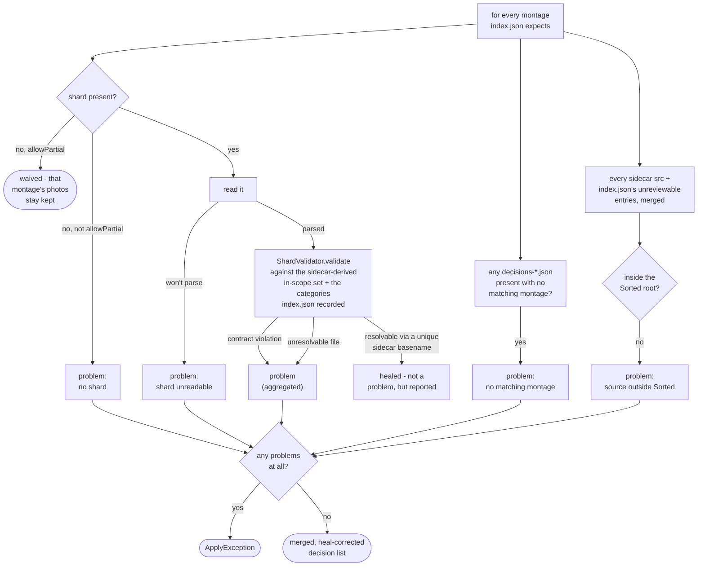
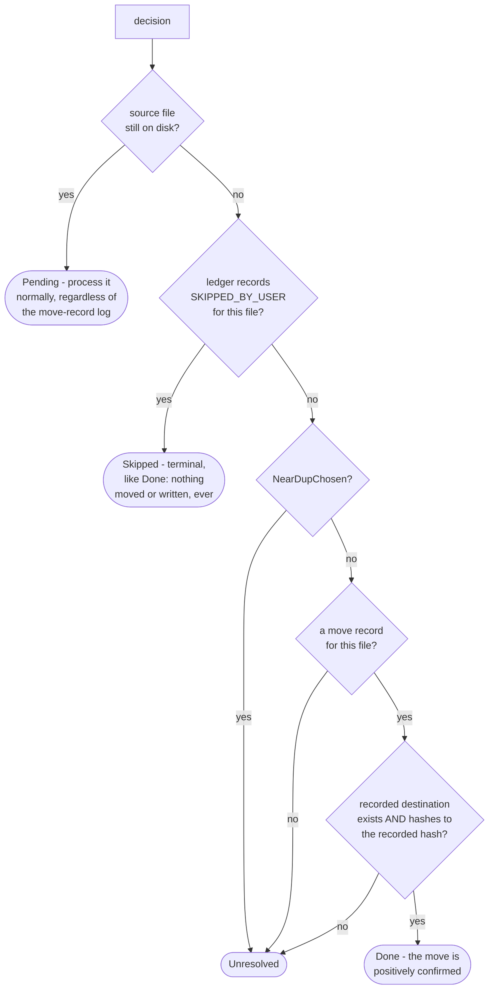

# Apply planner

How `application/service/ApplyPlanner` decides what a prep directory's run still has left to do,
before anything moves
(`app/src/main/java/photos/sluice/application/service/ApplyPlanner.java`, validation rules in
`domain/cull/ShardValidator`). It answers two questions: whether the shard batch is valid at all,
and where each decision or unreviewable file already stands for resume.

`ApplyPlanner` is read-only. It changes nothing itself: no move, no copy, no delete, no ledger
write. That is enforced by the types it holds, not by convention, on both sides. It takes
`MediaReader`, the inspect-only half of `MediaStore`, so the filesystem mutators are not reachable
from here and a mutation would not compile. And it holds no ledger reference at all. Every method
that needs one takes its caller's own `MoveLedger.Ledger` snapshot as a parameter instead. This
class cannot even read the ledger files on its own, let alone append to them (see
`move-ledger.md`).
`ApplyEngine.apply()` calls `validate()` and then classifies every decision through this class
before carrying anything out. See `apply-engine.md` section 1 for the whole pipeline.

## 1. Validation

A missing shard is the only problem allowPartial waives. A stray decisions file, an off-contract
decision, and a decision whose file resolves to neither the sidecar's in-scope set nor a unique
healable basename are always fatal. `ShardValidator` itself does no I/O. It checks a decision's
file against the sidecar-derived set, never the filesystem. So classification runs one more pass
after a clean validation, classifying every decision for resume (see section 2 below), before
anything moves.

### Which files a run may touch at all

`checkSourceRoot()` answers that, separately from the shard contract. Every file this run could act
on must sit strictly inside the configured Sorted root. Anything else is a
`Finding.SourceOutsideSorted`, and the run stops before a single file moves.

The root comes from `PathsPort`, which reads configuration. It is deliberately not `index.json`'s own
`basePath`. That field sits in the very file the rule guards, so it could vouch for an entry an
editor put there. Prep only ever scans `Sorted/Photos`, so the configured root is also exactly what a
real run can produce.

Both source lists are checked. `index.json` carries the unreviewable entries, which nothing else on
disk corroborates. The sidecars carry the `src` set. A decision's own file is admitted only because
that set vouches for it, so checking the set is what covers every decision too. Both files are
written by this app and neither is protected from being edited afterwards, so trusting one while
distrusting the other would leave a way in. The two lists are merged before checking, so a file named
in both is reported once.

Containment normalizes both paths and compares whole segments. That refuses a parent reference
climbing out of the root, and a relative path anchored somewhere else entirely. Symlinks are not
resolved: that would cost a filesystem call per file and fail outright on a source an earlier run
already moved. `CullDestinations.requireUnderSorted()` repeats the check immediately before each move
or copy (see `apply-engine.md`), the mirror of the destination refusal on the other side.

The sidecar-derived in-scope set itself isn't read in one flat pass over every montage. A montage
whose own sidecar can't be read (missing or corrupt) is handled by `collectMontage()`. It reports a
fresh `Finding.CorruptSidecar` unless the disposition ledger already carries an answer for it, in
which case that answer decides. Only the healthy montages' srcs and shards ever reach
`ShardValidator`. The CHOICE remedy that resolves a `CorruptSidecar` finding lives elsewhere: see
`prep-dir-remedies.md` for `resolveCorruptSidecar()` and the full breakdown of each ledger
resolution's effect.

**The finding is raised whether or not that montage has a shard yet.** A montage with an unreadable
sidecar and no shard reads like one still being culled, and is not. A culler keys its verdicts
against the sidecar, so it can never produce a shard for a montage whose sidecar it cannot read. Not
yet actionable would therefore never become actionable. Left unreported, the run sits `WAITING` with
an empty findings list, the troubleshoot screen has nothing to offer, and only a discard escapes.
Reported, `SET_ASIDE` becomes reachable: it drops the montage and leaves its photos in `Sorted` for a
later cull to see fresh.

A montage whose sidecar reads fine and simply has no shard yet is still skipped in silence. That is
the genuinely-still-culling case, and flagging it is the noise this finding must not become.

Both ledger answers are terminal, so neither re-raises the finding. `SET_ASIDE` drops the montage
outright. `APPLY_ANYWAY` trusts the shard as its own scope. A montage answered that way while still
holding no shard contributes nothing, there being no shard yet to trust.

A shard that is present but won't parse is a `Finding.CorruptShard`, never an exception escaping
`validate()`. That matters because this is the only gate an apply-only resume passes through, and
because `PrepDirDoctor.diagnose()` reuses the same call to drive a dashboard. A thrown exception
there would crash the read instead of describing the dir. The distinction is between damaged content
and a read that merely failed. Only the first becomes a finding. A read failure on an intact shard
propagates, so a lock or a permission denial is never reported as the culling agent's mistake.

`CorruptShard` carries the NONE remedy, unlike `CorruptSidecar`'s CHOICE. A sidecar is this app's
own output, so a corrupt one is a prep-dir problem the engine can offer options for. A shard is the
culling agent's output. No engine-level repair can invent judgements it failed to record, so the
ways out are a rewritten shard or the last-resort discard-and-redo.

`resolveOverlaps()` runs right after `ShardValidator`, suppressing a `Finding.DecisionUnreviewableOverlap`
once the disposition ledger records how the user resolved it. Neither a shard nor `index.json` is
ever edited: this only drops the losing side from the in-memory decision list.
`resolvedUnreviewable()` is the analogous filter for `prepDir.unreviewable()` itself. Both consult
the same ledger `overlaps` map. See `prep-dir-remedies.md` for how each resolution gets recorded in
the first place.

## 2. Classifying a decision (or an unreviewable file) for resume

A decision whose source file is still on disk is always Pending. A move that never happened needs
no verification, it just needs doing. A file the disposition ledger records as skipped
(`PrepDirRemedies.skipMissingSource()`, see `prep-dir-remedies.md`) is Skipped regardless of
decision type, checked before the `NearDupChosen` case. The user gave up on it rather than
restoring it, so there is nothing left to move or verify. Every other decision needs its source's
disappearance explained before the run can proceed. Either it's `NearDupChosen` (never move-based,
see below), or a move record proves the move that removed it actually happened, or the run
refuses.

An unreviewable file follows the same diagram with node D always answered "no": it has no
`NearDupChosen`-shaped copy exception, since routing one is always a move. `classifyFile()` is
this logic's standalone version for a plain `Path`. It exists because an unreviewable file has no
`Decision` behind it to carry through the rest of the diagram.

### Why a move record, written before the move, not a log written after

A log recording a decision's completion *after* carrying it out has a fundamental gap. A crash
landing between the move and that write leaves no way to tell "already moved, log write lost"
apart from "never moved at all." The run would have to refuse and ask a human to check by hand
which case it was. Even then, only `NearDupReject` (the one decision type with no write after its
move) has a manual recovery that's actually safe to apply unconditionally.

This write is performed by `ApplyEngine.recordThenMove()` (see `apply-engine.md` section 1),
immediately before the move it guards. Classification here only ever reads what that method
already wrote. It avoids the gap above entirely by moving the durable write to *before* the move
instead of after it. Before touching the file, `recordThenMove()` resolves the exact,
already-collision-resolved destination the move will land on (`MediaStore.resolveDestination`),
hashes the source, and appends both to the move-record log. Only then does it call
`MediaStore.moveTo`, which moves straight to that reserved path with no collision logic of its
own. A resumed run whose source has disappeared doesn't need to guess a destination name (`" (2)"`,
`" (3)"`, ...). It looks up the one exact path this decision was recorded as headed for, and hashes
whatever sits there. A match is positive proof the move happened, not a guess. A mismatch, a
missing destination, or no record at all mean the same thing: this engine cannot tell what
happened to the file. It refuses rather than guessing.

Confirming the move this way also settles a `Classification` decision's second write - a library
hash-index row, or a `_reasons.txt` line. A crash could have skipped that write independently of
the move itself. Once the move is positively confirmed, `ApplyEngine.backfillSecondaryWrite()`
checks that second write directly - `funny` via `HashIndexPort.contains`, everything else via an
exact line match in `_reasons.txt`. It backfills only if that write is actually missing. Nothing is
ever re-moved on this path. A backfilled decision also isn't counted in the report `apply()`
returns. See `apply-engine.md`'s section 1 prose, where `backfillSecondaryWrite()` is named
directly.

## Read-only helpers used by other callers

`checkMissingSources()` re-runs `classify()`/`classifyFile()` over an already-validated decision
list, returning a `Finding.MissingSource` for each unresolved one. `PrepDirDoctor.diagnose()` is
its one caller, for a proactive diagnosis pass that touches nothing (see `prep-dir-doctor.md`).
`Troubleshooter` only ever reaches it indirectly, through that same `diagnose()` call.
`ReconcileEngine` does not call it - it has its own reconciliation sweep instead
(`reconcile-engine.md`). `ApplyEngine.apply()` does not call it either: its own single
classification pass already produces the same findings inline, so a second hash-verification pass
would be redundant. `verifiedMoveRecord()` is the shared check both `classify()` and
`classifyFile()` use. A move record only counts as proof once its recorded destination still
exists and still hashes to the recorded value. A record alone is never trusted on its own.

## Scenarios

| Scenario                                                                                      | Outcome                                                                                  |
|-----------------------------------------------------------------------------------------------|------------------------------------------------------------------------------------------|
| A montage's shard is missing, `allowPartial` not set                                          | `ApplyException`, zero files moved                                                       |
| A montage's shard is missing, `allowPartial` set                                              | That montage's photos stay in place; the rest of the run applies                         |
| A decisions file exists with no matching montage                                              | `ApplyException`, zero files moved (regardless of `allowPartial`)                        |
| A montage's shard is present but its content will not parse                                   | `CorruptShard` - `ApplyException`, zero files moved; every other montage still validates |
| A montage's shard is present but the read itself fails, content intact                        | Propagates as a plain `UncheckedIOException` - never diagnosed as the culler's mistake   |
| A decision's category is absent from index.json's own set, or a required field is blank       | `ApplyException`, zero files moved                                                       |
| A category was edited or deleted in settings after this run was prepped                       | Irrelevant - the run is judged against the set index.json recorded at prep time          |
| A decision's `file` doesn't match any sidecar entry, but its basename does (and is unique)    | Healed - applied to the resolved path, reported as a heal                                |
| A move-based decision's file is missing, with no move record verifying it already ran         | Unresolved - `ApplyException`, zero files moved                                          |
| A move-based decision's file is missing, and its move record's destination hash-verifies      | Done - not reprocessed; a missing secondary write is backfilled (`apply-engine.md`)      |
| A move record's destination is missing, or its content no longer matches the recorded hash    | Unresolved - `ApplyException`, zero files moved; the record alone is never trusted       |
| An unreviewable file's move record verifies (destination hash-matches) but its source is gone | Done - not reprocessed; its note line is backfilled off the record (`apply-engine.md`)   |
| An unreviewable file is missing, with no move record verifying it already ran                 | Unresolved - `ApplyException`, zero files moved (same gate as any decision)              |
| An unreviewable entry, or a sidecar `src`, names a path outside the Sorted root               | `SourceOutsideSorted` - `ApplyException`, zero files moved, that path never opened       |

## Related

- The shard contract itself, and the auto-heal rule: `ShardValidator`'s own doc comment
  (`domain/cull/ShardValidator.java`).
- The pipeline that calls `validate()` then classifies every decision, and carries the
  Pending/Done results out: `apply-engine.md`.
- The move-record log's own file format, markers, and parsing rules: `move-ledger.md`.
- The CHOICE remedies that write the ledger entries `classify()`, `resolveOverlaps()`, and
  `collectMontage()` all consult: `prep-dir-remedies.md`.
- The offline rebuild that reconstructs a move record when the log itself can't be trusted:
  `reconcile-engine.md`.
