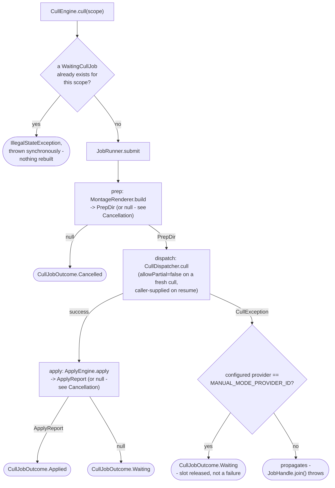
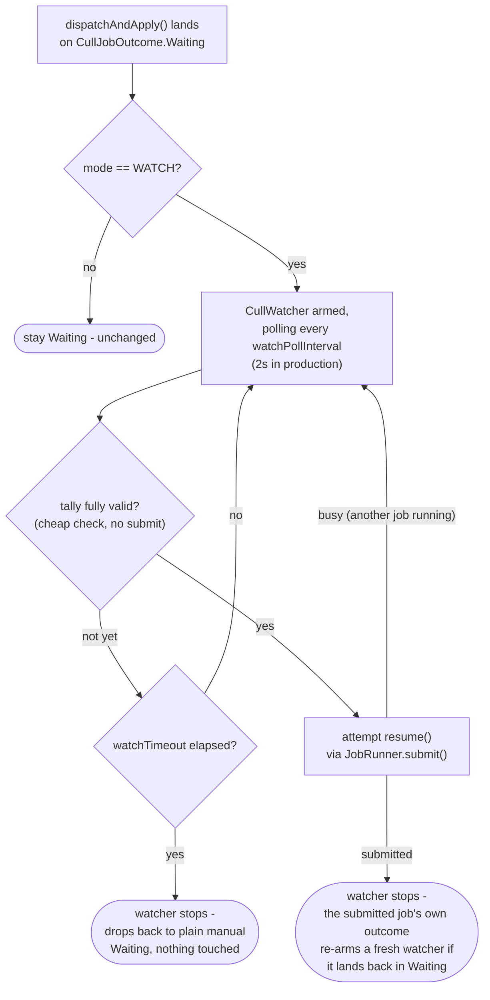

# Cull engine

How `application/service/CullEngine` orchestrates a cull job: prep (`MontageRenderer.build`) ->
dispatch (`CullDispatcher.cull`, which routes to whichever `VisionCuller` the configured provider
selects) -> apply (`ApplyEngine.apply`). It also covers the watch-mode auto-resume that polls a
still-waiting job for its shards to land
(`app/src/main/java/photos/sluice/application/service/CullEngine.java`,
`app/src/main/java/photos/sluice/application/service/ShardTallyCalculator.java`,
`app/src/main/java/photos/sluice/application/service/CullWatcher.java`). `Pipeline` builds the one
`CullEngine` instance it needs and exposes `cull()`/`waitingJobs()`/`resume()` under its own type -
see `pipeline.md` for that facade and for `sort()`/`commit()`/`rescue()`.

## `cull()` / `waitingJobs()` / `resume()`

The dispatch step is where the flow forks: a `CullException` from it means two different things
depending on the provider. See `VisionCuller.MANUAL_MODE_PROVIDER_ID`'s own doc comment for the
full reasoning.

`resume(prepDir, allowPartial)` re-enters at the dispatch step directly. `cullPrepPort.readIndex()`
re-reads the existing `PrepDir` from `index.json` instead of `MontageRenderer` regenerating it, so
no montage is ever rebuilt or re-rendered by a resume. `waitingJobs()` is a plain, un-jobbed read:
it scans `logs/cull-prep/*/` for a prep dir with `index.json` but no merged `decisions.json` yet.
See `WaitingCullJob`'s own doc for why this is derived live instead of a persisted list. It
tolerates a transiently-unreadable `index.json` (a concurrent job's own prep dir
mid-clear/mid-write) by skipping that entry rather than failing the whole scan.

`CullEngine` computes each `WaitingCullJob`'s `ShardTally` (`present`/`valid`/`total`) via
`ShardTallyCalculator`, one montage at a time via `ShardValidator`, rather than reusing
`ApplyPlanner`'s whole-batch `validate()`. A cross-shard problem (a near-dup group id reused across
two montages) therefore doesn't show up in the tally - an accepted simplification for a progress
number. `ApplyEngine.apply()`'s own full-batch validation (via `ApplyPlanner.validate()`) is still
the actual gate before anything moves.

| CullEngine method               | What runs                                                           | Phase label(s)                                                      |
|---------------------------------|---------------------------------------------------------------------|---------------------------------------------------------------------|
| `cull(CullScope)`               | prep -> dispatch -> (apply if complete)                             | `"Building montages..."`, `"Culling..."`, `"Applying decisions..."` |
| `waitingJobs()`                 | a plain disk scan, no `JobRunner` involved                          | none                                                                |
| `resume(Path prepDir, boolean)` | dispatch (re-reading the existing `PrepDir`) -> (apply if complete) | `"Culling..."`, `"Applying decisions..."`                           |

### Scenarios

| Scenario                                                                | Outcome                                                                                                                                                    |
|-------------------------------------------------------------------------|------------------------------------------------------------------------------------------------------------------------------------------------------------|
| `cull()` on a scope with no shards dropped yet (fresh manual-mode prep) | `CullJobOutcome.Waiting` with a `present=0/valid=0` tally; job slot released                                                                               |
| `cull()` called again while that scope's `WaitingCullJob` is unresolved | `IllegalStateException` thrown synchronously, before `JobRunner.submit()` - the existing prep dir (and any already-dropped shards) is left untouched       |
| `resume()` once every shard is present and valid                        | `CullJobOutcome.Applied`, files moved                                                                                                                      |
| `resume()` while a shard is still missing/invalid                       | `CullJobOutcome.Waiting` again, with a freshly recomputed tally                                                                                            |
| `resume(prepDir, allowPartial=true)` with a shard still missing         | Applies what it has; the missing montage's photos are left in place, untouched                                                                             |
| A genuine `CullException` from an automated (non-manual-mode) provider  | Propagates - `JobHandle.join()` throws, never resolves to `Waiting`. A cancellation is a separate path (see Cancellation below) and never reaches this one |

### Cancellation

Cancel is effectively Pause for cull, not a failure, at every boundary except one. `cull()`/
`resume()` both pass `handle::isCancellationRequested` through to `buildFreshAndDispatch()`/
`dispatchAndApply()`, and from there into `MontageRenderer.build()` and `ApplyEngine.apply()`
themselves. Every long-running pass in the whole cull flow now checks the same signal, not just the
two stage boundaries between them:

An automated provider's own montage loop (`AnthropicCuller`) checks the signal in its loop
condition and once more before its corrective retry. A cancellation therefore lands within at most
one montage call, plus rarely one retry call - never as a thrown `CullException`.

The external-agent provider's dispatch is a single fast completeness check with nothing to
interrupt mid-call. Its own manual-mode-pause `CullException` still resolves to `Waiting` as
before. The cancellation check right after that catch skips arming a watcher for it, the same way
every other cancellation-triggered `Waiting` in this diagram does.

`CullJobOutcome.Cancelled` is the one outcome with nothing to resume. The renderer stopped before
`index.json` was ever written, so there is no prep dir yet to derive a `WaitingCullJob` from. A
plain re-run of `cull()` on the same scope starts fresh. Every other cancellation path in this
diagram (mid-dispatch, mid-apply, or right at either stage boundary) lands on `Waiting` instead. A
resumable prep dir (and, for mid-dispatch, some shards) already exists by that point.

None of these paths ever arm a watcher, regardless of `mode`: an auto-resume moments after a
cancel would defy the cancel.

| Scenario                                                                       | Outcome                                                                                |
|--------------------------------------------------------------------------------|----------------------------------------------------------------------------------------|
| Cancellation requested mid-render, before `index.json` is written              | `CullJobOutcome.Cancelled` - nothing resumable exists yet                              |
| Cancellation requested mid-batch (the montage-write loop), before `index.json` | `CullJobOutcome.Cancelled`, same as mid-render - see `cull-montage-renderer.md`        |
| Cancellation requested right after prep finishes, before dispatch starts       | `Waiting` with a `0/N` tally - dispatch never runs                                     |
| Cancellation requested mid-dispatch (an automated provider's montage loop)     | `Waiting` with a tally reflecting however many shards the loop wrote before stopping   |
| Cancellation requested mid-apply (either of `ApplyEngine`'s two status loops)  | `Waiting` - `decisions.json` was never written, so the prep dir still reads as waiting |
| Cancellation requested racing a manual-mode pause's `CullException`            | `Waiting`, same as an uncancelled pause, but no watcher is armed even if `mode=WATCH`  |
| `mode=WATCH` configured with an automated (non-manual-mode) provider           | Never arms a watcher, cancelled or not - watch mode is an external-agent-only feature  |

## Watch mode

`cull.externalAgent.mode: watch` (`ExternalAgentSettings`, `WatchMode`) makes every `Waiting`
outcome from `dispatchAndApply()` arm a `CullWatcher` for that prep dir, on top of the plain
`Waiting` behavior above. `MANUAL` mode (the default) skips this section entirely -
`armWatchIfConfigured` returns immediately.

Deliberately pure polling, not `java.nio.file.WatchService`. A user's working folder can itself be
a cloud-synced or network folder (a Settings choice) - exactly the folder type known to miss
filesystem events. Depending on events at all would just relocate that gap. `watchPollInterval` is
an internal cadence, not a `CullSettings` field - only `mode` and `watchTimeout` are the documented
user-facing knobs.

`disarmWatch()` runs at the very start of every `dispatchAndApply()` call, regardless of who
triggered it (a fresh `cull()`, a manual `resume()` click, or a watcher's own auto-resume). The
prep dir's watcher, if any, is always retired before a real attempt runs. A manual click racing an
armed watcher can therefore never leave two pollers on the same job.
`armWatchesForExistingWaitingJobs()` (called from `Pipeline`'s own `@PostConstruct`) re-arms every
still-waiting job found on disk at startup. There is no persistent job store, so restarting the app
would otherwise silently stop watching every job armed before the restart.

### Scenarios

| Scenario                                                         | Outcome                                                                                           |
|------------------------------------------------------------------|---------------------------------------------------------------------------------------------------|
| Watch mode, a valid shard for every montage eventually appears   | The next poll tick's tally check passes, `resume()` is submitted automatically, `Applied` follows |
| Watch mode, `JobRunner` is busy with an unrelated job when ready | `attemptConsume` returns false; the watcher keeps polling and retries on the next tick            |
| Watch mode, `watchTimeout` elapses with no fully-valid tally     | Watcher stops on its own; every dropped shard is untouched; a manual `resume()` still works       |
| Watch mode, app restarts while a job is still waiting            | `armWatchesForExistingWaitingJobs()` re-arms a watcher for it purely from `waitingJobs()`         |
| Manual mode (default)                                            | No watcher ever arms; behavior is identical to the `cull()`/`resume()` section above              |

## Related

- `pipeline.md`: the `Pipeline` facade that builds this class and exposes its methods, plus
  `sort()`/`commit()`/`rescue()`.
- `curate-engine.md`: sorts a scope, then reuses this class's `buildFreshAndDispatch()` for the
  cull stage.
- `JobRunner`/`JobHandle`/`JobWork` (the single-slot async executor `CullEngine` submits onto): no
  dedicated design doc yet - see the source files directly.
- `ProgressPort` (the out-port `PhaseRunner` reports through): see the source file directly. Its
  own doc comment is the source of the "always bracket a phase" contract this page relies on.
- `ApplyEngine`: `apply-engine.md` in this same design folder, section 3 for its own cancellation
  behavior.
- `CullMontageRenderer`: `cull-montage-renderer.md` in the `adapter/imaging` design folder, its own
  Cancellation section for the render/batch checks `MontageRenderer.build()` does internally.
