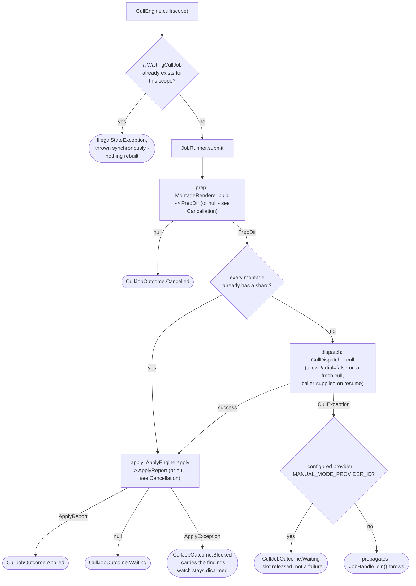
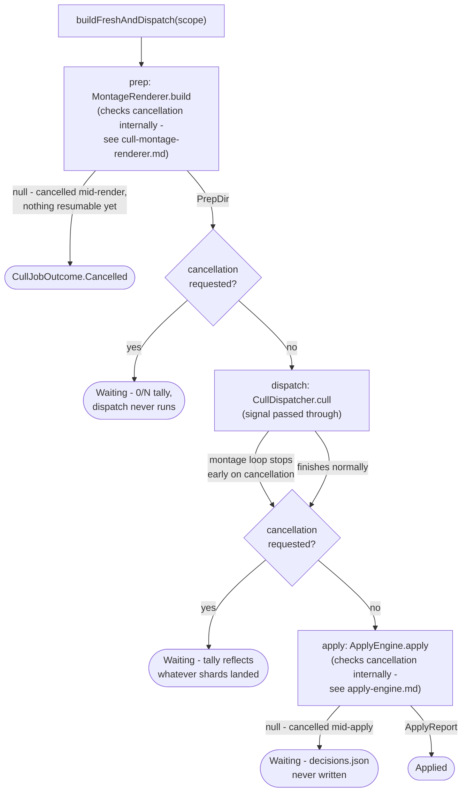
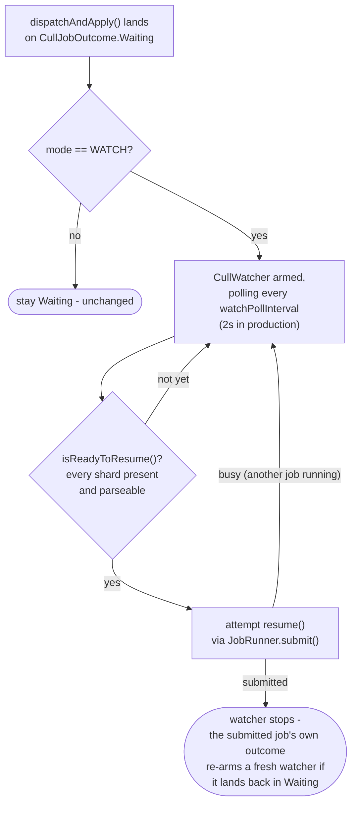

# Cull engine

How `application/service/CullEngine` orchestrates a cull job: prep (`MontageRenderer.build`) ->
dispatch (`CullDispatcher.cull`, which routes to whichever `VisionCuller` the configured provider
selects) -> apply (`ApplyEngine.apply`). Dispatch is conditional rather than a fixed stage: it runs
only while some montage still lacks a shard. It also covers the watch-mode auto-resume that polls a
still-waiting job for its shards to land
(`app/src/main/java/photos/sluice/application/service/CullEngine.java`,
`app/src/main/java/photos/sluice/application/service/ShardTallyCalculator.java`,
`app/src/main/java/photos/sluice/application/service/CullWatcher.java`). `Pipeline` builds the one
`CullEngine` instance it needs and exposes `cull()`/`waitingJobs()`/`resume()` under its own type -
see `pipeline.md` for that facade and for `sort()`/`commit()`/`rescue()`.

## `cull()` / `waitingJobs()` / `resume()`

Two forks decide the shape of a run. The first is whether any montage still lacks a shard, which
decides whether a culler is entered at all. The second is what a `CullException` from dispatch
means, which depends on the provider. See `VisionCuller.MANUAL_MODE_PROVIDER_ID`'s own doc comment
for the full reasoning on that one.

### Waiting and Blocked

The two non-terminal outcomes differ by whose move comes next, not by severity.

**Waiting** means shards are still missing. Somebody else has work left to do: the external agent is
still culling, or an automated run stopped part way. A watcher can usefully poll for that, so watch
mode arms one here.

**Blocked** means every montage has a shard and apply's validation refused anyway. Nothing further
is coming on its own, so there is nothing left to watch and no watcher is armed. Exit is
Troubleshoot, or a by-hand repair followed by Resume. Diagnosis is always live off disk, never
cached from the refused run, so a repair takes effect the moment it lands.

Blocked carries the same typed `Finding` list `ApplyException` does. A run card, a troubleshoot
screen and the CLI shim all render from that one source rather than parsing message text.

Only a validation refusal becomes Blocked. A read that merely fails part way through apply's gate is
a different thing: a locked shard or a permission denial is no verdict about the run. It has no
findings to carry and no state to settle on. So it propagates and the job fails, which is what a
transient condition should look like. The user retries Resume and it works. Blocked would claim a
diagnosis nobody made.

### Dispatch only when shards are missing

Once every montage has a shard, the culling agent has said everything it is going to say. Re-asking
buys the same answer back. For an automated provider that costs a fresh round of API calls, and for
the external-agent one a redundant whole-batch validation pass. So a resume with a full shard set
goes straight to apply.

That makes `ApplyPlanner.validate()` the single validator on the resume path, which is why it has to
catch everything a culler's own batch check would have. It does, across four families:

- a stray shard, `Finding.StrayShard`
- a near-dup group id reused across two montages, `Finding.GroupSpansMultipleMontages`, from the one
  whole-set `ShardValidator` call
- a shard present but unparseable, `Finding.CorruptShard`
- the whole per-decision contract, unchanged

The shard-presence check is a plain existence check per montage, never a parse. Whether the shards
are any good is apply's own gate to decide. A scope with no montages at all counts as fully sharded:
there is nothing for a culler to judge, so dispatching would only produce an empty report.

`resume(prepDir, allowPartial)` re-reads the existing `PrepDir` from `index.json` via
`cullPrepPort.readIndex()` instead of `MontageRenderer` regenerating it, so no montage is ever
rebuilt or re-rendered by a resume. `waitingJobs()` is a plain, un-jobbed read:
it scans `logs/cull-prep/*/` for a prep dir with `index.json` but no merged `decisions.json` yet.
See `WaitingCullJob`'s own doc for why this is derived live instead of a persisted list. It
tolerates a transiently-unreadable `index.json` (a concurrent job's own prep dir
mid-clear/mid-write) by skipping that entry rather than failing the whole scan.

`ShardTallyCalculator` answers two different questions, from two different places.

`tally()` is the `present`/`valid`/`total` display number on each `WaitingCullJob`, computed one
montage at a time via `ShardValidator`. Per-montage is what makes it useful: a card can name which
montage is holding the run up. A cross-shard problem (a near-dup group id reused across two
montages) therefore doesn't show up in it. That is fine for a number that is only ever shown.

`isReadyToResume()` is what a `CullWatcher` polls, and it asks a much narrower question: has
everything arrived? Every montage has a shard, and every one of those shards parses. Nothing more
is coming from outside, so the run is worth a resume attempt.

It deliberately holds no opinion on whether the shards are any good. That is `ApplyPlanner`'s job,
once, at the apply. Two reasons, and the second is the load-bearing one.

First, a second validator here would be ledger-blind. It reads raw disk state, where a user's answer
to a finding still looks like the finding.

Second, and worse: a problem this check could see would be a problem it never fires on. Take a stray
shard, or a near-dup group id reused across two montages. Only the whole-batch gate can see either.
A readiness check clever enough to catch them would therefore withhold the resume forever. The
per-montage tally cannot see them either, so it reads a healthy `N/N` throughout. The run would sit
silently, looking finished, with nothing ever put in front of the user. Firing instead
costs one job slot and lands `Blocked` with the findings on screen, which is that state's whole
point.

The same reasoning covers a missing source file, an unparseable-but-present shard, and every
ordinary contract violation. Each resumes once and settles somewhere visible.

Parsing is the one content check, and it is not a quality judgement. A shard file exists from the
moment the agent opens it for writing. Presence alone would then fire on a half-written one and
block the run over a file that was seconds from being fine.

One ledger-resolved answer reaches the display tally: a file resolved with `TRUST_DECISION` is no
longer treated as unreviewable, so the montage claiming it stops reading invalid. A montage resolved
with `APPLY_ANYWAY` still displays as invalid, since only the whole-batch pass knows to trust its
shard as its own scope. Neither affects what actually happens - readiness never asked.

| CullEngine method               | What runs                                                           | Phase label(s)                                                         |
|---------------------------------|---------------------------------------------------------------------|------------------------------------------------------------------------|
| `cull(CullScope)`               | prep -> (dispatch unless the scope is empty) -> apply               | `"Building montages..."`, `"Culling..."`, `"Applying decisions..."`    |
| `waitingJobs()`                 | a plain disk scan, no `JobRunner` involved                          | none                                                                   |
| `resume(Path prepDir, boolean)` | (dispatch only if a shard is missing) -> apply, on the existing dir | `"Culling..."` only when dispatch runs, then `"Applying decisions..."` |

A fresh `cull()` over a scope with any montages in it always dispatches. Prep rebuilds the dir and
clears whatever was in it, so no montage can already hold a shard. The one fresh-cull case that
skips is a scope that produced no montages at all, where there is nothing for a culler to judge.
Then no `"Culling..."` bracket is reported and no provider client is built.

### Scenarios

| Scenario                                                                | Outcome                                                                                                                                                    |
|-------------------------------------------------------------------------|------------------------------------------------------------------------------------------------------------------------------------------------------------|
| `cull()` on a scope with no shards dropped yet (fresh manual-mode prep) | `CullJobOutcome.Waiting` with a `present=0/valid=0` tally; job slot released                                                                               |
| `cull()` called again while that scope's `WaitingCullJob` is unresolved | `IllegalStateException` thrown synchronously, before `JobRunner.submit()` - the existing prep dir (and any already-dropped shards) is left untouched       |
| `resume()` once every shard is present and valid                        | `CullJobOutcome.Applied`, files moved. No culler is entered, so no `"Culling..."` phase is bracketed                                                       |
| `resume()` while a shard is still missing                               | Dispatch runs again; `CullJobOutcome.Waiting`, with a freshly recomputed tally                                                                             |
| `resume()` with every shard present but apply's validation refusing     | `CullJobOutcome.Blocked` carrying the findings; nothing moved, `decisions.json` never written, no watcher armed                                            |
| `resume(prepDir, allowPartial=true)` with a shard still missing         | Applies what it has; the missing montage's photos are left in place, untouched                                                                             |
| A genuine `CullException` from an automated (non-manual-mode) provider  | Propagates - `JobHandle.join()` throws, never resolves to `Waiting`. A cancellation is a separate path (see Cancellation below) and never reaches this one |

### Cancellation

Cancel is effectively Pause for cull, not a failure, at every boundary except one. `cull()`/
`resume()` both pass `handle::isCancellationRequested` through to `buildFreshAndDispatch()`/
`dispatchAndApply()`, and from there into `MontageRenderer.build()` and `ApplyEngine.apply()`
themselves. Every long-running pass in the whole cull flow now checks the same signal, not just the
two stage boundaries between them:

An automated provider's own montage loop (`AnthropicCuller`) checks the signal in its loop
condition and once more before its corrective retry. A cancellation therefore lands within at most
one montage call, plus rarely one retry call - never as a thrown `CullException`.

The external-agent provider's dispatch is a single fast completeness check with nothing to
interrupt mid-call. Its own manual-mode-pause `CullException` still resolves to `Waiting` as
before. The cancellation check right after that catch skips arming a watcher for it, the same way
every other cancellation-triggered `Waiting` in this diagram does.

`CullJobOutcome.Cancelled` is the one outcome with nothing to resume. The renderer stopped before
`index.json` was ever written, so there is no prep dir yet to derive a `WaitingCullJob` from. A
plain re-run of `cull()` on the same scope starts fresh. Every other cancellation path in this
diagram (mid-dispatch, mid-apply, or right at either stage boundary) lands on `Waiting` instead. A
resumable prep dir (and, for mid-dispatch, some shards) already exists by that point.

None of these paths ever arm a watcher, regardless of `mode`: an auto-resume moments after a
cancel would defy the cancel.

| Scenario                                                                       | Outcome                                                                                |
|--------------------------------------------------------------------------------|----------------------------------------------------------------------------------------|
| Cancellation requested mid-render, before `index.json` is written              | `CullJobOutcome.Cancelled` - nothing resumable exists yet                              |
| Cancellation requested mid-batch (the montage-write loop), before `index.json` | `CullJobOutcome.Cancelled`, same as mid-render - see `cull-montage-renderer.md`        |
| Cancellation requested right after prep finishes, before dispatch starts       | `Waiting` with a `0/N` tally - dispatch never runs                                     |
| Cancellation requested mid-dispatch (an automated provider's montage loop)     | `Waiting` with a tally reflecting however many shards the loop wrote before stopping   |
| Cancellation requested mid-apply (either of `ApplyEngine`'s two status loops)  | `Waiting` - `decisions.json` was never written, so the prep dir still reads as waiting |
| Cancellation requested racing a manual-mode pause's `CullException`            | `Waiting`, same as an uncancelled pause, but no watcher is armed even if `mode=WATCH`  |
| `mode=WATCH` configured with an automated (non-manual-mode) provider           | Never arms a watcher, cancelled or not - watch mode is an external-agent-only feature  |

## Watch mode

`cull.externalAgent.mode: watch` (`ExternalAgentSettings`, `WatchMode`) makes a `Waiting` outcome
from `dispatchAndApply()` arm a `CullWatcher` for that prep dir, on top of the plain `Waiting`
behavior above. `MANUAL` mode (the default) skips this section entirely - `armWatchIfConfigured`
returns immediately.

That setting is only the default a run starts with. `armWatch()` arms one prep dir whatever the mode
says, and `disarmWatch()` turns it off again. The two are the waiting card's own "auto-apply when
shards arrive" toggle, reaching the engine through `Pipeline.startWatching`/`stopWatching`. Neither
touches the run itself. It stays Waiting, stays listed, and still refuses a fresh cull of its scope
either way. Only the polling changes.

There is no time limit on the polling, and no setting for one. A watch that never fires costs one
read-only readiness check per interval. A watch that does fire either completes the run or lands it
`Blocked` and stops. So the only thing a deadline could add is giving up on a run the user is still
waiting for.

A `Blocked` outcome never arms one. Every montage already has a shard, so the agent has finished and
will not come back. There is nothing left for a poller to notice, and the `disarmWatch()` at the top
of every `dispatchAndApply()` has already retired whichever watcher was running. A refused run
therefore costs one attempt and then settles on a state the user can see. A watcher and a resume can
never take turns re-triggering each other.

Deliberately pure polling, not `java.nio.file.WatchService`. A user's working folder can itself be
a cloud-synced or network folder (a Settings choice) - exactly the folder type known to miss
filesystem events. Depending on events at all would just relocate that gap. `watchPollInterval` is
an internal cadence, not a `CullSettings` field - `mode` is the one documented user-facing knob.

`disarmWatch()` runs at the very start of every `dispatchAndApply()` call, regardless of who
triggered it (a fresh `cull()`, a manual `resume()` click, or a watcher's own auto-resume). The
prep dir's watcher, if any, is always retired before a real attempt runs. A manual click racing an
armed watcher can therefore never leave two pollers on the same job.
`armWatchesForExistingWaitingJobs()` (called from `Pipeline`'s own `@PostConstruct`) re-arms every
still-waiting job found on disk at startup. There is no persistent job store, so restarting the app
would otherwise silently stop watching every job armed before the restart.

Retiring by prep dir rather than by watcher identity leaves one known window, accepted rather than
closed. A watcher that fires stops itself as soon as its resume is *submitted*, but the submitted
job runs asynchronously. An `armWatch()` landing between those two moments installs a fresh watcher.
The job's own `disarmWatch()` then retires that one a moment later, aiming at the dead one it
replaced. So a per-run watch switched on inside that window turns itself back off.

It is bounded in three ways. The window is one job handoff wide. `activeWatches` is in-memory and
per-process, so it takes two actors inside one process racing the same prep dir. That is a UI shape,
a background watcher against a person, rather than a CLI one. And a second click works.

Identity-aware removal would close it, at the cost of `dispatchAndApply()` having to know whether a
watcher or a person entered it, threaded through `resume()` and the job submission. The blind retire
is genuinely correct for the manual path, so it cannot simply be made conditional. Not worth that
for this window. A caller should instead bind any watch indicator to `isWatchActive()` rather than
to its own optimistic state. A lost click then shows as a toggle flipping back, not as a click that
did nothing.

That startup scan reads `waitingJobs()`, which counts a prep dir as waiting whenever `index.json`
exists and `decisions.json` does not. A blocked dir matches that too, so a restart can arm one
watcher for it. Its shards are all present and parseable, so that watcher fires once, the resume
lands `Blocked` again, and nothing re-arms. One wasted job slot per restart, and the run stays where
the user left it.

The only state that keeps polling is a montage whose shard never arrives at all, or never finishes
being written. That is genuinely still waiting, and the card's tally says so. No resume is submitted
and no file moves. Watch mode never arms for an automated provider, so nothing spends money either.

### Scenarios

| Scenario                                                            | Outcome                                                                                               |
|---------------------------------------------------------------------|-------------------------------------------------------------------------------------------------------|
| Watch mode, a valid shard for every montage eventually appears      | The next poll tick's readiness check passes, `resume()` is submitted automatically, `Applied` follows |
| Watch mode, the auto-resume's own apply then refuses                | `Blocked`; the watcher already stopped after its one attempt and nothing re-arms it                   |
| Watch mode, `JobRunner` is busy with an unrelated job when ready    | `attemptConsume` returns false; the watcher keeps polling and retries on the next tick                |
| Watch mode, a shard is present but never parses                     | The watcher polls on, submitting nothing; the card's tally stays short of total                       |
| Watch mode, every shard arrives but the batch is invalid            | The watcher fires once; that resume lands `Blocked` with the findings, and nothing re-arms            |
| Watch mode, a poll tick throws                                      | Logged and treated as "not ready this tick"; the watch survives and retries                           |
| Watch mode, app restarts while a job is still waiting               | `armWatchesForExistingWaitingJobs()` re-arms a watcher for it purely from `waitingJobs()`             |
| Manual mode, the user turns one run's toggle on                     | `startWatching()` arms that prep dir alone; every other run still needs an explicit Resume            |
| Either mode, the user turns one run's toggle off                    | `stopWatching()` stops the polling only; the run stays Waiting, listed, and blocking its scope        |
| The user's answer to a troubleshoot finding makes the run appliable | A resume applies it; readiness never asked about the finding, so a watch armed for the run just fires |
| Manual mode (default), no toggle touched                            | No watcher ever arms; behavior is identical to the `cull()`/`resume()` section above                  |

## Related

- `pipeline.md`: the `Pipeline` facade that builds this class and exposes its methods, plus
  `sort()`/`commit()`/`rescue()`.
- `curate-engine.md`: sorts a scope, then reuses this class's `buildFreshAndDispatch()` for the
  cull stage.
- `JobRunner`/`JobHandle`/`JobWork` (the single-slot async executor `CullEngine` submits onto): no
  dedicated design doc yet - see the source files directly.
- `ProgressPort` (the out-port `PhaseRunner` reports through): see the source file directly. Its
  own doc comment is the source of the "always bracket a phase" contract this page relies on.
- `ApplyEngine`: `apply-engine.md` in this same design folder, section 3 for its own cancellation
  behavior.
- `CullMontageRenderer`: `cull-montage-renderer.md` in the `adapter/imaging` design folder, its own
  Cancellation section for the render/batch checks `MontageRenderer.build()` does internally.
