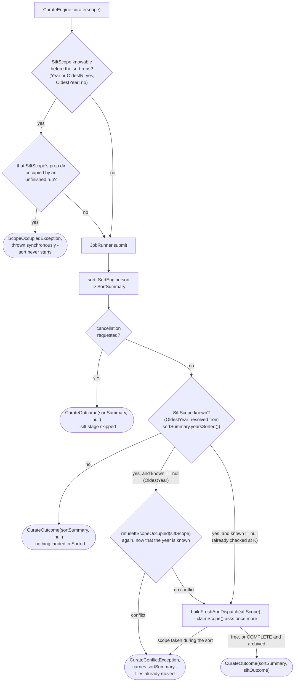

# Curate engine

How `application/service/CurateEngine` sorts a scope, then sifts whatever that sort just populated, as one job
(`app/src/main/java/photos/sluice/application/service/CurateEngine.java`). `Pipeline` builds the one `CurateEngine`
instance it needs, wiring it to the same `SiftEngine` it builds for `sift()`/`resume()` itself. See
[`pipeline.md`](pipeline.md) for that facade and [`sift-engine.md`](sift-engine.md) for `buildFreshAndDispatch()`, the
sift-stage method this class reuses.

## `curate()`

Sort, then sift whatever that sort just populated - one job, sequential Java calls inside its
`JobWork`. Never two chained `submit()` calls (see `JobHandle`'s own doc on why nothing threads a job's outcome across
separate `submit()` calls).

The target `SiftScope` mirrors `scope` directly wherever that's knowable up front. An explicit
`Year` maps straight across. `OldestN` carries the same `n` through to `SiftScope.OldestN`. Sort itself is never
narrowed to fit sift's shape - it always runs its own normal, complete job.

An `OldestN` sort can still land files across more than one year. Sift's own `OldestN` ordering is by raw mtime, not
resolved date (see `SiftScope`'s own doc) - exactly what a standalone `sift()`
call already does with that scope. Nothing new here.

Only `OldestYear` can't be mapped ahead of time - its year isn't decided until the sort itself resolves it.
`SortSummary.yearsSorted()` exists for exactly this: it's the only place an auto-resolved `OldestYear` scope's actual
year is ever reported.

A known target `SiftScope` (`Year` or `OldestN`) gets the same synchronous, pre-submit `refuseIfScopeOccupied()` `sift()`
gets - failing before the sort even starts. `OldestYear` can't be checked that early, so its year is resolved after the
sort and checked then.

**Two calls can refuse after the sort has already moved files**, and both are caught the same way. `OldestYear` reaches
`refuseIfScopeOccupied()` inside the job, having had no earlier chance. And `buildFreshAndDispatch()`'s own
`claimScope()` re-asks for every scope shape, on the job thread. A scope free when `curate()` was called can be taken by
something outside this process while a long sort runs.

Neither can be a plain `ScopeOccupiedException` like the pre-submit one is. The sort already moved real files by then,
and a caller must not lose the `SortSummary` describing that just because the sift stage was refused. `curate()` catches
and rethrows `Pipeline.CurateConflictException` instead (a `ScopeOccupiedException` subtype, kept on `Pipeline` itself
since that's the public facade type a caller catches). Being a subtype, it keeps `occupant()` as well as adding
`sortSummary()`, so these paths refuse no less usefully than the pre-submit one.

Only `ScopeOccupiedException` is caught, which is what keeps a genuine sift failure downstream (a misconfigured
provider, for example) from ever being mislabeled as this conflict. A `Pipeline.ScopeUnreadableException` mid-job (see
[`sift-engine.md`](sift-engine.md)) is neither this conflict nor a sift failure. It is not caught either, and propagates
carrying no `SortSummary` - the same as any other unexpected failure this method does not name.

The single stage-boundary check between sort finishing and sift starting still exists, but neither stage is coarse on
its own anymore. `SortEngine`'s own dating and routing passes each check the signal per file (see
[`sort-engine.md`](sort-engine.md)). `SiftEngine`'s own `buildFreshAndDispatch()`/ `dispatchAndApply()` boundaries (see
[`sift-engine.md`](sift-engine.md)'s Cancellation section) close the sift side the same way. A large sort or a long
automated-provider dispatch both respond within about one item's worth of latency, not by waiting out the whole
remaining stage.

| CurateEngine method | What runs                                                 | Phase label(s)                                                                      |
|---------------------|-----------------------------------------------------------|-------------------------------------------------------------------------------------|
| `curate(SortScope)` | sort -> (cancellation check) -> prep -> dispatch -> apply | `"Sorting..."`, `"Building montages..."`, `"Sifting..."`, `"Applying decisions..."` |

### Scenarios

| Scenario                                                                    | Outcome                                                                                                                                  |
|-----------------------------------------------------------------------------|------------------------------------------------------------------------------------------------------------------------------------------|
| `scope` is `Year` or `OldestN`, already occupied by an unfinished run       | `ScopeOccupiedException` thrown synchronously, before the sort ever starts                                                               |
| `scope` is `OldestYear` and its sort routes nothing into Sorted             | `siftOutcome` is `null` - no year was resolved, so a sift-prep dir is never even written                                                 |
| `scope` is `Year` or `OldestN` and this run sorted nothing new under it     | The sift stage still runs over that same scope - files already sitting there from an earlier, uncommitted run get sifted                 |
| `scope` is `OldestN` and the sort spans more than one year                  | Sort lands files in every year they resolve to, unrestricted; sift still runs `SiftScope.OldestN` with the same `n`, by raw mtime        |
| Cancellation requested between the sort and sift stages                     | The sort still completes in full; `siftOutcome` is `null` - the sift stage never starts                                                  |
| `scope` is `OldestYear` and the sort resolves a year                        | That resolved year is sifted - `SortSummary.yearsSorted()` is the only place it's reported                                               |
| `scope` is `OldestYear`, and its resolved year is already occupied          | `Pipeline.CurateConflictException` (a `ScopeOccupiedException` subtype) - carries the `SortSummary` for the files the sort already moved |
| `scope` is `Year` or `OldestN`, free at call time but taken during the sort | The same `CurateConflictException`, raised by `claimScope()` on the job thread rather than by the pre-submit check                       |
| Cancellation requested mid-render during curate's sift stage                | `siftOutcome` is `SiftJobOutcome.Cancelled` - same as `sift()` hitting the same point via `buildFreshAndDispatch()`                      |

## Related

- [`pipeline.md`](pipeline.md): the `Pipeline` facade that builds this class, and the `CurateConflictException`
  type it defines.
- [`sift-engine.md`](sift-engine.md): `buildFreshAndDispatch()`/`refuseIfScopeOccupied()`, both reused directly by this
  class's sift stage.
- `SortEngine`: [`sort-engine.md`](sort-engine.md) in this same design folder.
