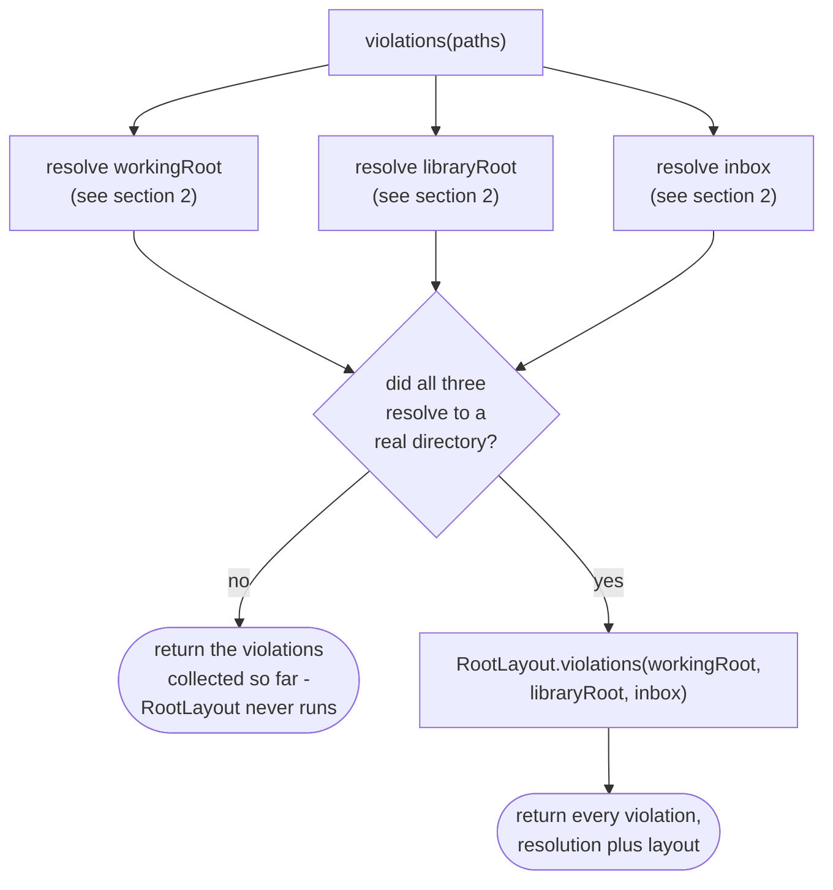
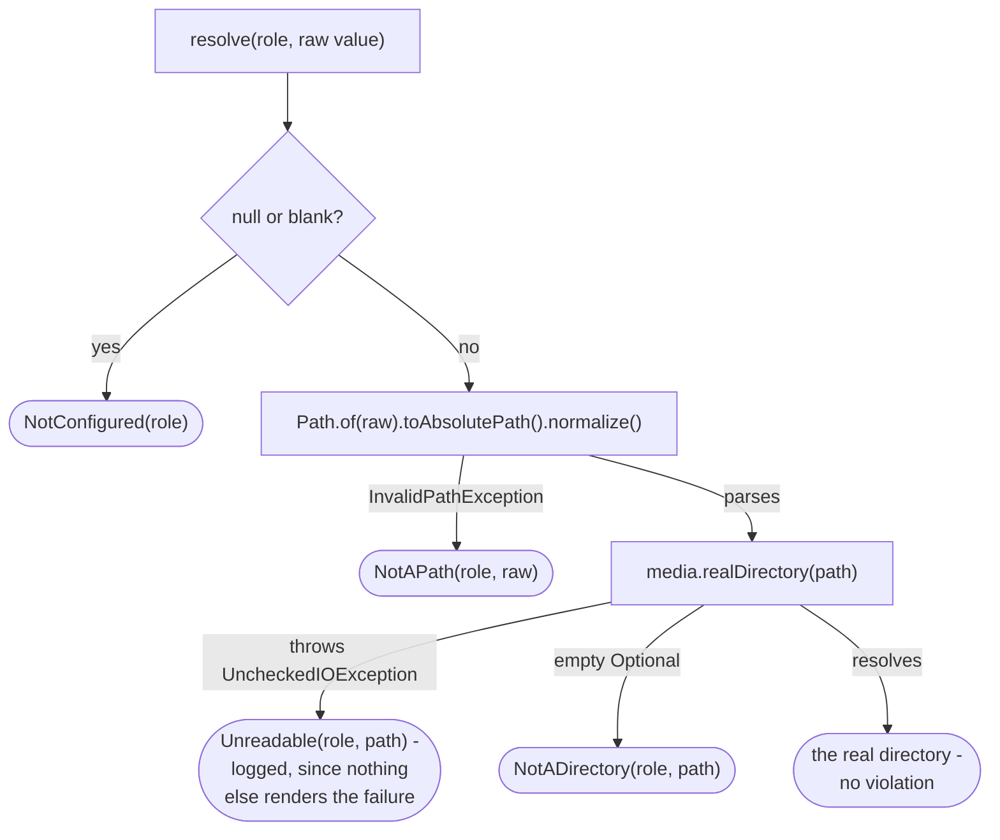

# Path validation service

How `application/service/PathValidationService` checks the three folder roots, by resolving each one
and handing the results to `domain/paths/RootLayout`, the rule that compares them
(`app/src/main/java/photos/sluice/application/service/PathValidationService.java`,
`app/src/main/java/photos/sluice/domain/paths/RootLayout.java`).

Three callers sit behind `PathValidationUseCase` today. `RootsGuard` refuses work for every
`Pipeline` entry point. `SettingsService` refuses a save that would move a root somewhere unusable.
`StartupSequence.run()` checks `violationsInForce()` before claiming the working root at all. An
unconfigured install returns from `run()` at that check, taking no claim and running no
housekeeping, rather than failing partway through either. A screen offering to check a folder before
saving it, the fourth shape this use case was built to serve, has no adapter yet.

The two halves are split because only one of them touches a disk. Whether a folder is there, and
what it really is behind any symlink, is a question for the filesystem. Whether three real folders
may sit where they do is arithmetic, and lives in the domain where `RootLayout` can be tested with no
filesystem at all.

## 1. Checking a set of candidate roots

The overlap rule only runs once all three roots resolved. Two roots cannot be compared while one of
them is a folder nobody has chosen yet. A user missing one root is told to fix that first. That is
enough to act on, without also being told two roots it cannot yet check might overlap.

`violationsInForce()` is the same check run against `LiveSettings.current().paths()` instead of a
candidate - the roots the app is actually running on right now.

## 2. Resolving one configured value

A read failure is recorded as a violation rather than left to throw. Every caller behind
`PathValidationUseCase` wants a verdict on three roots, and a root nobody can read is one this app
must not work in either way. Letting an exception out untyped would hand a screen a failure naming
no root, in place of a list that marks the field.

`NotADirectory` and `Unreadable` send a user to different places even though both start from "the
filesystem would not hand back a real directory". The first says the folder is not there, so go and
find it. The second says it is there and could not be read, so the thing to fix is the share, the
drive, or the permission. The failure itself is logged at the point it was caught, since no
`PathViolation` carries an adapter exception into the domain.

## Scenarios

| Scenario                                                                  | Outcome                                                                           |
|---------------------------------------------------------------------------|-----------------------------------------------------------------------------------|
| All three candidate roots are unset (a fresh, unconfigured install)       | Three `NotConfigured` violations, one per role - `RootLayout` never runs          |
| A candidate value cannot be parsed as a path at all                       | `NotAPath` for that role, resolution stops there for it                           |
| A candidate path is well formed but nothing exists there                  | `NotADirectory` for that role                                                     |
| A candidate path exists but the filesystem cannot say what it really is   | `Unreadable` for that role, and the underlying failure is logged                  |
| Only the inbox fails to resolve, the other two are real directories       | Just the inbox's own violation - the overlap rule is skipped entirely             |
| All three resolve, and the library and inbox roots contain each other     | An `Overlap(LIBRARY_ROOT, INBOX)` violation added on top of resolution            |
| All three resolve, and the inbox is the working root or an ancestor of it | An `Overlap(WORKING_ROOT, INBOX)` violation                                       |
| All three resolve, and the working root is an ancestor of the inbox       | No violation - that is the documented layout, and `RootLayout` treats it as legal |
| All three roots resolve to distinct, non-nested directories               | An empty list - the roots are usable                                              |
| `violationsInForce()` is called                                           | Same checks, run against whatever `LiveSettings.current()` holds right now        |
| `StartupSequence.run()` is called on an unconfigured install              | `violationsInForce()` is non-empty; `run()` returns before claiming anything      |

## Related

- `RootsGuard`, the caller that refuses every `Pipeline` entry point on a non-empty result:
  [`pipeline.md`](pipeline.md) in this same design folder.
- `SettingsService`, the caller that refuses a save whose move would land on a violation:
  [`settings-service.md`](settings-service.md) in this same design folder.
- `StartupSequence.run()`, the caller that skips the claim and the housekeeping sweep on a non-empty
  result: see the source file directly, no dedicated design doc yet.
- `RootLayout` and `PathViolation`, the domain types this service resolves into and defers to: pure
  path arithmetic, no dedicated design doc - see the source files directly.
- `MediaReader.realDirectory`, the filesystem call behind resolution: see the source file directly.
