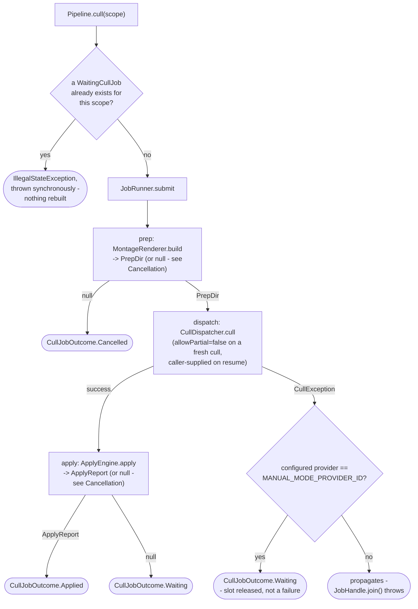
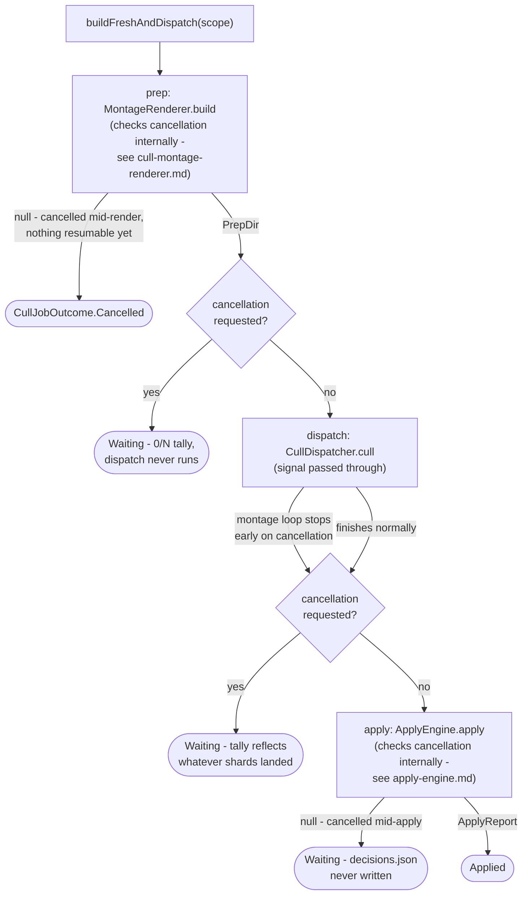
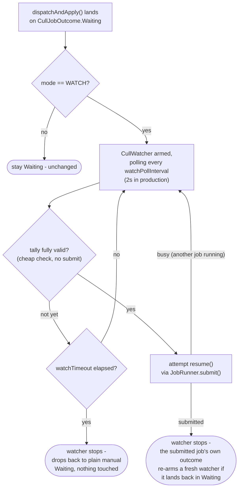
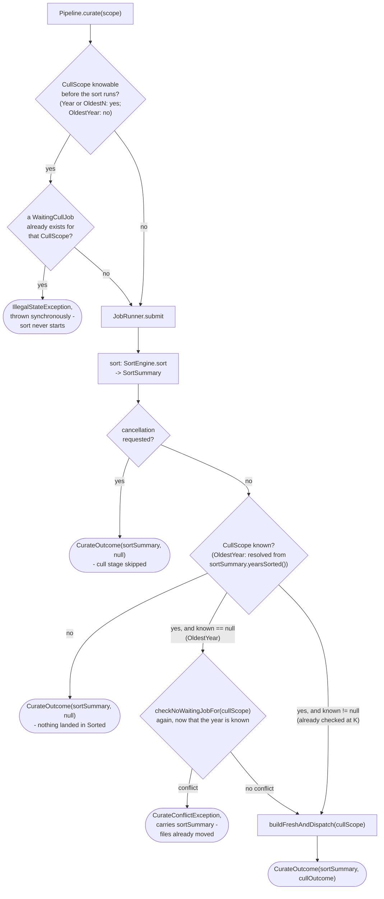

# Pipeline

How `application/service/Pipeline` wraps `SortEngine`/`CommitEngine`/`RescueEngine` (and, once the
cull/curate flows join it, those too) so a driving caller gets a `JobHandle` back instead of
blocking, with progress reported through `ProgressPort`
(`app/src/main/java/photos/sluice/application/service/Pipeline.java`,
`app/src/main/java/photos/sluice/application/service/JobRunner.java`,
`app/src/main/java/photos/sluice/application/port/out/ProgressPort.java`).

## How one call works

The busy check (`B`) is `Pipeline`'s own guaranteed enforcement of "one job at a time" - what it
means to a given caller depends on that caller's own shape. A caller with a persistent,
disable-able trigger (a desktop UI's own "start" action) can additionally disable it while a job
runs, so the check becomes a backstop there. A caller with no such affordance (a one-shot
command-line invocation) has nothing else standing between two concurrent calls, so the check is
that caller's actual enforcement, not just a backstop. Either way, catching the exception and
showing a plain message is the caller's own job, not `Pipeline`'s.

`phaseFinished` (`G`) fires whether or not the engine call throws. Without that, a job that dies
mid-call would leave a `ProgressPort` listener with a `phaseStarted` event and no matching
`phaseFinished` - the phase would look permanently "in progress" even though the `JobHandle` itself
already reports the failure.

| Pipeline method       | Engine call                             | Phase label       |
|-----------------------|-----------------------------------------|-------------------|
| `sort(SortScope)`     | `SortEngine.sort(scope, progress)`      | `"Sorting..."`    |
| `commit(CommitScope)` | `CommitEngine.commit(scope, progress)`  | `"Committing..."` |
| `rescue(String)`      | `RescueEngine.rescue(folder, progress)` | `"Rescuing..."`   |

`Pipeline` depends on these three engines' concrete classes, not their `SortUseCase`/
`CommitUseCase`/`RescueUseCase` interfaces - the progress-callback overloads only exist on the
concrete classes, not on those narrower interfaces.

## Scenarios

| Scenario                                                                | Outcome                                                                                                                                                                                       |
|-------------------------------------------------------------------------|-----------------------------------------------------------------------------------------------------------------------------------------------------------------------------------------------|
| A job is already running when `sort`/`commit`/`rescue` is called        | `IllegalStateException` immediately; the running job is unaffected, no new job starts                                                                                                         |
| The engine call succeeds                                                | `phaseStarted` -> N ticks -> `phaseFinished`, `JobHandle.join()` returns the engine's summary                                                                                                 |
| The engine call throws mid-run                                          | `phaseStarted` -> `phaseFinished` still fires -> `JobHandle.join()` throws `CompletionException` wrapping the real cause                                                                      |
| Cancellation requested via the returned `JobHandle` (`sort`)            | `SortEngine` checks it once per file in both its dating pass (aborts cleanly, nothing moved) and its routing pass (already-moved files stay moved) - see `sort-engine.md`                     |
| Cancellation requested via the returned `JobHandle` (`commit`/`rescue`) | `CommitEngine`/`RescueEngine` each check it once per file in their one move loop; already-moved/rescued files stay that way - see `rescue-engine.md` for `rescue`'s dissolve-gate interaction |

## `cull()` / `waitingJobs()` / `resume()`

Three stages chained into one job: prep (`MontageRenderer.build`) -> dispatch
(`CullDispatcher.cull`, which routes to whichever `VisionCuller` the configured provider selects)
-> apply (`ApplyEngine.apply`). The dispatch step is where the flow forks, because a
`CullException` from it means two different things depending on the provider - see
`VisionCuller.MANUAL_MODE_PROVIDER_ID`'s own doc comment for the full reasoning.

`resume(prepDir, allowPartial)` re-enters at the dispatch step directly -
`cullPrepPort.readIndex()` re-reads the existing `PrepDir` from `index.json` instead of
`MontageRenderer` regenerating it, so no montage is ever rebuilt or re-rendered by a resume.
`waitingJobs()` is a plain, un-jobbed read: it scans `logs/cull-prep/*/` for a prep dir with
`index.json` but no merged `decisions.json` yet (see `WaitingCullJob`'s own doc for why this is
derived live instead of a persisted list), tolerating a transiently-unreadable `index.json` (a
concurrent job's own prep dir mid-clear/mid-write) by skipping that entry rather than failing the
whole scan.

`Pipeline` computes each `WaitingCullJob`'s `ShardTally` (`present`/`valid`/`total`) itself, one
montage at a time via `ShardValidator`, rather than reusing `ApplyEngine`'s whole-batch
`validate()`. A cross-shard problem (a near-dup group id reused across two montages) therefore
doesn't show up in the tally - an accepted simplification for a progress number.
`ApplyEngine.apply()`'s own full-batch validation is still the actual gate before anything moves.

| Pipeline method                 | What runs                                                           | Phase label(s)                                                      |
|---------------------------------|---------------------------------------------------------------------|---------------------------------------------------------------------|
| `cull(CullScope)`               | prep -> dispatch -> (apply if complete)                             | `"Building montages..."`, `"Culling..."`, `"Applying decisions..."` |
| `waitingJobs()`                 | a plain disk scan, no `JobRunner` involved                          | none                                                                |
| `resume(Path prepDir, boolean)` | dispatch (re-reading the existing `PrepDir`) -> (apply if complete) | `"Culling..."`, `"Applying decisions..."`                           |

### Scenarios

| Scenario                                                                | Outcome                                                                                                                                                    |
|-------------------------------------------------------------------------|------------------------------------------------------------------------------------------------------------------------------------------------------------|
| `cull()` on a scope with no shards dropped yet (fresh manual-mode prep) | `CullJobOutcome.Waiting` with a `present=0/valid=0` tally; job slot released                                                                               |
| `cull()` called again while that scope's `WaitingCullJob` is unresolved | `IllegalStateException` thrown synchronously, before `JobRunner.submit()` - the existing prep dir (and any already-dropped shards) is left untouched       |
| `resume()` once every shard is present and valid                        | `CullJobOutcome.Applied`, files moved                                                                                                                      |
| `resume()` while a shard is still missing/invalid                       | `CullJobOutcome.Waiting` again, with a freshly recomputed tally                                                                                            |
| `resume(prepDir, allowPartial=true)` with a shard still missing         | Applies what it has; the missing montage's photos are left in place, untouched                                                                             |
| A genuine `CullException` from an automated (non-manual-mode) provider  | Propagates - `JobHandle.join()` throws, never resolves to `Waiting`. A cancellation is a separate path (see Cancellation below) and never reaches this one |

### Cancellation

Cancel is effectively Pause for cull, not a failure, at every boundary except one. `cull()`/
`resume()` both pass `handle::isCancellationRequested` through to `buildFreshAndDispatch()`/
`dispatchAndApply()`, and from there into `MontageRenderer.build()` and `ApplyEngine.apply()`
themselves - every long-running pass in the whole cull flow now checks the same signal, not just
the two stage boundaries between them:

An automated provider's own montage loop (`AnthropicCuller`) checks the signal in its loop
condition and once more before its corrective retry. A cancellation therefore lands within at most
one montage call, plus rarely one retry call - never as a thrown `CullException`.

The external-agent provider's dispatch is a single fast completeness check with nothing to
interrupt mid-call. Its own manual-mode-pause `CullException` still resolves to `Waiting` as
before. The cancellation check right after that catch skips arming a watcher for it, the same way
every other cancellation-triggered `Waiting` in this diagram does.

`CullJobOutcome.Cancelled` is the one outcome with nothing to resume. The renderer stopped before
`index.json` was ever written, so there is no prep dir yet to derive a `WaitingCullJob` from. A
plain re-run of `cull()` on the same scope starts fresh. Every other cancellation path in this
diagram (mid-dispatch, mid-apply, or right at either stage boundary) lands on `Waiting` instead,
because a resumable prep dir (and, for mid-dispatch, some shards) already exists by that point.

None of these paths ever arm a watcher, regardless of `mode`: an auto-resume moments after a
cancel would defy the cancel.

| Scenario                                                                       | Outcome                                                                                |
|--------------------------------------------------------------------------------|----------------------------------------------------------------------------------------|
| Cancellation requested mid-render, before `index.json` is written              | `CullJobOutcome.Cancelled` - nothing resumable exists yet                              |
| Cancellation requested mid-batch (the montage-write loop), before `index.json` | `CullJobOutcome.Cancelled`, same as mid-render - see `cull-montage-renderer.md`        |
| Cancellation requested right after prep finishes, before dispatch starts       | `Waiting` with a `0/N` tally - dispatch never runs                                     |
| Cancellation requested mid-dispatch (an automated provider's montage loop)     | `Waiting` with a tally reflecting however many shards the loop wrote before stopping   |
| Cancellation requested mid-apply (either of `ApplyEngine`'s two status loops)  | `Waiting` - `decisions.json` was never written, so the prep dir still reads as waiting |
| Cancellation requested racing a manual-mode pause's `CullException`            | `Waiting`, same as an uncancelled pause, but no watcher is armed even if `mode=WATCH`  |
| `mode=WATCH` configured with an automated (non-manual-mode) provider           | Never arms a watcher, cancelled or not - watch mode is an external-agent-only feature  |

## Watch mode

`cull.externalAgent.mode: watch` (`ExternalAgentSettings`, `WatchMode`) makes every `Waiting`
outcome from `dispatchAndApply()` arm a `CullWatcher` for that prep dir, on top of the plain
`Waiting` behavior above. `MANUAL` mode (the default) skips this section entirely -
`armWatchIfConfigured` returns immediately.

Deliberately pure polling, not `java.nio.file.WatchService`. A user's working folder can itself be
a cloud-synced or network folder (a Settings choice) - exactly the folder type known to miss
filesystem events. Depending on events at all would just relocate that gap. `watchPollInterval` is
an internal cadence, not a `CullSettings` field - only `mode` and `watchTimeout` are the documented
user-facing knobs.

`disarmWatch()` runs at the very start of every `dispatchAndApply()` call, regardless of who
triggered it (a fresh `cull()`, a manual `resume()` click, or a watcher's own auto-resume) - the
prep dir's watcher, if any, is always retired before a real attempt runs, so a manual click racing
an armed watcher can never leave two pollers on the same job. `armWatchesForExistingWaitingJobs()`
(`@PostConstruct`) re-arms every still-waiting job found on disk at startup, since there is no
persistent job store - restarting the app would otherwise silently stop watching every job armed
before the restart.

### Scenarios

| Scenario                                                         | Outcome                                                                                           |
|------------------------------------------------------------------|---------------------------------------------------------------------------------------------------|
| Watch mode, a valid shard for every montage eventually appears   | The next poll tick's tally check passes, `resume()` is submitted automatically, `Applied` follows |
| Watch mode, `JobRunner` is busy with an unrelated job when ready | `attemptConsume` returns false; the watcher keeps polling and retries on the next tick            |
| Watch mode, `watchTimeout` elapses with no fully-valid tally     | Watcher stops on its own; every dropped shard is untouched; a manual `resume()` still works       |
| Watch mode, app restarts while a job is still waiting            | `armWatchesForExistingWaitingJobs()` re-arms a watcher for it purely from `waitingJobs()`         |
| Manual mode (default)                                            | No watcher ever arms; behavior is identical to the `cull()`/`resume()` section above              |

## `curate()`

Sort, then cull whatever that sort just populated - one job, sequential Java calls inside its
`JobWork`. Never two chained `submit()` calls (see `JobHandle`'s own doc on why nothing threads a
job's outcome across separate `submit()` calls).

The target `CullScope` mirrors `scope` directly wherever that's knowable up front. An explicit
`Year` maps straight across. `OldestN` carries the same `n` through to `CullScope.OldestN`. Sort
itself is never narrowed to fit cull's shape - it always runs its own normal, complete job.

An `OldestN` sort can still land files across more than one year. Cull's own `OldestN` ordering is
by raw mtime, not resolved date (see `CullScope`'s own doc) - exactly what a standalone `cull()`
call already does with that scope. Nothing new here.

Only `OldestYear` can't be mapped ahead of time - its year isn't decided until the sort itself
resolves it. `SortSummary.yearsSorted()` exists for exactly this: it's the only place an
auto-resolved `OldestYear` scope's actual year is ever reported.

A known target `CullScope` (`Year` or `OldestN`) gets the same synchronous, pre-submit
`checkNoWaitingJobFor()` `cull()` gets - failing before the sort even starts. `OldestYear` can't be
checked that early. Its only guard is the same check running again once its resolved year is
known, after the sort has already moved real files - narrowly, around just that one call, not the
dispatch/apply that follows, so a genuine cull failure downstream (a misconfigured provider, for
example) is never mislabeled as this conflict.

A failure at that later point can't be a plain `IllegalStateException` like the pre-submit one is.
The sort already moved real files by then. A caller must not lose the `SortSummary` describing
that just because the cull stage was refused. `curate()` catches it and rethrows
`Pipeline.CurateConflictException` (an `IllegalStateException` subtype) instead, carrying the
`SortSummary` via its own `sortSummary()` accessor. This is the only failure path that needs to
carry a partial result - every other `checkNoWaitingJobFor()` failure happens before anything
runs.

The single stage-boundary check between sort finishing and cull starting still exists, but neither
stage is coarse on its own anymore. `SortEngine`'s own dating and routing passes each check the
signal per file (see `sort-engine.md`), and `buildFreshAndDispatch()`/`dispatchAndApply()`'s own
two boundaries (see the Cancellation section above) close the cull side the same way. A large sort
or a long automated-provider dispatch both respond within about one item's worth of latency, not
by waiting out the whole remaining stage.

| Pipeline method     | What runs                                                 | Phase label(s)                                                                      |
|---------------------|-----------------------------------------------------------|-------------------------------------------------------------------------------------|
| `curate(SortScope)` | sort -> (cancellation check) -> prep -> dispatch -> apply | `"Sorting..."`, `"Building montages..."`, `"Culling..."`, `"Applying decisions..."` |

### Scenarios

| Scenario                                                                       | Outcome                                                                                                                                   |
|--------------------------------------------------------------------------------|-------------------------------------------------------------------------------------------------------------------------------------------|
| `scope` is `Year` or `OldestN`, already holding an unresolved `WaitingCullJob` | `IllegalStateException` thrown synchronously, before the sort ever starts                                                                 |
| `scope` is `OldestYear` and its sort routes nothing into Sorted                | `cullOutcome` is `null` - no year was resolved, so a cull-prep dir is never even written                                                  |
| `scope` is `Year` or `OldestN` and this run sorted nothing new under it        | The cull stage still runs over that same scope - files already sitting there from an earlier, uncommitted run get culled                  |
| `scope` is `OldestN` and the sort spans more than one year                     | Sort lands files in every year they resolve to, unrestricted; cull still runs `CullScope.OldestN` with the same `n`, by raw mtime         |
| Cancellation requested between the sort and cull stages                        | The sort still completes in full; `cullOutcome` is `null` - the cull stage never starts                                                   |
| `scope` is `OldestYear` and the sort resolves a year                           | That resolved year is culled - `SortSummary.yearsSorted()` is the only place it's reported                                                |
| `scope` is `OldestYear`, and its resolved year already has a `WaitingCullJob`  | `Pipeline.CurateConflictException` (not a plain `IllegalStateException`) - carries the `SortSummary` for the files the sort already moved |
| Cancellation requested mid-render during curate's cull stage                   | `cullOutcome` is `CullJobOutcome.Cancelled` - same as `cull()` hitting the same point via `buildFreshAndDispatch()`                       |

## Related

- `JobRunner`/`JobHandle`/`JobWork` (the single-slot async executor `Pipeline` submits onto): no
  dedicated design doc yet - see the source files directly.
- `ProgressPort` (the out-port `Pipeline` reports through): see the source file directly; its own
  doc comment is the source of the "always bracket a phase" contract this page relies on.
- `SortEngine`: `sort-engine.md` in this same design folder.
- `RescueEngine`: `rescue-engine.md` in this same design folder.
- `CommitEngine` has no design doc of its own (one loop, one branch - judged too thin to diagram).
- `ApplyEngine`: `apply-engine.md` in this same design folder, section 5 for its own cancellation
  behavior.
- `CullMontageRenderer`: `cull-montage-renderer.md` in the `adapter/imaging` design folder, its own
  Cancellation section for the render/batch checks `MontageRenderer.build()` does internally.
