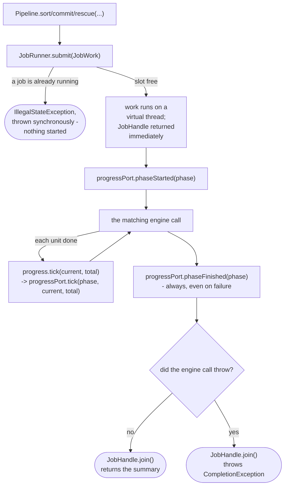
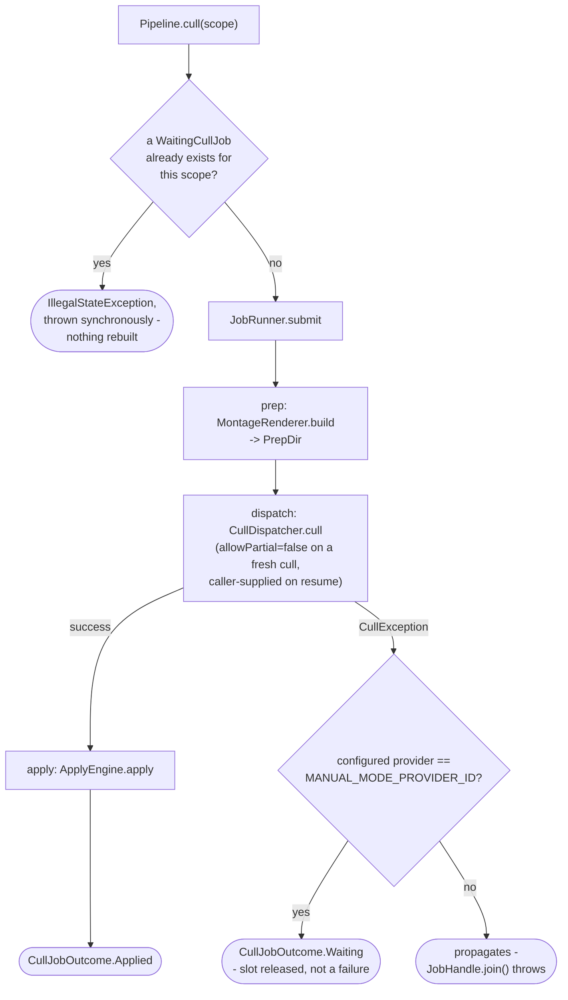

# Pipeline

How `application/service/Pipeline` wraps `SortEngine`/`CommitEngine`/`RescueEngine` (and, once the
cull/curate flows join it, those too) so a driving caller gets a `JobHandle` back instead of
blocking, with progress reported through `ProgressPort`
(`app/src/main/java/photos/sluice/application/service/Pipeline.java`,
`app/src/main/java/photos/sluice/application/service/JobRunner.java`,
`app/src/main/java/photos/sluice/application/port/out/ProgressPort.java`).

## How one call works

The busy check (`B`) is `Pipeline`'s own guaranteed enforcement of "one job at a time" - what it
means to a given caller depends on that caller's own shape. A caller with a persistent, disable-able
trigger (a desktop UI's own "start" action) can additionally disable it while a job runs, so the
check becomes a backstop there. A caller with no such affordance (a one-shot command-line
invocation) has nothing else standing between two concurrent calls, so the check is that caller's
actual enforcement, not just a backstop. Either way, catching the exception and showing a plain
message is the caller's own job, not `Pipeline`'s.

`phaseFinished` (`G`) fires whether or not the engine call throws. Without that, a job that dies
mid-call would leave a `ProgressPort` listener with a `phaseStarted` event and no matching
`phaseFinished` - the phase would look permanently "in progress" even though the `JobHandle`
itself already reports the failure.

| Pipeline method       | Engine call                             | Phase label       |
|-----------------------|-----------------------------------------|-------------------|
| `sort(SortScope)`     | `SortEngine.sort(scope, progress)`      | `"Sorting..."`    |
| `commit(CommitScope)` | `CommitEngine.commit(scope, progress)`  | `"Committing..."` |
| `rescue(String)`      | `RescueEngine.rescue(folder, progress)` | `"Rescuing..."`   |

`Pipeline` depends on these three engines' concrete classes, not their `SortUseCase`/
`CommitUseCase`/`RescueUseCase` interfaces - the progress-callback overloads only exist on the
concrete classes, not on those narrower interfaces.

## Scenarios

| Scenario                                                         | Outcome                                                                                                                                                                                                                   |
|------------------------------------------------------------------|---------------------------------------------------------------------------------------------------------------------------------------------------------------------------------------------------------------------------|
| A job is already running when `sort`/`commit`/`rescue` is called | `IllegalStateException` immediately; the running job is unaffected, no new job starts                                                                                                                                     |
| The engine call succeeds                                         | `phaseStarted` -> N ticks -> `phaseFinished`, `JobHandle.join()` returns the engine's summary                                                                                                                             |
| The engine call throws mid-run                                   | `phaseStarted` -> `phaseFinished` still fires -> `JobHandle.join()` throws `CompletionException` wrapping the real cause                                                                                                  |
| Cancellation requested via the returned `JobHandle`              | No effect yet - each of these three calls is a single, non-interruptible engine call with no boundary to check at; becomes meaningful once a multi-stage call (sort followed by a cull) has a boundary between its stages |

## `cull()` / `waitingJobs()` / `resume()`

Three stages chained into one job: prep (`MontageRenderer.build`) -> dispatch
(`CullDispatcher.cull`, which routes to whichever `VisionCuller` the configured provider selects)
-> apply (`ApplyEngine.apply`). The dispatch step is where the flow forks, because a
`CullException` from it means two different things depending on the provider - see
`VisionCuller.MANUAL_MODE_PROVIDER_ID`'s own doc comment for the full reasoning.

`resume(prepDir, allowPartial)` re-enters at the dispatch step directly - `cullPrepPort.readIndex()`
re-reads the existing `PrepDir` from `index.json` instead of `MontageRenderer` regenerating it, so
no montage is ever rebuilt or re-rendered by a resume. `waitingJobs()` is a plain, un-jobbed read:
it scans `logs/cull-prep/*/` for a prep dir with `index.json` but no merged `decisions.json` yet
(see `WaitingCullJob`'s own doc for why this is derived live instead of a persisted list),
tolerating a transiently-unreadable `index.json` (a concurrent job's own prep dir mid-clear/
mid-write) by skipping that entry rather than failing the whole scan.

`Pipeline` computes each `WaitingCullJob`'s `ShardTally` (`present`/`valid`/`total`) itself, one
montage at a time via `ShardValidator`, rather than reusing `ApplyEngine`'s whole-batch
`validate()`. A cross-shard problem (a near-dup group id reused across two montages) therefore
doesn't show up in the tally - an accepted simplification for a progress number.
`ApplyEngine.apply()`'s own full-batch validation is still the actual gate before anything moves.

| Pipeline method                 | What runs                                                           | Phase label(s)                                                      |
|---------------------------------|---------------------------------------------------------------------|---------------------------------------------------------------------|
| `cull(CullScope)`               | prep -> dispatch -> (apply if complete)                             | `"Building montages..."`, `"Culling..."`, `"Applying decisions..."` |
| `waitingJobs()`                 | a plain disk scan, no `JobRunner` involved                          | none                                                                |
| `resume(Path prepDir, boolean)` | dispatch (re-reading the existing `PrepDir`) -> (apply if complete) | `"Culling..."`, `"Applying decisions..."`                           |

### Scenarios

| Scenario                                                                | Outcome                                                                                                                                              |
|-------------------------------------------------------------------------|------------------------------------------------------------------------------------------------------------------------------------------------------|
| `cull()` on a scope with no shards dropped yet (fresh manual-mode prep) | `CullJobOutcome.Waiting` with a `present=0/valid=0` tally; job slot released                                                                         |
| `cull()` called again while that scope's `WaitingCullJob` is unresolved | `IllegalStateException` thrown synchronously, before `JobRunner.submit()` - the existing prep dir (and any already-dropped shards) is left untouched |
| `resume()` once every shard is present and valid                        | `CullJobOutcome.Applied`, files moved                                                                                                                |
| `resume()` while a shard is still missing/invalid                       | `CullJobOutcome.Waiting` again, with a freshly recomputed tally                                                                                      |
| `resume(prepDir, allowPartial=true)` with a shard still missing         | Applies what it has; the missing montage's photos are left in place, untouched                                                                       |
| `CullException` from an automated (non-manual-mode) provider            | Propagates - `JobHandle.join()` throws, never resolves to `Waiting`                                                                                  |

## Related

- `JobRunner`/`JobHandle`/`JobWork` (the single-slot async executor `Pipeline` submits onto): no
  dedicated design doc yet - see the source files directly.
- `ProgressPort` (the out-port `Pipeline` reports through): see the source file directly; its own
  doc comment is the source of the "always bracket a phase" contract this page relies on.
- `SortEngine`: `sort-engine.md` in this same design folder.
- `RescueEngine`: `rescue-engine.md` in this same design folder.
- `CommitEngine` has no design doc of its own (one loop, one branch - judged too thin to diagram).
