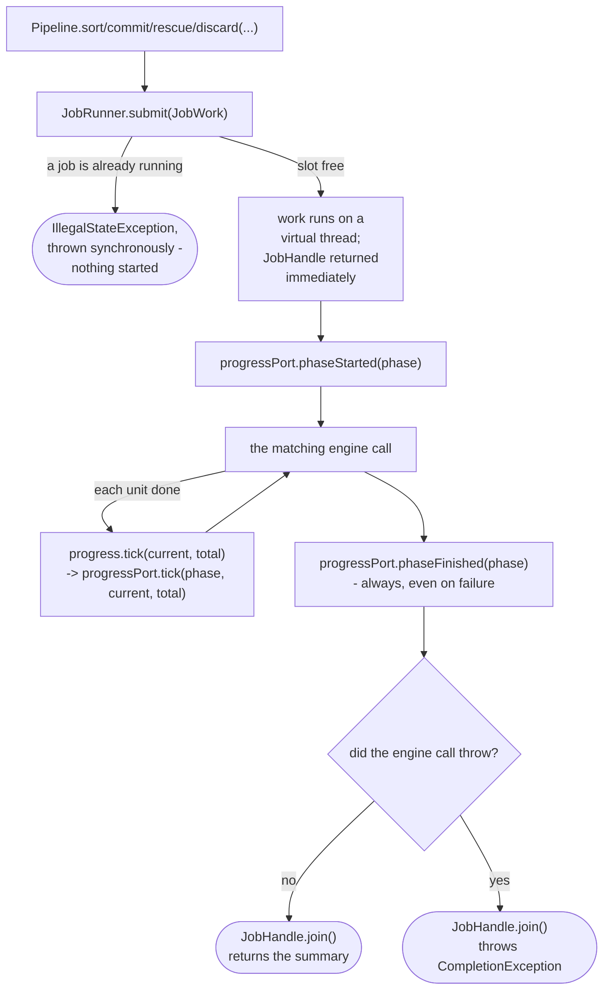

# Pipeline

How `application/service/Pipeline` wraps `SortEngine`/`CommitEngine`/`RescueEngine`, and builds and exposes
`CullEngine`/`CurateEngine`, so a driving caller gets a `JobHandle` back instead of blocking, with progress reported
through `ProgressPort` via `PhaseRunner`
(`app/src/main/java/photos/sluice/application/service/Pipeline.java`,
`app/src/main/java/photos/sluice/application/service/PhaseRunner.java`,
`app/src/main/java/photos/sluice/application/service/JobRunner.java`,
`app/src/main/java/photos/sluice/application/port/out/ProgressPort.java`). `cull()`/`waitingJobs()`/
`resume()` and `curate()` are one-line delegates to `CullEngine`/`CurateEngine` - see
`cull-engine.md`/`curate-engine.md` for how those actually work. `troubleshoot(prepDir)` and
`purgeCompleted()` are each a one-line `JobRunner.submit()` delegate (to `Troubleshooter` and
`PrepDirDoctor` respectively), with no `PhaseRunner`/`ProgressPort` bracketing - neither has
per-item progress worth reporting, so `JobRunner`'s one-job-at-a-time discipline is the whole
reason either runs as a job. See `troubleshooter.md`/`prep-dir-doctor.md` for what each actually
does.

## How one call works

The busy check (`B`) is `Pipeline`'s own guaranteed enforcement of "one job at a time" - what it means to a given caller
depends on that caller's own shape. A caller with a persistent, disable-able trigger (a desktop UI's own "start" action)
can additionally disable it while a job runs, so the check becomes a backstop there. A caller with no such affordance (a
one-shot command-line invocation) has nothing else standing between two concurrent calls, so the check is that caller's
actual enforcement, not just a backstop. Either way, catching the exception and showing a plain message is the caller's
own job, not `Pipeline`'s.

`phaseFinished` (`G`) fires whether or not the engine call throws, via `PhaseRunner`. Without that, a job that dies
mid-call would leave a `ProgressPort` listener with a `phaseStarted` event and no matching `phaseFinished` - the phase
would look permanently "in progress" even though the
`JobHandle` itself already reports the failure.

| Pipeline method       | Engine call                              | Phase label       |
|-----------------------|------------------------------------------|-------------------|
| `sort(SortScope)`     | `SortEngine.sort(scope, progress)`       | `"Sorting..."`    |
| `commit(CommitScope)` | `CommitEngine.commit(scope, progress)`   | `"Committing..."` |
| `rescue(String)`      | `RescueEngine.rescue(folder, progress)`  | `"Rescuing..."`   |
| `discard(Path)`       | `ApplyEngine.discard(prepDir, progress)` | `"Discarding..."` |

`Pipeline` depends on these three engines' concrete classes, not their `SortUseCase`/
`CommitUseCase`/`RescueUseCase` interfaces - the progress-callback overloads only exist on the concrete classes, not on
those narrower interfaces.

`discard(prepDir)` follows the same `PhaseRunner`-bracketed shape as `sort`/`commit`/`rescue`
(`"Discarding..."`, ticked once per file `ApplyEngine.discard()` moves or deletes - real work
worth a progress bar, unlike `troubleshoot`/`purgeCompleted` below), plus two checks neither of
those three needs: it refuses a prep dir `PrepDirDoctor.diagnose()` reports `COMPLETE`
(`purgeCompleted()` is that state's own verb), and it retires any watcher polling the prep dir
before the graveyard move starts, so an auto-resume can never fire against a run mid-discard. See
`apply-engine.md` section 9 for what `discard()` actually moves/deletes, and `cull-engine.md` for
the watcher it disarms.

### Scenarios

| Scenario                                                                                 | Outcome                                                                                                                                                                                       |
|------------------------------------------------------------------------------------------|-----------------------------------------------------------------------------------------------------------------------------------------------------------------------------------------------|
| A job is already running when `sort`/`commit`/`rescue`/`discard` is called               | `IllegalStateException` immediately; the running job is unaffected, no new job starts                                                                                                         |
| The engine call succeeds                                                                 | `phaseStarted` -> N ticks -> `phaseFinished`, `JobHandle.join()` returns the engine's summary                                                                                                 |
| The engine call throws mid-run                                                           | `phaseStarted` -> `phaseFinished` still fires -> `JobHandle.join()` throws `CompletionException` wrapping the real cause                                                                      |
| Cancellation requested via the returned `JobHandle` (`sort`)                             | `SortEngine` checks it once per file in both its dating pass (aborts cleanly, nothing moved) and its routing pass (already-moved files stay moved) - see `sort-engine.md`                     |
| Cancellation requested via the returned `JobHandle` (`commit`/`rescue`)                  | `CommitEngine`/`RescueEngine` each check it once per file in their one move loop; already-moved/rescued files stay that way - see `rescue-engine.md` for `rescue`'s dissolve-gate interaction |
| `discard(prepDir)` is called on a prep dir `PrepDirDoctor.diagnose()` reports `COMPLETE` | `IllegalStateException` immediately - `purgeCompleted()` is that state's own verb, not `discard()`                                                                                            |
| Cancellation requested via the returned `JobHandle` (`discard`)                          | Not checked - `discard()` has no cancellation signal; once started it runs every file to completion                                                                                           |

## Related

- `cull-engine.md`: `CullEngine` - `cull()`/`waitingJobs()`/`resume()`, cancellation, and watch mode.
- `curate-engine.md`: `CurateEngine` - `curate()`, and the `Pipeline.CurateConflictException` type it throws.
- `JobRunner`/`JobHandle`/`JobWork` (the single-slot async executor `Pipeline` submits onto): no dedicated design doc
  yet - see the source files directly.
- `ProgressPort` (the out-port `PhaseRunner` reports through): see the source file directly; its own doc comment is the
  source of the "always bracket a phase" contract this page relies on.
- `SortEngine`: `sort-engine.md` in this same design folder.
- `RescueEngine`: `rescue-engine.md` in this same design folder.
- `CommitEngine` has no design doc of its own (one loop, one branch - judged too thin to diagram).
- `ApplyEngine`: `apply-engine.md` in this same design folder, section 5 for its own cancellation behavior,
  section 9 for `discard()`.
- `Troubleshooter`: `troubleshooter.md` in this same design folder.
- `PrepDirDoctor`: `prep-dir-doctor.md` in this same design folder, for `diagnose()` and `purgeCompleted()`.
- `CullMontageRenderer`: `cull-montage-renderer.md` in the `adapter/imaging` design folder, its own Cancellation section
  for the render/batch checks `MontageRenderer.build()` does internally.
