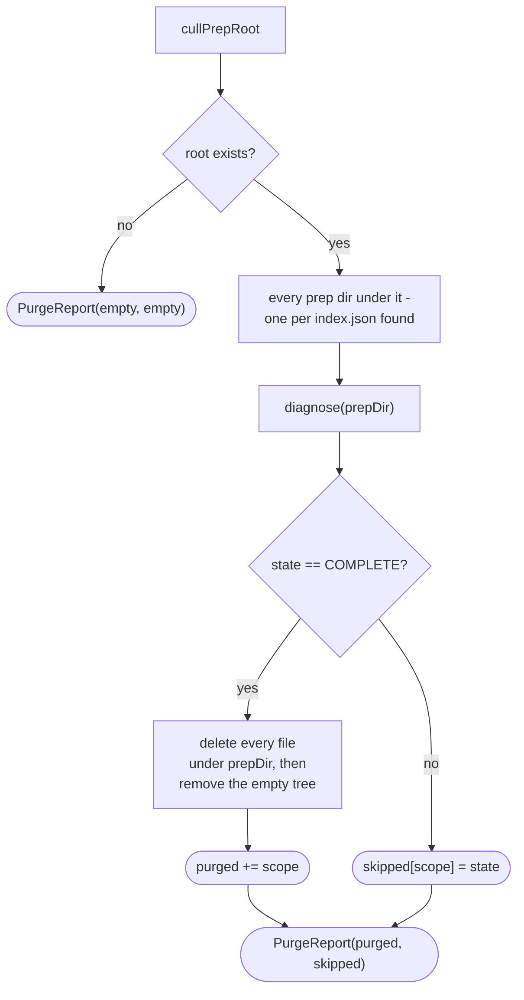

# PrepDirDoctor

How `application/service/PrepDirDoctor` diagnoses a prep dir's health and, separately, purges
completed runs across the whole cull-prep root
(`app/src/main/java/photos/sluice/application/service/PrepDirDoctor.java`).

`diagnose(prepDir)` - the read-only health check every other recovery flow builds on - is
documented in its own Javadoc rather than a flowchart here. `apply-planner.md`, `prep-dir-remedies.md`,
and `troubleshooter.md` already walk through the shard-contract and corrupt-index/sidecar branches
it delegates to. This page covers `purgeCompleted()`, the one piece of `PrepDirDoctor` that isn't
about a single prep dir.

## 1. purgeCompleted()

Manual, one-button housekeeping - no age-based auto-purge, and no graveyard detour. A completed
run already holds no image weight worth salvaging: `apply()`'s own `cleanupIntermediates()`
already dropped the montage/tile images. So what purge deletes is shards, `index.json`, the
move-record log, and any disaster drawer. That is kilobytes of forensic record the user has decided
to let go of, not media.

`Pipeline.purgeCompleted()` runs this as a normal `JobRunner` job. Not for progress, since a purge
is near-instant, but for the same one-job-at-a-time serialization every other job gets. A purge can
never race a re-prep of a scope it's mid-delete on.

Every other state (`WAITING`, `BLOCKED`, `READY`) is left untouched and reported in `skipped`. A
caller can then render "N runs cleared, M left because: ..." without a second diagnose pass.
Deletion itself reuses the same `listFiles` + `delete` + `removeIfEmptyOfFiles` sequence
`PrepDirRemedies.discard()` uses for its own image cleanup. The only difference is that here every
file is deleted, not just the montage/tile images. Nothing about a `COMPLETE` run's own artifacts
is worth a graveyard trip.

## Related

- `diagnose()`'s own state machine: `PrepDirDoctor.diagnose()`'s Javadoc, and `apply-planner.md`
  for the shard-contract validation it reuses.
- The corrupt-index/sidecar branches `diagnose()` reuses: `prep-dir-remedies.md`, section 2.
- `Pipeline.purgeCompleted()`'s `JobRunner` wiring: `pipeline.md`.
- The last-resort discard this is not: `prep-dir-remedies.md`, section 3 - `discard()` graveyards
  a prep dir's text artifacts and deletes only its images. `purgeCompleted()` hard-deletes a
  `COMPLETE` prep dir wholesale, with no graveyard, since nothing left in it needs salvaging.
