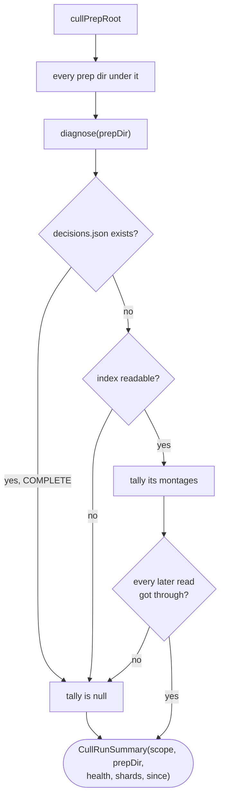
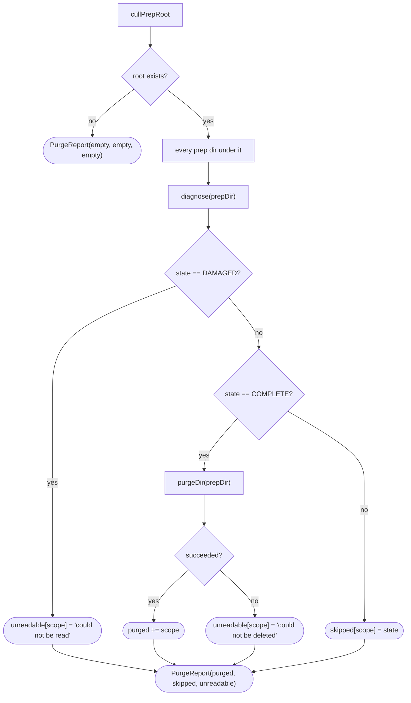

# PrepDirDoctor

How `application/service/PrepDirDoctor` diagnoses a prep dir's health and, separately, purges
completed runs across the whole cull-prep root
(`app/src/main/java/photos/sluice/application/service/PrepDirDoctor.java`).

`diagnose(prepDir)` - the read-only health check every other recovery flow builds on - is
documented in its own Javadoc rather than a flowchart here. `apply-planner.md`, `prep-dir-remedies.md`,
and `troubleshooter.md` already walk through the shard-contract and corrupt-index/sidecar branches
it delegates to. This page covers the two pieces of `PrepDirDoctor` that aren't about a single prep
dir: `runs()`, which diagnoses the whole root, and `purgeCompleted()`, which sweeps it.

## 1. What counts as a prep dir

Both methods below enumerate the same way, and the rule is deliberately loose. **A prep dir is any
immediate child of the cull-prep root holding at least one file, anywhere in its own subtree.**
Never "a directory containing an `index.json`".

That matters most for the dirs least able to speak for themselves. A run whose index has been lost
still holds shards an agent was paid to produce. Keyed off `index.json`, it would be invisible to
the dashboard and to the occupancy guard alike. The next cull of that scope would then clear it
without a word. Presence of a file is the one test that still works when nothing in the dir can be
read.

Two exclusions fall out of the same rule. A file lying loose directly in the root belongs to no run,
and an empty directory holds nothing anybody could lose. An immediate child of the root is what
identifies the run, never a file's own deeper parent. A prep dir has subdirectories of its own, the
disaster drawer among them.

Two reads at two different depths, each guarded on its own. The root itself is listed shallowly for
its immediate subdirectories; each candidate is then checked for occupancy with its own deep listing.
One candidate's read failing costs one entry rather than every entry after it. A locked disaster
drawer in one run must not hide every other run sitting next to it. A candidate whose own occupancy
could not be determined is treated as occupied rather than dropped. That is the same fail-safe
default `CullEngine.occupancyOf` uses for a scope's own occupancy check (see `cull-engine.md`) - an
unreadable dir must never be mistaken for an empty one. Its own diagnosis, run separately by every
caller, decides what it reports. Often that is the identical failure, landing it on `DAMAGED`.

## 2. runs()

One `CullRunSummary` per prep dir found: its scope, its diagnosis with every open finding, its shard
tally, and the prep dir's own mtime. Ordered by scope, so a dashboard's rows hold still between
refreshes.

This is the single source the run-card dashboard and the unresolved-run banner are both meant to
render from. Startup arming is the only caller today. `diagnose()` is side-effect-free and never
throws, so one damaged run cannot take the reading down with it. Polling it on a timer is safe in
that sense, but it is not free. One diagnosis reads every sidecar twice, every shard twice, and the
move ledger twice, because the validate pass and the tally pass each do their own reads. A
partly-applied run additionally hashes every recorded move destination.

The tally is null whenever the diagnosis did not get far enough to compute one. Three states reach
that: `DAMAGED`, the `CorruptIndex` form of `BLOCKED`, and `COMPLETE`. Check the tally for null
rather than deriving it from the state. `DAMAGED` covers a dir whose montage list was never read as
well as one where the list read fine and a later read gave out.

`DAMAGED` is what an index read that merely failed reports, and it carries a single
`Finding.UnreadablePrepDir` whose remedy is `NONE`. Calling it `CorruptIndex` instead would be worse
than imprecise. That finding carries an `AUTO` remedy, so the troubleshooter would offer to rebuild
an index that was never broken, discarding it in the process. A `NONE` finding says what happened
and offers no repair, which is the honest answer when reading the content is what failed.

The finding also has to exist for the state to be worth reaching. `Troubleshooter` drives every
repair off the findings list. A findings-free `DAMAGED` would produce a report reading "0 finding(s),
nothing repaired" for a directory the app is actively refusing to cull. That is a clean bill of
health for a run in trouble.

`diagnose()` never throws, whatever state the dir is in. Anything past the index that would otherwise
escape lands on `DAMAGED`. Not every later failure does: a shard that fails to parse reports
`CorruptShard`, and a sidecar that cannot be read reports `CorruptSidecar`. The guard is a catch-all
rather than a list of expected types, which is what lets the contract hold with no list to keep in
step. That is what makes it safe for the startup watch scan to call from a `@PostConstruct`, and for
a dashboard to poll. `runs()` and `summaryOf()` extend the same guarantee, guarded the same way, over
the mtime read and both of `prepDirsUnder`'s own reads (see section 1 above). Neither the root's own
listing failing nor one candidate's own occupancy check failing can take the whole reading down. The
former reports no runs at all. The latter costs one entry, reported `DAMAGED`.

A transient read failure and genuinely damaged content are distinguished on the findings path a
`CHOICE` answer follows from. A sidecar that merely failed to open propagates, rather than being
reported `Finding.CorruptSidecar`, whose remedy is `CHOICE` and whose answers are permanent.
`Sidecars.srcsOf` catches only `MalformedPrepJsonException`, narrowing to malformed content the same
way the shard read already does. The display-only shard tally makes the opposite, equally deliberate
choice: `ShardTallyCalculator`'s own reads degrade on any read failure, transient or not, since a
wrong number shown for one poll costs nothing a `CHOICE` answer would.

## 3. purgeCompleted()

Manual, one-button housekeeping - no age-based auto-purge, and no graveyard detour. A completed
run already holds no image weight worth salvaging: `apply()`'s own `cleanupIntermediates()`
already dropped the montage/tile images. So what purge deletes is shards, `index.json`, the
move-record log, and any disaster drawer. That is kilobytes of forensic record the user has decided
to let go of, not media.

`Pipeline.purgeCompleted()` runs this as a normal `JobRunner` job. Not for progress, since a purge
is near-instant, but for the same one-job-at-a-time serialization every other job gets. A purge can
never race a re-prep of a scope it's mid-delete on.

`WAITING`, `BLOCKED` and `READY` are left untouched and reported in `skipped`, mapped to the state
that kept them. A caller can then render "N runs cleared, M left because: ..." without a second
diagnose pass.

`DAMAGED` gets its own bucket instead: `unreadable`, mapped to a short reason rather than a state.
Its state carries no more than that something could not be read, not a state a user can act on the
way `WAITING` or `BLOCKED` are. `purgeDir()` guards itself the same way `prepDirsUnder`'s own
per-candidate read does. A run whose own delete then fails partway lands in the same bucket, so one
failing delete costs one entry rather than abandoning the rest of the sweep with no report at all.
Deletion itself reuses the same `listFiles` + `delete` + `removeIfEmptyOfFiles` sequence
`PrepDirRemedies.discard()` uses for its own image cleanup. The only difference is that here every
file is deleted, not just the montage/tile images. Nothing about a `COMPLETE` run's own artifacts
is worth a graveyard trip.

## Related

- `diagnose()`'s own state machine: `PrepDirDoctor.diagnose()`'s Javadoc, and `apply-planner.md`
  for the shard-contract validation it reuses.
- The scope-occupancy guard `runs()`'s per-dir half feeds: `cull-engine.md`, section on claiming a
  scope. Same diagnosis, asked about one prep dir instead of all of them.
- The corrupt-index/sidecar branches `diagnose()` reuses: `prep-dir-remedies.md`, section 2.
- `Pipeline.purgeCompleted()`'s `JobRunner` wiring: `pipeline.md`.
- The last-resort discard this is not: `prep-dir-remedies.md`, section 3 - `discard()` graveyards
  a prep dir's text artifacts and deletes only its images. `purgeCompleted()` hard-deletes a
  `COMPLETE` prep dir wholesale, with no graveyard, since nothing left in it needs salvaging.
