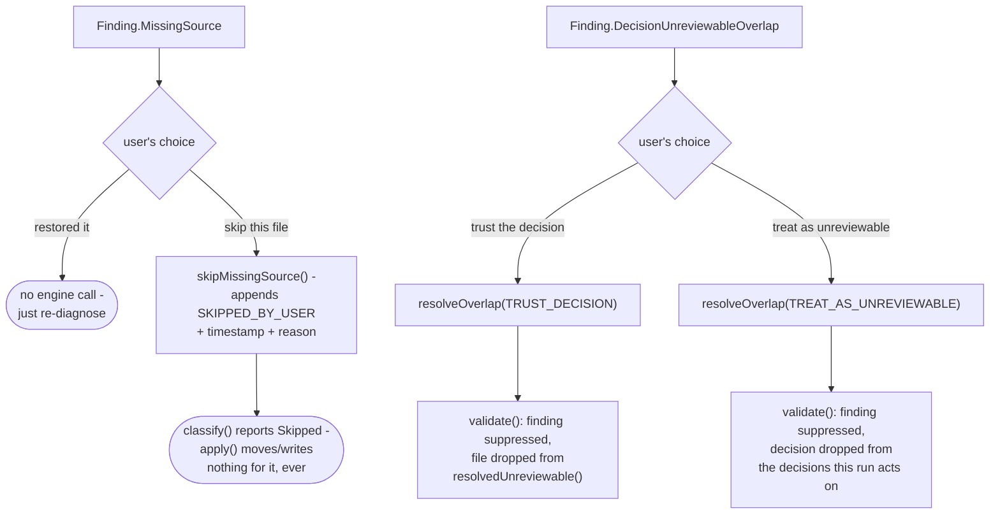
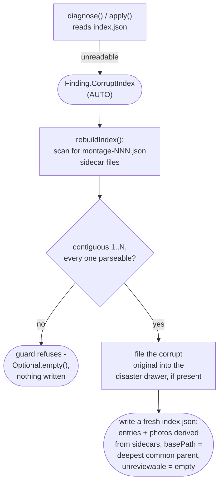
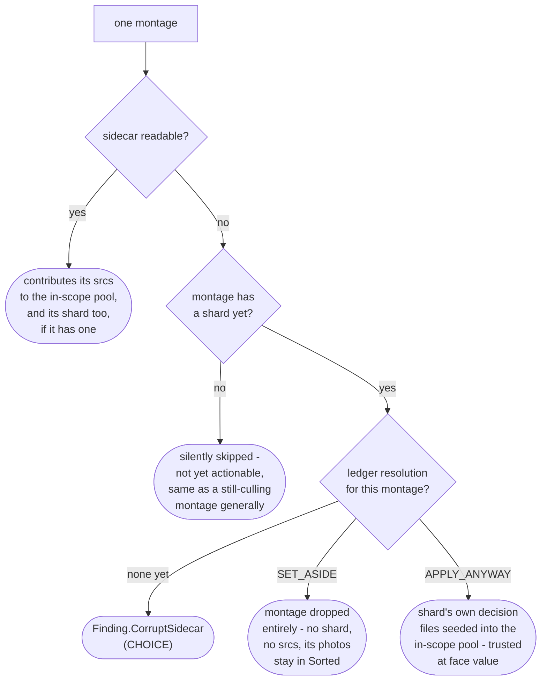

# Prep dir remedies

How `application/service/PrepDirRemedies` repairs a damaged prep directory: the disposition
ledger's CHOICE remedies, a corrupt or missing `index.json`/sidecar, and the last-resort discard
(`app/src/main/java/photos/sluice/application/service/PrepDirRemedies.java`).

Two kinds of remedy live here. An AUTO remedy is non-destructive and provably safe, so a
troubleshooter runs it unprompted. Examples are renaming an unambiguous stray shard into place, or
rebuilding a lost `index.json` from surviving sidecars. A CHOICE remedy costs the user something
(work, money, or an audit trail), so it only ever runs on an explicit decision.

Every CHOICE remedy records itself as a disposition-ledger entry. Neither a shard nor `index.json`
is ever edited. Mutating a culler's own output would destroy the record of what it actually said,
which is exactly what these repairs exist to reason about.

## 1. Disposition ledger and CHOICE remedies

The disposition ledger covers every decision and unreviewable file the shard/`index.json` alone
can't resolve. A witnessed or reconstructed move record is one disposition, held in
`move-records.log` (see `apply-planner.md` and `reconcile-engine.md`). `skipMissingSource()` and
`resolveOverlap()` append two more, each a **CHOICE** remedy a user picks between, never guessed at
automatically. Those land in `choices.log`, the ledger's other half. Neither one ever edits a shard
or `index.json`. Both work by appending a ledger entry that
`ApplyPlanner.validate()`/`classify()` consult on every later read.

The write side of each CHOICE lives here: `skipMissingSource`, `resolveOverlap`,
`resolveCorruptSidecar`. The read side that consults it - suppressing findings and filtering the
decisions and unreviewable files `apply()` acts on - lives in `ApplyPlanner`. See
`apply-planner.md`. `MoveLedger.read()` parses both files into their four dispositions in one
pass; see `move-ledger.md` for the file formats and why the ledger is split in two.

`DecisionUnreviewableOverlap` is `ShardValidator`'s own finding for the narrow
one-decision-plus-one-unreviewable shape. Every other multi-reference shape stays the general
`DuplicateFileReference`, which has no CHOICE remedy. `ApplyPlanner.resolveOverlaps()` resolves
it, a post-processing pass `validate()` runs over `ShardValidator`'s own report. A resolved
finding is suppressed. The losing side never reaches `apply()`: the decision for
`TREAT_AS_UNREVIEWABLE`, or the unreviewable listing for `TRUST_DECISION`.
`ApplyPlanner.resolvedUnreviewable()` is the single place `prepDir.unreviewable()` gets filtered
against a `TRUST_DECISION` resolution. Every caller that needs prepDir's unreviewable list -
`apply()`, `checkMissingSources()`, `reconcile()` - reads through it instead of
`prepDir.unreviewable()` directly.

`Finding.StrayShard` gets a third remedy, this one not ledger-based: `autoRepairStrayShard()`. It
is **AUTO** when it's provably unambiguous. Exactly one montage in the prep dir currently has no
shard. Every file the stray shard's own decisions name is also a member of that one candidate
montage's sidecar. It renames the stray file into place (`decisions-NNN.json` for the candidate
montage) with no ledger entry needed, the rename itself is the fix. Anything else is left
untouched: more than one montage unclaimed, or a decision naming a file the candidate's sidecar
never showed. `setAsideStrayShard()` is the CHOICE fallback for that case. It files the stray
file into the disaster drawer (never a true delete), so the culler can redo that montage from a
clean slate. `Troubleshooter` attempts this AUTO repair for every `StrayShard` finding it sees,
regardless of overall prep-dir state. See `troubleshooter.md`.

## 2. Corrupt or missing index.json / sidecar

This app's own prior output can itself go missing or unreadable in two places. `index.json` (the
prep dir's own summary) is one; a montage's own sidecar (`montage-NNN.json`, its scope evidence)
is the other. Neither is a culling mistake. Both get a remedy here instead of a bare crash.

`rebuildIndex()`'s guard only trusts a *contiguous* montage sequence where *every* sidecar in it
also parses cleanly. A gap or an unparseable sidecar means the sidecars themselves are also
damaged. A silently-smaller rebuilt index would make perfectly healthy shards look stray.

The unreviewable list is genuinely unrecoverable (no sidecar or shard ever names it), so a
rebuilt index always reports it empty. That's a report-line loss, not a safety one, since an
unreviewable file is never moved either way. `basePath` is reconstructed as the deepest common
parent of every surviving sidecar's own `src` files. That's exact for a `Year` scope, an
approximation for `OldestN` narrowed to one year. The field is display-only, though, and no engine
logic ever consults it.

A montage's own sidecar failing to read, with `index.json` itself intact, is a narrower problem:
`Finding.CorruptSidecar` (CHOICE). This per-montage check is `ApplyPlanner.collectMontage()`, run
as part of `validate()`'s own sidecar/shard collection loop. See `apply-planner.md` for that
method; the resolution below is what this class contributes.

`resolveCorruptSidecar()` records the user's choice as one more disposition-ledger entry (the
mechanism from section 1 above, keyed by montage id rather than a file path). It also files the
sidecar itself into the disaster drawer if it's still present, its scope evidence is spent either
way once a choice is made. `SET_ASIDE` means a future cull of the same scope sees those photos
fresh. `APPLY_ANYWAY` means every other safety net (files must exist, categories configured,
cross-shard duplicate check, never-overwrite) still applies. Only the membership cross-check is
skipped.

## 3. Last-resort discard

`discard()` is the remedy for a prep dir mangled beyond every repair above. It gives up on the run
entirely rather than resolving it. Every non-image file (shards, sidecars, `index.json`, the
move-record log, and any disaster drawer, preserving its own relative layout) is moved wholesale
into a global graveyard, `logs/disasters/<scope>-<timestamp>/`. The scope is read straight off the
prep dir's own folder name, never `index.json`. The whole point of this remedy is that
`index.json` (or anything else) might be unreadable. Only the montage/tile contact-sheet images
are truly deleted, cents to re-render on a fresh cull of the same scope. Library media is never
touched. It returns a `DiscardReport` naming the graveyard directory and how many montage decision
shards (`decisions-NNN.json`) were among the files filed there. That lets a caller tell the user
how many already-paid vision-model calls this discard gives up on.

This is the raw, ungated mechanism only. `Pipeline.discard()` gates it on `PrepDirDoctor`
reporting anything but `COMPLETE`. It also retires any watcher polling the prep dir first (an
auto-resume must never fire against a run mid-discard), and wraps it as a `JobRunner` job. Both of
this remedy's entry points - this last-resort CHOICE, and giving up on a still-waiting job - call
that one `Pipeline.discard()` method.

## Scenarios

| Scenario                                                                             | Outcome                                                                            |
|--------------------------------------------------------------------------------------|------------------------------------------------------------------------------------|
| A file listed both as a decision and in index.json's unreviewable list               | Reported as `DecisionUnreviewableOverlap` (CHOICE), not `DuplicateFileReference`   |
| A missing file the user resolved via `skipMissingSource()`                           | Skipped - `apply()` moves/writes nothing for it, ever again                        |
| An overlap resolved `TRUST_DECISION`                                                 | The decision applies normally; the file is no longer treated as unreviewable       |
| An overlap resolved `TREAT_AS_UNREVIEWABLE`                                          | The file moves to `Unreviewable/<yyyy>/<mm>/`; the decision is dropped             |
| A stray shard, exactly one montage unclaimed, decisions match that montage's sidecar | `autoRepairStrayShard()` (AUTO) renames it into place with no user input           |
| A stray shard that can't be assigned unambiguously                                   | Left as a `StrayShard` finding; `setAsideStrayShard()` is the CHOICE fallback      |
| index.json is corrupt or missing, every sidecar contiguous and parseable             | `rebuildIndex()` (AUTO) rebuilds it from the sidecars; original filed if present   |
| index.json is corrupt or missing, a sidecar is also missing or unparseable           | Rebuild guard refuses - `CorruptIndex` finding stays open, no engine remedy left   |
| A montage's sidecar is missing or corrupt, the montage has no shard yet              | Silently skipped - not yet actionable, same as any still-culling montage           |
| A montage's sidecar is missing or corrupt, the montage already has a shard           | `CorruptSidecar` finding (CHOICE)                                                  |
| A `CorruptSidecar` finding resolved `SET_ASIDE`                                      | Montage dropped entirely; its photos stay in `Sorted` for a future cull            |
| A `CorruptSidecar` finding resolved `APPLY_ANYWAY`                                   | Montage's own decisions trusted at face value; membership cross-check skipped      |
| A prep dir mangled beyond every repair above                                         | `discard()` (last-resort CHOICE) graveyards its text artifacts, deletes its images |

## Related

- The shard contract itself, and the auto-heal rule: `ShardValidator`'s own doc comment
  (`domain/cull/ShardValidator.java`).
- The validation and classification that surface every finding resolved here, and that consult
  the ledger entries these remedies write: `apply-planner.md`.
- The move-record log's own file format, markers, and parsing rules: `move-ledger.md`.
- The pipeline that carries decisions out once validation and classification are clean, and its
  own cancellation handling: `apply-engine.md`.
- The offline rebuild this class's `rebuildIndex()` complements, for when the move ledger itself
  (rather than the index) can't be trusted: `reconcile-engine.md`.
- `Pipeline.discard()`'s `PrepDirDoctor`/`JobRunner`/watcher wiring around the raw `discard()`
  mechanism here: `pipeline.md`.
- The single-button recovery that runs `rebuildIndex()`, `autoRepairStrayShard()`, and (via a
  separate reconcile call) resolves a lost move ledger: `troubleshooter.md`.
- Where a repaired decision's file ends up once applied: `CullDestinations`
  (`application/service/CullDestinations.java`), described in `apply-engine.md`.
