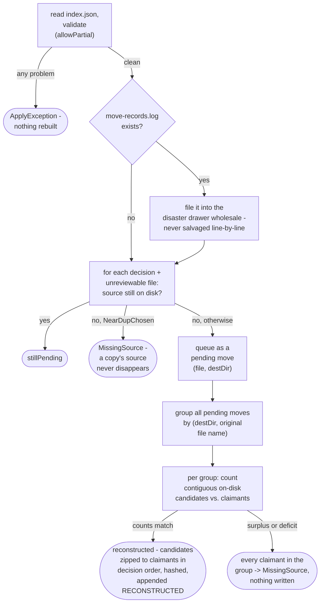

# Reconcile engine

How `application/service/ReconcileEngine` rebuilds a prep directory's move ledger from disk state
alone, for when the ledger itself cannot be trusted
(`app/src/main/java/photos/sluice/application/service/ReconcileEngine.java`).

## 1. Offline reconcile

`reconcile()` exists for when `move-records.log` itself can't be trusted, missing or found
corrupt, while the shard contract is otherwise intact. It first calls `ApplyPlanner.validate()`
(see `apply-planner.md`) to confirm that contract is actually intact before rebuilding anything
from disk. It never salvages a corrupt log line-by-line. Hashes are the ground truth, so the whole
log is re-derived from disk state and the original is filed away for forensics.

The counts-match rule is what keeps a rebuilt record honest. A destination like library `Funny/`
accumulates files across every run this app has ever applied, not just the run being reconciled.
So the on-disk collision candidates for a given (destination, name) pair can outnumber or fall
short of this sweep's own claimants. Reconstruction only happens when the candidate count and
claimant count for a group match exactly. A surplus is a stranger's file holding a slot; a
deficit is the genuinely moved file gone without trace. Either way the group is ambiguous, and
every claimant in it is reported `MissingSource` rather than guessed at. A false refusal costs one
click in a later CHOICE remedy; a false reconstruction would be a permanent, undetectable lie in
the audit trail.

One coincidence this rule cannot catch: a stranger's file can arrive at the exact moment the
genuine file vanishes without trace. Count parity still holds, so it would reconstruct wrongly.
Nothing short of the original file's own hash could tell that case apart from a genuine match.
That hash lived only in the log this repair is replacing. This residual risk is accepted rather
than chased; see `ReconcileEngine.resolvePendingMoves()`'s own Javadoc for the same rule stated
against the code.

Corrupt/missing originals, and every troubleshoot report, are collected the same way. See
`DisasterDrawer`'s own class doc (`application/service/DisasterDrawer.java`) for the filename
format and retention rule. `troubleshooter.md` explains what decides whether this reconcile even
runs.

Destination resolution during the sweep (which folder a decision or unreviewable file would have
been moved into) is `CullDestinations`, the same class a real apply uses. See `apply-engine.md`
for a fuller description. Agreement between the two is what keeps an already-moved file from
looking permanently lost.

## Related

- The shard contract this reconcile validates before rebuilding anything: `apply-planner.md`.
- The move-record log's own file format, and the `RECONSTRUCTED` marker this rebuild appends:
  `move-ledger.md`.
- The pipeline that carries decisions out, and the recorded moves this reconcile rebuilds when
  they're lost: `apply-engine.md`.
- The disposition-ledger CHOICE remedies a `MissingSource` finding from this sweep can still be
  resolved through: `prep-dir-remedies.md`.
- The single-button recovery that decides whether to call this reconcile at all:
  `troubleshooter.md`.
