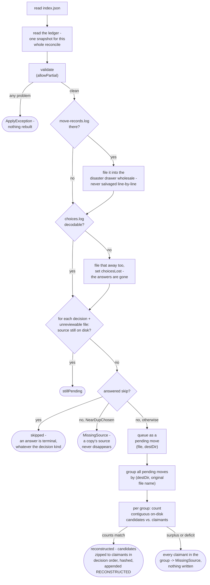

# Reconcile engine

How `application/service/ReconcileEngine` rebuilds a prep directory's move ledger from disk state
alone, for when the ledger itself cannot be trusted
(`app/src/main/java/photos/sluice/application/service/ReconcileEngine.java`).

## 1. Offline reconcile

`reconcile()` exists for when the ledger itself can't be trusted, missing or found corrupt, while
the shard contract is otherwise intact. It reads both ledger files into one snapshot before doing
anything else. That same snapshot is what `validate()` and `resolvedUnreviewable()` both consume.
See [`move-ledger.md`](move-ledger.md) for the ordering rule this follows. It never salvages a
corrupt file line-by-line. Hashes are the ground truth, so the move records are re-derived from disk
state. `move-records.log` itself is filed away for forensics, if it was there at all.

The counts-match rule is what keeps a rebuilt record honest. A destination like library `Funny/`
accumulates files across every run this app has ever applied, not just the run being reconciled.
So the on-disk collision candidates for a given (destination, name) pair can outnumber or fall
short of this sweep's own claimants. Reconstruction only happens when the candidate count and
claimant count for a group match exactly. A surplus is a stranger's file holding a slot; a
deficit is the genuinely moved file gone without trace. Either way the group is ambiguous, and
every claimant in it is reported `MissingSource` rather than guessed at. A false refusal costs one
click in a later CHOICE remedy; a false reconstruction would be a permanent, undetectable lie in
the audit trail.

One coincidence this rule cannot catch: a stranger's file can arrive at the exact moment the
genuine file vanishes without trace. Count parity still holds, so it would reconstruct wrongly.
Nothing short of the original file's own hash could tell that case apart from a genuine match.
That hash lived only in the records this repair is replacing. This residual risk is accepted rather
than chased; see `ReconcileEngine.resolvePendingMoves()`'s own Javadoc for the same rule stated
against the code.

Corrupt/missing originals, and every troubleshoot report, are collected the same way. See
`DisasterDrawer`'s own class doc
(`app/src/main/java/photos/sluice/application/service/DisasterDrawer.java`) for the filename format
and retention rule. [`troubleshooter.md`](troubleshooter.md) explains what decides whether this
reconcile even runs.

Destination resolution during the sweep (which folder a decision or unreviewable file would have
been moved into) is `SiftDestinations`, the same class a real apply uses. See
[`apply-engine.md`](apply-engine.md) for a fuller description. Agreement between the two is what
keeps an already-moved file from looking permanently lost.

A near-dup group's folder is resolved from the group's chosen keeper, never from the specific
member being swept. `reconcile()` builds that group-to-keeper map once, up front, from the same
validated decisions the rest of the sweep already walks. A reject sitting in a different Sorted
month than its keeper still searches the keeper's folder, matching exactly what a real apply would
have done.

## 2. What a rebuild is not allowed to touch

`choices.log` is left exactly where it is. Rebuilding from disk is only honest for evidence disk
can carry, and an answer somebody gave is not that. So a skip, an overlap resolution and a
corrupt-sidecar resolution all survive a reconcile untouched. That holds by construction: the file
is simply not in the rebuild's scope.

A file the user already gave up on is reported `skipped`, never `MissingSource`. An answer is
terminal, and a rebuild is not allowed to un-ask it. The skip outranks the decision kind, so even
a `NearDupChosen` answered this way reports skipped. Existence is still checked first, the same
order applying itself classifies in, so a file given up on and then put back becomes pending again.

The one exception is a `choices.log` whose bytes do not decode. Its answers are already gone,
whatever this run does. So it is filed into the drawer too, and the report carries `choicesLost`
so the loss is stated plainly rather than passed over. Every finding those answers had settled is
raised again for the user to answer afresh. A fresh answer lands in a clean file, because
appending files an undecodable one away first - see [`move-ledger.md`](move-ledger.md).

That disclosure only reaches a returned report, so it covers the lost skips whenever a reconcile
actually runs. Lost overlap and corrupt-sidecar answers surface earlier and by a different route:
`validate()` re-raises their findings, so `reconcile()` throws before any report exists.
`PrepDirDoctor` reads the same re-raised findings, and [`troubleshooter.md`](troubleshooter.md)
explains why that keeps the throw unreachable from the one caller. Either way the user is re-asked.
Only the skip path also gets told why.

Any other read failure is not a lost answer at all. A file locked by a backup or antivirus scanner
still holds every entry it ever did. That case propagates and fails the run, rather than filing
intact answers away. See [`move-ledger.md`](move-ledger.md).

## Related

- The shard contract this reconcile validates before rebuilding anything:
  [`apply-planner.md`](apply-planner.md).
- The move-record log's own file format, and the `RECONSTRUCTED` marker this rebuild appends:
  [`move-ledger.md`](move-ledger.md).
- The pipeline that carries decisions out, and the recorded moves this reconcile rebuilds when
  they're lost: [`apply-engine.md`](apply-engine.md).
- The disposition-ledger CHOICE remedies a `MissingSource` finding from this sweep can still be
  resolved through: [`prep-dir-remedies.md`](prep-dir-remedies.md).
- The single-button recovery that decides whether to call this reconcile at all:
  [`troubleshooter.md`](troubleshooter.md).
