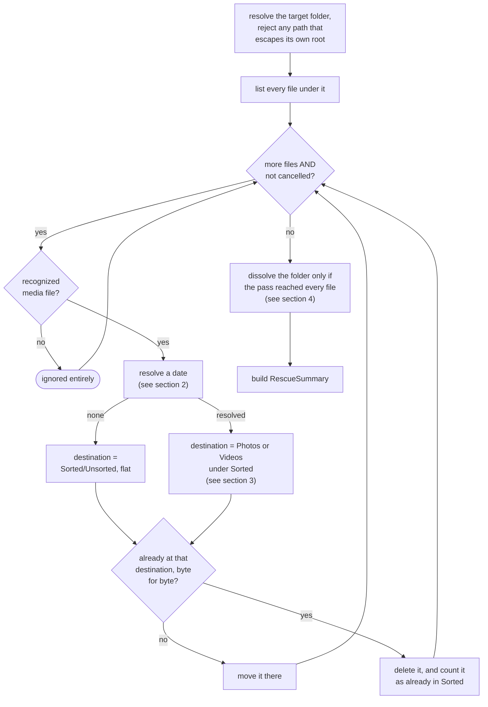
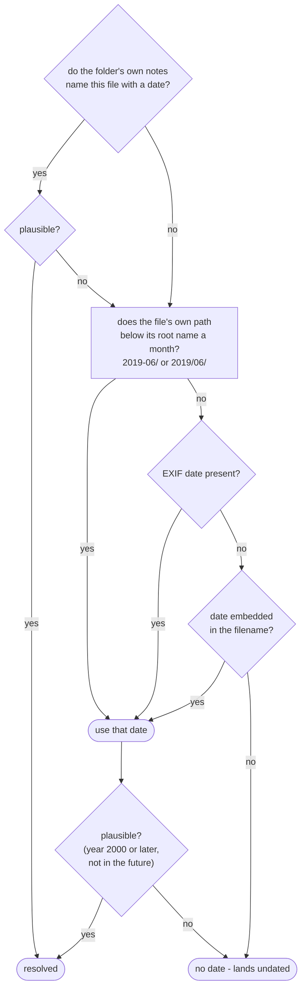
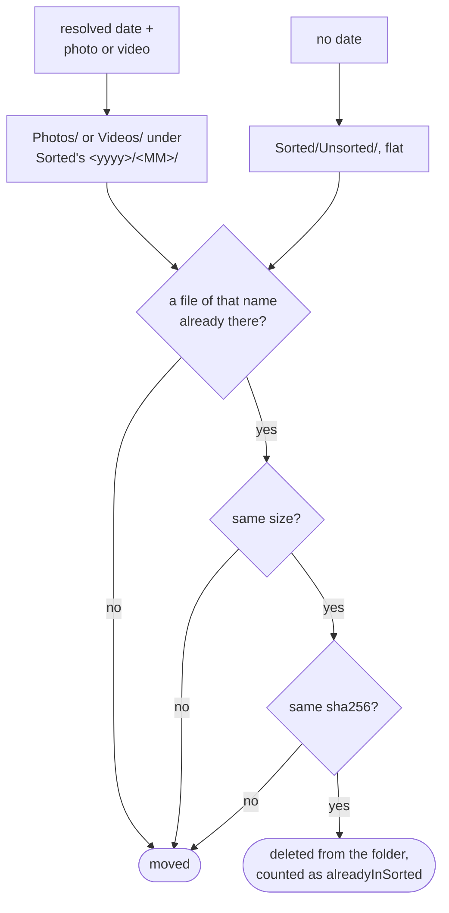
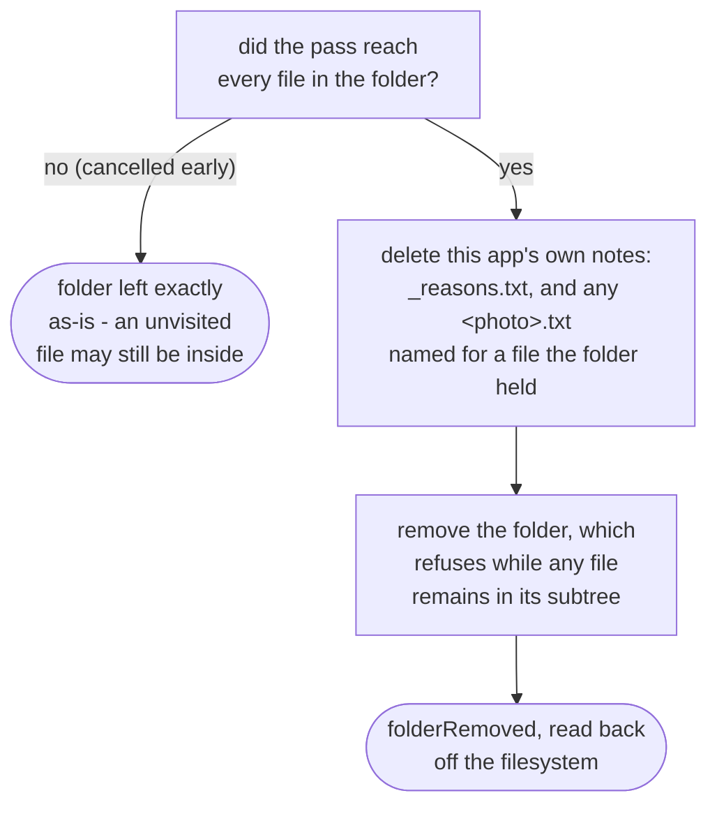

# Rescue engine

How `application/service/RescueEngine` moves the media files still sitting in a waiting folder back
into Sorted, dated via `domain/dating/RescueDateResolver`. Once nothing is left behind, it dissolves
the folder (`app/src/main/java/photos/sluice/application/service/RescueEngine.java`,
`app/src/main/java/photos/sluice/domain/dating/RescueDateResolver.java`).

Three roots hold rescuable folders, named by `application/port/in/RescueRoot`: Review, Unreviewable
and Duplicates. A near-copy group also holds a copy of the photo it kept, whose original never left
Sorted, and section 3 says what becomes of that copy.

## 1. The rescue pipeline

A file that isn't a recognized media type is never moved. Every recognized one moves, dated or not,
so a rescue leaves nothing behind for want of a date. Every `.txt` in the folder is read for the
dates it holds. This app's own notes among them go with the folder, once the pass has reached every
file (section 4). Anything else left in the folder is left exactly as it is.

Cancellation is checked once per file, at the top of the loop. So an in-flight file is never
interrupted, and every file already moved before the request stays moved. A cancelled pass still
returns a `RescueSummary`, just a partial one covering only the files it actually reached.

## 2. Resolving a file's date

Note-first. The note is what this app worked out when it filed the photo, off a chain wider than
anything still readable here. A Takeout sidecar beats EXIF for a sort, and by rescue time that
sidecar is swept. Reading EXIF first would hand back a different month for exactly the photos the
note exists to serve. `domain/review/ReasonNotes` writes and reads those lines. `ApplyEngine` and
`SortEngine` are the two that write them.

Every `.txt` in the folder is read, in filename order, which is what the review screen's own fold
reads. A category folder keeps one `_reasons.txt` naming each photo. A near-copy group keeps one per
group instead, named for the photo that group kept, so taking only `_reasons.txt` would cost every
reject there its month. The group folder's own name cannot stand in for it: that name is built from
the keeper's month, and a group's members can sit in different ones.

A note is text this app tells people to open and weed, so a date read back out of it is input from
outside. Anything unparseable or implausible costs the date and nothing else: the file falls through
to the rest of the chain rather than landing undated. Lines written before dates were recorded name
a photo and a reason only, and fall through the same way.

Any note that cannot be read at all is different, and stops the rescue. Carrying on would file every
photo in the folder under whatever is left to read, which for a category folder is nothing. The pass
would then have reached every file, so section 4 dissolves the folder and deletes the note that held
the answer. That covers bytes that are not text as well, which `MediaReader.readLines` does let a
caller carry on from. `ApplyEngine` does carry on from that one, its own alternative being a
half-finished run rather than a lost month.

Path next, and only then EXIF and the filename. The path is the note's own answer with the day
dropped, and a copy a reader can rename. Two shapes are read. A sort writes `Review/2019-06/`, one
folder per month. A sift writes `Unreviewable/2019/06/`, a year folder holding months. A folder
named for a category (`Food`, `Scenery`, `Unsorted`) names no month and falls through.

There is no fallback to a file's modification time and no Takeout sidecar lookup. A rescue never
fabricates a date. The plausibility check on the last three runs once, against whichever source
actually won, not per source.

## 3. Destination

**Nothing here writes the library hash index, and it must not.** A Sorted path in that index would
make the next sort read an Inbox original as a redundant re-import, and delete it. That is one of
the deletions the safety invariant allows, fired on a false premise. So this engine holds no
`HashIndexPort`. `CommitEngine` writes the index when the same file later reaches the library, which
is where the claim it encodes is true.

**A file already at its destination is deleted rather than moved**, which is another of those
allowed deletions. It is checked against the unsuffixed destination, never against what the store
would resolve a collision to. A ` (2)` beside it is a different photo that wanted the same name, and
answering yes to that would delete a photo nothing else holds. Name, then size, then the hash, each
cheaper than the next, and any one of them failing means the file moves. `Sha256Port` is here for
that last step and for nothing else.

The check is asked of every rescue rather than only a near-copy group's. What it decides is whether
the destination already holds this exact file, which is worth the same answer wherever it is asked.
Somebody who put a photo back into Sorted by hand reaches it too. A version switching on the root
would carry a branch that rots.

The undated folder is reachable by `commit unsorted` and by `commit all`, and by no year scope, its
files carrying no year for one to match.

## 4. Dissolving the folder

All-or-nothing per folder, not per file. A cancelled run with unvisited media still in the folder
must not delete the notes, which is what the reach-every-file check is for.

Two shapes are deleted, because two things write one. A sort and a sift both append to
`_reasons.txt`. A sift also writes one note per near-copy group, named for the photo that group
kept, so `IMG_1.jpg` in the folder means `IMG_1.jpg.txt` is its note. Every other `.txt` is left
where it is. This is a folder people are told to open and weed, so one of them may have put their
own notes in it. That makes the deleting set narrower than the reading set in section 2, which takes
every `.txt`.

A pass that reached every file can still leave the folder standing. `removeIfEmptyOfFiles` refuses
while anything remains in the subtree, and a file that is not media is exactly that. So
`folderRemoved` is read back off the filesystem rather than assumed from the loop.

## Scenarios

| Scenario                                                           | Outcome                                                      |
|--------------------------------------------------------------------|--------------------------------------------------------------|
| Folder named `Food`, the note dates the file                       | Note wins - dated `Sorted/Photos` under the month it names   |
| Folder named `2019-06`, the note dates the file as `2020-08`       | Note wins over the folder's own name                         |
| Near-copy group, its reject listed in `<keeper>.txt` with a month  | That month wins, not the month the group folder is named for |
| The note names the file with no date, or names another file        | Falls through to the path, then EXIF, then the filename      |
| The note's date is unparseable or implausible                      | Falls through the same way - the note costs nothing else     |
| A note cannot be read: locked, denied or its bytes are not text    | The rescue stops, having moved nothing in that folder        |
| Folder named `2019-06`, file has no note, EXIF or filename date    | Path wins - dated `Sorted/Photos/2019/06`                    |
| Folder `2019/06` under Unreviewable, file has no note or EXIF      | Path wins - dated `Sorted/Photos/2019/06`                    |
| Folder named `Food`, file has an EXIF date and no note             | EXIF wins (no month in the path to short-circuit with)       |
| Folder named `Food`, file has none of the four                     | Moved to `Sorted/Unsorted`, counted as undated               |
| Resolved date is from 1998 (path, EXIF, or filename)               | Rejected as implausible - moved to `Sorted/Unsorted`         |
| Near-copy group's copy of the kept photo, original still in Sorted | Deleted, counted as `alreadyInSorted` - nothing is moved     |
| Destination holds that name at another size, or another hash       | Moved, landing beside it as a ` (2)`                         |
| Every file in the folder moved                                     | Folder, and this app's own notes in it, removed entirely     |
| A `.txt` the reader wrote themselves is left in the folder         | Kept, and the folder with it - `folderRemoved` false         |
| A file that is not media is left in the folder                     | Folder kept, `folderRemoved` false                           |
| `folder` argument tries to escape its root (e.g. `../Sorted`)      | Rejected before anything is read                             |
| `folder` argument resolves to the root itself                      | Rejected before anything is read                             |
| Cancellation requested mid-pass                                    | Pass stops; folder kept - it never reached every file        |
| Cancellation requested after the pass already reached every file   | Dissolves normally - cancellation arrived too late to matter |

## Related

- How a caller invokes this engine asynchronously with progress reporting:
  [`pipeline.md`](pipeline.md) in this same design folder.
- The filesystem effect backing folder dissolution (`removeIfEmptyOfFiles`, and its sibling
  `removeEmptyDirectories`): [`media-store.md`](../../adapter/fs/media-store.md) in the `adapter/fs`
  design folder.
