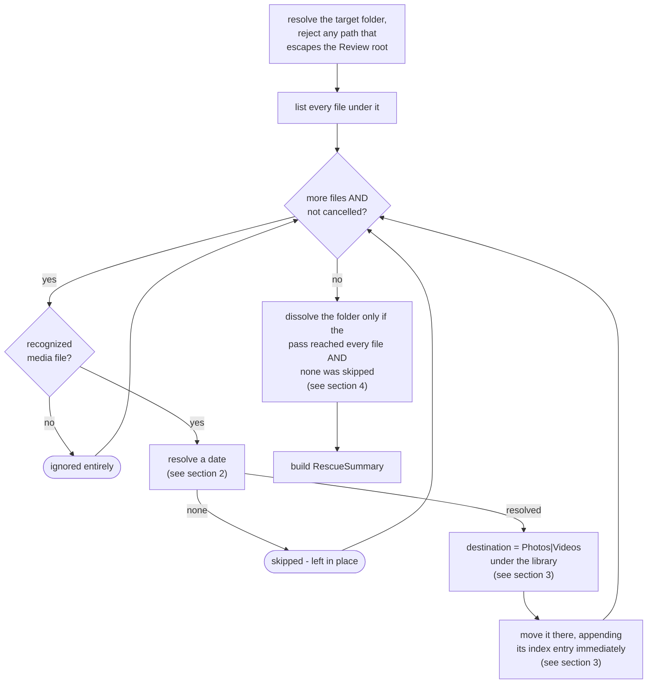
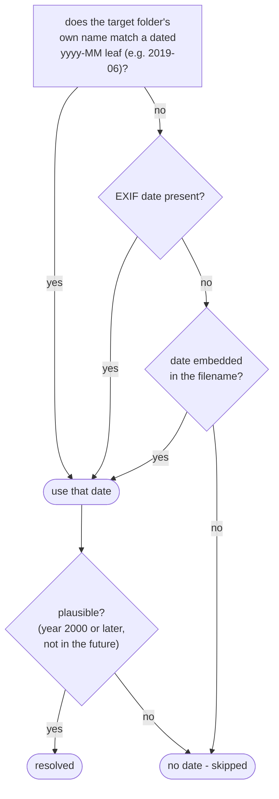
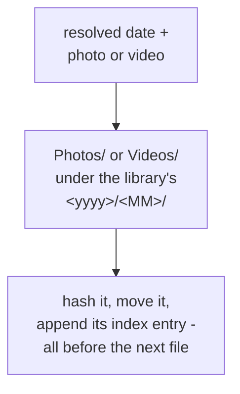
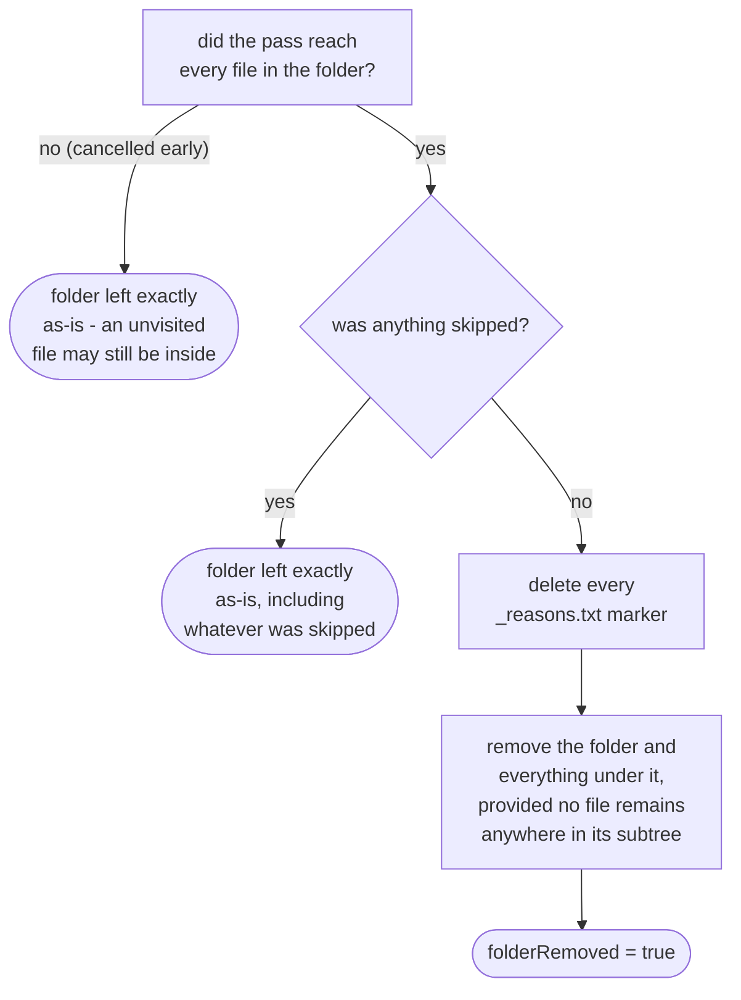

# Rescue engine

How `application/service/RescueEngine` promotes the media files still sitting in a Review folder
into the library, re-dated via `domain/dating/RescueDateResolver`. Once nothing is left behind, it
dissolves the folder (`app/src/main/java/photos/sluice/application/service/RescueEngine.java`,
`app/src/main/java/photos/sluice/domain/dating/RescueDateResolver.java`).

## 1. The rescue pipeline

A file that isn't a recognized media type (a stray `_reasons.txt`, or anything else left in the
folder) is never touched. It's not rescued, and not counted as skipped. Only a real media file
that has no resolvable date is skipped.

Cancellation is checked once per file, at the top of the loop. So an in-flight file is never
interrupted, and every file already rescued before the request stays rescued. A cancelled pass
still returns a `RescueSummary`, just a partial one covering only the files it actually reached.

## 2. Resolving a file's date

Folder-first, not last. A folder whose own name already carries a year and month (`Food`,
`Scenery`, and `Unsorted` don't) is a more trustworthy signal than EXIF or the filename. That's
why it short-circuits both when it matches. There is no fallback to a file's modification time and
no Takeout sidecar lookup. A rescue never fabricates a date, and by the time a file reaches Review
its sidecar is long gone. The plausibility check runs once, against whichever source actually won,
not per source.

## 3. Destination and the hash index

The whole pass shares one `HashIndexPort.Session`, but the index append itself happens immediately
per rescued file, not batched until the end. A crash (or a cancellation) mid-run never leaves an
already-moved file with no index row.

## 4. Dissolving the folder

This is all-or-nothing per folder, not per file. A single skipped file anywhere in the tree keeps
the whole folder - and every other file still in it - untouched. Checking "nothing was skipped"
alone isn't enough once a pass can stop early on cancellation. A cancelled run with zero skips so
far would otherwise delete the `_reasons.txt` markers while unvisited media still sits in the
folder. Dissolving now requires both - the pass reached every file, and none of them were skipped.

## Scenarios

| Scenario                                                                   | Outcome                                                      |
|----------------------------------------------------------------------------|--------------------------------------------------------------|
| Folder named `2019-06`, file has no EXIF or filename date                  | Folder name wins - dated `2019/06`                           |
| Folder named `Food`, file has an EXIF date                                 | EXIF wins (no folder name to short-circuit with)             |
| Folder named `Food`, file has neither EXIF nor a filename date             | Skipped, left in place                                       |
| Resolved date is from 1998 (folder, EXIF, or filename)                     | Rejected as implausible - skipped                            |
| Every file in the folder rescued, no skips                                 | Folder (and any `_reasons.txt`) removed entirely             |
| One file in the folder skipped                                             | Folder kept, including every other file already rescued      |
| `reviewFolder` argument tries to escape the Review root (e.g. `../Sorted`) | Rejected before anything is read                             |
| Cancellation requested mid-pass, zero files skipped so far                 | Pass stops; folder kept - it never reached every file        |
| Cancellation requested after the pass already reached every file           | Dissolves normally - cancellation arrived too late to matter |

## Related

- How a caller invokes this engine asynchronously with progress reporting: `pipeline.md` in this
  same design folder.
- The filesystem effect backing folder dissolution (`removeIfEmptyOfFiles`, and its sibling
  `removeEmptyDirectories`): `media-store.md` in the `adapter/fs` design folder.
