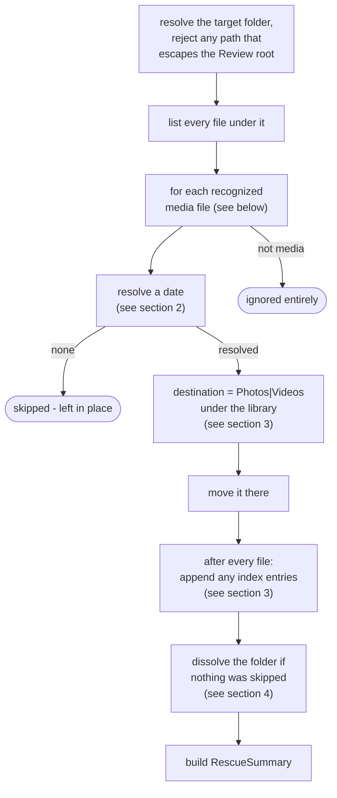
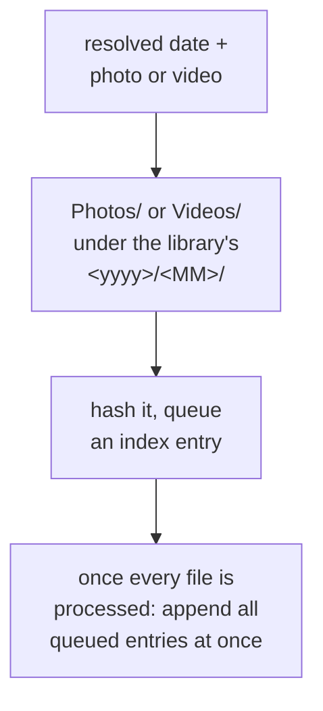
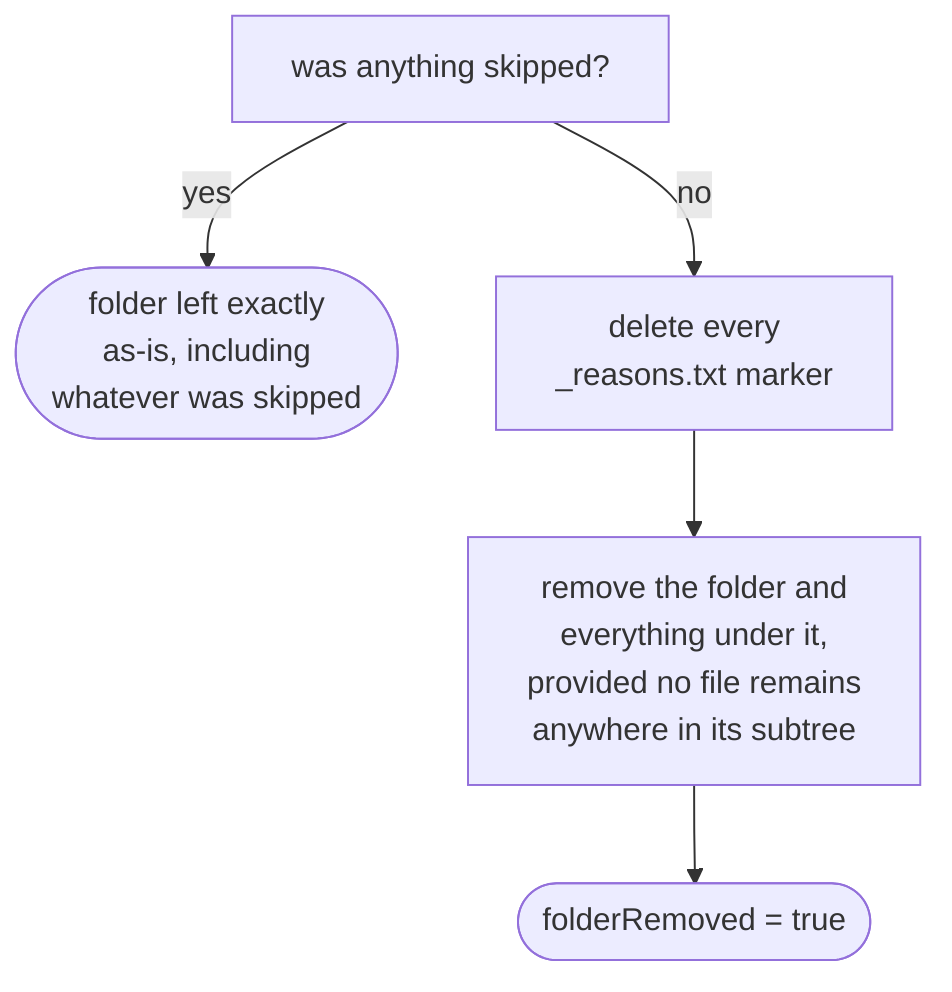

# Rescue engine

How `application/service/RescueEngine` promotes the media files still sitting in a Review folder
into the library, re-dated via `domain/dating/RescueDateResolver`, then dissolves the folder once
nothing is left behind
(`app/src/main/java/photos/sluice/application/service/RescueEngine.java`,
`app/src/main/java/photos/sluice/domain/dating/RescueDateResolver.java`).

## 1. The rescue pipeline

A file that isn't a recognized media type (a stray `_reasons.txt`, or anything else left in the
folder) is never touched - not rescued, not counted as skipped. Only a real media file that has no
resolvable date is skipped.

## 2. Resolving a file's date

Folder-first, not last: a folder whose own name already carries a year and month (`Food`,
`Scenery`, and `Unsorted` don't) is a more trustworthy signal than re-deriving one from just EXIF
and the filename, so it short-circuits both when it matches. There is no fallback to a file's
modification time and no Takeout sidecar lookup - a rescue never fabricates a date, and by the time
a file reaches Review its sidecar is long gone. The plausibility check runs once, against whichever
source actually won, not per source.

## 3. Destination and the hash index

The index append is a single batched call after the whole folder has been walked, not one call per
file.

## 4. Dissolving the folder

This is all-or-nothing per folder, not per file: a single skipped file anywhere in the tree keeps
the whole folder - and every other file still in it - untouched. Only once every file the run
looked at was actually rescued does cleanup run at all.

## Scenarios

| Scenario                                                                   | Outcome                                                 |
|----------------------------------------------------------------------------|---------------------------------------------------------|
| Folder named `2019-06`, file has no EXIF or filename date                  | Folder name wins - dated `2019/06`                      |
| Folder named `Food`, file has an EXIF date                                 | EXIF wins (no folder name to short-circuit with)        |
| Folder named `Food`, file has neither EXIF nor a filename date             | Skipped, left in place                                  |
| Resolved date is from 1998 (folder, EXIF, or filename)                     | Rejected as implausible - skipped                       |
| Every file in the folder rescued, no skips                                 | Folder (and any `_reasons.txt`) removed entirely        |
| One file in the folder skipped                                             | Folder kept, including every other file already rescued |
| `reviewFolder` argument tries to escape the Review root (e.g. `../Sorted`) | Rejected before anything is read                        |

## Related

- How a caller invokes this engine asynchronously with progress reporting: `pipeline.md` in this
  same design folder.
- The filesystem effect backing folder dissolution (`removeIfEmptyOfFiles`, and its sibling
  `removeEmptyDirectories`): `media-store.md` in the `adapter/fs` design folder.
