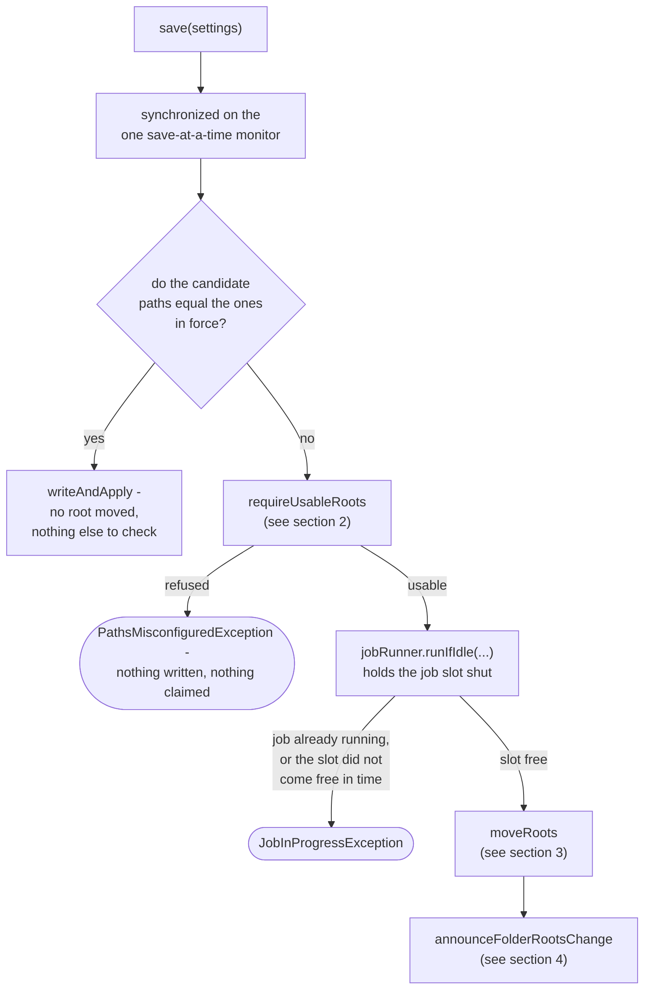
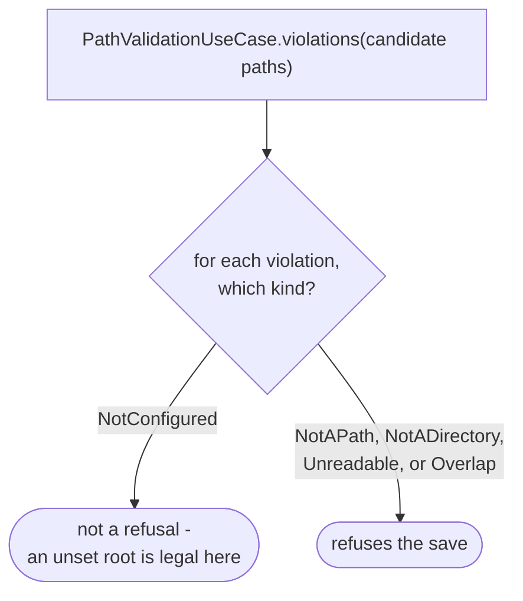
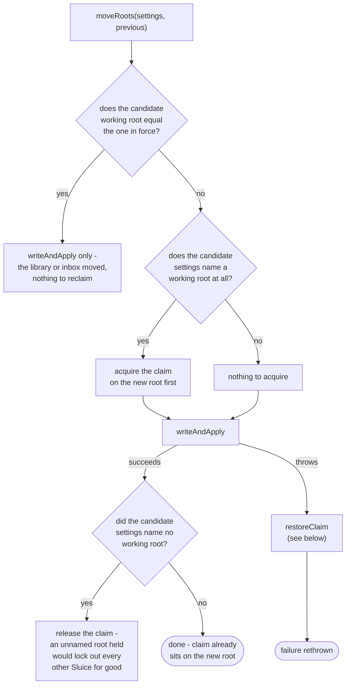

# Settings service

How `application/service/SettingsService` saves settings: claim, write, then put in force
(`app/src/main/java/photos/sluice/application/service/SettingsService.java`). The order is what the
class is for. Claiming a moved working root before anything is written refuses a folder another
Sluice already has open, leaving the app exactly as it was. Writing before putting the new values in
force means the app never runs on settings that failed to reach disk.

## 1. How one save works

`requireUsableRoots` runs before the job slot rather than inside it, because it reads directories. A
folder root on a stalled mount would otherwise cost every concurrent `Pipeline` caller its own wait
on the slot. That wait would end in a refusal it did nothing to deserve. It still runs under the save
monitor, which no save can avoid - working out what changed means reading the settings in force.
So a stalled root holds up the next save. That is one caller paying the cost, not every job in the
process.

Two refusals can be due at once: a job is running, and the candidate roots are also unusable. The
path refusal wins. It names a value the user can go and correct, and it answers the same way however
long the job takes. Whether a job happened to be running is neither.

Only a save that moves a folder root reaches any of this. A save that changes a category or a grid
leaves every root exactly where it found it. It takes the `C -- yes` branch straight to
`writeAndApply`, with no job-slot wait and no lock touched at all.

## 2. Which violations refuse a save

Not the same admission rule `RootsGuard` runs for every `Pipeline` entry point (see `pipeline.md`).
A root that is set to somewhere unusable is refused, but an unset root is legal here. An install
still choosing its three folders one picker at a time must be able to save each choice as it makes
it.

The switch enumerates every `PathViolation` case rather than testing for the one that passes. A
fifth kind of violation then fails to compile here until somebody says which side of the line it
falls on.

## 3. Moving the claim with the root

The claim moves before the write, not after. A write that then fails still leaves this process
holding the new root. `restoreClaim` puts that right: it re-acquires whatever root the settings still
in force actually name, or releases outright when that answer is "none". Whatever goes wrong while
restoring is reported as a suppressed exception on the save failure already on its way out, never in
place of it.

Re-acquiring is a fresh claim rather than a rollback, and it can be refused. `acquire` gives the old
root up as soon as it has taken the new one, so the old root sits unheld for the whole of the write.
Another process starting up, or saving into that same root, can take it in that gap. The restore is
then refused, and this process ends up holding neither root. It keeps running, with the settings in
force naming a folder whose claim it has given up. Nothing re-tries it and nothing says so.

Giving the claim up is the deliberate half. Holding the new root instead would lock a folder nothing
names for the life of the process, which is worse. What the loss costs is bounded by what the claim
is worth. `WorkingRootLock` documents itself as a convenience rather than a safety device, and a CLI
process never takes a claim at all. So the app continues in the state the command line runs in by
design.

Whether it should instead notice it holds nothing, say so, and offer to take the root back is open.
Nothing does any of that today, and nobody has ruled on whether it should.

## 4. Telling folder-roots listeners

Runs with the job slot still held shut by `runIfIdle`, which is what makes it worth the delay it
costs every waiting `Pipeline` caller. A listener re-arms watchers, and arming is skipped while a job
runs. Announced after the slot went free instead, a watcher armed under the old root could take that
slot in the gap. The re-arm would then silently do nothing for the life of the process.

Each listener is called inside its own `try`/`catch (Throwable)`. A listener that throws would
otherwise report a save that has already reached disk as a failed one. The port's own documented
contract is "report your own failures". Catching it here is what makes that true even of a listener
that gets it wrong, rather than merely instructing one not to. `Throwable` rather than
`RuntimeException` because a listener walks directory trees, the same hazard `JobRunner` already
treats as a real outcome. Only the hazard is borrowed, not the handling. There is no caller's future
left to forward an `Error` to here, so a log line is the whole remedy.

## Scenarios

| Scenario                                                             | Outcome                                                                          |
|----------------------------------------------------------------------|----------------------------------------------------------------------------------|
| Candidate paths equal the settings in force                          | `writeAndApply` only - no job-slot wait, no root check, no lock touched          |
| A category or grid setting changes, every folder root stays the same | Same as above - only a root move reaches the checks below                        |
| A candidate root is left unset                                       | Legal - `NotConfigured` does not refuse a save                                   |
| A candidate root names a path that does not exist                    | `PathsMisconfiguredException`, nothing written or claimed                        |
| Two candidate roots would overlap                                    | `PathsMisconfiguredException`, nothing written or claimed                        |
| The roots are usable and a job is currently running                  | `JobInProgressException` once the job-slot wait runs out                         |
| The roots are unusable and a job is currently running                | `PathsMisconfiguredException` - the path refusal is checked first and wins       |
| The working root moves to a folder no other Sluice holds             | Claim acquired on the new root before the write, released nowhere                |
| The working root moves and the write then fails                      | Claim restored onto whatever root the settings still in force name, or released  |
| The write fails, and another process took the old root in the gap    | Restore refused; neither root is held, and the app keeps running unclaimed       |
| The settings name no working root where the previous ones did        | Write succeeds, then the claim is released - nothing should hold that folder now |
| Only the library or inbox root moves, the working root does not      | No claim work at all - `writeAndApply` runs directly inside `moveRoots`          |
| A folder-roots listener throws after the save reached disk           | Logged as a warning; the save is still reported as successful                    |

## Related

- `RootsGuard`/`PathValidationUseCase`'s other admission rule, run for every `Pipeline` entry point
  instead of a save: `pipeline.md` in this same design folder.
- `PathValidationUseCase`'s own implementation, `PathValidationService`, and the domain rule it
  defers to: `path-validation-service.md` in this same design folder.
- `JobRunner.runIfIdle`, the bounded job-slot wait this save holds shut: no dedicated design doc yet
  - see the source file directly.
- `WorkingRootLock`, the port `acquire`/`release` claim against: see the source file directly.
