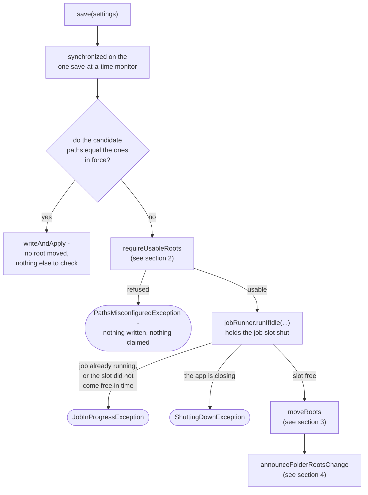
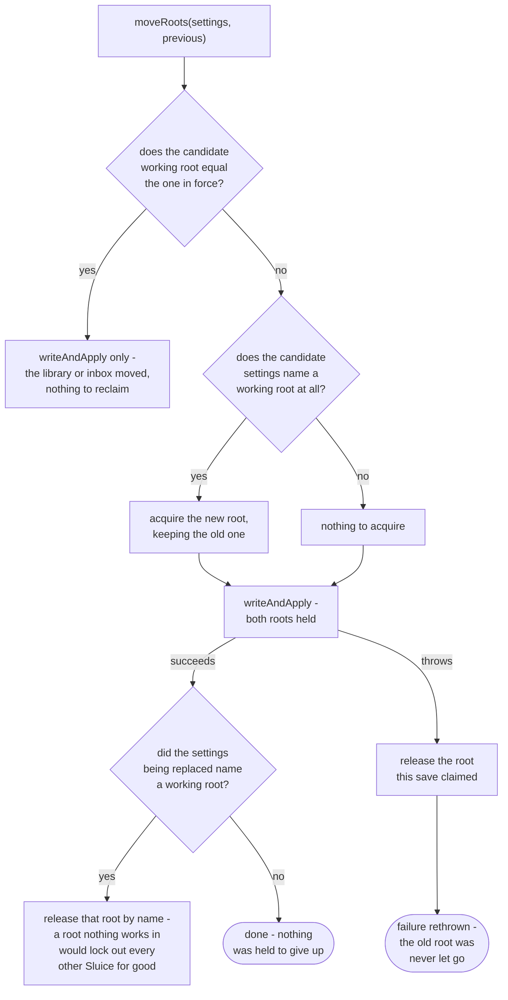

# Settings service

How `application/service/SettingsService` saves settings: claim, write, then put in force
(`app/src/main/java/photos/sluice/application/service/SettingsService.java`). The order is what the
class is for. Claiming a moved working root before anything is written refuses a folder another
Sluice already has open, leaving the app exactly as it was. Writing before putting the new values in
force means the app never runs on settings that failed to reach disk.

## 1. How one save works

Only a save that moves a folder root can meet `ShuttingDownException`, because only that save asks
the job runner for anything. A save changing a category or a grid takes the `C -- yes` branch and
still goes through while the app is closing. Nothing it touches outlives the process.

`requireUsableRoots` runs before the job slot rather than inside it, because it reads directories. A
folder root on a stalled mount would otherwise cost every concurrent `Pipeline` caller its own wait
on the slot. That wait would end in a refusal it did nothing to deserve. It still runs under the save
monitor, which no save can avoid - working out what changed means reading the settings in force.
So a stalled root holds up the next save. That is one caller paying the cost, not every job in the
process.

Two refusals can be due at once: a job is running, and the candidate roots are also unusable. The
path refusal wins. It names a value the user can go and correct, and it answers the same way however
long the job takes. Whether a job happened to be running is neither.

Only a save that moves a folder root reaches any of this. A save that changes a category or a grid
leaves every root exactly where it found it. It takes the `C -- yes` branch straight to
`writeAndApply`, with no job-slot wait and no lock touched at all.

## 2. Which violations refuse a save

Not the same admission rule `RootsGuard` runs for every `Pipeline` entry point (see `pipeline.md`).
A root that is set to somewhere unusable is refused, but an unset root is legal here. An install
still choosing its three folders one picker at a time must be able to save each choice as it makes
it.

The switch enumerates every `PathViolation` case rather than testing for the one that passes. A
fifth kind of violation then fails to compile here until somebody says which side of the line it
falls on.

## 3. Moving the claim with the root

Both roots are held across the write. The new one is claimed first, the old one is given up by name
only once the write has succeeded. So there is no moment where this process has stopped holding the
root its own settings still name.

That is what makes a failed save cost nothing. Nothing has to be taken back, so nothing can be
refused: the only claim to undo is the one this save itself took. Another process cannot slip into a
gap and leave this one holding neither root, because there is no gap. A refusal to give up the new
claim is reported as a suppressed exception on the save failure already on its way out, never in
place of it.

The release on the success path is the mirror of that, and it cannot fail the save either. The
settings have reached disk and are in force by then. Reporting a failure would tell the caller
something untrue and leave it no step to retry. It would also skip the listeners below, leaving
watchers armed for a root the app has moved off. So a refusal there is logged and the save stands.

One case is knowingly outside all of this: renaming or deleting a claimed folder on disk while the
claim is live. The lock recognises a root by the path it resolves to, so one moved out from under
its claim stops matching it. That claim is then held until the process ends.
`FileChannelWorkingRootLock` records the cost where it keeps those claims.

The reverse case is handled rather than accepted. Two paths this service reads as different roots can
be one folder to the lock, which resolves symlinks and junctions where this service only normalises.
A save between two such spellings acquires and releases what it believes are two roots. The lock
counts holders per folder, so a process that already held the root it is moving off still holds it
afterwards.

That balance depends on the process having a holder to start with. One acquire and one release over
one claim net out, so a save from zero holders ends at zero, and this service alone cannot do
otherwise. What supplies the holder is startup. `StartupSequence` claims the working root whenever
that root itself is usable, gated on it alone rather than on all three. An install still choosing
its library or inbox therefore holds the folder it stages in, and an aliased save from it keeps that
hold.

Two processes still reach the zero-holder case, and neither loses protection it had. A command line
holds nothing on the way in, having no startup sequence to claim in: the save below is the first
thing that claims anything. A desktop whose working root was unusable at boot never claimed one, and
stays at zero across every save that leaves the working root alone. If that root becomes
usable and a later save re-spells it to an alias while the process still holds nothing, that save
ends with the folder unheld. The session was already running unclaimed, so nothing is taken away.
Recorded rather than closed. Closing it would mean this service knowing which two paths are one
folder, and that is the lock's job rather than something a caller can ask it.

A third way to hold nothing does not reach here at all. A startup claim that was refused, or that
failed opening its marker, leaves the desktop on its failure screen rather than its main window. No
settings save follows it in that session.

## 4. Telling folder-roots listeners

Runs with the job slot still held shut by `runIfIdle`, which is what makes it worth the delay it
costs every waiting `Pipeline` caller. A listener re-arms watchers, and arming is skipped while a job
runs. Announced after the slot went free instead, a watcher armed under the old root could take that
slot in the gap. The re-arm would then silently do nothing for the life of the process.

Each listener is called inside its own `try`/`catch (Throwable)`. A listener that throws would
otherwise report a save that has already reached disk as a failed one. The port's own documented
contract is "report your own failures". Catching it here is what makes that true even of a listener
that gets it wrong, rather than merely instructing one not to. `Throwable` rather than
`RuntimeException` because a listener walks directory trees, the same hazard `JobRunner` already
treats as a real outcome. Only the hazard is borrowed, not the handling. There is no caller's future
left to forward an `Error` to here, so a log line is the whole remedy.

## Scenarios

| Scenario                                                             | Outcome                                                                      |
|----------------------------------------------------------------------|------------------------------------------------------------------------------|
| Candidate paths equal the settings in force                          | `writeAndApply` only - no job-slot wait, no root check, no lock touched      |
| A category or grid setting changes, every folder root stays the same | Same as above - only a root move reaches the checks below                    |
| A candidate root is left unset                                       | Legal - `NotConfigured` does not refuse a save                               |
| A candidate root names a path that does not exist                    | `PathsMisconfiguredException`, nothing written or claimed                    |
| Two candidate roots would overlap                                    | `PathsMisconfiguredException`, nothing written or claimed                    |
| The roots are usable and a job is currently running                  | `JobInProgressException` once the job-slot wait runs out                     |
| A folder root moves while the app is closing                         | `ShuttingDownException` - nothing written, nothing claimed                   |
| A category or grid changes while the app is closing                  | Saved - it never asks the job runner, so nothing refuses it                  |
| The roots are unusable and a job is currently running                | `PathsMisconfiguredException` - the path refusal is checked first and wins   |
| The working root moves to a folder no other Sluice holds             | Both roots held across the write, then the old one released by name          |
| The working root moves and the write then fails                      | Only the claim this save took is released; the old root was never let go     |
| The write fails, and the release of the new claim is refused too     | Reported as a suppressed exception on the save failure, never in place of it |
| The settings name no working root where the previous ones did        | Write succeeds, then the old claim is released - nothing should hold it now  |
| Releasing the old root is refused after the write succeeded          | Logged as a warning; the save stands and the listeners still run             |
| Only the library or inbox root moves, the working root does not      | No claim work at all - `writeAndApply` runs directly inside `moveRoots`      |
| A folder-roots listener throws after the save reached disk           | Logged as a warning; the save is still reported as successful                |

## Related

- `RootsGuard`/`PathValidationUseCase`'s other admission rule, run for every `Pipeline` entry point
  instead of a save: `pipeline.md` in this same design folder.
- `PathValidationUseCase`'s own implementation, `PathValidationService`, and the domain rule it
  defers to: `path-validation-service.md` in this same design folder.
- `JobRunner.runIfIdle`, the bounded job-slot wait this save holds shut: no dedicated design doc yet
  - see the source file directly.
- `WorkingRootLock`, the port `acquire`/`release` claim against: see the source file directly.
