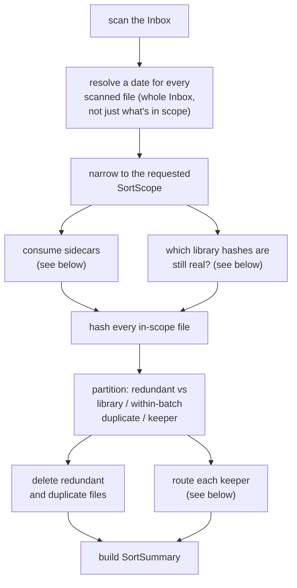
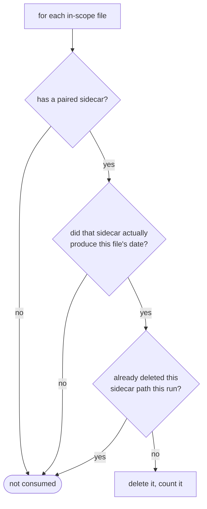
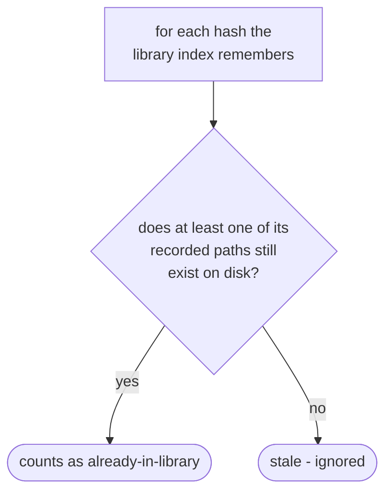
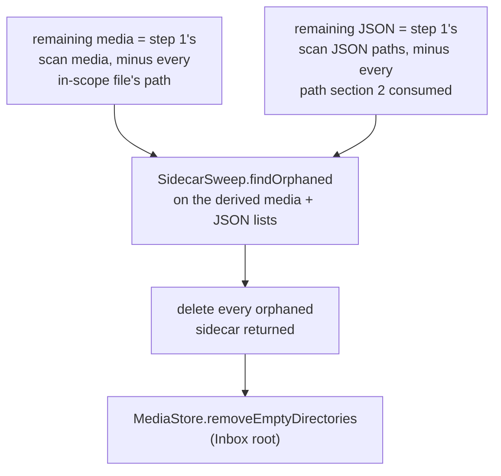
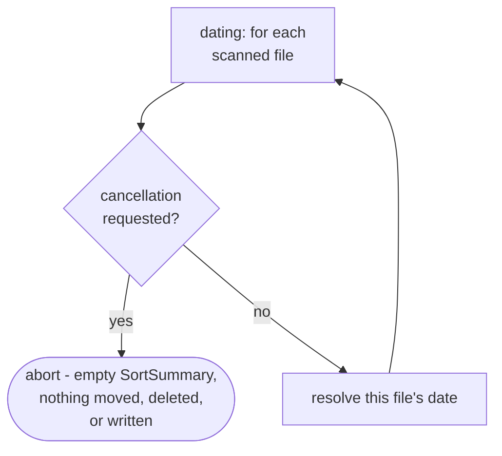
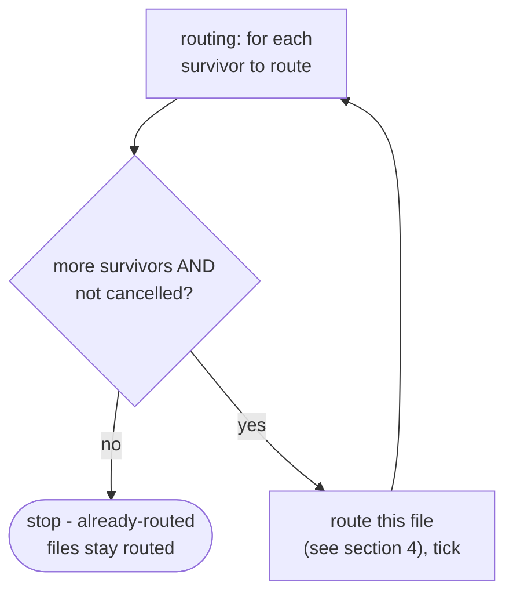

# Sort engine

How `application/service/SortEngine` turns a scan of the Inbox into a `SortSummary`, moving each
file to `Sorted/` or `Review/` along the way
(`app/src/main/java/photos/sluice/application/service/SortEngine.java`).

## 1. The one-pass pipeline

Every scanned file is dated before the scope narrows anything. `OldestYear`/`OldestN` need to
compare dates across the *whole* Inbox to pick the right subset, so dating only the
already-narrowed files would pick the wrong ones. Sidecar consumption and the library-hash check
are independent of each other, and of the dedup partition that follows. Nothing here depends on
which of the three dedup buckets a file eventually lands in.

## 2. Consuming a sidecar

A sidecar that exists but lost the date-resolution race - invalid content, or a coincidentally
name-matched but unrelated JSON file - is left alone. Only a sidecar that was actually read as
real metadata gets consumed. The "already deleted?" check exists because an edited copy of a photo
shares its original's sidecar. Both files can be in scope at once, and both resolve their date
from the same JSON path. It must be deleted, and counted, exactly once - not once per file that
points at it.

## 3. Which library hashes still count as "real"

The library lives outside this process's control - it can be resynced, moved, or pruned
independently. A stale index entry pointing at a since-vanished file must never cause an
otherwise-unique Inbox file to be deleted as a false duplicate. Only a hash with at least one
surviving copy can safely delete its Inbox twin.

## 4. Routing a keeper

Checked in this order and only this order. An undatable file is routed away before anything else
looks at it - "which folder does this date belong in" is meaningless without a usable date. The
low-res gate only ever runs on a file that already cleared that check. A "reason noted" move also
appends a line (`"<filename> - <reason>"`) to a `_reasons.txt` file in the destination folder.

## 5. Post-run sweep

Runs once, after every keeper has been routed:

This is independent of section 2's per-file consumption - that mechanism only spends a sidecar
whose date actually won for its file. The sweep instead catches every other spent sidecar too.
That includes unmatched ones, and ones whose media left via a different branch (sorted, or deleted
as a duplicate) than the one that would have consumed their sidecar inline. This is what keeps
sidecars from piling up across incremental year-by-year runs. `SortSummary.sidecarsDeleted` is not
incremented here - only section 2's inline consumption counts toward it.

"Remaining" is derived from step 1's original scan, not observed directly. `dedup.plan`'s three
buckets (section 1) are a total partition of every in-scope file, and each bucket is either moved
or deleted before the sweep runs. So every in-scope file is guaranteed to have left the Inbox
already, and step 1's original scan lists minus what this run itself removed already describe
what's left.

## 6. Cancellation

Checked twice, once per pass, at different granularities. Dating spans the whole Inbox and is pure
in-memory computation. A cancellation there is a clean abort with zero side effects - an empty
`SortSummary` comes back before anything moves, deletes, or writes. Routing spans only the in-scope
survivors and does real file-system work per item (a move, sometimes a `_reasons.txt` append). A
cancellation there stops after whichever file is currently in flight, leaving every already-routed
file routed.

A cancelled routing pass changes what "left the Inbox this run" means. `RoutingResult.routedFiles`
tracks only the survivors actually routed before the stop. `actuallyRemoved` - used for both
`SortSummary.processed` and the post-run sweep above - is built from that, plus the two dedup
buckets, rather than the full in-scope list. Section 2's sidecar consumption runs after routing and
is scoped the same way, so a not-yet-routed file's sidecar is never deleted out from under it while
the file itself still sits in the Inbox awaiting a future run.

The dedup-deletion step in section 1 ("delete redundant and duplicate files") has no cancellation
check of its own. A cancellation requested during it is only observed once routing's own per-file
check runs next. See `pipeline.md`'s Cancellation section for the cross-engine picture.

This is a deliberate omission, not a gap that slipped through review. The two dedup buckets are
only the actual duplicates found within one scope, a small subset of the batch, and each iteration
is a single local `mediaStore.delete()` call - no hashing, no image reads, nothing that scales the
way the whole-Inbox dating pass or the per-file routing pass can. In practice the wait before the
next checkpoint is negligible. Adding a check here would also cost more than it saves. These loops
delete files, so a cancellation mid-loop would need the same `actuallyRemoved`-style split routing
already required - tracking exactly which deletions actually happened, and re-scoping the summary
and sidecar/sweep logic to match. That's real rework to close a wait that was never actually long.
Reassessed 2026-07-26 during a full cancellation-coverage review across every engine this project's
cancellation support touches; the verdict was to leave it as-is.

## Scenarios

| Scenario                                                                                                                 | Outcome                                                                                                               |
|--------------------------------------------------------------------------------------------------------------------------|-----------------------------------------------------------------------------------------------------------------------|
| Photo with a Takeout sidecar that produced its date                                                                      | Sidecar deleted, counted in `sidecarsDeleted`                                                                         |
| Photo `+` its `-edited` copy, sharing one sidecar, both in scope                                                         | Sidecar deleted exactly once, `sidecarsDeleted` = 1, not 2                                                            |
| Sidecar present but invalid/unrelated, and its would-be media leaves the directory this run                              | Not deleted inline (not counted in `sidecarsDeleted`); swept afterward since nothing in the directory owns it anymore |
| Sidecar present but invalid/unrelated, and a same-named media file remains in the directory (e.g. awaiting a future run) | Left on disk by both mechanisms                                                                                       |
| Inbox file's hash matches a library-index hash whose recorded path still exists                                          | Deleted, counted in `reimportsDeleted`, never moved                                                                   |
| Inbox file's hash matches a library-index hash whose recorded path is gone                                               | Not treated as redundant - sorts (or routes) normally                                                                 |
| Two inbox files share bytes, neither is in the library                                                                   | First one sorts; the rest are deleted, counted in `byteDupsDeleted`                                                   |
| Undatable file (implausible mtime, no better source)                                                                     | `Review/Unsorted/`, `unsorted` count, filename in `unsortedFiles`                                                     |
| Small or low-dimension photo                                                                                             | `Review/<yyyy-MM>/`, `lowRes` count                                                                                   |
| Video or `.svg`, however small                                                                                           | Exempt from the low-res gate - sorts normally                                                                         |
| Sorted photo whose date came only from file-modification time                                                            | Sorts normally, but also listed in `lowConfidenceFiles`                                                               |
| A Takeout album directory left with no files at all after this run                                                       | Directory removed (cascades up through empty parent directories too)                                                  |
| Cancellation requested during dating                                                                                     | Clean abort - empty `SortSummary`, Inbox untouched                                                                    |
| Cancellation requested mid-routing                                                                                       | Already-routed files stay routed; partial `SortSummary`; an unrouted file's sidecar stays intact                      |

## Related

- How a caller invokes this engine asynchronously with progress reporting: `pipeline.md` in this
  same design folder.
- The filesystem effects this pipeline uses (collision-safe move/copy, existence/size checks,
  appending a reason line): `media-store.md` in the `adapter/fs` design folder.
- Scope selection itself (`Year`/`OldestN`/`OldestYear`) is delegated to
  `domain/dating/ScopeSelector` and not diagrammed here - see that class directly.
- The sweep's orphan decision itself: `sidecar-sweep.md` in the `domain/scan` design folder.
