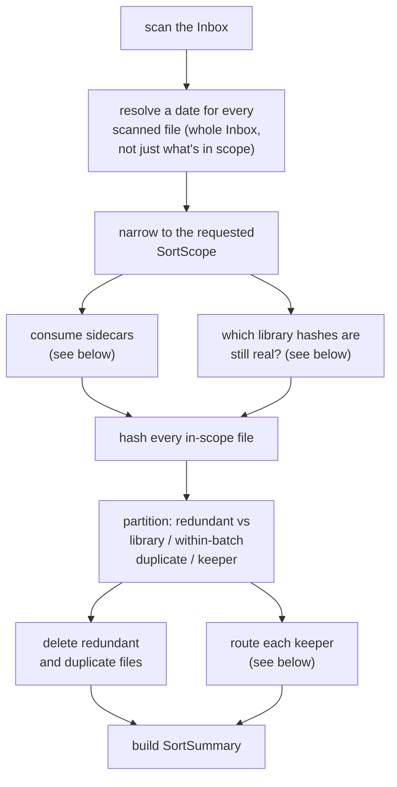
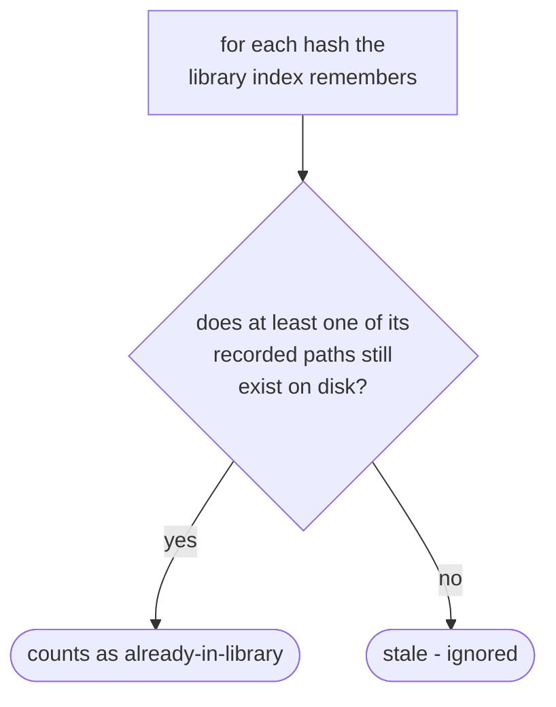
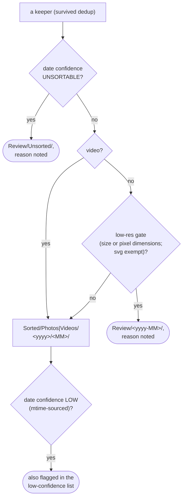

# Sort engine

How `application/service/SortEngine` turns a scan of the Inbox into a `SortSummary`, moving each
file to `Sorted/` or `Review/` along the way
(`app/src/main/java/photos/sluice/application/service/SortEngine.java`).

## 1. The one-pass pipeline

Every scanned file is dated before the scope narrows anything. `OldestYear`/`OldestN` need to
compare dates across the *whole* Inbox to pick the right subset, so dating only the
already-narrowed files would pick the wrong ones. Sidecar consumption and the library-hash check
are independent of each other, and of the dedup partition that follows. Nothing here depends on
which of the three dedup buckets a file eventually lands in.

## 2. Consuming a sidecar

A sidecar that exists but lost the date-resolution race - invalid content, or a coincidentally
name-matched but unrelated JSON file - is left alone. Only a sidecar that was actually read as
real metadata gets consumed. The "already deleted?" check exists because an edited copy of a photo
shares its original's sidecar. Both files can be in scope at once, and both resolve their date
from the same JSON path. It must be deleted, and counted, exactly once - not once per file that
points at it.

## 3. Which library hashes still count as "real"

The library lives outside this process's control - it can be resynced, moved, or pruned
independently. A stale index entry pointing at a since-vanished file must never cause an
otherwise-unique Inbox file to be deleted as a false duplicate. Only a hash with at least one
surviving copy can safely delete its Inbox twin.

## 4. Routing a keeper

Checked in this order and only this order. An undatable file is routed away before anything else
looks at it - "which folder does this date belong in" is meaningless without a usable date. The
low-res gate only ever runs on a file that already cleared that check. A "reason noted" move also
appends a line (`"<filename> - <reason>"`) to a `_reasons.txt` file in the destination folder.

## Scenarios

| Scenario | Outcome |
|---|---|
| Photo with a Takeout sidecar that produced its date | Sidecar deleted, counted in `sidecarsDeleted` |
| Photo `+` its `-edited` copy, sharing one sidecar, both in scope | Sidecar deleted exactly once, `sidecarsDeleted` = 1, not 2 |
| Sidecar present but invalid/unrelated | Left on disk; date falls through to the next source in the chain |
| Inbox file's hash matches a library-index hash whose recorded path still exists | Deleted, counted in `reimportsDeleted`, never moved |
| Inbox file's hash matches a library-index hash whose recorded path is gone | Not treated as redundant - sorts (or routes) normally |
| Two inbox files share bytes, neither is in the library | First one sorts; the rest are deleted, counted in `byteDupsDeleted` |
| Undatable file (implausible mtime, no better source) | `Review/Unsorted/`, `unsorted` count, filename in `unsortedFiles` |
| Small or low-dimension photo | `Review/<yyyy-MM>/`, `lowRes` count |
| Video or `.svg`, however small | Exempt from the low-res gate - sorts normally |
| Sorted photo whose date came only from file-modification time | Sorts normally, but also listed in `lowConfidenceFiles` |

## Related

- The filesystem effects this pipeline uses (collision-safe move/copy, existence/size checks,
  appending a reason line): `media-store.md` in the `adapter/fs` design folder.
- Scope selection itself (`Year`/`OldestN`/`OldestYear`) is delegated to
  `domain/dating/ScopeSelector` and not diagrammed here - see that class directly.
- A whole-Inbox sweep for now-orphaned sidecars and directories left empty of all files is not
  part of this pipeline yet; it lands in a later addition to this same engine.
