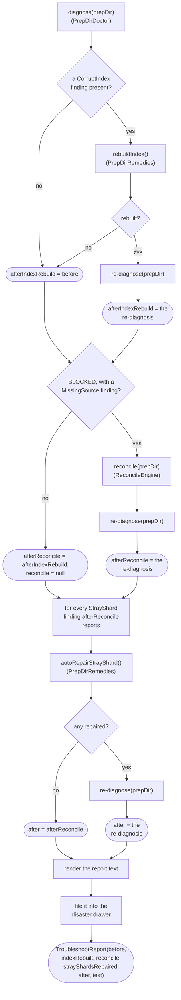

# Troubleshooter

How `application/service/Troubleshooter` runs the single-button recovery over a prep dir
(`app/src/main/java/photos/sluice/application/service/Troubleshooter.java`).

## 1. troubleshoot()

A `CorruptIndex` finding gets `rebuildIndex()` attempted first, in the locked dependency order
(index before move log before stray shards). See `prep-dir-remedies.md` section 2 for the rebuild
guard itself. A failed attempt is a pure no-op: nothing is written unless every guard passes, so
`afterIndexRebuild` just falls back to `before` unchanged. `indexRebuilt` records whether the
attempt actually succeeded, independent of whatever `before`/`after` end up reporting.

`MissingSource` is the only signal available today that the move-record log itself might be lost or
unreadable. `PrepDirDoctor` only ever reports one once the shard contract has already validated
cleanly (see `apply-planner.md`'s own doc). The index rebuild step above is itself a prerequisite
for that. Nothing can be diagnosed at all without a readable index. `reconcile()`
(`ReconcileEngine`, see `reconcile-engine.md`) is exactly the offline repair for that situation.
Reconcile never runs otherwise - every other `BLOCKED` cause is left exactly as diagnosed. Running
reconcile unconditionally would also needlessly file away an already-trustworthy log, demoting its
witnessed provenance to reconstructed for zero benefit.

`autoRepairStrayShard()` (`PrepDirRemedies`) runs next, in the locked dependency order (move log
before stray shards). Until the log is rebuilt, an already-moved file can still look like a stray
shard's own missing match. Unlike the reconcile gate, this repair isn't gated on overall prep-dir
state. A `StrayShard` finding can surface either while `WAITING` (other montages still being
culled) or `BLOCKED` (culling finished, something else needs a remedy). `PrepDirDoctor` never
gates it on the shard contract being otherwise complete, the way it gates `MissingSource`.

Every `StrayShard` finding gets one attempt. Each re-reads current disk state. So an earlier
repair in the same pass can make a later one possible (one candidate montage claimed) or moot
(nothing left unclaimed). `autoRepairStrayShard()` itself decides that per its own unambiguity
rule, not this loop. See `prep-dir-remedies.md`, section 1, for the unambiguity rule itself and
the CHOICE fallback (`setAsideStrayShard()`) neither this nor `reconcile()` ever invokes
unprompted.

Every disposition-ledger CHOICE remedy (missing-source skip, overlap resolution, corrupt-sidecar
resolution, stray-shard set-aside) needs a real user choice. So none of them run here - they
surface unchanged in `after` for the UI to offer, via
`PrepDirRemedies.skipMissingSource()`/`resolveOverlap()`/`resolveCorruptSidecar()`/`setAsideStrayShard()`
directly (`prep-dir-remedies.md`, sections 1-2). The last-resort `discard()` is likewise never
attempted here - it is a standalone action, not gated on any one finding (`prep-dir-remedies.md`,
section 3).

The rendered report is the same technical, path-and-hash-level detail `Finding.describe()` already
gives an aggregated `ApplyException` - never layman-friendly copy. A UI maps that friendlier
language on top of this structured data. See `apply-planner.md` for `Finding`/`ApplyException`
aggregation itself.

## Related

- The reconcile sweep this triggers: `reconcile-engine.md`.
- The disposition ledger, CHOICE remedies, and the stray-shard AUTO repair this runs:
  `prep-dir-remedies.md`, section 1.
- The index-rebuild AUTO repair this triggers first, and the corrupt-sidecar CHOICE remedy and
  last-resort discard this never attempts unprompted: `prep-dir-remedies.md`, sections 2-3.
- The shard-contract validation `PrepDirDoctor` relies on before reporting `MissingSource`:
  `apply-planner.md`.
- The diagnosis this reads before and after repair: `PrepDirDoctor.diagnose()`'s own doc comment
  (`application/service/PrepDirDoctor.java`).
- The drawer entry the rendered report is filed as: `DisasterDrawer`'s own class doc
  (`application/service/DisasterDrawer.java`).
