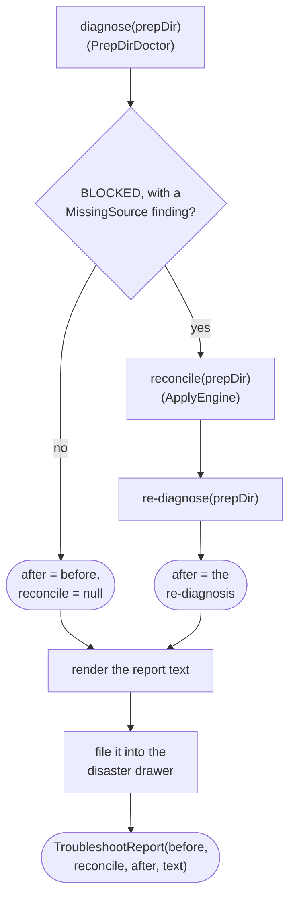

# Troubleshooter

How `application/service/Troubleshooter` runs the single-button recovery over a prep dir
(`app/src/main/java/photos/sluice/application/service/Troubleshooter.java`).

## 1. troubleshoot()

`MissingSource` is the only signal available today that the move-record log itself might be lost or
unreadable. `PrepDirDoctor` only ever reports one once the shard contract has already validated
cleanly (see `apply-engine.md`'s own doc). `reconcile()` is exactly the offline repair for that
situation. Reconcile never runs otherwise - every other `BLOCKED` cause (a stray shard, an
off-contract decision) is left exactly as diagnosed, since no repair for those exists yet. Running
reconcile unconditionally would also needlessly file away an already-trustworthy log, demoting its
witnessed provenance to reconstructed for zero benefit.

The rendered report is the same technical, path-and-hash-level detail `Finding.describe()` already
gives an aggregated `ApplyException` - never layman-friendly copy. A UI maps that friendlier language
on top of this structured data, the same layering `apply-engine.md`'s own cross-cutting note
describes for a blocked run's card.

## Related

- The reconcile sweep this triggers: `apply-engine.md`, section 6.
- The diagnosis this reads before and after repair: `PrepDirDoctor.diagnose()`'s own doc comment
  (`application/service/PrepDirDoctor.java`).
- The drawer entry the rendered report is filed as: `DisasterDrawer`'s own class doc
  (`application/service/DisasterDrawer.java`).
