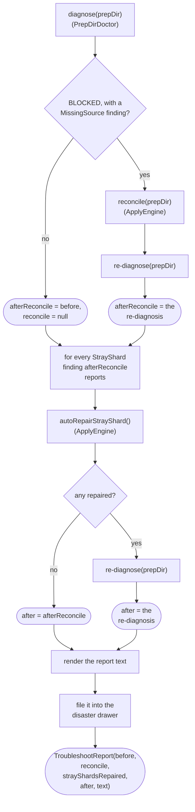

# Troubleshooter

How `application/service/Troubleshooter` runs the single-button recovery over a prep dir
(`app/src/main/java/photos/sluice/application/service/Troubleshooter.java`).

## 1. troubleshoot()

`MissingSource` is the only signal available today that the move-record log itself might be lost or
unreadable. `PrepDirDoctor` only ever reports one once the shard contract has already validated
cleanly (see `apply-engine.md`'s own doc). `reconcile()` is exactly the offline repair for that
situation. Reconcile never runs otherwise - every other `BLOCKED` cause is left exactly as
diagnosed. Running reconcile unconditionally would also needlessly file away an already-trustworthy
log, demoting its witnessed provenance to reconstructed for zero benefit.

`autoRepairStrayShard()` runs next, in the locked dependency order (move log before stray shards -
until the log is rebuilt, an already-moved file can still look like a stray shard's own missing
match). Unlike the reconcile gate, this repair isn't gated on overall prep-dir state. A `StrayShard`
finding can surface either while `WAITING` (other montages still being culled) or `BLOCKED`
(culling finished, something else needs a remedy). `PrepDirDoctor` never gates it on the shard
contract being otherwise complete, the way it gates `MissingSource`.

Every `StrayShard` finding gets one attempt. Each re-reads current disk state, so an earlier repair
in the same pass can make a later one possible (one candidate montage claimed) or moot (nothing
left unclaimed). `autoRepairStrayShard()` itself decides that per its own unambiguity rule, not this
loop. See `apply-engine.md`, section 7, for the unambiguity rule itself and the CHOICE fallback
(`setAsideStrayShard()`) neither this nor `reconcile()` ever invokes unprompted.

Every disposition-ledger CHOICE remedy (missing-source skip, overlap resolution, stray-shard
set-aside) needs a real user choice, so none of them run here - they surface unchanged in `after`
for the UI to offer, via `ApplyEngine.skipMissingSource()`/`resolveOverlap()`/`setAsideStrayShard()`
directly (`apply-engine.md`, section 7).

The rendered report is the same technical, path-and-hash-level detail `Finding.describe()` already
gives an aggregated `ApplyException` - never layman-friendly copy. A UI maps that friendlier language
on top of this structured data, the same layering `apply-engine.md`'s own cross-cutting note
describes for a blocked run's card.

## Related

- The reconcile sweep this triggers: `apply-engine.md`, section 6.
- The disposition ledger, CHOICE remedies, and the stray-shard AUTO repair this runs:
  `apply-engine.md`, section 7.
- The diagnosis this reads before and after repair: `PrepDirDoctor.diagnose()`'s own doc comment
  (`application/service/PrepDirDoctor.java`).
- The drawer entry the rendered report is filed as: `DisasterDrawer`'s own class doc
  (`application/service/DisasterDrawer.java`).
