# Sluice architecture

376 classes in one Maven module, laid out hexagonally. `ArchitectureTest` holds the boundaries with
fourteen ArchUnit rules, so a crossed one fails the build.

Each section below takes one layer, draws what is inside it, and links the classes that have a
design doc of their own. A box with no link has no branching worth a diagram.

## The layers

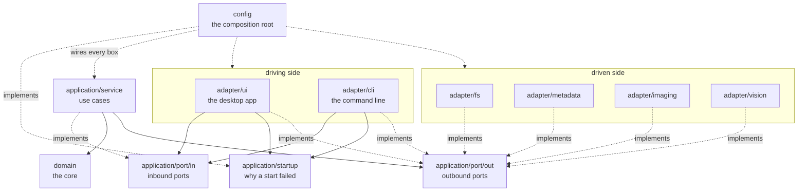

Every arrow is a compile-time dependency. `domain` has none leaving it.

- [Domain](#domain), the pure core.
- [Inbound](#inbound), the ports a driving adapter calls in through.
- [Services](#services), the use cases behind those ports.
- [Outbound](#outbound), the effect interfaces a use case reaches the world through.
- [Adapters](#adapters), the six packages that implement or drive them.
- [Config](#config), the composition root.
- [Startup](#startup), a failed start in a form a surface can render.

## Domain

Values and rules, no I/O and no framework. A `Path` is allowed as a value, opening it is not.
`DateSource` lives here rather than in the outbound ports, because the chain that calls it is a
domain rule.

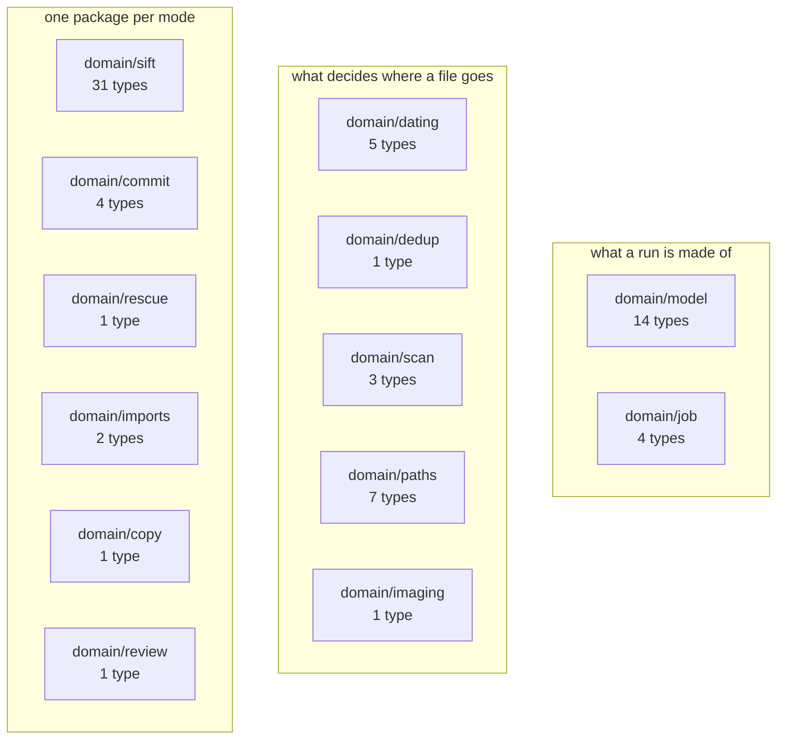

- `domain/model`: the shared values. `MediaFile`, `HashedMedia`, `DatedMedia`, `SortScope`.
- `domain/job`: `ProgressCallback`, `CancellationSignal`, `WaitingSiftJob`, `ShardTally`.
- `domain/dating`: `DateResolver` walks sidecar, EXIF, filename, mtime. `DatePlausibility` refuses
  a pre-2000 or future date.
- `domain/dedup`: `ByteIdenticalDedup` splits a hashed batch into keepers and duplicates.
- `domain/scan`: `MediaTypeDetector` classifies by extension.
  [`takeout-sidecar-pairing.md`](domain/scan/takeout-sidecar-pairing.md) pairs a photo with its
  Takeout JSON. [`sidecar-sweep.md`](domain/scan/sidecar-sweep.md) finds the sidecars nothing owns.
- `domain/paths`: the folder-root rules. `RootLayout`, `Containment`, `ReservedDeviceNames`,
  `PathViolation`.
- `domain/imaging`: `LowResGate` decides what counts as low resolution.
- `domain/sift`: the vocabulary of a sift. `ShardValidator` is the authority on a well-formed one.
- `domain/commit`: `CommitScope`, `CommitScopeSelector`, `LibraryBucket`, `CommitSummary`.
- `domain/rescue`, `domain/imports`, `domain/copy`: outcome counters for those modes.
- `domain/review`: `ReasonNotes`, the note left beside set-aside photos.

## Inbound

Twenty-seven types. An interface says what can be asked for, a record what came back, an exception
what was refused. Both surfaces reach the same use cases through these.

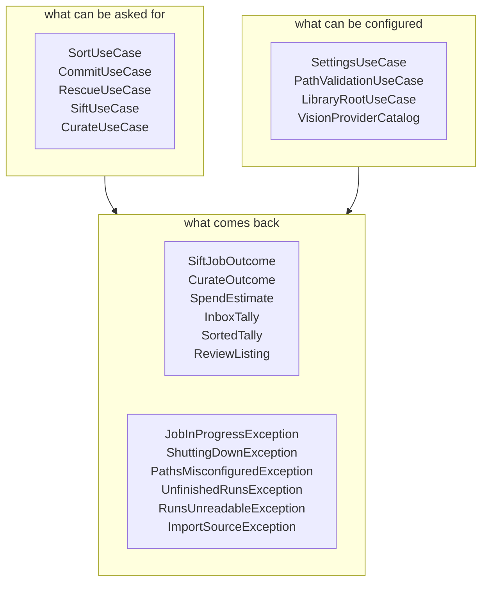

- `SortUseCase`: date, de-duplicate and move Inbox files into staging.
- `CommitUseCase`: promote staged media into the library.
- `RescueUseCase`: move a waiting folder's leftovers back into Sorted.
- `SiftUseCase`: the vision pass, including waiting on and resuming a paused run.
- `CurateUseCase`: a sort, then a sift over what it populated.
- `SettingsUseCase`: read and change settings.
- `PathValidationUseCase`: check the three folder roots.
- `LibraryRootUseCase`: move the library root, which a plain save cannot do.
- `VisionProviderCatalog`: the providers this install has.

## Services

The use cases, reaching the filesystem only through an outbound port. `Pipeline` is the facade a
driving adapter holds, and it hands back a `JobHandle` rather than blocking. Fourteen of the 41
classes have a design doc, more than any other layer.

Six of the eight inbound ports have an implementation here. `SiftUseCase` and `CurateUseCase` have
none: `Pipeline` declares no interface at all, and callers hold the class.

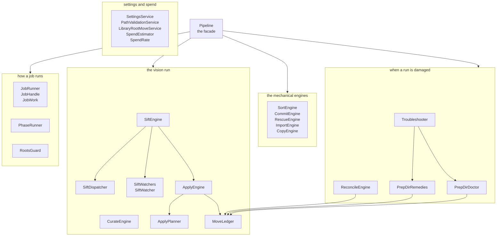

- The facade, wiring the engines through `JobRunner`:
  [`pipeline.md`](application/service/pipeline.md).
- The one-pass Inbox to Sorted route: [`sort-engine.md`](application/service/sort-engine.md).
- A waiting folder's leftovers back into Sorted:
  [`rescue-engine.md`](application/service/rescue-engine.md).
- A whole vision run: prep, dispatch, apply:
  [`sift-engine.md`](application/service/sift-engine.md).
- A sort and then a sift, as one job: [`curate-engine.md`](application/service/curate-engine.md).
- Carrying the decisions out against the filesystem:
  [`apply-engine.md`](application/service/apply-engine.md).
- What a run still has left to do: [`apply-planner.md`](application/service/apply-planner.md).
- The two ledger files a prep dir keeps: [`move-ledger.md`](application/service/move-ledger.md).
- Rebuilding that ledger from disk alone:
  [`reconcile-engine.md`](application/service/reconcile-engine.md).
- The health check and the purge: [`prep-dir-doctor.md`](application/service/prep-dir-doctor.md).
- One entry point per repair: [`prep-dir-remedies.md`](application/service/prep-dir-remedies.md).
- The single-button recovery: [`troubleshooter.md`](application/service/troubleshooter.md).
- Saving settings as claim, write, put in force:
  [`settings-service.md`](application/service/settings-service.md).
- Resolving the three roots for the domain rule:
  [`path-validation-service.md`](application/service/path-validation-service.md).
- `CommitEngine` moves staged files into the library. One loop, one branch, too thin to diagram.
- `ImportEngine` brings photos into the Inbox, `CopyEngine` copies one tree into another.
- `SiftDispatcher` routes to the provider whose id matches the configured one.
- `SiftWatchers` owns the watch lifecycle, `SiftWatcher` polls one waiting run.
- `JobRunner` runs one job at a time, `PhaseRunner` brackets each phase it reports.
- `RootsGuard` refuses work whose folder roots are unusable.
- `SpendEstimator` forecasts a run's cost, `SpendRate` what a sheet has actually cost here.

## Outbound

The effect interfaces and the values they take, 49 types in all, the widest layer by count. Each
port names the effect rather than the technology, so `HashIndexPort` says what is needed and
`CsvLibraryHashIndex` says how this build supplies it.

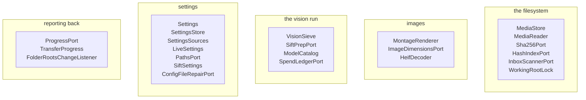

- `MediaStore` is storage as a whole, `MediaReader` its inspect-only half.
- `Sha256Port` computes the hash identity rests on, `HashIndexPort` persists it.
- `InboxScannerPort` walks the Inbox and moves nothing.
- `WorkingRootLock` claims a root before anything mutates inside it.
- `MontageRenderer` turns a scope into the prep directory a provider judges.
- `ImageDimensionsPort` reads dimensions without decoding, `HeifDecoder` handles what Java cannot.
- `VisionSieve` turns a prepared directory into decision shards.
- `SiftPrepPort` reads and writes that directory's JSON, `SpendLedgerPort` records what a run cost.
- `Settings` is every value a user can change, `SettingsStore` where they survive a restart.
- `LiveSettings` is the seam that replaces the values in force. No adapter may name it.
- `PathsPort` and `SiftSettings` keep the config record out of the layers that read from it.
- `ProgressPort` reports a running job without being polled.

## Adapters

Every effect implementation and both surfaces a person drives the app from. Nothing outside adapter
and config may name a concrete adapter type, and no adapter may name another. So where the same
idea is needed on both surfaces it is written twice, on purpose.

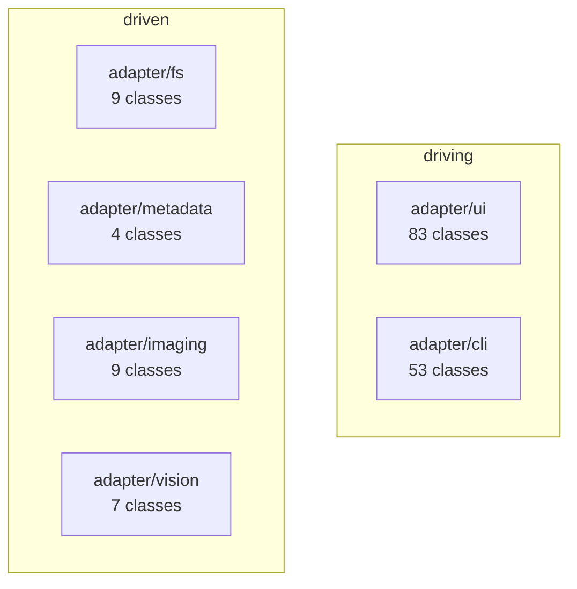

- [Desktop](#desktop), the JavaFX app.
- [Command-line](#command-line), one process, one command, then exit.
- [Filesystem](#filesystem), everything that touches a disk by name.
- [Metadata](#metadata), the four date sources.
- [Imaging](#imaging), tiles, montages and the JSON beside them.
- [Vision](#vision), the providers and their shards.

### Desktop

A presenter decides what a screen shows and what a press does. A view is a record of display-ready
values and decides nothing, which `viewsDecideNothing` enforces by refusing it any domain or
application import.

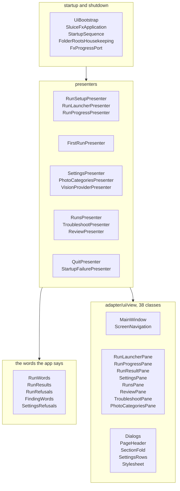

- `RunSetupPresenter`, `RunLauncherPresenter`, `RunProgressPresenter`: the dashboard's three faces,
  named by `RunStage`.
- `SettingsPresenter`, `PhotoCategoriesPresenter`, `VisionProviderPresenter`: the settings screens.
- `RunWords`, `RunResults`, `RunRefusals`: numbers and refusals turned into sentences.
- `StartupSequence` claims the working root at startup, `FolderRootsHousekeeping` redoes that after
  a save moves one.
- `FxProgressPort` records what a job reports and redraws on the toolkit thread.
- `MainWindow` is a sidebar over three destinations. Each pane is one screen, `Dialogs` the shape
  every question takes.

No design docs here. A screen is judged by looking at it.

### Command-line

One process, one command, then exit. Every bean is gated to the `cli` profile, so a desktop run
builds none of them.

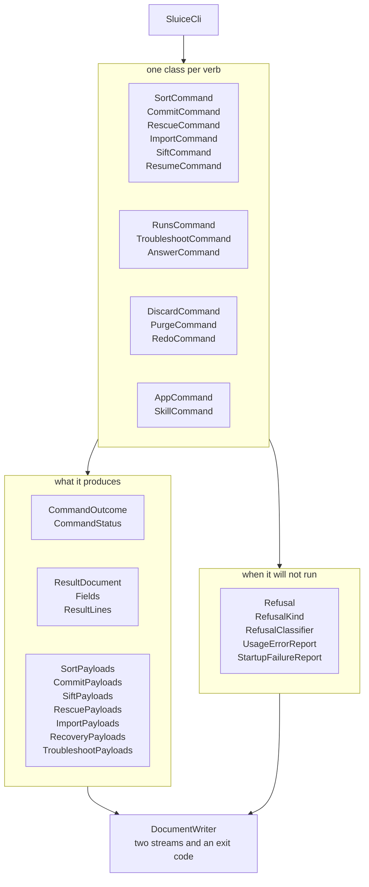

- The whole surface, verb by verb: [`command-surface.md`](adapter/cli/command-surface.md).
- `CommandReports` and `JobReports` run one command's work and report what came of it.
- A `*Payloads` class is one verb's wire shape plus the reading that builds it.
- `Refusal` carries both shapes at once: what a person is told, what a machine acts on.
- `ConsoleProgressPort` reports on the error stream, `TypedCancel` stops a job on a typed `c`.

### Filesystem

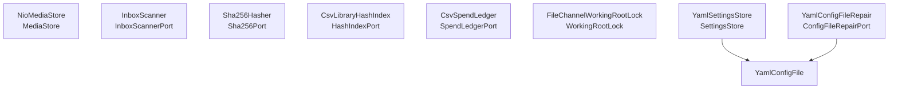

- The `MediaStore` backed by `java.nio.file`: [`media-store.md`](adapter/fs/media-store.md).
- Enumerating the tree and pairing sidecars: [`inbox-scanning.md`](adapter/fs/inbox-scanning.md).
- Claiming a root with an OS lock on a marker file:
  [`working-root-lock.md`](adapter/fs/working-root-lock.md).
- `Sha256Hasher` streams in fixed-size chunks, so a large video costs no more memory than a photo.
- `CsvLibraryHashIndex` is two columns per hashed file, `CsvSpendLedger` twelve per sift run.
- `YamlConfigFile` is the config file as a document. Both the save and the repair go through it.

### Metadata

Four date sources, each implementing `DateSource`. `DateResolver` walks them in this order.

- `TakeoutJsonSource` reads a Takeout sidecar's `photoTakenTime`.
- `ExifSource` prefers the original capture timestamp over the digitized one.
- `FilenameSource` matches camera and messaging-app export names.
- `MtimeSource` reads last-modified time, and is trusted least.

### Imaging

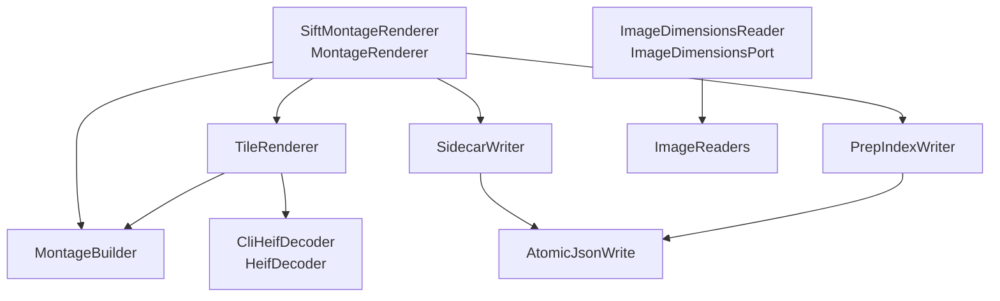

- Wiring the other four together:
  [`sift-montage-renderer.md`](adapter/imaging/sift-montage-renderer.md).
- One fixed-size preview per file: [`tile-renderer.md`](adapter/imaging/tile-renderer.md).
- A batch of tiles into one captioned grid:
  [`montage-builder.md`](adapter/imaging/montage-builder.md).
- Dimensions from embedded metadata where it can:
  [`image-dimensions-reader.md`](adapter/imaging/image-dimensions-reader.md).
- `CliHeifDecoder` shells out to a libheif decoder for what Java will not read.
- `SidecarWriter` and `PrepIndexWriter` both write through `AtomicJsonWrite`, so a destination name
  never holds a half-written file.

### Vision

A provider is one `@Component` implementing `VisionSieve`. `SiftDispatcher` takes them by list
injection, so adding one needs no wiring beyond its own class.

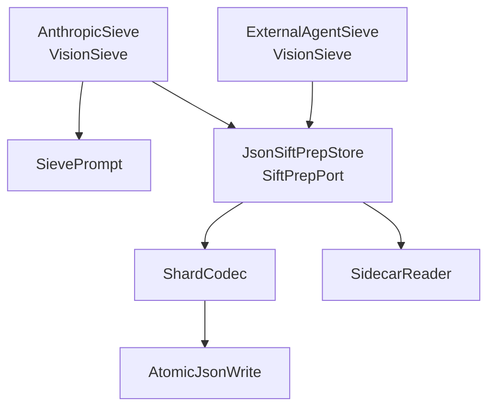

- The provider that calls a model from inside the app:
  [`anthropic-sieve.md`](adapter/vision/anthropic-sieve.md).
- What a new provider has to satisfy:
  [`adding-a-provider.md`](adapter/vision/adding-a-provider.md).
- `ExternalAgentSieve` reads the shards an agent outside the app has already written. It waits for
  nothing and spends nothing.
- `SievePrompt` renders the request from the prep dir's own recorded categories, so the prompt and
  the validation cannot judge different rule sets.
- `ShardCodec` reads and writes one `decisions-NNN.json`, `SidecarReader` the montage sidecar.

## Config

The composition root. Fifteen classes that build everything above and are named by nothing above.
It is the only package allowed to depend on a concrete adapter. It also implements five ports
itself, because Spring's property binding is what holds those values.

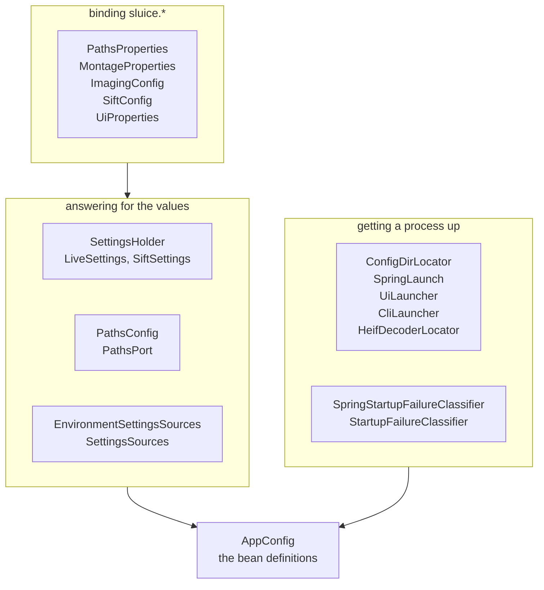

- Each `*Properties` or `*Config` binds one `sluice.*` block. Precedence is Spring's own:
  environment variables, then the user's config file, then the bundled `application.yml`.
- `SettingsHolder` is where the current settings live until the last save before close.
- `PathsConfig` resolves the working paths from whatever is in force.
- `ConfigDirLocator` computes the OS-native config directory from the OS name and environment
  handed to it, which is what makes every platform's answer testable on any platform.
- `HeifDecoderLocator` picks the decoder installed alongside the app, or whatever the settings name.
- `UiLauncher` starts the window, `CliLauncher` runs one command, `SpringLaunch` builds the
  arguments either starts Spring with.

`sluice.paths` has no defaults. An unconfigured install boots to the first-run card, and every
path-resolving entry point refuses until the roots are set.

## Startup

Two classes, so that a surface can render a failed start without knowing the framework underneath.

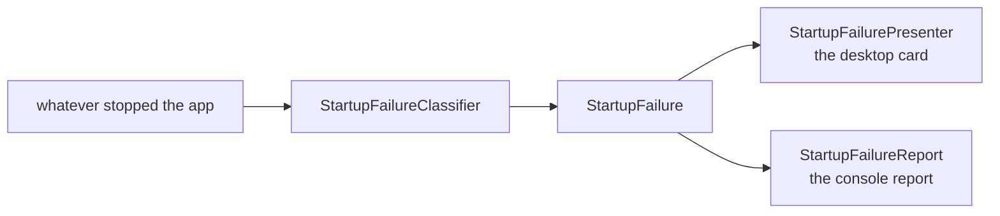

- `StartupFailureClassifier` is the port. `SpringStartupFailureClassifier` in config implements it,
  and is the only class that reads a framework exception.
- `StartupFailure` says why the app could not start. Neither surface re-inspects the original.
