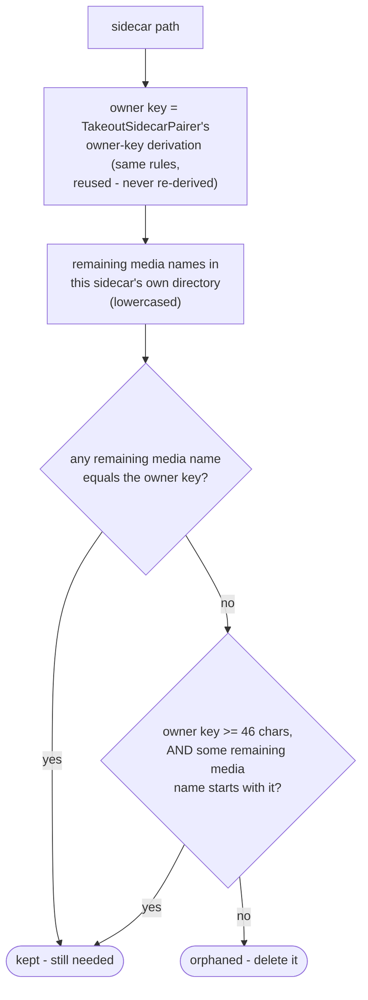

# Sidecar sweep

How `domain/scan/SidecarSweep` decides which Takeout `.json` sidecars are orphaned, once run
against what's still in the Inbox after this run's routing
(`app/src/main/java/photos/sluice/domain/scan/SidecarSweep.java`). `SidecarSweep` itself is a pure
function of whatever media/JSON lists it's handed - it has no opinion on how the caller derives
those lists.

This is deliberately independent of `TakeoutSidecarPairer`'s per-file pairing (see
`sort-engine.md` section 2 for that mechanism). A sidecar is spent here purely because its owning
media is gone from its directory now. It doesn't matter whether that media ever paired to this
sidecar in the first place, or which date source won for it.

## Deciding whether one sidecar is orphaned

The owner-key derivation is shared with `TakeoutSidecarPairer` on purpose. The sweep's notion of
"which media does this sidecar belong to" must never drift from the pairer's, or the two
mechanisms could disagree about the same sidecar.

The prefix check (not just exact equality) exists because Google truncates a sidecar's
`.supplemental-metadata` suffix once the original filename plus that suffix would exceed roughly
46 characters. This is community-documented behavior, not an official Google spec - see
`SidecarSweep.MIN_TRUNCATED_OWNER_KEY_LENGTH`'s own comment for sources. As long as any part of
that suffix still fits, the exact-match branch above already recovers the real filename correctly.
The prefix branch only matters once the original filename alone is near that cap. Then none of the
suffix survives, and the JSON's base name is a raw truncated cut of the filename itself. A genuine
truncation of that kind lands close to 46 characters.

A *shorter* owner key matching some remaining media name as a prefix is far more likely to be an
accidental collision with an unrelated file. Genuine truncation is much less likely at that
length. So the prefix branch is only trusted at or above that length. Below it, only an exact
match keeps a sidecar alive.

## Scenarios

| Scenario                                                                              | Outcome                                        |
|---------------------------------------------------------------------------------------|------------------------------------------------|
| Sidecar's media still sits in the same directory                                      | Kept                                           |
| Sidecar's media has left the directory (sorted away, or deleted as a duplicate)       | Orphaned                                       |
| A same-named media file exists, but in a *different* directory                        | Orphaned - directory-scoped, never cross-pairs |
| Sidecar name is a truncated (>= 46 char) prefix of a remaining, longer media filename | Kept                                           |
| Owner key is a short (< 46 char) prefix of an unrelated remaining media filename      | Orphaned - not trusted as truncation evidence  |
| Owner-key match is case-different (`PHOTO.JPG` vs `photo.jpg.json`)                   | Kept - comparison is case-insensitive          |

## Related

- Caller: `SortEngine.sweepOrphanedSidecarsAndEmptyDirectories`. It derives "what's remaining"
  from the run's original scan minus what the run itself removed, feeds those lists in here, and
  deletes whatever comes back. It then removes any directory left empty of all files. See
  `sort-engine.md` section 5 in the `application/service` design folder.
- The owner-key and per-directory scoping rules this class reuses:
  `takeout-sidecar-pairing.md`, same folder.
- The directory-removal step that follows: `media-store.md` in the `adapter/fs` design folder.
