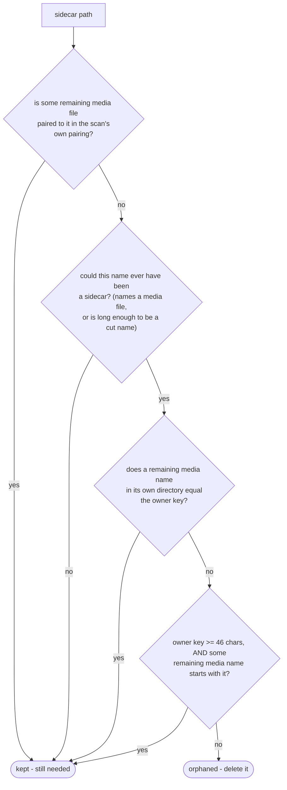

# Sidecar sweep

How `domain/scan/SidecarSweep` decides which Takeout `.json` sidecars are orphaned, once run
against what's still in the Inbox after this run's routing
(`app/src/main/java/photos/sluice/domain/scan/SidecarSweep.java`). `SidecarSweep` itself is a pure
function of whatever media/JSON lists it's handed - it has no opinion on how the caller derives
those lists.

Everything it returns gets hard-deleted, with no trash and no undo. So the decision is deliberately
one-sided. Three things keep a sidecar alive, and any one of them is enough. Only a sidecar none of
them claims is swept.

This is not the same question `TakeoutSidecarPairer` answers per file (see
[`sort-engine.md`](../../application/service/sort-engine.md) section 2 for that mechanism). A
sidecar is spent here because nothing left in its directory owns it, whatever date source actually
won for the media that has gone.

## Deciding whether one sidecar is orphaned



### 1. The pairing

The caller hands in the sidecar-by-media map it already built when it scanned. That map is the
authoritative answer to which sidecar a media file reads its date from. A sidecar still mapped to a
media file sitting in the Inbox is by definition still needed.

The sweep asks for it rather than working the relationship out again. Two ways of deriving "which
media does this sidecar belong to" will eventually disagree. The one that governs a delete is the
one that has to be right.

Pairing also knows things a name comparison cannot recover. An `-edited` copy carries no sidecar of
its own and pairs to its original's. A sidecar whose base name merely starts with the media
filename pairs through the prefix fallback, which no owner-key comparison reproduces.

### 2. Could this name ever have been a sidecar?

Two signals, either one enough.

**Its owner key names a media file.** A per-photo sidecar's owner key is built from a media
filename, so a recognized media extension sits somewhere in it. The extension can sit anywhere in
the key, not only at its end. A sidecar with a non-standard suffix (`IMG_1234.jpg.someextra`) is a
real sidecar the sweep is meant to reach, and demanding the extension come last would make it
immortal. See [`takeout-sidecar-pairing.md`](takeout-sidecar-pairing.md) section 3.

**Or the owner key is at least 46 characters.** Google truncates a long sidecar name, and the cut
usually takes the media extension with it. Such a name looks like nothing in particular, so length
is the only thing left to read. 46 is where Google cuts. Measured on a real export: every one of
its 773 cut names came out at exactly that length.

A file failing both is something like `metadata.json`, `notes.json` or
`print-subscriptions.json`. Real Takeout exports ship one album descriptor per album, and any dump
can carry an unrelated app's JSON. Those are not this mechanism's to delete.

The second signal is what keeps a truncated sidecar from becoming immortal. Without it, a cut name
could never be swept at all, and a processed Inbox would fill with stale JSON that nothing will
ever claim.

**Read the second signal as a deletion licence, not only as a keep.** It says nothing about the
file's contents, so a `.json` that was never a sidecar is swept anyway once its name is long enough.
A user's `my_wedding_guest_list_and_seating_plan_final_v3.json` sitting in a folder whose media has
gone will be deleted.

That is a deliberate trade, and the numbers drive it. In a surveyed export of 14,789 sidecars, 773
had cut names and 5 files were genuine non-sidecars. Protecting the long-named strays would strand
all 773 forever. Length is the only thing that separates the two populations, and it separates them
imperfectly. A shorter stray is safe, which covers every name Google's own manifests use.

### 3. The name match

For a sidecar the pairing awarded to nobody. Pairing gives a media file exactly one sidecar, so a
second sidecar in the same directory deriving the same owner key stays unpaired. It still describes
a file that is sitting right there, so an exact owner-key match keeps it.

A prefix match also counts, but only from 46 characters up. That is the truncation case again, and
this is the only rule that catches it. Pairing looks for a sidecar name starting with a media name.
A cut name runs the other way round, being shorter than the file it describes. Below that length a
shared opening is coincidence, so only an exact match counts.

The comparison is case-insensitive and scoped to the sidecar's own directory. A same-named media
file one directory over never counts.

## Known limitation: a suffix that is both truncated and dup-numbered

One naming shape is swept while its media is still in the Inbox, which is the thing this mechanism
otherwise never does:

```
media:   IMG_1234(1).jpg
sidecar: IMG_1234.jpg.supple(1).json
```

Google truncated the suffix and appended a duplicate counter. The counter comes off first, and the
suffix strip cannot fire on the shortened `.supple`, so the owner key ends up as
`IMG_1234.jpg(1).supple`. No media file is called that.

Pairing misses it independently, and would miss it even with no other sidecar in the directory. It
offers the candidates `IMG_1234(1).jpg` and its dup-reversed form `IMG_1234.jpg(1)`, then looks for
a sidecar name starting with one of them. Here the `(1)` sits *after* the truncated suffix, so
neither candidate is a prefix of `IMG_1234.jpg.supple(1)`.

**Decided 2026-07-31: not worth fixing.** The shape is vanishingly rare, one file in a surveyed
export of 14,789 sidecars. The media it describes still dates from EXIF where present, which is the
next link in the date-resolution chain. Repairing it would mean teaching pairing to prefer a
dup-numbered sidecar for a dup-numbered media file, and that risks mis-pairing across the whole rest
of an export. The trade is not worth taking.

Recorded rather than fixed, and deliberately not asserted in
`takeout-sidecar-shapes.md`, so nobody reads the current behaviour as a rule worth preserving.

## Scenarios

| Scenario                                                                                | Outcome                                             |
|-----------------------------------------------------------------------------------------|-----------------------------------------------------|
| Sidecar's media still sits in the same directory                                        | Kept                                                |
| Sidecar's media has left the directory (sorted away, or deleted as a duplicate)         | Orphaned                                            |
| A same-named media file exists, but in a *different* directory                          | Orphaned - directory-scoped, never cross-pairs      |
| Sidecar paired to a remaining media file only via the prefix fallback                   | Kept - the pairing claims it                        |
| Shared sidecar whose `-edited` co-owner is still in the Inbox                           | Kept - the pairing claims it                        |
| Sidecar with a non-standard suffix (`IMG_1234.jpg.someextra`), its media gone           | Orphaned - a real sidecar, and nothing owns it      |
| A `.json` whose owner key names no media file (`metadata.json`, `notes.json`)           | Kept - it was never a sidecar                       |
| Truncated (>= 46 char) name, the longer-named media it was cut from still present       | Kept - the prefix is trusted at that length         |
| Truncated (>= 46 char) name, that media now gone                                        | Orphaned - the length says it was a sidecar         |
| A `.json` that never named a media file, but whose name reaches 46 characters           | Orphaned - length alone reads as a cut name         |
| Owner key one character short of 46, carrying no media extension                        | Kept - reads as never having been a sidecar         |
| Owner key one character short of 46, carrying a media extension, prefixing a media name | Orphaned - only an exact match counts below 46      |
| Dup-numbered sidecar whose numbered media is absent, the unnumbered original present    | Orphaned - the key names the copy, not the original |
| A second sidecar deriving an owner key pairing already awarded, its media still present | Kept - exact owner-key match                        |
| Owner-key match is case-different (`PHOTO.JPG` vs `photo.jpg.json`)                     | Kept - comparison is case-insensitive               |

## Related

- Caller: `SortEngine.sweepOrphanedSidecarsAndEmptyDirectories`. It derives "what's remaining" from
  the run's original scan minus what the run itself removed, feeds those lists in here, and deletes
  whatever comes back. It then removes any directory left empty of all files. See
  [`sort-engine.md`](../../application/service/sort-engine.md) section 5 in the
  `application/service` design folder.
- The owner-key derivation, the media-file shape check, and the per-directory scoping rules this
  class reuses: [`takeout-sidecar-pairing.md`](takeout-sidecar-pairing.md), same folder.
- The directory-removal step that follows: [`media-store.md`](../../adapter/fs/media-store.md) in
  the `adapter/fs` design folder.
