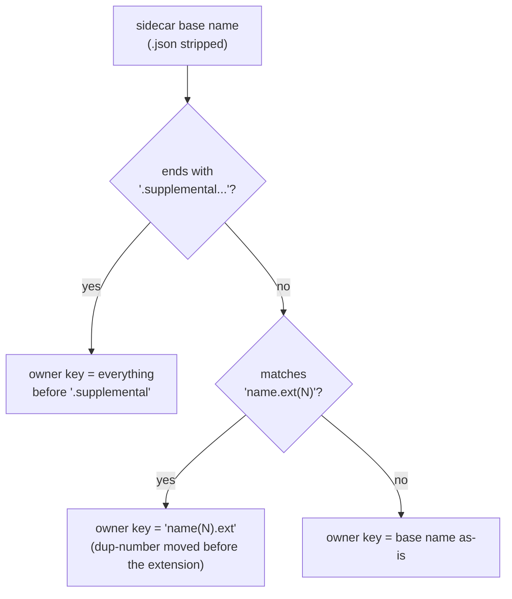
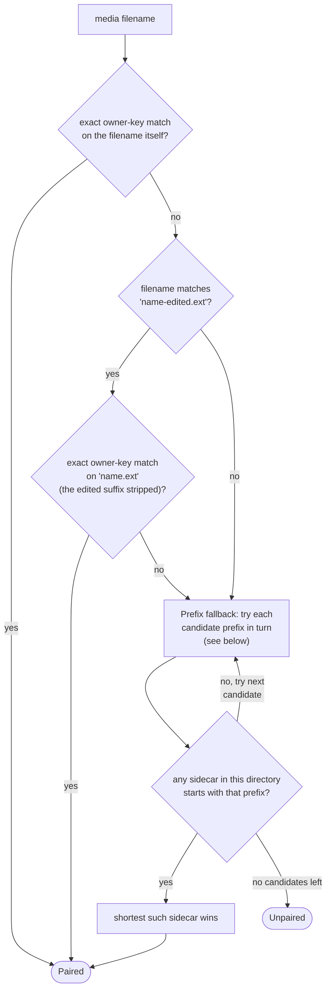

# Takeout sidecar pairing

How `domain/scan/TakeoutSidecarPairer` matches a media file to the Google Takeout `.json` sidecar
that describes it (`app/src/main/java/photos/sluice/domain/scan/TakeoutSidecarPairer.java`).
Pairing is always scoped to a single directory - a sidecar never pairs across directories.

## 1. Building the owner index (once per directory, from the sidecars)

Each sidecar's filename, with the trailing `.json` stripped, is turned into an "owner key" - the
media filename it's expected to describe:

If two sidecars in the same directory derive the same owner key, the first one encountered wins;
the second is ignored.

## 2. Matching a media file against the index

The prefix fallback's candidate list, in order: the plain filename, its dup-number-reversed form
(if the filename itself has a `(N)` marker), the edited-stripped base, and the edited-stripped
base's dup-reversed form. It exists for sidecars whose derived owner key doesn't land on an exact
match - e.g. a non-standard suffix - by falling back to "does some sidecar's name start with
this," picking the closest (shortest) match if several do.

## Naming examples

| Media file on disk | Sidecar on disk | How it pairs |
|---|---|---|
| `IMG_1234.jpg` | `IMG_1234.jpg.json` | Exact owner-key match (owner key = base name as-is). |
| `IMG_1234.jpg` | `IMG_1234.jpg.supplemental-metadata.json` | Exact match; owner key strips the `.supplemental-metadata` suffix. |
| `IMG_1234(1).jpg` | `IMG_1234.jpg(1).json` | Exact match; owner key reverses the dup-number to `IMG_1234(1).jpg`. |
| `IMG_1234-edited.jpg` | `IMG_1234.jpg.json` | No sidecar of its own; matches under the original's owner key after stripping `-edited`. |
| `IMG_1234.jpg` | `IMG_1234.jpg.someextra.json` | No exact owner-key match (owner key stays `IMG_1234.jpg.someextra`); prefix fallback matches because the sidecar's base name starts with the media filename. |
| `IMG_1234(1).jpg` | `IMG_1234.jpg(1).extra.json` | No exact match; prefix fallback needs the dup-reversed candidate (`IMG_1234.jpg(1)`) to find the hit. |
| `IMG_5678.jpg` | `IMG_1234.jpg.json` (unrelated) | No key or prefix match anywhere - falls through unpaired. |
| `dirA/IMG_1234.jpg` | `dirB/IMG_1234.jpg.json` | Same owner key, different directory - never pairs. |

## Related

- Risk note: a name-only pairing can't tell a real Takeout sidecar from an unrelated `.json` that
  happens to share a filename prefix. Whatever deletes a consumed sidecar must only do so once it
  has actually been read as valid Takeout metadata, never on name-match alone.
