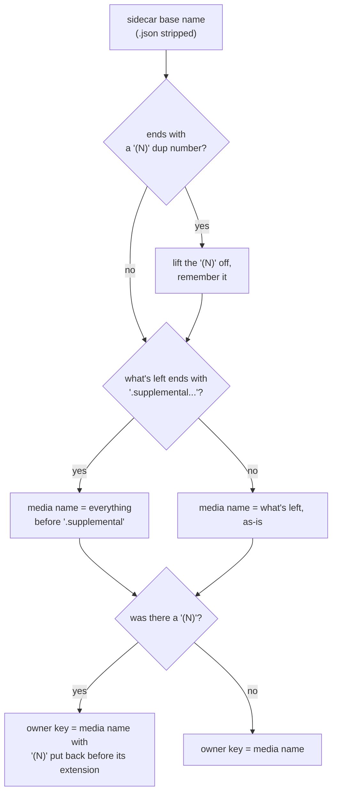

# Takeout sidecar pairing

How `domain/scan/TakeoutSidecarPairer` matches a media file to the Google Takeout `.json` sidecar
that describes it (`app/src/main/java/photos/sluice/domain/scan/TakeoutSidecarPairer.java`).
Pairing is always scoped to a single directory - a sidecar never pairs across directories.

## 1. Building the owner index (once per directory, from the sidecars)

Each sidecar's filename, with the trailing `.json` stripped, is turned into an "owner key" - the
media filename it's expected to describe:

The dup number is handled first because Google puts it at the very end of the sidecar's whole name,
after any suffix. Both `IMG_1234.jpg(1)` and `IMG_1234.jpg.supplemental-metadata(1)` describe
`IMG_1234(1).jpg`. Stripping the suffix before lifting the number off would lose it, and the sidecar
would then claim the unnumbered original instead.

Keys are indexed by their lowercased form, and every sidecar deriving one is kept rather than only
the first. Two sidecars can share a lowercased key for two different reasons. They are
differently-suffixed sidecars for one photo, or they belong to two media files whose names differ
only in case. A lone candidate is taken whatever its case. Among several, only the one whose raw
owner key equals the queried filename wins, and none matching leaves the media unpaired here.

## 2. Matching a media file against the index

The prefix fallback tries four candidates in order: the plain filename, then its
dup-number-reversed form (if the filename itself has a `(N)` marker). Next comes the
edited-stripped base, then the edited-stripped base's dup-reversed form. It exists for
sidecars whose derived owner key doesn't land on an exact match - e.g. a non-standard suffix.
It falls back to "does some sidecar's name start with this," picking the closest (shortest)
match if several do.

## 3. Does a `.json` name a media file at all?

A separate question from pairing, answered from the owner key alone. A per-photo sidecar's owner
key is built from a media filename, so a recognized media extension sits somewhere in it. A file
like `metadata.json` or `notes.json` derives an owner key with no such component, and could never
have described a photo.

The extension is looked for anywhere in the owner key, not only at its end. A sidecar with a
non-standard suffix keeps its media extension in the middle (`IMG_1234.jpg.someextra`), and the two
prefix-fallback rows in the table below are exactly that shape. Requiring the extension to come
last would mistake those real sidecars for unrelated files.

This lives here because the owner-key derivation above is what it rests on. Its consumer is the
orphan sweep, which deletes what it decides is a spent sidecar. A file that was never a sidecar
must not enter that decision at all. See `sidecar-sweep.md`.

## Naming examples

| Media file on disk    | Sidecar on disk                              | How it pairs                                                                                                                                                 |
|-----------------------|----------------------------------------------|--------------------------------------------------------------------------------------------------------------------------------------------------------------|
| `IMG_1234.jpg`        | `IMG_1234.jpg.json`                          | Exact owner-key match (owner key = base name as-is).                                                                                                         |
| `IMG_1234.jpg`        | `IMG_1234.jpg.supplemental-metadata.json`    | Exact match; owner key strips the `.supplemental-metadata` suffix.                                                                                           |
| `IMG_1234(1).jpg`     | `IMG_1234.jpg(1).json`                       | Exact match; owner key moves the dup-number to `IMG_1234(1).jpg`.                                                                                            |
| `IMG_1234(1).jpg`     | `IMG_1234.jpg.supplemental-metadata(1).json` | Exact match; the dup-number comes off before the suffix is stripped, giving `IMG_1234(1).jpg`.                                                               |
| `IMG_1234-edited.jpg` | `IMG_1234.jpg.json`                          | No sidecar of its own; matches under the original's owner key after stripping `-edited`.                                                                     |
| `IMG_1234.jpg`        | `IMG_1234.jpg.someextra.json`                | No exact owner-key match (owner key stays `IMG_1234.jpg.someextra`); prefix fallback matches because the sidecar's base name starts with the media filename. |
| `IMG_1234(1).jpg`     | `IMG_1234.jpg(1).extra.json`                 | No exact match; prefix fallback needs the dup-reversed candidate (`IMG_1234.jpg(1)`) to find the hit.                                                        |
| `IMG_5678.jpg`        | `IMG_1234.jpg.json` (unrelated)              | No key or prefix match anywhere - falls through unpaired.                                                                                                    |
| `dirA/IMG_1234.jpg`   | `dirB/IMG_1234.jpg.json`                     | Same owner key, different directory - never pairs.                                                                                                           |

## Related

- How media and sidecar lists are built in the first place (the walk over the inbox tree, the
  media/sidecar/dropped classification) is covered separately. See `inbox-scanning.md` in the
  sibling `adapter/fs` design folder.
- Risk note: a name-only pairing can't tell a real Takeout sidecar from an unrelated `.json` that
  happens to share a filename prefix. Deletion does not close that gap by validating content.
  Inline consumption spends only a sidecar whose parsed date actually won for its file, but the
  orphan sweep decides from names alone. The sweep's safety is structural instead: it deletes only
  `.json` files, never media, and only once nothing left in the sidecar's own directory owns it.
  See `sidecar-sweep.md` for the rules, and its section 2 for the accepted residual, a long-named
  stray `.json`.
